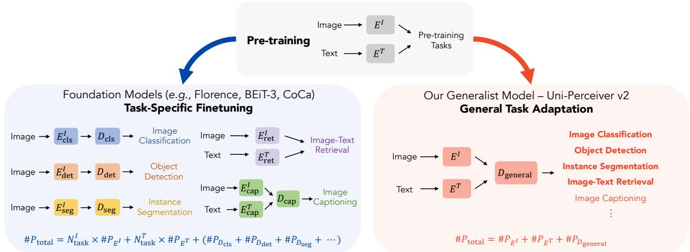
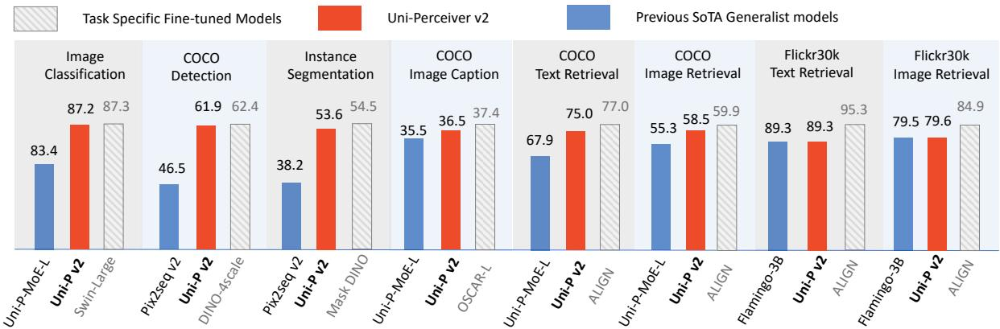

# Uni-Perceiver v2: A Generalist Model for Large-Scale Vision and Vision-Language Tasks

Hao Li1⇤, Jinguo Zhu2⇤, Xiaohu Jiang3⇤, Xizhou Zhu4,6B, Hongsheng Li1, Chun Yuan3, Xiaohua Wang2, Yu Qiao6, Xiaogang Wang1, Wenhai Wang6, Jifeng Dai5,6 1CUHK-SenseTime Joint Laboratory, The Chinese University of Hong Kong 2Xi’an Jiaotong University 3SIGS, Tsinghua University 4SenseTime Research 5Tsinghua University 6Shanghai Artificial Intelligence Laboratory

## Abstract

Despite the remarkable success of foundation models, their task-specific fine-tuning paradigm makes them inconsistent with the goal of general perception modeling. The key to eliminating this inconsistency is to use generalist models for general task modeling. However, existing attempts at generalist models are inadequate in both versatility and performance. In this paper, we propose Uni-Perceiver v2, which is the first generalist model capable of handling major large-scale vision and vision-language tasks with competitive performance. Specifically, images are encoded as general region proposals, while texts are encoded via a Transformer-based language model. The encoded representations are transformed by a task-agnostic decoder. Different tasks are formulated as a unified maximum likelihood estimation problem. We further propose an effective optimization technique named Task-Balanced Gradient Normalization to ensure stable multi-task learning with an unmixed sampling strategy, which is helpfulfor tasks requiring large batch-size training. After beingjointly trained on various tasks, Uni-Perceiver v2 is capable of directly handling downstream tasks without any task-specific adaptation. Results show that Uni-Perceiver v2 outperforms all existing generalist models in both versatility and performance. Meanwhile, compared with the commonlyrecognized strong baselines that require tasks-specific finetuning, Uni-Perceiver v2 achieves competitive performance on a broad range of vision and vision-language tasks.

## 1. Introduction

Learning a general perception model that can handle various modalities and tasks is widely regarded as an important step towards artificial general intelligence. Due to its difficulty, many works (e.g., Florence [45], CoCa [44], BEiT-3 [40]), also known asfoundation models [2], instead focus on a fallback solution of learning a general representation encoder that can be adapted (e.g., fine-tuned) to various downstream tasks. By performing large-scale pretraining on massive multi-modal task-agnostic data, these works have demonstrated the superiority by pushing the state-of-the-art results on a broad range of tasks including single-modal tasks (e.g., image classification and object detection) and also cross-modal tasks (e.g., image captioning and image retrieval).

Despite the success, there is still a considerable gap between foundation models and the goal of general perception modeling. While foundation models only focus on general representation learning, task modeling is neglected. Traditional task-specific fine-tuning paradigm is still utilized (see Fig. 1). This significantly increases the marginal cost of adapting pre-trained models to various downstream tasks, making it difficult to meet the rapidly growing demands of diverse downstream tasks and scenarios. Such a taskspecific fine-tuning paradigm of foundation models is inconsistent with the goal of general perception modeling.

Instead of performing task-specific fine-tuning, generalist models process different tasks with shared architecture and parameters, which is aligned with the goal of general perception modeling. It not only reduces the cost of handling diverse tasks but also enables task collaboration. Most existing attempts on generalist models are sequenceto-sequence (seq2seq) models [1, 5, 10, 14, 23, 29, 39, 43]. However, these attempts are inadequate in both versatility and performance: (1) some pillar vision and visionlanguage tasks as listed in Tab. 1 cannot be handled, e.g., image-text retrieval, object detection, and instance segmentation; (2) the accuracy and inference speed still lag significantly behind state-of-the-art task-specific methods. Another line of research named Uni-Perceivers [49, 50] builds generalist models supporting both generation and non-generation tasks. Nevertheless, they still cannot handle many vital tasks such as detection and segmentation.

  
Figure 1. Comparison of foundation models and Uni-Perceiver v2. $E ^ { I }$ and $E ^ { T }$ denote the image encoder and text encoder, respectively. In existing foundation models, task-specific decoders $\begin{array} { r } { D _ { \mathrm { c l s } } , D _ { \mathrm { d e t } } , \ldots } \end{array}$ are employed to tune $E ^ { I }$ and ${ \bf \vec { E } } ^ { T }$ in different task-specific finetuning. The total number of parameters # $: P _ { \mathrm { t o t a l } }$ in adaptation grow with the number of visual/linguistic tasks, denoted as $N _ { \mathrm { t a s k } } ^ { I }$ and $N _ { \mathrm { t a s k } } ^ { T }$ , respectively. By contrast, our Uni-Perceiver v2 shares all parameters across various downstream tasks with a general decoder $D _ { \mathrm { g e n e r a l } } .$ , where no taskspecific fine-tuning is incorporated. Better than previous generalist models, our method can also effectively handle pillar tasks such as image classification, object detection, instance segmentation, and image-text retrieval.

To develop generalist models with better versatility and performance, our core idea is to encode images as general region proposals consisting of the semantic, bounding box and segmentation mask representations. Compared with previous methods where images are represented as non-overlapping patches, this design makes our localization modeling more expressive and flexible. This explicit encoding of foreground information not only greatly reduces the difficulty of handling localization tasks such as image detection and segmentation, but also provides richer features for understanding textual concepts in nonlocalization vision-language tasks, thus enabling more general task modeling and better performance.

In this paper, we propose Uni-Perceiver v2 as a generalist model capable of handling major large-scale vision and vision-language tasks as listed in Tab. 1. Specifically, images are encoded as a concatenation of global and regional representations via a region proposal network, while texts are encoded via a Transformer-based language model. Both the image and text encoders can benefit from off-the-shelf pre-trained models, which reduces the demand for training data and resources and ensures performance. The encoded representations are transformed by a shared modality-agnostic Transformer [36] network to obtain the decoded representations. Following Uni-Perceivers [49, 50], different tasks are formulated as a unified maximum likelihood estimation problem and are jointly learned to enable general task adaptation. We further propose Task-Balanced Gradient Normalization to ensure stable multi-task learning with an unmixed sampling strategy which only samples one task for all GPUs per iteration. This is very helpful for tasks requiring large batch size training.

Uni-Perceiver v2 is the first generalist model achieving competitive results on major large-scale vision and visionlanguage tasks including object detection, instance segmentation, image classification, image captioning, and imagetext retrieval, except for image generation that has not been verified due to limited computational resources. After being jointly trained on various tasks, it can directly handle a broad range of tasks without any task-specific adaption, achieving state-of-the-art performance among existing generalist models. Our contributions are summarized as:

• We propose Uni-Perceiver v2, which is the first generalist model capable of handling both localization and nonlocalization tasks with competitive performance. The general region proposal encoding of images brings more flexible and expressive localization modeling.

• To improve the effectiveness of multi-task learning, we adopt an unmixed sampling strategy to enable large batchsize training and develop an effective optimization technique named Task-Balanced Gradient Normalization to mitigate the instability in gradients.

• Uni-Perceiver v2 outperforms all existing generalist models in both versatility and performance. Without any taskspecific adaption, Uni-Perceiver v2 achieves competitive performance on a broad range of downstream tasks compared with commonly-recognized strong baselines that require task-specific fine-tuning, demonstrating its strong ability of general task modeling.

<table><tr><td>Categories</td><td>Specific Tasks</td></tr><tr><td>Retrieval</td><td>Image-text retrieval</td></tr><tr><td>Classification</td><td>Image classification Region categorization Situation recognition</td></tr><tr><td rowspan="6">Localization</td><td>Object detection Key point detection</td></tr><tr><td>Pose estimation</td></tr><tr><td>Referring expression grounding</td></tr><tr><td>Human object interaction Relation detection</td></tr><tr><td>Optical character recognition</td></tr><tr><td>Object localization</td></tr><tr><td rowspan="3">Mask Predication</td><td>Instance segmentation</td></tr><tr><td>Semantic segmentation</td></tr><tr><td>Panoptic segmentation</td></tr><tr><td rowspan="7">Image Generation</td><td>Image synthesis Image inpainting</td></tr><tr><td>Segment-based image generation</td></tr><tr><td></td></tr><tr><td>Style transferring Depth estimation</td></tr><tr><td>Surface normal estimation</td></tr><tr><td>Image infilling</td></tr><tr><td>Image super resolution</td></tr><tr><td rowspan="6">Image to Text</td><td>Image captioning</td></tr><tr><td>Visual question answering</td></tr><tr><td>Region captioning</td></tr><tr><td>Grounded VQA</td></tr><tr><td>Grounded captioning</td></tr><tr><td>Visual commonsense reasoning</td></tr></table>

Table 1. Categories of mainstream vision and vision-language tasks. Pillar tasks of different downstream task categories are in bold. These pillar tasks are the most representative tasks in each category, where other tasks can be derived from them. Uni-Perceiver v2 is able to effectively handle the underlined pillar tasks, except for image synthesis that has not been verified due to limited computational resources.

## 2. Related Work

Foundation Vision Models are “designed to be adapted (e.g., fine-tuned) to various downstream tasks by pretraining on broad data at scale” [2]. Such large-scale pretrained vision models have shown effectiveness in enriching data encoding capacity, alleviating data hunger, and improving the performance of downstream tasks.

Image classification on ImageNet-1k [8] has been the mainstream pre-training paradigm for a long period. However, as the model size grows, larger annotated datasets are required to avoid over-fitting in pre-training, such as ImageNet-21k [8], Instagram-1B [24], JFT-300M [35] and JFT-3B [46]. Inspired by the success of linguistic pre-training on massive web-crawled text, CLIP [27] and ALIGN [12] have begun to focus on multi-modal contrastive pre-training on web-scale noisy image-text pairs to learn aligned image and text representations. SimVLM [41] employs the multi-modal sequence generation task for pretraining. FLAVA [34] combines contrastive and generative pre-training to handle both unimodal and multimodal tasks. UniCL [42] and CoCa [44] jointly use human-annotated and web-crawled data. Florence [45] and INTERN [31] increase the scale and diversity of pre-training data to enhance the representation capability. OmniVL [37] proposes to incorporate both image-language and video-language tasks in its pre-training. GLIP [17] and GLIPv2 [48] propose a unified pre-training framework for localization tasks and vision-language understanding tasks. BEiT-3 [40] unifies pre-training objectives for different modalities as a single masked data modeling task, achieving state-of-the-art results on a wide range of downstream tasks.

These works on foundation models only focus on general representation learning, while neglecting task modeling. When adapting them to downstream tasks, the traditional task-specific fine-tuning paradigm is still utilized, which is inconsistent with the goal of general perception modeling. Meanwhile, with the rapidly growing demands of diverse tasks and scenarios, the task-specific fine-tuning paradigm would result in a prohibitive marginal cost for data collection, data annotation, model training, and model storage.

Generalist models handle various tasks with shared architecture and parameters, which have been long pursued by the machine learning community. Recently, inspire by the success of sequence-to-sequence (seq2seq) models in NLP field [28], OFA [39], Flamingo [1], and GIT [38] propose to model various tasks as a sequence generation task. Unified-IO [23], Pix2Seq v2 [5], and UniTab [43] further develop this method to support more tasks by introducing discrete coordinate tokens, thus location information can be encoded or decoded by the unified models. Beyond that, Gato [29] succeeds in unifying reinforcement learning tasks into the seq2seq framework. GPV [10] also builds a general-purpose vision system by adding a seq2seq module on a DETR [3]-based visual encoder.

However, these methods with seq2seq formulation are still inadequate in both versatility and performance: (1) They cannot handle some core vision tasks, e.g., image-text retrieval, object detection, and instance segmentation. Although Pix2Seq v2 [5] includes detection and instance segmentation tasks, its performance and inference speed still lag significantly behind state-of-the-art task-specific methods [16, 47]; (2) The non-parallel auto-regressive decoding leads to slow inference speed. For example, image classification requires calculating and comparing the cumulative probabilities of all category names conditioned on the given image; (3) They also suffer from the task-interference issue in multi-task learning, resulting in performance degradation compared with task-specific models.

Alternatively, Uni-Perceivers [49, 50] formulate different tasks as finding the maximum likelihood target for each input through the representation similarity regardless of their modality, making it possible to support both generation and non-generation tasks. Nevertheless, they still cannot handle image detection and segmentation tasks.

## 3. Revisiting Uni-Perceivers

Unified Modeling of Perception Tasks. Uni-Perceiver [50] proposes to reformulate different tasks as a unified maximum likelihood estimation problem. Specifically, each task is defined with a set of inputs and a set of candidate targets from arbitrary combinations of modalities. The inputs and targets are first encoded with a modalityspecific tokenizer with linear projection. Then the encoded representations are transformed by modality-agnostic decoder with shared parameters for different tasks. Given an input, the unified task objective is defined as finding the target with the maximum likelihood with the input.

Mitigating Task Interference. Multi-task learning with fully shared parameters could introduce interference between different tasks. Uni-Perceiver-MoE [49] proposes Conditional MoEs to address the task-interference issue. Specifically, for each input token, a routing decision is calculated depending on specific routing strategy, which sparsely activates a small portion of experts to process this token. The corresponding output of an input token is the linearly weighted combination of those selected experts by the routing decision. Conditional MoEs mitigate the interference issue by allowing conflicting modalities and tasks using separate parameters without introducing any taskspecific modules.

Limitations. Although Uni-Perceivers aim to process different tasks with a unified architecture, it fails to handle detection and segmentation tasks due to the lack of localization information in its encoded features. Meanwhile, Uni-Perceivers do not integrate off-the-shelf encoder models, making it unable to benefit from existing large-scale pretrained encoders. This potentially increases its demand for pre-training data and resources, limiting its performance.

## 4. Method

## 4.1. Encoding Images as General Region Proposals

Most existing generalist models [49, 50] represent images as non-overlapping patches with fixed sizes. This design is rather coarse and limited in modeling objects of varying sizes and shapes in images, making it difficult to handle localization tasks such as detection and segmentation.

In order to enable more expressive and flexible localization modeling, we propose to encode the input image as a sequence of general region proposals. Specifically, given an input image $x \in \mathbb { R } ^ { H \times W }$ with height H and width W, a network $f _ { \mathrm { i m a g e } } ( \cdot )$ is employed to encode the image as the concatenation of global and regional representations as

$$
f _ { \mathrm { i m a g e } } ( \boldsymbol { x } ) = \mathrm { C o n c a t } \left( \{ q _ { i } ^ { \mathrm { g l o b a l } } \} _ { i = 1 } ^ { M } , \ \{ q _ { j } ^ { \mathrm { p r o p o s a l } } \} _ { j = 1 } ^ { N } \right) ,\tag{1}
$$

where $q _ { i } ^ { \mathrm { g l o b a l } } \in \mathbb { R } ^ { d }$ are the global representations of the whole image, and $q _ { j } ^ { \mathrm { p r o p o s a l } } \ \in \ \mathbb { R } ^ { d }$ are the regional representations of candidate object proposals in the image. The regional representations embed information of foreground objects, and the global representations complement the regional representations with background scene information.

Following the common practice in localization tasks, an image backbone network $( e . g .$ ., ResNet [11]) is firstly employed to extract the multi-scale feature maps $\{ \mathcal { F } _ { l } \} _ { l = 1 } ^ { L } ,$ where L is the number of feature scales $( e . g . , L = 4 )$ .

Regional Representations. A Transformer [36]-based region proposal network is applied on top of the multi-scale feature maps $\{ \mathcal { F } _ { l } \} _ { l = 1 } ^ { L }$ to extract a set of O candidate object proposals $\{ q _ { j } ^ { \mathrm { s e m } } , q _ { j } ^ { \mathrm { b o x } } , q _ { j } ^ { \mathrm { m a s k } } \} _ { j = 1 } ^ { O }$ , where $q _ { j } ^ { \mathrm { s e m } } ~ \in ~ \mathbb { R } ^ { d }$ $q _ { j } ^ { \mathrm { b o x } } \in \mathbb { R } ^ { 4 }$ , and $q _ { j } ^ { \mathrm { { \bar { m a s k } } } } \in \mathbb { R } ^ { \bar { H } \times W }$ are the semantic, bounding box, and segmentation mask representations of the $j -$ th proposal, respectively. The region proposal network is similar to MaskDINO [16], but only considers foregroundbackground binary classification. See Appendix A for detailed implementation. These three representations are then fused as the regional representation as

$$
q _ { j } ^ { \mathrm { p r o p o s a l } } = q _ { j } ^ { \mathrm { s e m } } + \mathcal { B } ( q _ { j } ^ { \mathrm { b o x } } ) + \mathcal { M } ( q _ { j } ^ { \mathrm { m a s k } } ) ,\tag{2}
$$

where  denotes the positional encoding of box coordinates. uses adaptive average pooling to scale the mask predictions to the size of $2 8 \times 2 8$ . Both and are followed by linear projections to match the feature dimension.

Global Representations. The global representations are extracted from the last-scale feature map $\bar { \mathcal { F } } _ { L } \in \mathbb { R } ^ { h \times w }$ with height h and width w. $M ^ { \prime }$ instances of parameterized Attention Pooling [27] are employed to extract global features. The pooled features are concatenated with the flattened feature map to obtain the global representations as

$$
q ^ { \mathrm { g l o b a l } } = \mathrm { C o n c a t } \Big ( \big \{ \mathrm { A t t n P o o l } _ { i } ( \mathcal { F } _ { L } ) \big \} _ { i = 1 } ^ { M ^ { \prime } } , ~ \mathrm { F l a t t e n } ( \mathcal { F } _ { L } ) \Big ) .\tag{3}
$$

## 4.2. Encoding Text with Language Models

A Transformer [36]-based language model is used to encode textual data, such as category names in classification tasks, image descriptions in image-text retrieval tasks, and the vocabulary in image captioning tasks. Specifically, a BPE tokenizer [30] tokenizes the input text x into a sequence of word embeddings, and a Transformer encoder is employed to extracts the text feature sequence as

$$
f _ { \mathrm { t e x t } } ( \boldsymbol { x } ) = \mathrm { C o n c a t } ( q _ { 1 } ^ { \mathrm { t e x t } } , q _ { 2 } ^ { \mathrm { t e x t } } , \cdot \cdot \cdot , q _ { L } ^ { \mathrm { t e x t } } )\tag{4}
$$

where $q _ { i } ^ { \mathrm { t e x t } } \in \mathbb { R } ^ { d }$ is the encoded feature of the i-th word, and $L$ is the sequence length. In our implementation, we use a pre-trained $\mathtt { R o B E R T a } _ { \mathtt { B A S E } }$ [20] as the text encoder, which is jointly tuned with the whole network.

## 4.3. General Task Adaptation

We follow Uni-Perceivers [49, 50] to formulate different tasks as a unified maximum likelihood estimation problem. Given an input $x \in \mathcal { X }$ and the candidate target set $\mathcal { V }$ , the task objective is defined as finding the target $\hat { y } \in \mathcal { V }$ with the maximum likelihood as

$$
\hat { y } = \arg \operatorname* { m a x } _ { y \in \mathcal { V } } P ( x , y ) ,\tag{5}
$$

where the likelihood $P ( x , y )$ is estimated from the cosine similarity between the representations of x and y as

$$
P ( x , y ) \propto \exp  \biggl ( \cos { \Bigl ( } g \circ f ( x ) , g \circ f ( y ) { \Bigr ) } / \tau { \biggr ) } ,\tag{6}
$$

where $f ( \cdot )$ is the modality-specific encoders $f _ { \mathrm { i m a g e } }$ and $f _ { \mathrm { t e x t } }$ introduced in Sec. 4.1 and 4.2, respectively. $g ( \cdot )$ is a modality-agnostic Transformer [36] network shared for different tasks, and $\tau > 0$ is a learnable temperature parameter.

Depending on task requirements, the modality-specific encoded representation for inputs x can be an image feature sequence $f _ { \mathrm { i m a g e } } ( x )$ , a text feature sequence $f _ { \mathrm { t e x t } } ( x )$ , or their concatenation, with an additional ${ < } \mathrm { S P E } >$ token inserted at the beginning. The encoded representation for targets $y$ is constructed in the same way. Please refer to Appendix B for detailed input and prediction formats of the unified decoder.

To obtain general task modeling capability, Uni-Perceiver $\mathbf { v } 2$ conducts multi-task learning on various unimodal and multi-modal tasks. Denoting a set of $K$ tasks as $\{ \mathcal { X } _ { k } , \mathcal { V } _ { k } \} _ { k = 1 } ^ { K }$ , where $\mathcal { X } _ { k }$ and ${ \mathcal { V } } _ { k }$ are the input set and target set of the k-th task, respectively. The training loss is

$$
L = \sum _ { k = 1 } ^ { K } s _ { k } \underset { \left\{ x , y \right\} \in \left\{ \mathcal { X } _ { k } , \mathcal { Y } _ { k } \right\} } { \mathbb { E } } \Bigg [ - w _ { k } \log \frac { P ( x , y ) } { \sum _ { z \in \mathcal { Y } _ { k } } P ( x , z ) } \Bigg ] ,\tag{7}
$$

where $s _ { k }$ and $w _ { k }$ denote the sampling ratio and loss weight of the k-th task, respectively. The sampling ratio are normalized as $\textstyle \sum _ { k } s _ { k } = 1$ . We refer to Sec. 4.4 for detailed discussions of the sampling strategy. To mitigate the task interference in multi-task training, we follow Uni-Perceiver-MoE [49] to employ the Conditional MoEs with attributelevel routing strategy for effective multi-task training.

Tasks with Localization. Uni-Perceiver $\mathbf { v } 2$ can perform localization tasks such as object detection and instance segmentation by decoding the regional representations. Specifically, for each region proposal $q _ { j } ^ { \mathrm { p r o p o s a l } }$ , its outputted feature from the unified decoder $g ( \cdot )$ will be compared with class embeddings to obtain the class prediction as in Eq. (5). The corresponding bounding box ${ \dot { q } } _ { j } ^ { \mathrm { b o x } }$ and segmentation mask $q _ { j } ^ { \mathrm { m a s k } }$ will serve as the localization predictions.

Tasks without Localization. Uni-Perceiver ${ \bf v } 2$ can also handle tasks that do need localization predictions, $e . g .$ ., image classification, image captioning, image-text retrieval. It follows a similar formulation of Uni-Perceiver for these tasks with two major differences: (1) More expressive and flexible localization clues for images, better facilitating these tasks; (2) Both the image and text encoders can leverage off-the-shelf modality-specific pre-trained models, leading to better performance.

## 4.4. Sampling Strategy and Improved Optimization

Optimizing generalist models follows the paradigm of multi-task learning, which performs joint training on data from different tasks. Current methods usually mix all tasks in one training iteration [23, 39, 50]. Such mixed sampling strategy limits the batch-size of each task, which can be detrimental for tasks that benefit from large batch-size training (e.g., image-text retrieval).

A straightforward solution is to sample only one task per iteration, which we refer as unmixed sampling strategy. It can achieve the largest training batch-size. However, when different iterations sample different tasks, the gradients would vary greatly due to the differences in data and tasks, which may bring potential instability to multitask learning and performance deterioration.

To mitigate the instability issue of unmixed sampling strategy, we propose Task-Balanced Gradient Normalization. The core idea is to balance the gradient of each task, by normalizing the gradient of each iteration and compensating it according to the task sampling ratio.

Suppose the k-th task is sampled at timestep t, the updating of parameters ✓ using Task-Balanced Gradient Normalization is obtained by modifying the vanilla AdamW [22] as follows:

$$
\{ \begin{array} { l l } { \mathbf { g } _ { t }  \nabla L _ { t , k } ( \theta _ { t - 1 } ) } \\ { \mathbf { m } _ { t } = ( 1 - \beta _ { 1 } ) \mathbf { m } _ { t - 1 } + \beta _ { 1 } \mathbf { g } _ { t } } \\ { \mathbf { n } _ { t } = ( 1 - \beta _ { 2 } ) \mathbf { n } _ { t - 1 } + \beta _ { 2 } \mathbf { g } _ { t } ^ { 2 } } \\ { \theta _ { t } = \theta _ { t - 1 } - \alpha \frac { \mathbf { m } _ { t } } { \sqrt { \mathbf { n } _ { t } } + \varepsilon } } \end{array}  \Rightarrow \{ \begin{array} { l l } { \mathbf { g } _ { t }  \omega _ { k } \frac { \nabla L _ { t , k } ( \theta _ { t - 1 } ) } { \| \nabla L _ { t , k } ( \theta _ { t - 1 } ) \| } } \\ { \mathbf { m } _ { t } = ( 1 - \beta _ { 1 } ) \mathbf { m } _ { t - 1 } + \frac { \beta _ { 1 } } { s _ { k } } \mathbf { g } _ { t } } \\ { \mathbf { n } _ { t } = ( 1 - \beta _ { 2 } ) \mathbf { n } _ { t - 1 } + \frac { \beta _ { 2 } } { s _ { k } } \mathbf { g } _ { t } ^ { 2 } } \\ { \theta _ { t } = \theta _ { t - 1 } - \alpha \frac { \mathbf { m } _ { t } } { \sqrt { \mathbf { n } _ { t } } + \varepsilon } } \end{array} 
$$

where $L _ { t , k }$ is the loss function for the sampled k-th task at timestep $t ,$ and $\alpha$ is the learning rate. The weight decay and bias corrections are omitted for simplicity. The original task gradients are first normalized to stabilize training. The scaling factor $\omega _ { k }$ serves as the balance coefficient of the sampled task. Then the trimmed gradient $\mathbf { g } _ { t }$ can be used to estimate the first moment $\mathbf { m } _ { t }$ and second moment $\mathbf { n } _ { t }$ of gradients in a moving average way. To further decouple the gradient contribution and sampling ratio $s _ { k }$ of each task, a task-specific compensation coefficient $1 / s _ { k }$ is used to unbias the estimation $\mathbf { m } _ { t }$ and $\mathbf { n } _ { t }$ . In practice, if all tasks are expected to contribute equally, all scaling factors could be set as $\omega _ { k } = 1$

## 5. Experiments

## 5.1. Datasets

Uni-Perceiver v2 performs multi-task training on various tasks and public-available datasets to achieve the general task modeling capability. It uses similar datasets as in Uni-Perceiver [50]. Specifically, the image classification task is trained on ImageNet-1k [8] dataset. For objection detection and instance segmentation, COCO [19] is used for training. For image captioning and image-text retrieval, we use a combination of image-text-pair datasets: SBU Captions [25], Visual Genome [15], COCO Caption [7], CC3M [33], CC12M [4] and YFCC [13]. We also add the language modeling task during training, which is trained on BookCorpus [51] and English Wikipedia (Books&Wiki).

During the evaluation, we evaluate generalist models on the most representative datasets for the pillar vision and vision-language tasks listed in Tab. 1. Specifically, ImageNet-1k [8] and COCO Caption [7] are utilized to evaluate the performance of image classification and image caption, respectively. For image-text retrieval, COCO Caption and Flickr30k [26] are utilized. Note that Flickr30k is not involved in training. For objection detection and instance segmentation, COCO [19] is used to evaluate their performances. We put the licenses of all datasets in the Appendix.

## 5.2. Implementation Details

We implement three Uni-Perceiver v2 variants with different backbones, i.e., ResNet-50 [11], Swin-Base [21], and Swin-Large. ResNet-50 is pre-trained on ImageNet-1k, and Swin-Base is pre-trained on ImageNet-21k. Swin-Large is firstly pre-trained on ImageNet-21k and then trained on the detection task with Object365 [32]. A Transformer [36]- based region proposal network [16] is used to generate general region proposals. However, we replace all multicategory classifiers with binary classifiers. We choose the pre-trained RoBERTa $\mathrm { B A S E }$ [20] as the text encoder, which is jointly tuned with the whole network. The unified decoder is also a Transformer-based network, whose parameters are initialized randomly and optimized from scratch. Its architecture follows the setting of the BERT BASE [9] model, but it only consists of 6 Transformer layers. To mitigate the task interference issue in multi-task learning, we also employ the attribute-level Conditional MoE [49] in all FFN layers of the unified decoder.

Unless specifically stated, we adopt the unmixed sampling strategy, which only samples one task for all GPUs per iteration. Please refer to the Appendix B for more training settings and implementation details.

## 5.3. Ablation Studies

In the following, we evaluate the key components of Uni-Perceiver v2 with ResNet-50 backbone by evaluating its performance on four tasks, i.e., image detection on COCO, image classification on ImageNet-1k, image-text retrieval on COCO caption, and image captioning on COCO caption. The instance segmentation and language modeling tasks are not included to save training costs, and the YFCC dataset is also excluded from the training. Note that, the performance on these datasets are reported without any task-specific finetuning. If not stated, COCO detection pre-trained ResNet-50 is used for ablation studies to accelerate convergence.

<table><tr><td>Representation Types</td><td>COCO Detection</td><td>ImageNet-1k Classification</td><td>COCO Retrieval</td><td>COCO Caption</td></tr><tr><td>Global</td><td>-</td><td>76.8</td><td>46.334.6</td><td>28.8</td></tr><tr><td>Regional</td><td>48.2</td><td>75.9</td><td>52.3 39.2</td><td>31.2</td></tr><tr><td>Global + Regional</td><td>49.9</td><td>76.9</td><td>51.3 38.8</td><td>30.6</td></tr></table>

Table 2. Ablation of different representation types for general region proposals. Results are reported on object detection (mAP), image classification (Acc), image-text retrieval (I2T R@1 and T2I R@1), and image caption (BLEU-4).

Effectiveness of Global and Regional Image Representations. Uni-Perceiver v2 encodes images as the concatenation of global and regional representations. To evaluate their effectiveness on different tasks, we conduct experiments that employ different representations, i.e., only using global representations, only using regional representation only, and using both. Results in Tab. 2 show that: (1) regional representation is crucial for both captioning and retrieval tasks. We speculate that this is because regional proposals can provide localization clues, which is helpful to process both tasks. (2) Compared with regional-only representations, global representations deliver better results on the image classification task, which indicates global representations are important for image-level tasks. (3) Combining global and regional representation allows the two representations to complement each other, and thus achieve the best overall results on all tasks. Therefore, in our subsequent experiments, combining global and regional representations is taken as the default setting.

Task Collaboration and Interference. To analyze the collaboration and interference between different tasks, we conduct experiments by removing each task independently from the joint-training tasks in Tab. 3. If the removal of one task can improve (or degrade) the performance of another task, it can reflect that the former task is detrimental (or beneficial) to the latter one during joint training. For a fair comparison, the Conditional MoEs are not employed except for the last experiment. Results show that without MoEs, other tasks have negative impacts on the training of imagetext retrieval. However, the image-text retrieval task could promote the performance of image captioning. The image classification task is also very helpful to image captioning, yet the reverse has no obvious effect. It should be noted that all models employ an image encoder pre-trained on COCO detection, thereby all these tasks can benefit from the pretrained region proposal network. The results indicate that task interference indeed exists in the multi-task training of generalist models and is more common than task collaboration, suggesting the importance of addressing the task interference issue. By employing Conditional MoEs, the task interference is largely mitigated, resulting in improved results on all tasks.

<table><tr><td rowspan=1 colspan=1>Tasks</td><td rowspan=1 colspan=1>COCODetection</td><td rowspan=1 colspan=1>ImageNet-1kClassification</td><td rowspan=1 colspan=1>COCORetrieval</td><td rowspan=1 colspan=1>COCOCaption</td></tr><tr><td rowspan=1 colspan=1>Single Task</td><td rowspan=1 colspan=1>50.1</td><td rowspan=1 colspan=1>76.1</td><td rowspan=1 colspan=1>50.0    37.6</td><td rowspan=1 colspan=1>30.2</td></tr><tr><td rowspan=1 colspan=1>All Tasksw/o Detectionw/o Classificationw/o Retrievalw/o Captioning</td><td rowspan=1 colspan=1>49.8一50.1 (+0.3)49.5 (−0.3)49.7 (−0.1)</td><td rowspan=1 colspan=1>76.376.6(+0.3)76.3 (+0.0)76.3 (+0.0)</td><td rowspan=1 colspan=1>46.0    34.747.0(+1.0) 34.6 (−0.1)51.6(+5.6) $3 8 . 6 ( + 3 . 9 ) $ 一51.2(+5.2) $3 8 . 3 \left( + 3 . 6 \right)$ </td><td rowspan=1 colspan=1>28.930.4 (+0.5) $2 5 . 9 \scriptstyle ( - 3 . 0 )$  $2 7 . 4 ( - 1 . 5 )$ </td></tr><tr><td rowspan=1 colspan=1>All Tasks w/ MoE</td><td rowspan=1 colspan=1>49.9(+0.1)</td><td rowspan=1 colspan=1>76.9(+0.6)</td><td rowspan=1 colspan=1>|51.3 (+5.3) $3 8 . 8 \left( + 4 . 1 \right)$ </td><td rowspan=1 colspan=1> $3 0 . 6 ( + 0 . 7 ) $ </td></tr></table>

Table 3. Ablation of collaboration and interference between tasks. All experiments except for the last line do not employ Conditional MoEs. In the brackets are the gaps to the “All Tasks” counterpart. In green and red are the gaps of at least 0.5 point.
<table><tr><td>Task Sampling</td><td>Gather Feature</td><td>TBGN</td><td>COCO Detection</td><td>ImageNet-1k Classification</td><td>COCO Retrieval</td><td>COCO Caption</td></tr><tr><td>mixed</td><td></td><td></td><td>49.6</td><td>76.7</td><td>40.1 31.9</td><td>27.6</td></tr><tr><td>unmixed</td><td></td><td></td><td>49.2</td><td>76.6</td><td>39.8 30.9</td><td>27.5</td></tr><tr><td>unmixed</td><td>√</td><td></td><td>49.3</td><td>76.8</td><td>50.4 37.3</td><td>27.6</td></tr><tr><td>unmixed</td><td>√</td><td>√</td><td>49.9</td><td>76.9</td><td>51.3 38.8</td><td>30.6</td></tr></table>

Table 4. Ablation of sampling strategies and improved optimizer. “mixed” means mixing different tasks’ data in one iteration, while “unmixed” denotes that only one task’s data is sampled in one iteration. “Gather Feature” means that negative samples for retrieval tasks are collected synchronously across GPUs. “TBGN” denotes Task-Balanced Gradient Normalization.

Sampling Strategy and Improved Optimization. We evaluate the effectiveness of the unmixed sampling strategy (i.e., sampleing one task for each iteration) and the proposed Task-Balanced Gradient Normalization in Tab. 4. From the results, we observe that the vanilla unmixed sampling strategy that computing the contrastive loss with samples on each GPU have slightly adverse effect on the learning of all tasks when compared with the mixed sampling strategy. With the batch size increased by gathering features across all GPUs, the performance of retrieval tasks can be largely improved. Further introducing Task-Balanced Gradient Normalization leads to more stable multi-task training and consistently improved performance across all tasks.

Effects of Different Image Encoder Pre-training. By integrating off-the-shelf encoder models, Uni-Perceiver v2 is capable of leveraging existing large-scale pre-trained encoders. To analyze the effects of different pre-training, we employ different pre-trained models for image encoders. For models with supervised pre-training, we employ ResNet-50 pre-trained on ImageNet-1k, on ImageNet-21k, or consecutively pre-trained on ImageNet-1k and COCO. For models with weakly-supervised or unsupervised pre-training, we employ ResNet-50 pre-trained with MoCo v2 [6] or CLIP [27]. Tab. 5 demonstrates that different pre-training data and methods of image encoders benefit different downstream tasks. Specifically, supervised pretraining methods show the most obvious benefits on downstream tasks similar to it, e.g., ImageNet-21k pre-training delivers the best results on ImageNet-1k classification. Besides, the pre-training on large-scale supervised (ImageNet-21k), weakly-supervised or unsupervised data (CLIP and MoCo v2) is more helpful to vision-language tasks such image-text retrieval and image captioning, which possibly thanks to more general representations.

<table><tr><td rowspan=1 colspan=1>PretrainedMethod</td><td rowspan=1 colspan=1>PretrainedData</td><td rowspan=1 colspan=1>COCODetection</td><td rowspan=1 colspan=1>ImageNet-1kClassification</td><td rowspan=1 colspan=1>COCORetrieval</td><td rowspan=1 colspan=1>COCOCaption</td></tr><tr><td rowspan=5 colspan=1>Supervised |SupervisedSupervisedMoCo v2CLIP</td><td rowspan=1 colspan=1>IN-1k</td><td rowspan=1 colspan=1>45.7</td><td rowspan=1 colspan=1>76.8</td><td rowspan=1 colspan=1>51.2 38.9</td><td rowspan=1 colspan=1>27.3</td></tr><tr><td rowspan=1 colspan=1>IN-21k</td><td rowspan=1 colspan=1>48.3</td><td rowspan=1 colspan=1>80.1</td><td rowspan=1 colspan=1>55.141.2</td><td rowspan=1 colspan=1>30.2</td></tr><tr><td rowspan=1 colspan=1>IN-1k &amp; COCO</td><td rowspan=1 colspan=1>49.9</td><td rowspan=1 colspan=1>76.9</td><td rowspan=1 colspan=1>51.3 38.8</td><td rowspan=1 colspan=1>30.6</td></tr><tr><td rowspan=1 colspan=1>IN-1k</td><td rowspan=1 colspan=1>48.3</td><td rowspan=1 colspan=1>75.0</td><td rowspan=1 colspan=1>54.840.5</td><td rowspan=1 colspan=1>29.6</td></tr><tr><td rowspan=1 colspan=1>CLIP data</td><td rowspan=1 colspan=1>47.2</td><td rowspan=1 colspan=1>73.8</td><td rowspan=1 colspan=1>55.341.3</td><td rowspan=1 colspan=1>32.0</td></tr></table>

Table 5. Ablation of different pre-trained image encoders.

## 5.4. Main Results

To further verify the effectiveness of Uni-Perceiver v2, we incorporate more powerful backbones including Swin-Base and Swin-Large, denoted as Uni-Perceiver-v2 BASE and Uni-Perceiver-v2 LARGE, respectively. In addition to the tasks included in the ablation studies, we also incorporate instance segmentation on COCO, language modeling on Books&Wiki, and image captioning / image-text retrieval on YFCC for larger-scale multi-task training.

Comparison with existing Generalist Models. We list the performance of Uni-Perceiver v2 and other generalist models on pillar vision and vision-language tasks in Tab. 6. Since generalist models aim to process different tasks with shared architecture and parameters, the task-specific finetuning will lose the general modeling ability. We report the performance of the shared models without any task-specific adaptation. Specifically, Uni-Perceiver-v2 BASE can outperform all previous generalist models on all tasks except the Flickr30k retrieval, even if some methods have $> ~ 1 0 \times$ model parameters, e.g., Unified-IOXL and Flamingo-3B. The performance disadvantage on Flicker30k may be due to the use of private data by Flamingo-3B. Further Scaling up to Swin-Large backbone, Uni-Perceiver- ${ \tt V } 2 _ { \tt L A R G E }$ obtains the best performance on all tasks. Thanks to the flexibil ity of general region proposals, Uni-Perceiver v2 supports most pillar tasks among generalist models and can achieve competitive results consistently, which indicates the superior general modeling performance of Uni-Perceiver v2 in both versatility and performance.

<table><tr><td rowspan="2">Methods</td><td rowspan="2">#params</td><td>Image Classification</td><td>Object Detection</td><td>Instance Segmentation</td><td colspan="2">Image Captioning</td><td colspan="2">Text Retrieval</td><td colspan="2">Image Retrieval</td></tr><tr><td>ImageNet-1k Acc</td><td>COCO mAP</td><td>COCO mAP</td><td>COCO B@4</td><td>CIDEr</td><td>COCO R@1</td><td>Flickr30k R@1</td><td>COCO R@1</td><td>Flickr30k R@1</td></tr><tr><td>Pix2Seq v2 [5]</td><td>132M</td><td></td><td>46.5</td><td>38.2</td><td>34.9</td><td></td><td></td><td></td><td></td><td></td></tr><tr><td>UniTab [43]</td><td>185M</td><td></td><td></td><td></td><td></td><td>115.8</td><td></td><td></td><td></td><td></td></tr><tr><td>Unified-IO LARGE [23]</td><td>776M</td><td>71.8</td><td></td><td></td><td></td><td></td><td></td><td></td><td></td><td></td></tr><tr><td>Unified-IO xL [23]</td><td>2.9B</td><td>79.1</td><td></td><td></td><td></td><td>122.3</td><td></td><td></td><td></td><td></td></tr><tr><td>Flamingo-3B [1]</td><td>3.2B</td><td></td><td></td><td></td><td></td><td></td><td>65.9</td><td>89.3</td><td>48.0</td><td>79.5</td></tr><tr><td>Uni-Perceiver BAsE [50]</td><td>124M</td><td>79.2</td><td></td><td></td><td>32.0</td><td></td><td>64.9</td><td>82.3</td><td>50.7</td><td>71.1</td></tr><tr><td>Uni-Perceiver LARGE [50]</td><td>354M</td><td>82.7</td><td></td><td></td><td>35.3</td><td></td><td>67.8</td><td>83.7</td><td>54.1</td><td>74.2</td></tr><tr><td>Uni-Perceiver-MoE BASE [49]</td><td>167M</td><td>80.3</td><td></td><td></td><td>33.2</td><td></td><td>64.6</td><td>82.1</td><td>51.6</td><td>72.4</td></tr><tr><td>Uni-Perceiver-MoELARGE [49]</td><td>505M</td><td>83.4</td><td></td><td></td><td>35.5</td><td></td><td>67.9</td><td>83.6</td><td>55.3</td><td>75.9</td></tr><tr><td>Uni-Perceiver-v2 BASE</td><td>308M</td><td>86.3</td><td>58.6</td><td>50.6</td><td>35.4</td><td>116.9</td><td>71.8</td><td>88.1</td><td>55.6</td><td>73.8</td></tr><tr><td>Uni-Perceiver-v2 LARGE</td><td>446M</td><td>87.2</td><td>61.9</td><td>53.6</td><td>36.5</td><td>122.5</td><td>75.0</td><td>89.3</td><td>58.5</td><td>79.6</td></tr><tr><td></td><td></td><td>(+3.8)</td><td>(+15.4)</td><td>(+15.4)</td><td>(+1.6)</td><td>(+0.2)</td><td>(+7.1)</td><td>(+0.0)</td><td>(+3.2)</td><td>(+0.1)</td></tr></table>

Table 6. Comparison of our Uni-Perceiver v2 to recent generalist models on six pillar visual and visual-linguistic tasks listed in Tab. 1. Note that we only report the results without any task-specific fine-tuning. Uni-Perceiver v2 is the the first generalist model to support all these pillar tasks and can achieve competitive results without any task-specific adaption. Some generalist models that only report results with task-specific fine-tuning are not included, e.g., , OFA [39] and GIT [38]. “#params” is the number of parameters required during model deployment for cross-modal tasks. Results with the best performance are in bold, and previous SoTA results are underlined.  
  
Figure 2. Comparison with generalist models and commonly-recognized strong task-specific models on pillar vision and vision-language tasks. For generalist models including Uni-Perceiver v2, we only report the results without any task-specific fine-tuning. Uni-Perceiver v2 (Uni-P v2) is compared with competitive specialized models, i.e., Swin-Large [21], DINO [47], Mask DINO [16], OSCAR-L [18] and ALIGN [12], and previous SoTA generalists, i.e., Uni-P-MoE-L [49], Pix2seq v2 [5], and Flamingo-3B [1].

Comparison with Specialized Models. We compare Uni-Perceiver v2 with commonly-recognized strong baseline models and previous SoTA generalist models on the pillar tasks in Tab. 2. The results show that Uni-Perceiver v2 significantly decreases the performance gap between generalist models and commonly-recognized strong baselines, which need task-specific fine-tuning. It can achieve comparable results across all tasks except the retrieval task on Flickr30K, which we suspect is because ALIGN [12] uses 1.8B private image-text pairs for training, which is much larger than ours that uses only publicly available datasets.

## 6. Conclusion

We propose Uni-Perceiver v2, which is the first generalist model that achieves competitive results on major large-scale vision and vision-language tasks. After being jointly trained on single-modal and multi-modal tasks, Uni-Perceiver v2 achieves competitive performance on a broad range of downstream tasks. As for limitations, our method has not been verified on image generation tasks due to limited computational resources.

Acknowledgments This work is partially supported by the National Key R&D Program of China(NO.2022ZD0160100), and in part by Shanghai Committee of Science and Technology (Grant No. 21DZ1100100).

## References

[1] Jean-Baptiste Alayrac, Jeff Donahue, Pauline Luc, Antoine Miech, Iain Barr, Yana Hasson, Karel Lenc, Arthur Mensch, Katie Millican, Malcolm Reynolds, et al. Flamingo: a visual language model for few-shot learning. arXiv preprint arXiv:2204.14198, 2022. 1, 3, 8

[2] Rishi Bommasani, Drew A Hudson, Ehsan Adeli, Russ Altman, Simran Arora, Sydney von Arx, Michael S Bernstein, Jeannette Bohg, Antoine Bosselut, Emma Brunskill, et al. On the opportunities and risks of foundation models. arXiv preprint arXiv:2108.07258, 2021. 1, 3

[3] Nicolas Carion, Francisco Massa, Gabriel Synnaeve, Nicolas Usunier, Alexander Kirillov, and Sergey Zagoruyko. End-toend object detection with transformers. In ECCV. Springer, 2020. 3

[4] Soravit Changpinyo, Piyush Sharma, Nan Ding, and Radu Soricut. Conceptual 12M: Pushing web-scale image-text pre-training to recognize long-tail visual concepts. In CVPR, 2021. 6, 13, 14

[5] Ting Chen, Saurabh Saxena, Lala Li, Tsung-Yi Lin, David J Fleet, and Geoffrey Hinton. A unified sequence interface for vision tasks. arXiv preprint arXiv:2206.07669, 2022. 1, 3, 8

[6] Xinlei Chen, Haoqi Fan, Ross Girshick, and Kaiming He. Improved baselines with momentum contrastive learning. arXiv preprint arXiv:2003.04297, 2020. 7

[7] Xinlei Chen, Hao Fang, Tsung-Yi Lin, Ramakrishna Vedantam, Saurabh Gupta, Piotr Dollar, and C. Lawrence Zit-´ nick. Microsoft coco captions: Data collection and evaluation server. arXiv preprint arXiv:1504.00325, 2015. 6, 13, 14

[8] Jia Deng, Wei Dong, Richard Socher, Li-Jia Li, Kai Li, and Li Fei-Fei. Imagenet: A large-scale hierarchical image database. In CVPR, 2009. 3, 6, 13

[9] Jacob Devlin, Ming-Wei Chang, Kenton Lee, and Kristina Toutanova. Bert: Pre-training of deep bidirectional transformers for language understanding. arXiv preprint arXiv:1810.04805, 2018. 6

[10] Tanmay Gupta, Amita Kamath, Aniruddha Kembhavi, and Derek Hoiem. Towards general purpose vision systems. arXiv preprint arXiv:2104.00743, 2021. 1, 3

[11] Kaiming He, Xiangyu Zhang, Shaoqing Ren, and Jian Sun. Deep residual learning for image recognition. In CVPR, 2016. 4, 6, 11

[12] Chao Jia, Yinfei Yang, Ye Xia, Yi-Ting Chen, Zarana Parekh, Hieu Pham, Quoc Le, Yun-Hsuan Sung, Zhen Li, and Tom Duerig. Scaling up visual and vision-language representation learning with noisy text supervision. In International Conference on Machine Learning, pages 4904–4916. PMLR, 2021. 3, 8

[13] Sebastian Kalkowski, Christian Schulze, Andreas Dengel, and Damian Borth. Real-time analysis and visualization of the yfcc100m dataset. In Proceedings ofthe 2015 workshop on community-organized multimodal mining: opportunities for novel solutions, pages 25–30, 2015. 6, 13, 14

[14] Amita Kamath, Christopher Clark, Tanmay Gupta, Eric Kolve, Derek Hoiem, and Aniruddha Kembhavi. Webly supervised concept expansion for general purpose vision models. arXiv preprint arXiv:2202.02317, 2022. 1

[15] Ranjay Krishna, Yuke Zhu, Oliver Groth, Justin Johnson,

Kenji Hata, Joshua Kravitz, Stephanie Chen, Yannis Kalantidis, Li-Jia Li, David A Shamma, et al. Visual genome: Connecting language and vision using crowdsourced dense image annotations. IJCV, 123(1):32–73, 2017. 6, 13, 14

[16] Feng Li, Hao Zhang, Shilong Liu, Lei Zhang, Lionel M Ni, Heung-Yeung Shum, et al. Mask dino: Towards a unified transformer-based framework for object detection and segmentation. arXiv preprint arXiv:2206.02777, 2022. 3, 4, 6, 8, 11, 12

[17] Liunian Harold Li, Pengchuan Zhang, Haotian Zhang, Jianwei Yang, Chunyuan Li, Yiwu Zhong, Lijuan Wang, Lu Yuan, Lei Zhang, Jenq-Neng Hwang, et al. Grounded language-image pre-training. In Proceedings of the IEEE/CVF Conference on Computer Vision and Pattern Recognition, pages 10965–10975, 2022. 3

[18] Xiujun Li, Xi Yin, Chunyuan Li, Pengchuan Zhang, Xiaowei Hu, Lei Zhang, Lijuan Wang, Houdong Hu, Li Dong, Furu Wei, et al. Oscar: Object-semantics aligned pre-training for vision-language tasks. In ECCV, 2020. 8

[19] Tsung-Yi Lin, Michael Maire, Serge Belongie, James Hays, Pietro Perona, Deva Ramanan, Piotr Dollar, and C Lawrence´ Zitnick. Microsoft coco: Common objects in context. In ECCV, 2014. 6, 13

[20] Yinhan Liu, Myle Ott, Naman Goyal, Jingfei Du, Mandar Joshi, Danqi Chen, Omer Levy, Mike Lewis, Luke Zettlemoyer, and Veselin Stoyanov. Roberta: A robustly optimized bert pretraining approach. arXiv preprint arXiv:1907.11692, 2019. 5, 6

[21] Ze Liu, Yutong Lin, Yue Cao, Han Hu, Yixuan Wei, Zheng Zhang, Stephen Lin, and Baining Guo. Swin transformer: Hierarchical vision transformer using shifted windows. In Proceedings of the IEEE/CVF International Conference on Computer Vision, pages 10012–10022, 2021. 6, 8, 11

[22] Ilya Loshchilov and Frank Hutter. Decoupled weight decay regularization. arXiv preprint arXiv:1711.05101, 2017. 5

[23] Jiasen Lu, Christopher Clark, Rowan Zellers, Roozbeh Mottaghi, and Aniruddha Kembhavi. Unified-io: A unified model for vision, language, and multi-modal tasks. arXiv preprint arXiv:2206.08916, 2022. 1, 3, 5, 8

[24] Dhruv Mahajan, Ross Girshick, Vignesh Ramanathan, Kaiming He, Manohar Paluri, Yixuan Li, Ashwin Bharambe, and Laurens Van Der Maaten. Exploring the limits of weakly supervised pretraining. In Proceedings ofthe European conference on computer vision (ECCV), pages 181–196, 2018. 3

[25] Vicente Ordonez, Girish Kulkarni, and Tamara Berg. Im2text: Describing images using 1 million captioned photographs. NeurIPS, 2011. 6, 13, 14

[26] Bryan A Plummer, Liwei Wang, Chris M Cervantes, Juan C Caicedo, Julia Hockenmaier, and Svetlana Lazebnik. Flickr30k entities: Collecting region-to-phrase correspondences for richer image-to-sentence models. In ICCV, 2015. 6

[27] Alec Radford, Jong Wook Kim, Chris Hallacy, Aditya Ramesh, Gabriel Goh, Sandhini Agarwal, Girish Sastry, Amanda Askell, Pamela Mishkin, Jack Clark, et al. Learning transferable visual models from natural language supervision. arXiv preprint arXiv:2103.00020, 2021. 3, 4, 7

[28] Alec Radford, Karthik Narasimhan, Tim Salimans, Ilya

Sutskever, et al. Improving language understanding by generative pre-training. 2018. 3

[29] Scott Reed, Konrad Zolna, Emilio Parisotto, Sergio Gomez Colmenarejo, Alexander Novikov, Gabriel Barth-Maron, Mai Gimenez, Yury Sulsky, Jackie Kay, Jost Tobias Springenberg, et al. A generalist agent. arXiv preprint arXiv:2205.06175, 2022. 1, 3

[30] Rico Sennrich, Barry Haddow, and Alexandra Birch. Neural machine translation of rare words with subword units. arXiv preprint arXiv:1508.07909, 2015. 4

[31] Jing Shao, Siyu Chen, Yangguang Li, Kun Wang, Zhenfei Yin, Yinan He, Jianing Teng, Qinghong Sun, Mengya Gao, Jihao Liu, et al. Intern: A new learning paradigm towards general vision. arXiv preprint arXiv:2111.08687, 2021. 3

[32] Shuai Shao, Zeming Li, Tianyuan Zhang, Chao Peng, Gang Yu, Xiangyu Zhang, Jing Li, and Jian Sun. Objects365: A large-scale, high-quality dataset for object detection. In ICCV, 2019. 6

[33] Piyush Sharma, Nan Ding, Sebastian Goodman, and Radu Soricut. Conceptual captions: A cleaned, hypernymed, image alt-text dataset for automatic image captioning. In ACL, 2018. 6, 13, 14

[34] Amanpreet Singh, Ronghang Hu, Vedanuj Goswami, Guillaume Couairon, Wojciech Galuba, Marcus Rohrbach, and Douwe Kiela. Flava: A foundational language and vision alignment model. arXiv preprint arXiv:2112.04482, 2021. 3

[35] Chen Sun, Abhinav Shrivastava, Saurabh Singh, and Abhinav Gupta. Revisiting unreasonable effectiveness of data in deep learning era. In Proceedings of the IEEE international conference on computer vision, pages 843–852, 2017. 3

[36] Ashish Vaswani, Noam Shazeer, Niki Parmar, Jakob Uszkoreit, Llion Jones, Aidan N Gomez, Łukasz Kaiser, and Illia Polosukhin. Attention is all you need. Advances in neural information processing systems, 30, 2017. 2, 4, 5, 6

[37] Junke Wang, Dongdong Chen, Zuxuan Wu, Chong Luo, Luowei Zhou, Yucheng Zhao, Yujia Xie, Ce Liu, Yu-Gang Jiang, and Lu Yuan. Omnivl: One foundation model for image-language and video-language tasks. arXiv preprint arXiv:2209.07526, 2022. 3

[38] Jianfeng Wang, Zhengyuan Yang, Xiaowei Hu, Linjie Li, Kevin Lin, Zhe Gan, Zicheng Liu, Ce Liu, and Lijuan Wang. Git: A generative image-to-text transformer for vision and language. arXiv preprint arXiv:2205.14100, 2022. 3, 8

[39] Peng Wang, An Yang, Rui Men, Junyang Lin, Shuai Bai, Zhikang Li, Jianxin Ma, Chang Zhou, Jingren Zhou, and Hongxia Yang. Unifying architectures, tasks, and modalities through a simple sequence-to-sequence learning framework. arXiv preprint arXiv:2202.03052, 2022. 1, 3, 5, 8

[40] Wenhui Wang, Hangbo Bao, Li Dong, Johan Bjorck, Zhiliang Peng, Qiang Liu, Kriti Aggarwal, Owais Khan Mohammed, Saksham Singhal, Subhojit Som, et al. Image as a foreign language: Beit pretraining for all vision and visionlanguage tasks. arXiv preprint arXiv:2208.10442, 2022. 1, 3

[41] Zirui Wang, Jiahui Yu, Adams Wei Yu, Zihang Dai, Yulia Tsvetkov, and Yuan Cao. Simvlm: Simple visual language model pretraining with weak supervision. arXiv preprint arXiv:2108.10904, 2021. 3

[42] Jianwei Yang, Chunyuan Li, Pengchuan Zhang, Bin Xiao, Ce

Liu, Lu Yuan, and Jianfeng Gao. Unified contrastive learning in image-text-label space. In Proceedings of the IEEE/CVF Conference on Computer Vision and Pattern Recognition, pages 19163–19173, 2022. 3

[43] Zhengyuan Yang, Zhe Gan, Jianfeng Wang, Xiaowei Hu, Faisal Ahmed, Zicheng Liu, Yumao Lu, and Lijuan Wang. Unitab: Unifying text and box outputs for grounded visionlanguage modeling. In European Conference on Computer Vision, pages 521–539. Springer, 2022. 1, 3, 8

[44] Jiahui Yu, Zirui Wang, Vijay Vasudevan, Legg Yeung, Mojtaba Seyedhosseini, and Yonghui Wu. Coca: Contrastive captioners are image-text foundation models. arXiv preprint arXiv:2205.01917, 2022. 1, 3

[45] Lu Yuan, Dongdong Chen, Yi-Ling Chen, Noel Codella, Xiyang Dai, Jianfeng Gao, Houdong Hu, Xuedong Huang, Boxin Li, Chunyuan Li, et al. Florence: A new foundation model for computer vision. arXiv preprint arXiv:2111.11432, 2021. 1, 3

[46] Xiaohua Zhai, Alexander Kolesnikov, Neil Houlsby, and Lucas Beyer. Scaling vision transformers. In Proceedings of the IEEE/CVF Conference on Computer Vision and Pattern Recognition, pages 12104–12113, 2022. 3

[47] Hao Zhang, Feng Li, Shilong Liu, Lei Zhang, Hang Su, Jun Zhu, Lionel M Ni, and Heung-Yeung Shum. Dino: Detr with improved denoising anchor boxes for end-to-end object detection. arXiv preprint arXiv:2203.03605, 2022. 3, 8

[48] Haotian Zhang, Pengchuan Zhang, Xiaowei Hu, Yen-Chun Chen, Liunian Harold Li, Xiyang Dai, Lijuan Wang, Lu Yuan, Jenq-Neng Hwang, and Jianfeng Gao. Glipv2: Unifying localization and vision-language understanding. In Advances in Neural Information Processing Systems, 2022. 3

[49] Jinguo Zhu, Xizhou Zhu, Wenhai Wang, Xiaohua Wang, Hongsheng Li, Xiaogang Wang, and Jifeng Dai. Uniperceiver-moe: Learning sparse generalist models with conditional moes. arXiv preprint arXiv:2206.04674, 2022. 1, 2, 4, 5, 6, 8, 12, 13

[50] Xizhou Zhu, Jinguo Zhu, Hao Li, Xiaoshi Wu, Hongsheng Li, Xiaohua Wang, and Jifeng Dai. Uni-perceiver: Pretraining unified architecture for generic perception for zeroshot and few-shot tasks. In CVPR, 2022. 1, 2, 4, 5, 6, 8, 12

[51] Yukun Zhu, Ryan Kiros, Rich Zemel, Ruslan Salakhutdinov, Raquel Urtasun, Antonio Torralba, and Sanja Fidler. Aligning books and movies: Towards story-like visual explanations by watching movies and reading books. In ICCV, 2015. 6, 13