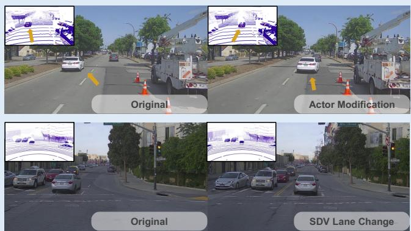
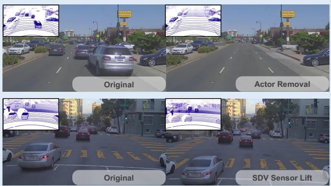
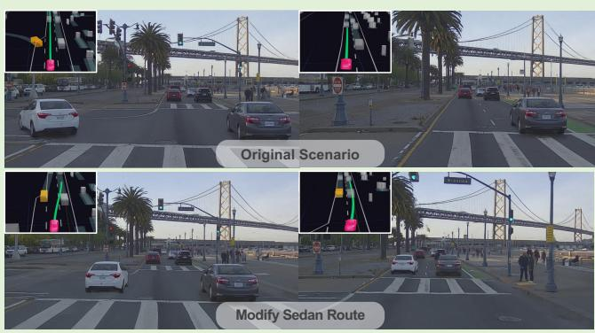
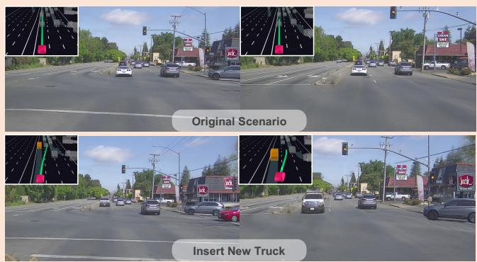
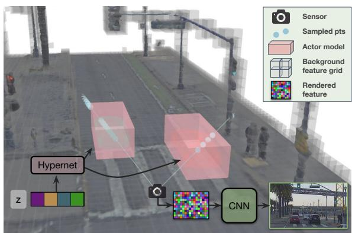
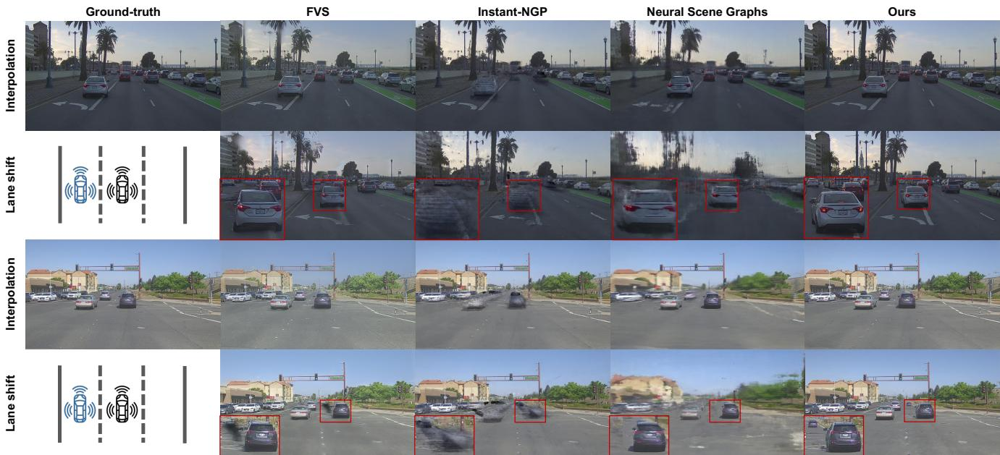
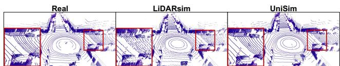
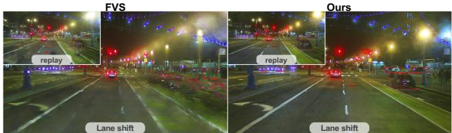
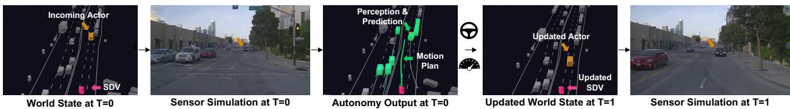

# UniSim: A Neural Closed-Loop Sensor Simulator

Ze Yang1,2\* Yun Chen1,2∗ Jingkang Wang1,2∗ Sivabalan Manivasagam1,2∗ Wei-Chiu Ma1,3 Anqi Joyce Yang1,2 Raquel Urtasun1,2 1Waabi 2University of Toronto 3Massachusetts Institute of Technology {zyang, ychen, jwang, siva, weichiu, jyang, urtasun}@waabi.ai

  
Scene manipulation with actor removal, modification, sensor configuration changes, and modified ego-trajectories

  
Closed-loop simulation for vehicle cut-in

  
Closed-loop simulation for safety-critical scenarios

Figure 1. Top: UniSim takes recorded sensor data from a data collection platform and creates manipulable digital twins. Bottom: UniSim generates realistic, temporally consistent sensor simulations for new scenarios, enabling closed-loop autonomy evaluation. The autonomy system reactively interacts with the scenario, receives new sensor data, and changes lanes (see planned trajectory inset). All images and LiDAR in figure simulated by UniSim. Please refer to our project page https://waabi.ai/research/unisim/ for more results.

## Abstract

Rigorously testing autonomy systems is essential for making safe self-driving vehicles (SDV) a reality. It requires one to generate safety critical scenarios beyond what can be collected safely in the world, as many scenarios happen rarely on our roads. To accurately evaluate performance, we need to test the SDV on these scenarios in closed-loop, where the SDV and other actors interact with each other at each timestep. Previously recorded driving logs provide

a rich resource to build these new scenarios from, but for closed loop evaluation, we need to modify the sensor data based on the new scene configuration and the SDV’s decisions, as actors might be added or removed and the trajectories of existing actors and the SDV will differ from the original log. In this paper, we present UniSim, a neural sensor simulator that takes a single recorded log captured by a sensor-equipped vehicle and converts it into a realistic closed-loop multi-sensor simulation. UniSim builds neural feature grids to reconstruct both the static background and dynamic actors in the scene, and composites them together

to simulate LiDAR and camera data at new viewpoints, with actors added or removed and at new placements. To better handle extrapolated views, we incorporate learnable priors for dynamic objects, and leverage a convolutional network to complete unseen regions. Our experiments show UniSim can simulate realistic sensor data with small domain gap on downstream tasks. With UniSim, we demonstrate,for the first time, closed-loop evaluation ofan autonomy system on safety-critical scenarios as ifit were in the real world.

## 1. Introduction

While driving along a highway, a car from the left suddenly swerves into your lane. You brake hard, avoiding an accident, but discomforting your passengers. As you replay the encounter in your mind, you consider how the scenario would have gone if the other vehicle had accelerated more, if you had slowed down earlier, or if you had instead changed lanes for a more comfortable drive. Having the ability to generate such “what-if” scenarios from a single recording would be a game changer for developing safe self-driving solutions. Unfortunately, such a tool does not exist and the self-driving industry primarily test their systems on pre-recorded real-world sensor data (i.e., logreplay), or by driving new miles in the real-world. In the former, the autonomous system cannot execute actions and observe their effects as new sensor data different from the original recording is not generated, while the latter is neither safe, nor scalable or sustainable. The status quo calls for novel closed-loop sensor simulation systems that are high fidelity and represent the diversity of the real world.

Here, we aim to build an editable digital twin of the real world (through the logs we captured), where existing actors in the scene can be modified or removed, new actors can be added, and new autonomy trajectories can be executed. This enables the autonomy system to interact with the simulated world, where it receives new sensor observations based on its new location and the updated states of the dynamic actors, in a closed-loop fashion. Such a simulator can accurately measure self-driving performance, as if it were actually in the real world, but without the safety hazards, and in a much less capital-intensive manner. Compared to manually-created game-engine based virtual worlds [15, 62], it is a more scalable, cost-effective, realistic, and diverse way towards closed-loop evaluation.

Towards this goal, we present UniSim, a realistic closedloop data-driven sensor simulation system for self-driving. UniSim reconstructs and renders multi-sensor data for novel views and new scene configurations from a single recorded log. This setting is very challenging as the observations are sparse and often captured from constrained viewpoints (e.g., straight trajectories along the roads). To better handle extrapolation from the observed views, we propose a series of enhancements over prior neural rendering approaches. In particular, we leverage multi-resolution voxel-based neural fields to represent and compose the static scene and dynamic agents, and volume render feature maps. To better handle novel views and incorporate scene context to reduce artifacts, a convolutional network (CNN) renders the feature map to form the final image. For dynamic agents, we learn a neural shape prior that helps complete the objects to render unseen areas. We use this sparse voxel-based representations to efficiently simulate both image and LiDAR observations under a unified framework. This is very useful as SDVs often use several sensor modalities for robustness.

Our experiments show that UniSim realistically simulates camera and LiDAR observations at new views for large-scale dynamic driving scenes, achieving SoTA performance in photorealism. Moreover, we find UniSim reduces the domain gap over existing camera simulation methods on the downstream autonomy tasks of detection, motion forecasting and motion planning. We also apply UniSim to augment training data to improve perception models. Importantly, we show, for the first time, closed-loop evaluation of an autonomy system on photorealistic safety-critical scenarios, allowing us to better measure SDV performance. This further demonstrates UniSim’s value in enabling safer and more efficient development of self-driving.

## 2. Related Work

Simulation Environments for Robotics: The robotics community has a long history of building simulators for safer and faster robot development [14, 29, 34, 45, 70, 80]. Early works focused on modeling robot dynamics and physical forces for parameter identification and controller modelling [29, 49]. Several works then developed accurate physics engines for improving robot design and motion planning [7,12,14,27,31], and for specific domains such as grasping [33], soft robotics [26], and SDVs [80]. But to enable end-to-end testing of full autonomy systems, we must also simulate realistic sensor observations of the 3D environment for the robot to perceive, interact with its surroundings, and plan accordingly [18]. Most prior sensor simulation systems use 3D-scanned or manually built synthetic environments for small indoor environments [31, 34, 61], and perform rasterization or ray-tracing [53,63] to simulate various sensor data [19, 21, 28]. For high-speed robots such as SDVs, simulators such as CARLA and AirSim [15, 62] applied a similar approach. But due to the costly manual effort in creating scenes, these simulators have difficulty scaling to all the areas we may want to test in, have limited asset diversity (e.g., roads, vehicles, vegetation) compared to the real world, and generate unrealistic sensor data that require substantial domain adaptation for autonomy [25, 79].

Novel View Synthesis: Recent novel view synthesis (NVS) work has achieved success in automatically generating highly photorealistic sensor observations [1, 32, 40, 46, 51, 52, 57, 58]. Such methods aim to learn a scene representation from a set of densely collected observed images and render the scene from nearby unseen viewpoints. Some works perform geometry reconstruction and then warp and aggregate pixel-features from the input images into new camera views, which are then processed by learning-based modules [1, 54, 58, 59]. Others represent the scene implicitly as a neural radiance field (NeRF) and perform volume rendering with a neural network [4,46,71,83]. These methods can represent complex geometry and appearance and have achieved photorealistic rendering, but focus on small static scenes. Several representations [8, 39, 43, 47, 48, 55, 56, 69, 88] partition the space and model the volume more efficiently to handle large-scale unbounded outdoor scenes. However, these works focus primarily on the NVS task where a dense collection of images are available and most test viewpoints are close to the training views, and focus on the static scene without rendering dynamic objects such as moving vehicles. In contrast, our work extends NVS techniques to build a sensor simulator from a single recorded log captured by a high-speed mobile platform. We aim to render image and LiDAR observations of dynamic traffic scenarios from new viewpoints and modified scene configurations to enable closed-loop autonomy evaluation.

Data-driven Sensor Simulation for Self Driving: Several past works have leveraged computer vision techniques and real world data to build sensor simulators for selfdriving. Some works perform 3D reconstruction by aggregating LiDAR and building textured geometry primitives for physics-based rendering [17, 42, 68, 82], but primarily simulate LiDAR or cannot model high-resolution images. Another line of work perform object reconstruction and insertion into existing images [10, 72, 78, 83] or point clouds [16,73,84,85], but these methods are unable to render sensor data from new views for closed-loop interaction. DriveGAN [30] represents the scene as disentangled latent codes and generates video from control inputs with a neural network for differentiable closed-loop simulation, but is limited in its realism and is not temporally consistent. AADS [35] and VISTA 2.0 [2, 3, 76], perform multisensor simulation via image-based warping or ray-casting on previously collected sensor data to render new views of the static scene, and then insert and blend CAD assets into the sensor data to create new scenarios. These approaches, while promising, have visual artifacts for the inserted actors and rendered novel views, resulting in a large domain gap. Neural Scene Graphs (NSG) [52] and Panoptic Neural Fields (PNF) [32] represent the static scene and agents as multi-layer perceptrons (MLPs) and volume render photorealistic images of the scene. However, the single MLP has difficulties modelling large scale scenes. These prior works also focus on scene editing and perception tasks where the

  
Figure 2. Overview of our approach: We divide the 3D scene into a static background (grey) and a set of dynamic actors (red). We query the neural feature fields separately for static background and dynamic actor models, and perform volume rendering to generate neural feature descriptors. We model the static scene with a sparse feature-grid and use a hypernetwork to generate the representation of each actor from a learnable latent. We finally use a convolutional network to decode feature patches into an image.

SDV does not deviate significantly from the original recording. Instead, we focus on multi-sensor simulation for closed loop evaluation of autonomy systems, and specifically design our system to better handle extrapolation.

## 3. Neural Sensor Simulation

Given a log with camera images and LiDAR point clouds captured by a moving platform, as well as their relative poses in a reference frame, our goal is to construct an editable and controllable digital twin, from which we can generate realistic multi-modal sensor simulation and counterfactual scenarios of interest. We build our model based on the intuition that the 3D world can be decomposed as a static background and a set of moving actors. By effectively disentangling and modeling each component, we can manipulate the actors to generate new scenarios and simulate the sensor observations from new viewpoints. Towards this goal, we propose UniSim, a neural rendering closed-loop simulator that jointly learns shape and appearance representations for both the static scene and dynamic actors from the sensor data captured from a single pass of the environment.

We unfold this section by first reviewing the basic building blocks of our approach. Next, we present our compositional scene representation, and detail how we design our background and dynamic actor models. We then describe how to generate simulated sensor data with UniSim. Finally, we discuss how to learn the model from real-world data. Fig. 2 shows an overview of our approach.

## 3.1. Preliminaries

Neural feature fields: A feature field refers to a continuous function $f$ that maps a 3D point $\textbf { x } \in \ \mathbb { R } ^ { 3 }$ and a view direction d $\in \ \mathbb { R } ^ { 2 }$ to an implicit geometry $s \in \mathbb { R }$ and a $N _ { f }$ -dimensional feature descriptor $\mathbf { f } \in \mathbb { R } ^ { N _ { f } }$ . Since the function is often parameterized as a neural network $f _ { \theta } : \mathbb { R } ^ { 3 } \times \mathbb { R } ^ { 2 } \to \mathbb { R } \times \mathbf { \bar { \mathbb { R } } } ^ { N _ { f } }$ , with θ the learnable weights, we call it neural feature field (NFF). NFFs can be seen as a superset of several existing works [44, 46]. If we represent the implicit geometry as volume density $s \in \mathbb { R } ^ { + }$ and the feature descriptor as RGB radiance $\textbf { f } \in \mathbb { R } ^ { 3 }$ , NFFs become NeRFs [46]. If we enforce the implicit geometry to be the probability of occupancy, NFFs become occupancy functions [44]. Importantly, NFFs naturally support composition [22, 32, 50], enabling the combination of multiple relatively simple NFFs to form a complex field.

Multi-resolution features grid: To improve the expressiveness and speed of NFFs, past works [11, 47, 67, 87] further combined learnable multi-resolution features grid $\{ \mathcal { G } ^ { l } \} _ { l = 1 } ^ { L }$ with a neural network $f .$ Specifically, given a query point $\textbf { x } \in \ \mathbb { R } ^ { 3 }$ , the 3D feature grid at each level is first trilinearly interpolated. The interpolated features are then concatenated with the view direction d $\in \mathbb { R } ^ { 2 }$ , and the resulting features are processed with an MLP head to obtain the geometry s and feature descriptor f:

$$
s , \mathbf { f } = f \left( \{ \mathrm { i n t e r p } ( \mathbf { x } , \mathcal { G } ^ { l } ) \} _ { l = 1 } ^ { L } , \mathbf { d } \right) .\tag{1}
$$

These multi-scale features encode both global context and fine-grained details, providing richer information comparing to the original input x. This also enables using a smaller $f ,$ which significantly reduces the inference time [66,67]. In practice, we optimize the features grid using a fixed number of features ${ \mathcal { F } } ,$ , and map the features grid $\{ \bar { \mathcal { G } } ^ { l } \} _ { l = 1 } ^ { L }$ to $\mathcal { F }$ with a grid index hash function [47]. Hereafter, we will use $\mathcal { F }$ and $\{ \mathcal { G } ^ { l } \} _ { l = 1 } ^ { L }$ interchangeably.

## 3.2. Compositional Neural Scene Representation

We aim to build a compositional scene representation that best models the 3D world including the dynamic actors and static scene. Given a recorded log captured by a data collection platform, we first define a 3D space volume over the traversed region. The volume consists of a static background B and a set of dynamic actors $\{ \mathcal { A } _ { i } \} _ { i = 1 } ^ { N } .$ Each dynamic actor is parameterized as a bounding box of dimensions $\mathbf { s } _ { \mathcal { A } _ { i } } ~ \in ~ \mathbb { R } ^ { 3 }$ , and its trajectory is defined by a sequence of SE(3) poses $\{ \mathbf { T } _ { \mathcal { A } _ { i } } ^ { t } \} _ { t = 1 } ^ { T }$ We then model the static background and dynamic actors with separate multiresolution features grid and NFFs. Let the static background be expressed in the world frame. We represent each actor in its object-centroid coordinate system (defined at the centroid of its bounding box), and transform their features grid to world coordinates to compose with the background. This allows us to disentangle the 3D motion of each actor, and focus on representing shape and appearance. To learn high-quality geometry [74,86], we adopt the signed distance function (SDF) as our implicit geometry representation s. We now describe each component in more detail.

Sparse background scene model: We model the whole static scene with a multi-resolution features grid $\mathcal { F } _ { \mathrm { b g } }$ and an MLP head $f _ { \mathrm { b g } } .$ Since a self-driving log often spans hundreds to thousands of meters, it is computationally and memory expensive to maintain a dense, high-resolution voxel grid. We thus utilize geometry priors from LiDAR observations to identify near-surface voxels and optimize only their features. Specifically, we first aggregate the static LiDAR point cloud from each frame to construct a dense 3D scene point cloud. We then voxelize the scene point cloud and obtain a scene occupancy grid $\mathbf { V } _ { \mathrm { o c c } }$ . Finally, we apply morphological dilation to the occupancy grid and coarsely split the 3D space into free vs. near-surface space. As the static background is often dominated by free space, this can significantly sparsify the features grid and reduce the computation cost. The geometric prior also allows us to better model the 3D structure of the scene, which is critical when simulating novel viewpoints with large extrapolation. To model distant regions, such as sky, we follow [5, 88] to extend our background scene model to unbounded scenes.

Generalized actor model: One straightforward way to model the actors is to parameterize each actor A with a features grid $\mathcal { F } _ { A }$ and adopt a shared MLP head $f _ { A }$ for all actors. In this design, the individual features grid encodes instance-specific geometry and appearance, while the shared network maps them to the same feature space for downstream applications. Unfortunately, such a design requires large memory for dense traffic scenes and, in practice, often leads to overfitting — the features grid does not generalize well to unseen viewpoints. To overcome such limitations, we propose to learn a hypernetwork [23] over the parameters of all grids of features. The intuition is that different actors are observed from different viewpoints, and thus their grids of features are informative in different regions. By learning a prior over them, we can capture the correlations between the features and infer the invisible parts from the visible ones. Specifically, we model each actor $A _ { i }$ with a low-dimensional latent code $\mathbf { z } _ { \mathcal { A } _ { i } }$ and learn a hypernetwork $f _ { \mathbf { z } }$ to regress the features grid $\mathcal { F } _ { A _ { i } }$

$$
\mathcal { F } _ { A _ { i } } = f _ { \mathbf { z } } ( \mathbf { z } _ { \mathcal { A } _ { i } } ) .\tag{2}
$$

Similar to the background, we adopt a shared MLP head $f _ { A }$ to predict the geometry and feature descriptor at each sampled 3D point via Eq. 1. We jointly optimize the actor latent codes $\left\{ \mathbf { z } _ { \mathbf { \mathcal { A } } _ { i } } \right\}$ during training.

Composing neural feature fields: Inspired by works that composite solid objects [22, 52] into a scene, we first transform object-centric neural fields of the foreground actors to world coordinates with the desired poses $( e . g .$ , using $\mathbf { T } _ { \mathcal { A } _ { i } } ^ { t }$ for reconstruction). As the static background is a sparse features grid, we then simply replace the free space with the actor feature fields. Through this simple operation, we can insert, remove, and manipulate the actors within the scene.

## 3.3. Multi-modal Sensor Simulation

Now that we have a composed scene representation of the static and dynamic world, the next step is to render it into the data modality of interest. In this work, we focus on camera images and LiDAR point clouds, as they are the two main sensory modalities employed by modern SDVs.

Camera simulation: Following recent success in NVS [9, 50], we adopt a hybrid volume and neural rendering framework for efficient photorealistic image simulation. Given a ray $\mathbf { r } ( t ) = \mathbf { o } + t \mathbf { d }$ shooting from the camera center o through the pixel center in direction d, we first sample a set of 3D points along the ray and extract their features and geometry (Eq. 1). We then aggregate the samples and obtain a pixel-wise feature descriptor via volume rendering:

$$
\mathbf { f } ( \mathbf { r } ) = \sum _ { i = 1 } ^ { N _ { \mathbf { r } } } w _ { i } \mathbf { f } _ { i } , \quad w _ { i } = \alpha _ { i } \prod _ { j = 1 } ^ { i - 1 } ( 1 - \alpha _ { j } ) .\tag{3}
$$

Here, $\alpha _ { i } \in [ 0 , 1 ]$ represents opacity, which we can derive from the SDF $s _ { i }$ using an approximate step function $\alpha =$ $1 / ( 1 + \exp ( \beta \cdot s ) )$ , and $\beta$ is the hyper-parameter controlling the slope. We volume render all camera rays and generate a 2D feature map $\mathbf { F } \in \mathbb { R } ^ { H _ { f } \times W _ { f } \times N _ { f } }$ . We then leverage a 2D CNN $g _ { \mathrm { r g b } }$ to render the feature map to an RGB image $\mathbf { I } _ { \mathrm { r g b } } { \mathrm { : } }$

$$
g _ { \mathrm { r g b } } : { \mathbf { F } } \in \mathbb { R } ^ { H _ { f } \times W _ { f } \times N _ { f } } \to { \mathbf { I } } _ { \mathrm { r g b } } \in \mathbb { R } ^ { H \times W \times 3 } .\tag{4}
$$

In practice, we adopt a smaller spatial resolution for the feature map $H _ { f } \times W _ { f }$ than that of the rendered image $H \times W$ and rely on the CNN $g _ { \mathrm { r g b } }$ for upsampling. This allows us to significantly reduce the amount of ray queries.

LiDAR simulation: LiDAR point clouds encode 3D (depth) and intensity (reflectivity) information, both of which can be simulated in a similar fashion to Eq. 3. We assume the LiDAR to be a time-of-flight pulse-based sensor, and model the pulses transmitted by the oriented LiDAR laser beams as a set of rays. We slightly abuse the notation and let $\mathbf { r } ( t ) = \mathbf { o } +$ td be a ray casted from the LiDAR sensor we want to simulate. Denote o as the center of the LiDAR and d as the normalized vector of the corresponding beam. We then simulate the depth measurement by computing the expected depth of the sampled 3D points:

$$
D ( \mathbf { r } ) = \sum _ { i = 1 } ^ { N _ { \mathbf { r } } } w _ { i } t _ { i } .\tag{5}
$$

As for LiDAR intensity, we volume render the ray feature (using Eq. 3) and pass it through an MLP intensity decoder $g _ { \mathrm { i n t } }$ to predict its intensity $l ^ { \mathrm { i n t } } ( { \bf r } ) = g _ { \mathrm { i n t } } ( { \bf f } ( { \bf r } ) )$ .

## 3.4. Learning

We jointly optimize all grids of features $\mathcal { F } _ { * }$ (including latent codes $\left\{ \mathbf { z } _ { \mathcal { A } _ { i } } \right\}$ , the hypernetwork $f _ { \mathbf { z } } ,$ the MLP heads $( f _ { \mathrm { b g } } , f _ { \mathrm { \mathcal { A } } } )$ and the decoders $( g _ { \mathrm { r g b } } , g _ { \mathrm { i n t } } )$ by minimizing the difference between the sensor observations and our rendered outputs. We also regularize the underlying geometry such that it satisfies real-world constraints. Our full objective is:

$$
\begin{array} { r } { \mathcal { L } = \mathcal { L } _ { \mathrm { r g b } } + \lambda _ { \mathrm { l i d a r } } \mathcal { L } _ { \mathrm { l i d a r } } + \lambda _ { \mathrm { r e g } } \mathcal { L } _ { \mathrm { r e g } } + \lambda _ { \mathrm { a d v } } \mathcal { L } _ { \mathrm { a d v } } . } \end{array}
$$

In the following, we discuss in more detail each term.

Image simulation $\mathcal { L } _ { \mathbf { r g b } } \colon$ This objective consists of a $\ell _ { 2 }$ photometric loss and a perceptual loss [75, 89], both measured between the observed images and our simulated results. We compute the loss in a patch-wise fashion:

$$
\mathcal { L } _ { \mathrm { r g b } } = \frac { 1 } { N _ { \mathrm { r g b } } } \sum _ { i = 1 } ^ { N _ { \mathrm { r g b } } } \left( \left. \mathbf { I } _ { i } ^ { \mathrm { r g b } } - \hat { \mathbf { I } } _ { i } ^ { \mathrm { r g b } } \right. _ { 2 } + \lambda \sum _ { j = 1 } ^ { M } \left. V ^ { j } ( \mathbf { I } _ { i } ^ { \mathrm { r g b } } ) - V ^ { j } ( \hat { \mathbf { I } } _ { i } ^ { \mathrm { r g b } } ) \right. _ { 1 } \right) ,\tag{6}
$$

where $\mathbf { I } _ { i } ^ { \mathrm { r g b } } = f _ { \mathrm { r g b } } ( \mathbf { F } _ { i } )$ is the rendered image patch (Eq. 4) and $\hat { \mathbf { I } } _ { i } ^ { \mathrm { g b } }$ is the corresponding observed image patch. Vj denotes the j-th layer of a pre-trained VGG network [64].

LiDAR simulation $\mathcal { L } _ { \mathrm { l i d a r } } \colon$ This objective measures the $\ell _ { 2 }$ error between the observed LiDAR point clouds and the simulated ones. Specifically, we compute the depth and intensity differences:

$$
\mathcal { L } _ { \mathrm { l i d a r } } = \frac { 1 } { N } \sum _ { i = 1 } ^ { N } \left( \left\| D ( \mathbf { r } _ { i } ) - D _ { i } ^ { \mathrm { o b s } } \right\| _ { 2 } + \left\| l ^ { \mathrm { i n t } } ( \mathbf { r } _ { i } ) - \hat { l } _ { i } ^ { \mathrm { m t } } \right\| _ { 2 } \right) .\tag{7}
$$

Since LiDAR observations are noisy, we filter outliers and encourage the model to focus on credible supervision. In practice, we optimize 95% of the rays within each batch that have smallest depth error.

Regularization $\mathcal { L } _ { \mathrm { r e g } } \mathrm { : }$ We further apply two additional constraints on the learned representations. First, we encourage the learned sample weight distribution w (Eq. 3) to concentrate around the surface. Second, we encourage the underlying SDF s to satisfy the Eikonal equation, which helps the network optimization find a smooth zero level set [20]:

$$
\mathcal { L } _ { \mathrm { r e g } } = \frac { 1 } { N } \sum _ { i = 1 } ^ { N } \biggl ( \sum _ { \tau _ { i , j } > \epsilon } \left\| w _ { i j } \right\| _ { 2 } + \sum _ { \tau _ { i , j } < \epsilon } \left( \left\| \nabla s ( \mathbf { x } _ { i j } ) \right\| _ { 2 } - 1 \right) ^ { 2 } \biggr ) ,\tag{8}
$$

where $\tau _ { i , j } = | t _ { i j } - D _ { i } ^ { \mathrm { g t } } |$ is the distance between the sample $\mathbf { x } _ { i j }$ and its corresponding LiDAR observation $D _ { i } ^ { \mathrm { g t } }$

Adversarial loss $\mathcal { L } _ { \mathbf { a d v } } \mathbf { : }$ To improve photorealism at unobserved viewpoints, we train a discriminator CNN $\mathcal { D } _ { \mathrm { a d v } }$ to differentiate between our simulated images at observed viewpoints and unobserved ones. Specifically, we denote the set of rays to render an image patch as ${ \textbf { R } } =$ $\{ \mathbf { r } ( \mathbf { o } , \mathbf { d } _ { j } ) \} _ { j = 1 } ^ { P \times P }$ , and randomly jitter the ray origin to create unobserved ray patches $\mathbf { R } ^ { \prime } = \{ \mathbf { r } ( \mathbf { o } + \epsilon , \mathbf { d } _ { j } ) \} _ { j = 1 } ^ { P \times P }$ , where $\epsilon \in \mathcal { N } ( 0 , \sigma )$ . The discriminator CNN $\mathcal { D } _ { \mathrm { a d v } }$ minimizes:

  
Figure 3. Qualitative comparison. We show simulation results in both the interpolation (rows 1, 3) and lane-shift test settings (rows 2, 4).

<table><tr><td rowspan="2">Methods</td><td colspan="3">Interpolation</td><td colspan="2">Lane Shift</td></tr><tr><td>PSNR↑</td><td>SSIM↑</td><td>LPIPS↓</td><td>FID↓ @ 2m</td><td>FID↓ @ 3m</td></tr><tr><td>FVS [58]</td><td>21.09</td><td>0.700</td><td>0.299</td><td>112.6</td><td>135.8</td></tr><tr><td>NSG [52]</td><td>20.74</td><td>0.600</td><td>0.556</td><td>319.2</td><td>343.0</td></tr><tr><td>Instant-NGP [47]</td><td>24.03</td><td>0.708</td><td>0.451</td><td>192.8</td><td>220.1</td></tr><tr><td>Ours</td><td>25.63</td><td>0.745</td><td>0.288</td><td>74.7</td><td>97.5</td></tr></table>

Table 1. State-of-the-art image comparison
<table><tr><td rowspan="2">Methods</td><td colspan="3">Interpolation</td><td colspan="2">Lane Shift</td></tr><tr><td>PSNR↑</td><td>SSIM↑</td><td>LPIPS↓</td><td>FID↓ @ 2m</td><td>FID↓ @ 3m</td></tr><tr><td>NFF only</td><td>24.93</td><td>0.717</td><td>0.393</td><td>153.7</td><td>173.5</td></tr><tr><td>+ Actor model</td><td>25.80</td><td>0.744</td><td>0.364</td><td>84.1</td><td>111.8</td></tr><tr><td>+ CNN</td><td>25.99</td><td>0.762</td><td>0.341</td><td>78.8</td><td>103.3</td></tr><tr><td>+ VGG &amp; GAN loss</td><td>25.63</td><td>0.745</td><td>0.288</td><td>74.7</td><td>97.5</td></tr></table>

Table 2. Ablation of UniSim enhancements

<table><tr><td></td><td>Median  $\ell _ { 2 }$  Error (m)↓</td><td>Hit Rate↑</td><td>Intensity RMSE↓</td></tr><tr><td>LiDARsim [42]</td><td>0.11</td><td>92.2%</td><td>0.091</td></tr><tr><td>Ours</td><td>0.10</td><td>99.6%</td><td>0.065</td></tr></table>

Table 3. State-of-the-art LiDAR comparison

$$
- \frac { 1 } { { \cal N } _ { \mathrm { a d v } } } \sum _ { i = 1 } ^ { N _ { \mathrm { a d v } } } \log \mathcal { D } _ { \mathrm { a d v } } ( { \bf { I } } _ { i } ^ { \mathrm { r g b , { \bf R } } } ) + \log ( 1 - \mathcal { D } _ { \mathrm { a d v } } ( { \bf { I } } _ { i } ^ { \mathrm { r g b , { \bf R } ^ { \prime } } } ) ) ,\tag{9}
$$

where ${ \bf I } _ { i } ^ { \mathrm { r g b , R } } \ = \ f _ { \mathrm { r g b } } ( { \bf F } ( { \bf R } _ { i } ) )$ and ${ \bf \Gamma } _ { i } ^ { \mathrm { r g b , R ^ { \prime } } } = f _ { \mathrm { r g b } } ( { \bf F } ( { \bf R } _ { i } ^ { \prime } ) )$ are the rendered image patches at observed and unobserved viewpoints, respectively. We then define the adversarial loss ${ \mathcal { L } } _ { \mathrm { a d v } }$ to train the CNN RGB decoder $g _ { \mathrm { r g b } }$ and neural feature fields to improve photorealism at unobserved viewpoints as:

$$
\mathcal { L } _ { \mathrm { a d v } } = \frac { 1 } { N _ { \mathrm { a d v } } } \sum _ { i = 1 } ^ { N _ { \mathrm { a d v } } } \log ( 1 - \mathcal { D } _ { \mathrm { a d v } } ( \mathbf { I } _ { i } ^ { \mathrm { r g b , \mathbf { R } ^ { \prime } } } ) ) .\tag{10}
$$

Implementation details: We identify actors along rendered rays using the AABB ray-box intersection [41]. When sampling points along the ray, we adopt a larger step size for background regions and a smaller one for intersected actor models to ensure appropriate resolution. We leverage the scene occupancy grid $\mathbf { V } _ { \mathrm { o c c } }$ to skip point samples in free space. During learning, we also optimize the actor trajectories to account for noise in the initial input. For vehicle actors, we also leverage the shape prior that they are symmetric along their length. Please see supp. for details.

## 4. Experiments

In this section we begin by introducing our experimental setting, and then compare our model against state-of-the-art methods to evaluate the sensor simulation realism and domain gap with real data, and also ablate our model components. We then show that our method can generate diverse sensor simulations to improve vehicle detection. Finally, we demonstrate UniSim for evaluating an autonomy system trained only on real data in closed-loop.

## 4.1. Experimental Details

Dataset: We evaluate our method on the publicly available PandaSet [81] which contains 103 driving scenes captured in urban areas in San Francisco. Each scene is composed of 8 seconds (80 frames, sampled at 10hz) of images captured from a front-facing wide angle camera (1920×1080) and point clouds from 360◦ spinning LiDAR.

  
Figure 4. Comparison of LiDAR simulation. UniSim produces higher-fidelity LiDAR simulation with less noise and more continuous beam rings that are closer to real LiDAR compared to [42].

Baselines: We compare our model against several SoTA methods. FVS [58] is an NVS method that uses reconstructed geometry (aggregated LiDAR in our implementation) as a “proxy” to re-project pixels from the input images into new camera views, where they are blended by a neural network. We enhance FVS to model dynamic actors. Instant-NGP [47] is a NeRF-based method that adopts multi-resolution hashing encoding for compact scene representation and efficient rendering. We enhance it by adding LiDAR depth supervision for better geometry and extrapolation. NSG [52] is a camera simulation method that models the scene with separate NeRF representations for the static background and each dynamic actor. See supp. for details.

## 4.2. UniSim Controllability

We first highlight in Fig. 1 the power of UniSim to perform all the capabilities for closed-loop sensor simulation. We can not only render the original scene, but because of our decomposed actor and background representations, we can also remove all the actors, and change their positions. With enhanced extrapolation capabilities, we can change the SDV’s location or test new sensor configurations. See supp. for more results, including highway scenes.

## 4.3. Realism Evaluation

Sensor simulation should not only reconstruct nearby views, but also generate realistic data at significantly different viewpoints. Here we evaluate both settings. Similar to other NVS benchmarks [38], we subsample the sensor data by two, training on every other frame and testing on the remaining frames, dubbed “interpolation” test. We report PSNR, SSIM [77], and LPIPS [89]. We also evaluate extrapolation by simulating a new trajectory shifted laterally to the left or right by 2 or 3 meters, dubbed “lane shift” test. Since ground-truth is unavailable, we report FID [24].

Camera Simulation: We report image-similarity metrics against SoTA in Table 1. Due to computational costs of the baseline NSG, we select 10 scenes for evaluation. Our method outperforms the baselines in all metrics, and the gap is more significant in extrapolation settings. FVS performs well on LPIPS and InstantNGP on PSNR in the interpolation setting, but both have difficulty when rendering at extrapolated views. Fig. 3 shows qualitative results. NSG produces decent results for dynamic actors but fails on large static scenes, due to its sparse multi-plane representation. Note UniSim is more realistic than the baselines.

Figure 5. Real2Sim Qualitative on replay and lane shift settings.
<table><tr><td rowspan="2">Method</td><td colspan="2">Log Replay</td><td colspan="2">Lane Shift</td></tr><tr><td>Real2Sim</td><td>Sim2Real</td><td>Real2Sim</td><td>Sim2Real</td></tr><tr><td>FVS [58]</td><td>36.9</td><td>38.7</td><td>30.3</td><td>32.2</td></tr><tr><td>Instant-NGP [47]</td><td>22.6</td><td>34.0</td><td>18.1</td><td>26.5</td></tr><tr><td>Ours</td><td>40.2</td><td>39.9</td><td>37.0</td><td>37.1</td></tr></table>

Table 4. Detection domain gap, mAP. Real2Real = 40.9.
<table><tr><td></td><td>Instant-NGP [47]</td><td>FVS [58]</td><td>Ours</td></tr><tr><td>Sim</td><td>32.4</td><td>39.2</td><td>41.4</td></tr><tr><td>Real + Sim</td><td>40.1</td><td>41.1</td><td>42.9</td></tr></table>

Table 5. Augmenting with simulation, mAP. Real2Real = 40.9.
<table><tr><td></td><td>Det. Agg. ↑</td><td>Pred. ADE ↓</td><td>Plan Cons. ↓</td></tr><tr><td>FVS [58]</td><td>0.80</td><td>2.35</td><td>6.15</td></tr><tr><td>Instant-NGP [47]</td><td>0.42</td><td>3.24</td><td>13.44</td></tr><tr><td>Ours</td><td>0.82</td><td>1.68</td><td>6.09</td></tr></table>

Table 6. Open-Loop Real2Sim Autonomy Evaluation

Ablation: We validate the effectiveness of several key components in Tab. 2. Both the actor model and the CNN decoder improve the overall performance over the neural features grid base model. The CNN is especially effective in the extrapolation setting, as it improves the overall image quality by spatial relation reasoning and increases model capacity. Adding perceptual and adversarial losses results in a small performance drop for interpolation, but improves the lane shift results. Please see supp. for more visual results.

LiDAR Simulation: We also evaluate the fidelity of our LiDAR simulation and compare with SoTA approach Li-DARsim [42]. For LiDARsim, we reconstruct surfel assets using all training frames, place actors in their original scenario in test frames, and perform ray-casting. Both methods use the real LiDAR rays to generate a simulated point cloud. We evaluate the fraction of real LiDAR points that have a corresponding simulated point (i.e., Hit rate), the median per-ray $\ell _ { 2 }$ error and the average intensity simulation errors. As shown in Tab. 3, UniSim outperforms LiDARsim in all metrics suggesting it is more accurate and has better coverage. Fig. 4 shows a visual comparison. Please see supp. for additional autonomy results and qualitative examples.

## 4.4. Perception Evaluation and Training

In addition to image-similarity, sensor simulation should be realistic with respect to how autonomy perceives it. To verify if UniSim reduces the domain gap for perception tasks, we leveraged the SoTA camera-based birds-eye-view (BEV) detection model BEVFormer [37]. We consider two setups (a) Real2Sim: evaluating the perception model trained on real data on simulated data; (b) Sim2Real: training perception models with simulated data data and testing on real data. Specifically, we evaluate the real model on 24 simulated validation logs for Real2Sim and train perception models with 79 simulated training logs for Sim2Real.

  
Figure 6. Closed-loop Evaluation. From left to right: With UniSim, we can create a safety-critical scenario (e.g., incoming actor), simulate the sensor data, run autonomy on it, update the SDV’s viewpoint and other actor locations, and simulate the new sensor data.

We consider both replay and lane shift test settings. In replay, we replay all actors and SDV with their original trajectories. In lane shift, we shift the SDV trajectory laterally by 2 meters and simulate images at extrapolated views. We report detection mean average precision (mAP).

Domain Gap in Simulation: As shown in Table 4, our approach achieves the smallest domain gap in both Real2Sim and Sim2Real setups, on both replay and lane shift settings, while other existing approaches result in larger domain gaps, hindering their applicability to evaluate and train autonomy. This is especially evident in the more challenging lane shift setting, where there is a larger performance gap between UniSim and the baselines. Fig. 5 shows the Real2Sim detection performance for both replay and lane shift settings compared to FVS [58].

Data Augmentation with Simulation Data: We now study if our simulated data boosts performance when used for training. Specifically, we use all PandaSet training logs to generate simulation variations (replay, lane shift 0.5 and 2 meters) to train the detectors. As shown in Table 5, using UniSim data only to train the perception model is even better than training with all real data. Note we only increase the rendered viewpoints and do not alter the content. We then combine the real data with the simulation data and retrain the detector. Table 5 shows UniSim augmentation yields a significant performance gain. In contrast, baseline data augmentation brings marginal gain or harms performance.

## 4.5. Full Autonomy Evaluation with UniSim

Domain gap evaluation: Sensor simulation not only affects perception tasks, but also downstream tasks such as motion forecasting and planning. We report domain gap metrics by evaluating an autonomy system trained on real data on simulated images of the original scenario. The autonomy system under evaluation is a module-based system, with BEVFormer [37] taking front-view camera images as input and producing BEV detections that are matched over time to produce tracks via greedy association as the perception module. These are then fed to a motion forecasting model [13] that takes in BEV tracks and a map raster and outputs bounding boxes and 6 second trajectory forecasts. Finally a SoTA sampling-based motion planner [60] takes the prediction output and map to plan a maneuver. We report open-loop autonomy metrics (detection agreement @ IoU 0.3, prediction average displacement error (ADE), and motion plan consistency at 5 seconds) in Table 6. Compared to other methods, our approach has the smallest domain gap. Please see supp. for details.

Closed-loop Simulation: With UniSim, we can create new scenarios, simulate the sensor data, run the autonomy system, update the state of the actors in a reactive manner and the SDV’s location, and execute the next time step (see Fig. 6). This gives us a more accurate measure of the SDV’s performance to how it would behave in the real world for the same scenario. Fig. 1 shows additional simulations of the autonomy on safety critical scenarios such as an actor cutting into our lane or an oncoming actor in our lane. The SDV then lane changes, and with UniSim we can simulate the sensor data realistically throughout the scenario. Please see supp. video for complete visuals.

## 5. Conclusion

In this paper, we leveraged real world scenarios collected by a mobile platform to build a high-fidelity virtual world for autonomy testing. Towards this goal, we presented UniSim, a neural sensor simulator that takes in a sequence of LiDAR and camera data and can decompose and reconstruct the dynamic actors and static background in the scene, allowing us to create new scenarios and render sensor observations of those new scenarios from new viewpoints. UniSim improves over SoTA and generates realistic sensor data with much lower domain gap. Furthermore, we demonstrated that we can use it to evaluate an autonomy system in closed loop on novel safety-critical scenarios. We hope UniSim will enable developing safer autonomy systems more efficiently and safely. Future work involves explicitly modelling and manipulating scene lighting [6, 65, 90], weather [36], and articulated actors [72].

Acknowledgements: We thank Ioan-Andrei Barsan for profound discussion and constructive feedback. We thank the Waabi team for their valuable assistance and support.

## References

[1] Kara-Ali Aliev, Artem Sevastopolsky, Maria Kolos, Dmitry Ulyanov, and Victor Lempitsky. Neural point-based graphics. In ECCV, 2020. 3

[2] Alexander Amini, Igor Gilitschenski, Jacob Phillips, Julia Moseyko, Rohan Banerjee, Sertac Karaman, and Daniela Rus. Learning robust control policies for end-to-end autonomous driving from data-driven simulation. IEEE RA-L, 2020. 3

[3] Alexander Amini, Tsun-Hsuan Wang, Igor Gilitschenski, Wilko Schwarting, Zhijian Liu, Song Han, Sertac Karaman, and Daniela Rus. VISTA 2.0: An open, data-driven simulator for multimodal sensing and policy learning for autonomous vehicles. In ICRA, 2022. 3

[4] Jonathan T Barron, Ben Mildenhall, Matthew Tancik, Peter Hedman, Ricardo Martin-Brualla, and Pratul P Srinivasan. Mip-NeRF: A multiscale representation for antialiasing neural radiance fields. In ICCV, 2021. 3

[5] Jonathan T Barron, Ben Mildenhall, Dor Verbin, Pratul P Srinivasan, and Peter Hedman. Mip-NeRF 360: Unbounded anti-aliased neural radiance fields. In CVPR, 2022. 4

[6] Mark Boss, Varun Jampani, Raphael Braun, Ce Liu, Jonathan Barron, and Hendrik Lensch. Neural-PIL: Neural pre-integrated lighting for reflectance decomposition. 2021. 8

[7] Greg Brockman, Vicki Cheung, Ludwig Pettersson, Jonas Schneider, John Schulman, Jie Tang, and Wojciech Zaremba. OpenAI gym. arXiv, 2016. 2

[8] Rohan Chabra, Jan E Lenssen, Eddy Ilg, Tanner Schmidt, Julian Straub, Steven Lovegrove, and Richard Newcombe. Deep local shapes: Learning local sdf priors for detailed 3d reconstruction. In ECCV, 2020. 3

[9] Eric R Chan, Connor Z Lin, Matthew A Chan, Koki Nagano, Boxiao Pan, Shalini De Mello, Orazio Gallo, Leonidas J Guibas, Jonathan Tremblay, Sameh Khamis, et al. Efficient geometry-aware 3D generative adversarial networks. In CVPR, 2022. 5

[10] Yun Chen, Frieda Rong, Shivam Duggal, Shenlong Wang, Xinchen Yan, Sivabalan Manivasagam, Shangjie Xue, Ersin Yumer, and Raquel Urtasun. Geosim: Realistic video simulation via geometry-aware composition for self-driving. In CVPR, 2021. 3

[11] Julian Chibane, Thiemo Alldieck, and Gerard Pons-Moll. Implicit functions in feature space for 3D shape reconstruction and completion. In CVPR, 2020. 4

[12] Erwin Coumans and Yunfei Bai. PyBullet, a python module for physics simulation for games, robotics and machine learning. 2016. 2

[13] Henggang Cui, Vladan Radosavljevic, Fang-Chieh Chou, Tsung-Han Lin, Thi Nguyen, Tzu-Kuo Huang, Jeff Schneider, and Nemanja Djuric. Multimodal trajectory predictions for autonomous driving using deep convolutional networks. ICRA, 2019. 8

[14] Rosen Diankov and James Kuffner. OpenRAVE: A planning architecture for autonomous robotics. Robotics Institute, Pittsburgh, PA, Tech. Rep. CMU-RI-TR-08-34, 2008. 2

[15] Alexey Dosovitskiy, German Ros, Felipe Codevilla, Antonio Lopez, and Vladlen Koltun. CARLA: An open urban driving simulator. CoRL, 2017. 2

[16] Jin Fang, Dingfu Zhou, Feilong Yan, Tongtong Zhao, Feihu Zhang, Yu Ma, Liang Wang, and Ruigang Yang. Augmented LiDAR simulator for autonomous driving. IEEE RA-L, 2020. 3

[17] Jin Fang, Xinxin Zuo, Dingfu Zhou, Shengze Jin, Sen Wang, and Liangjun Zhang. LiDAR-Aug: A general renderingbased augmentation framework for 3D object detection. In CVPR, 2021. 3

[18] James J Gibson. The ecological approach to visual perception: classic edition. 2014. 2

[19] Adam A Goodenough and Scott D Brown. Dirsig 5: core design and implementation. In Algorithms and Technologies for Multispectral, Hyperspectral, and Ultraspectral Imagery XVIII, 2012. 2

[20] Amos Gropp, Lior Yariv, Niv Haim, Matan Atzmon, and Yaron Lipman. Implicit geometric regularization for learning shapes. In ICML, 2020. 5

[21] Michael Gschwandtner, Roland Kwitt, Andreas Uhl, and Wolfgang Pree. Blensor: Blender sensor simulation toolbox. In International Symposium on Visual Computing, 2011. 2

[22] Michelle Guo, Alireza Fathi, Jiajun Wu, and Thomas Funkhouser. Object-centric neural scene rendering. arXiv, 2020. 4

[23] David Ha, Andrew Dai, and Quoc V Le. Hypernetworks. ICLR, 2016. 4

[24] Martin Heusel, Hubert Ramsauer, Thomas Unterthiner, Bernhard Nessler, and Sepp Hochreiter. Gans trained by a two time-scale update rule converge to a local nash equilibrium. In NeurIPS, 2017. 7

[25] Judy Hoffman, Eric Tzeng, Taesung Park, Jun-Yan Zhu, Phillip Isola, Kate Saenko, Alexei Efros, and Trevor Darrell. CyCADA: Cycle-consistent adversarial domain adaptation. In ICML, 2018. 2

[26] Yuanming Hu, Jiancheng Liu, Andrew Spielberg, Joshua B Tenenbaum, William T Freeman, Jiajun Wu, Daniela Rus, and Wojciech Matusik. Chainqueen: A real-time differentiable physical simulator for soft robotics. In ICRA, 2019. 2

[27] Louis Hugues and Nicolas Bredeche. Simbad: an autonomous robot simulation package for education and research. In International Conference on Simulation ofAdaptive Behavior, 2006. 2

[28] Brian Karis and Epic Games. Real shading in unreal engine 4. Proc. Physically Based Shading Theory Practice, 2013. 2

[29] Pradeep K Khosla and Takeo Kanade. Parameter identification of robot dynamics. In 1985 24th IEEE conference on decision and control, 1985. 2

[30] Seung Wook Kim, Jonah Philion, Antonio Torralba, and Sanja Fidler. DriveGAN: Towards a controllable highquality neural simulation. In CVPR, 2021. 3

[31] Nathan Koenig and Andrew Howard. Design and use paradigms for gazebo, an open-source multi-robot simulator. In IROS, 2004. 2

[32] Abhijit Kundu, Kyle Genova, Xiaoqi Yin, Alireza Fathi, Caroline Pantofaru, Leonidas J Guibas, Andrea Tagliasacchi, Frank Dellaert, and Thomas Funkhouser. Panoptic neural fields: A semantic object-aware neural scene representation. In CVPR, 2022. 3, 4

[33] Beatriz Leon, Stefan Ulbrich, Rosen Diankov, Gustavo´ Puche, Markus Przybylski, Antonio Morales, Tamim Asfour, Sami Moisio, Jeannette Bohg, James Kuffner, et al. Opengrasp: a toolkit for robot grasping simulation. In International conference on simulation, modeling, and programmingfor autonomous robots, 2010. 2

[34] Chengshu Li, Fei Xia, Roberto Mart´ın-Mart´ın, Michael Lingelbach, Sanjana Srivastava, Bokui Shen, Kent Vainio, Cem Gokmen, Gokul Dharan, Tanish Jain, et al. igibson 2.0: Object-centric simulation for robot learning of everyday household tasks. CoRL, 2021. 2

[35] Wei Li, CW Pan, Rong Zhang, JP Ren, YX Ma, Jin Fang, FL Yan, QC Geng, XY Huang, HJ Gong, et al. Aads: Augmented autonomous driving simulation using data-driven algorithms. Science robotics, 2019. 3

[36] Yuan Li, Zhi-Hao Lin, David Forsyth, Jia-Bin Huang, and Shenlong Wang. ClimateNeRF: Physically-based neural rendering for extreme climate synthesis. arXiv e-prints, pages arXiv–2211, 2022. 8

[37] Zhiqi Li, Wenhai Wang, Hongyang Li, Enze Xie, Chonghao Sima, Tong Lu, Qiao Yu, and Jifeng Dai. Bevformer: Learning bird’s-eye-view representation from multi-camera images via spatiotemporal transformers. In ECCV, 2022. 8

[38] Yiyi Liao, Jun Xie, and Andreas Geiger. Kitti-360: A novel dataset and benchmarks for urban scene understanding in 2d and 3d. PAMI, 2022. 7

[39] Lingjie Liu, Jiatao Gu, Kyaw Zaw Lin, Tat-Seng Chua, and Christian Theobalt. Neural sparse voxel fields. In NeurIPS, 2020. 3

[40] Stephen Lombardi, Tomas Simon, Jason Saragih, Gabriel Schwartz, Andreas Lehrmann, and Yaser Sheikh. Neural volumes: Learning dynamic renderable volumes from images. In SIGGRAPH, 2019. 3

[41] Alexander Majercik, Cyril Crassin, Peter Shirley, and Morgan McGuire. A ray-box intersection algorithm and efficient dynamic voxel rendering. Journal of Computer Graphics Techniques Vol, 2018. 6

[42] Sivabalan Manivasagam, Shenlong Wang, Kelvin Wong, Wenyuan Zeng, Mikita Sazanovich, Shuhan Tan, Bin Yang, Wei-Chiu Ma, and Raquel Urtasun. Lidarsim: Realistic lidar simulation by leveraging the real world. In CVPR, 2020. 3, 6, 7

[43] Julien NP Martel, David B Lindell, Connor Z Lin, Eric R Chan, Marco Monteiro, and Gordon Wetzstein. Acorn: Adaptive coordinate networks for neural scene representation. TOG, 2021. 3

[44] Lars Mescheder, Michael Oechsle, Michael Niemeyer, Sebastian Nowozin, and Andreas Geiger. Occupancy networks: Learning 3d reconstruction in function space. In CVPR, 2019. 4

[45] Olivier Michel. Cyberbotics ltd. webots™: professional mobile robot simulation. International Journal of Advanced Robotic Systems, 2004. 2

[46] Ben Mildenhall, Pratul P Srinivasan, Matthew Tancik, Jonathan T Barron, Ravi Ramamoorthi, and Ren Ng. Nerf: Representing scenes as neural radiance fields for view synthesis. ECCV, 2020. 3, 4

[47] Thomas Muller, Alex Evans, Christoph Schied, and Alexan-¨ der Keller. Instant neural graphics primitives with a multiresolution hash encoding. 2022. 3, 4, 6, 7

[48] Thomas Neff, Pascal Stadlbauer, Mathias Parger, Andreas Kurz, Joerg H Mueller, Chakravarty R Alla Chaitanya, Anton Kaplanyan, and Markus Steinberger. Donerf: Towards realtime rendering of compact neural radiance fields using depth oracle networks. In Computer Graphics Forum, 2021. 3

[49] Charles P Neuman and John J Murray. Computational robot dynamics: Foundations and applications. Journal of Robotic Systems, 1985. 2

[50] Michael Niemeyer and Andreas Geiger. Giraffe: Representing scenes as compositional generative neural feature fields. In CVPR, 2021. 4, 5

[51] Julian Ost, Issam Laradji, Alejandro Newell, Yuval Bahat, and Felix Heide. Neural point light fields. In CVPR, 2022. 3

[52] Julian Ost, Fahim Mannan, Nils Thuerey, Julian Knodt, and Felix Heide. Neural scene graphs for dynamic scenes. In CVPR, 2021. 3, 4, 6, 7

[53] Steven G Parker, James Bigler, Andreas Dietrich, Heiko Friedrich, Jared Hoberock, David Luebke, David McAllister, Morgan McGuire, Keith Morley, Austin Robison, et al. Optix: a general purpose ray tracing engine. TOG, 2010. 2

[54] Ruslan Rakhimov, Andrei-Timotei Ardelean, Victor Lempitsky, and Evgeny Burnaev. Npbg++: Accelerating neural point-based graphics. In CVPR, 2022. 3

[55] Daniel Rebain, Wei Jiang, Soroosh Yazdani, Ke Li, Kwang Moo Yi, and Andrea Tagliasacchi. Derf: Decomposed radiance fields. In CVPR, 2021. 3

[56] Christian Reiser, Songyou Peng, Yiyi Liao, and Andreas Geiger. KiloNeRF: Speeding up neural radiance fields with thousands of tiny MLPs. In ICCV, 2021. 3

[57] Konstantinos Rematas, Andrew Liu, Pratul P Srinivasan, Jonathan T Barron, Andrea Tagliasacchi, Thomas Funkhouser, and Vittorio Ferrari. Urban radiance fields. In CVPR, 2022. 3

[58] Gernot Riegler and Vladlen Koltun. Free view synthesis. In ECCV, 2020. 3, 6, 7, 8

[59] Gernot Riegler and Vladlen Koltun. Stable view synthesis. In CVPR, 2021. 3

[60] Abbas Sadat, Mengye Ren, Andrei Pokrovsky, Yen-Chen Lin, Ersin Yumer, and Raquel Urtasun. Jointly learnable behavior and trajectory planning for self-driving vehicles. IROS, 2019. 8

[61] Manolis Savva, Abhishek Kadian, Oleksandr Maksymets, Yili Zhao, Erik Wijmans, Bhavana Jain, Julian Straub, Jia Liu, Vladlen Koltun, Jitendra Malik, et al. Habitat: A platform for embodied ai research. In ICCV, 2019. 2

[62] Shital Shah, Debadeepta Dey, Chris Lovett, and Ashish Kapoor. AirSim: High-fidelity visual and physical simulation for autonomous vehicles. In Field and service robotics, 2018. 2

[63] Dave Shreiner, Bill The Khronos OpenGL ARB Working Group, et al. OpenGL programming guide: the official guide to learning OpenGL, versions 3.0 and 3.1. 2009. 2

[64] Karen Simonyan and Andrew Zisserman. Very deep convolutional networks for large-scale image recognition. In ICLR, 2015. 5

[65] Pratul P. Srinivasan, Boyang Deng, Xiuming Zhang, Matthew Tancik, Ben Mildenhall, and Jonathan T. Barron. NeRV: Neural reflectance and visibility fields for relighting and view synthesis. In CVPR, 2021. 8

[66] Cheng Sun, Min Sun, and Hwann-Tzong Chen. Direct voxel grid optimization: Super-fast convergence for radiance fields reconstruction. In CVPR, 2022. 4

[67] Towaki Takikawa, Joey Litalien, Kangxue Yin, Karsten Kreis, Charles Loop, Derek Nowrouzezahrai, Alec Jacobson, Morgan McGuire, and Sanja Fidler. Neural geometric level of detail: Real-time rendering with implicit 3D shapes. In CVPR, 2021. 4

[68] Abhijeet Tallavajhula, C¸ etin Meric¸li, and Alonzo Kelly. Offroad lidar simulation with data-driven terrain primitives. In ICRA, 2018. 3

[69] Matthew Tancik, Vincent Casser, Xinchen Yan, Sabeek Pradhan, Ben Mildenhall, Pratul P. Srinivasan, Jonathan T. Barron, and Henrik Kretzschmar. Block-NeRF: Scalable large scene neural view synthesis. In CVPR, 2022. 3

[70] Emanuel Todorov, Tom Erez, and Yuval Tassa. Mujoco: A physics engine for model-based control. In IROS, 2012. 2

[71] Dor Verbin, Peter Hedman, Ben Mildenhall, Todd Zickler, Jonathan T Barron, and Pratul P Srinivasan. Ref-nerf: Structured view-dependent appearance for neural radiance fields. In CVPR, 2022. 3

[72] Jingkang Wang, Sivabalan Manivasagam, Yun Chen, Ze Yang, Ioan Andrei Barsan, Anqi Joyce Yang, Wei-Chiu Ma,ˆ and Raquel Urtasun. CADSim: Robust and scalable in-thewild 3d reconstruction for controllable sensor simulation. In Conference on Robot Learning, 2022. 3, 8

[73] Jingkang Wang, Ava Pun, James Tu, Sivabalan Manivasagam, Abbas Sadat, Sergio Casas, Mengye Ren, and Raquel Urtasun. Advsim: Generating safety-critical scenarios for self-driving vehicles. In CVPR, 2021. 3

[74] Peng Wang, Lingjie Liu, Yuan Liu, Christian Theobalt, Taku Komura, and Wenping Wang. NeuS: Learning neural implicit surfaces by volume rendering for multi-view reconstruction. In NeurIPS, 2021. 4

[75] Ting-Chun Wang, Ming-Yu Liu, Jun-Yan Zhu, Andrew Tao, Jan Kautz, and Bryan Catanzaro. High-resolution image synthesis and semantic manipulation with conditional gans. In CVPR, 2018. 5

[76] Tsun-Hsuan Wang, Alexander Amini, Wilko Schwarting, Igor Gilitschenski, Sertac Karaman, and Daniela Rus. Learning interactive driving policies via data-driven simulation. In ICRA, 2022. 3

[77] Zhou Wang, Alan C Bovik, Hamid R Sheikh, and Eero P Simoncelli. Image quality assessment: from error visibility to structural similarity. TIP, 2004. 7

[78] Zian Wang, Wenzheng Chen, David Acuna, Jan Kautz, and Sanja Fidler. Neural light field estimation for street scenes with differentiable virtual object insertion. ECCV, 2022. 3

[79] Bichen Wu, Xuanyu Zhou, Sicheng Zhao, Xiangyu Yue, and Kurt Keutzer. SqueezeSegV2: Improved model structure and unsupervised domain adaptation for road-object segmentation from a LiDAR point cloud. In ICRA, 2019. 2

[80] Bernhard Wymann, Eric Espie, Christophe Guion-´ neau, Christos Dimitrakakis, Remi Coulom, and An-´ drew Sumner. Torcs, the open racing car simulator. http://torcs.sourceforge.net, 2000. 2

[81] Pengchuan Xiao, Zhenlei Shao, Steven Hao, Zishuo Zhang, Xiaolin Chai, Judy Jiao, Zesong Li, Jian Wu, Kai Sun, Kun Jiang, et al. Pandaset: Advanced sensor suite dataset for autonomous driving. In ITSC, 2021. 6

[82] Zhenpei Yang, Yuning Chai, Dragomir Anguelov, Yin Zhou, Pei Sun, Dumitru Erhan, Sean Rafferty, and Henrik Kretzschmar. SurfelGAN: Synthesizing realistic sensor data for autonomous driving. In CVPR, 2020. 3

[83] Ze Yang, Sivabalan Manivasagam, Yun Chen, Jingkang Wang, Rui Hu, and Raquel Urtasun. Reconstructing objects in-the-wild for realistic sensor simulation. In ICRA, 2023. 3

[84] Ze Yang, Siva Manivasagam, Ming Liang, Bin Yang, Wei-Chiu Ma, and Raquel Urtasun. Recovering and simulating pedestrians in the wild. In CoRL, 2020. 3

[85] Ze Yang, Shenlong Wang, Siva Manivasagam, Zeng Huang, Wei-Chiu Ma, Xinchen Yan, Ersin Yumer, and Raquel Urtasun. S3: Neural shape, skeleton, and skinning fields for 3d human modeling. In CVPR, 2021. 3

[86] Lior Yariv, Yoni Kasten, Dror Moran, Meirav Galun, Matan Atzmon, Basri Ronen, and Yaron Lipman. Multiview neural surface reconstruction by disentangling geometry and appearance. In NeurIPS, 2020. 4

[87] Zehao Yu, Songyou Peng, Michael Niemeyer, Torsten Sattler, and Andreas Geiger. Monosdf: Exploring monocular geometric cues for neural implicit surface reconstruction. In NeurIPS, 2022. 4

[88] Kai Zhang, Gernot Riegler, Noah Snavely, and Vladlen Koltun. NeRF++: Analyzing and improving neural radiance fields. arXiv, 2020. 3, 4

[89] Richard Zhang, Phillip Isola, Alexei A Efros, Eli Shechtman, and Oliver Wang. The unreasonable effectiveness of deep features as a perceptual metric. In CVPR, 2018. 5, 7

[90] Xiuming Zhang, Pratul P Srinivasan, Boyang Deng, Paul Debevec, William T Freeman, and Jonathan T Barron. Nerfactor: Neural factorization of shape and reflectance under an unknown illumination. TOG, 2021. 8