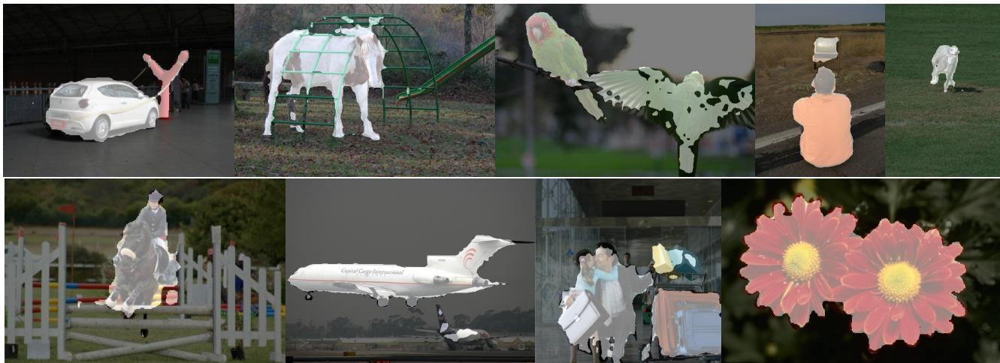
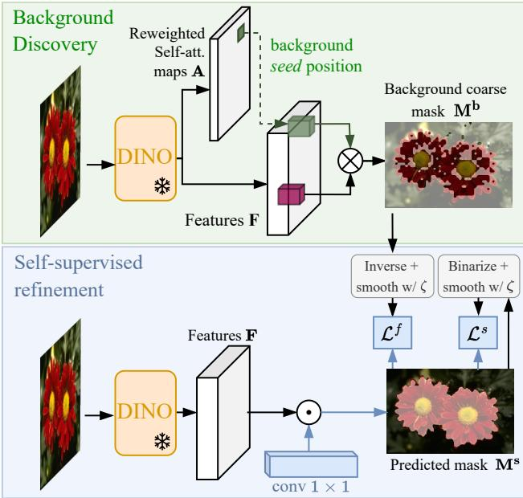
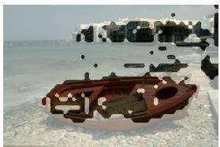
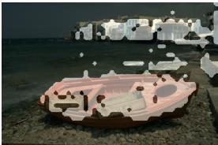
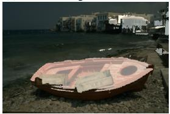
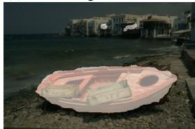
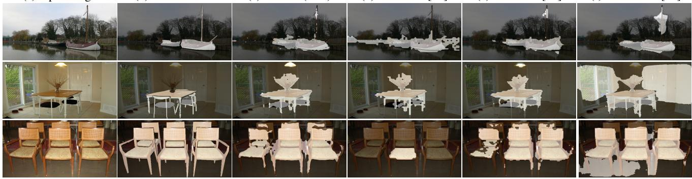

# Unsupervised Object Localization: Observing the Background to Discover Objects

Oriane Simeoni´ 1, Chloe Sekkat´ 1, Gilles Puy1, Antonin Vobecky1,2, Eloi Zablocki´ 1, Patrick Perez´ 1 1valeo.ai, Paris, France

2Czech Institute of Informatics, Robotics and Cybernetics, CTU, Prague, Czech Republic

  
Figure 1. Examples of object localization results obtained with our method FOUND on images from diverse datasets. We propose a simple framework in which we train a single conv1 × 1 layer, and achieve state-of-the-art results in unsupervised object discovery and saliency detection. We train for only 2 epochs over the 10k dataset DUTS-TR [54] and inference runs at 80 FPS. Note that the results presented here are without post-processing refinement.

## Abstract

Recent advances in self-supervised visual representation learning have paved the wayfor unsupervised methods tackling tasks such as object discovery and instance segmentation. However, discovering objects in an image with no supervision is a very hard task; what are the desired objects, when to separate them into parts, how many are there, and of what classes? The answers to these questions depend on the tasks and datasets of evaluation. In this work, we take a different approach and propose to look for the background instead. This way, the salient objects emerge as a by-product without any strong assumption on what an object should be. We propose FOUND, a simple model made of a single conv1 × 1 initialized with coarse background masks extracted from self-supervised patch-based representations. After fast training and refining these seed masks, the model reaches state-of-the-art results on unsupervised saliency detection and object discovery bench-

marks. Moreover, we show that our approach yields good results in the unsupervised semantic segmentation retrieval task. The code to reproduce our results is available at https://github.com/valeoai/FOUND.

## 1. Introduction

The task of object localization — either performed by detecting [4, 39] or segmenting [7] objects — is required in many safety-critical systems such as self-driving cars. Today’s best methods train large deep models [4, 7] on large sets of labeled data [13, 30]. To mitigate such needs in annotation, it is possible to use strategies such as semisupervised [10, 31], weakly-supervised [10, 61] and active learning [37, 50, 65].

In this work, we consider the unsupervised object localization task, which consists in discovering objects in an image with no human-made annotation. This task has recently received a lot of attention [40,41,43] as it is a solution to detect objects in a scene with no prior about what they should look like or which category they should belong to. Early works exploit hand-crafted features [46,62,71,74] and interimage information [49,51] but hardly scale to large datasets. Recent works leverage strong self-supervised [6,16,19] features learned using pretext tasks: [33, 44, 58] localize a single object per image just by exploiting a similarity graph at the level of an image; [43] proposes to combine different self-supervised representations, in an ensemble-fashion, and trains a model to learn the concept of object, the same as what [56] does. However, most of these methods make assumptions about what an object is. For example, [44, 58] assume that an image contains more background pixels than object pixels, while [43] discards masks that fill in the width of an image. Such hypotheses restrict objects one can find.

In this work, we propose to tackle the problem the other way around: we make no assumptions about objects but focus instead on the concept of background. Then, we use the idea that a pixel not belonging to the background is likely to belong to an object. Doing so, we do not need to make hypotheses about the number or the size of objects in order to find them. Our method, named FOUND, is cheap both at training and inference time.

We start by computing a rough estimate of the background mask; this step works by mining a first patch that likely belongs to the background. To do this, we leverage attention maps in a self-supervised transformer and select one of the patches that received the least attention. Then the background mask incorporates patches similar to this mined one. One of our contributions is a reweighting scheme to reduce the effect of noisy attention maps based on the sparsity concept. In the second step, we use the fact that the complement of this background mask provides an approximate estimation of the localization of the objects. This estimate is refined by training a single conv1 × 1 layer on top of the frozen self-supervised transformer, using only the masks computed in the first step, an edge-preserving filter, and a self-labelling procedure. We show that this cheap method allows us to reach state-of-the-art results in the tasks of saliency detection, unsupervised object discovery and semantic segmentation retrieval.

Our main contributions are as follows:

• We propose to think about the object discovery problem upside-down, and to look for what is not background instead of directly looking for objects.

• We propose a new way to exploit already self-trained features and show that they allow us to discover the concept of background.

• We show that the use of attention heads can be improved by integrating a weighting scheme based on attention sparsity.

• We propose a lightweight model composed only of a single conv1 × 1 layer and show that there is no need to train a large segmenter for the task.

• We demonstrate that our model performs well on unsupervised saliency detection, unsupervised object discovery and unsupervised semantic segmentation retrieval tasks. We reach state-of-the-art results in all tasks with a method much faster and lighter than competing ones.

## 2. Related work

Self-supervised learning. In self-supervised learning, a model is trained to solve a pretext task (e.g., jigsaw solving, colorization, or rotation prediction) on unlabeled data [6, 8, 9, 16, 17, 20, 27, 36, 45]. Recently, with the surge of Vision Transformers (ViT) [12] that stand out compared to convolutional networks, one can obtain rich, and dense descriptors of image patches with models trained in a selfsupervised fashion on massive amounts of data [6, 19, 70]. For example, DINO [6] employs a teacher-student framework where the two networks see different and randomly transformed input parts and the student network learns to predict the mean-centered output of the teacher network. In MAE [19], patches of the input image are randomly masked and the pretext task aims at learning to reconstruct the missing pixels by auto-encoding. In these works, it has been shown that the representations of the self-attention maps of the ViTs contain interesting localization information [1, 6, 19, 70], which have led recent methods to exploit these properties in several downstream tasks as unsupervised object discovery [33, 44, 58] or semantic segmentation [15, 18, 47, 66]. In this paper, we build upon such selfsupervised features to partition background and foreground patches. Arguably, learning self-supervised representation on unlabaled Imagenet [11] — a curated dataset — induces a certain supervision. We leave for future work using models trained on less curated and more heterogenous datasets.

Unsupervised object localization. Localizing objects within images without any supervision is in the literature traditionally addressed by two distinct branches: 1) unsupervised saliency detection methods find binary masks of objects [29, 63, 72] while 2) unsupervised object detection seeks for bounding boxes around objects [3,23,26,73]. Unsupervised saliency detection has been approached with hand-crafted methods [62, 71], generative adversarial mod els [34], or, closer to us, by refining noisy labels [35]. The first attempts in an unsupervised object discovery have often used region proposals [46,74] as input. These works explored a collection of images and inter-image information using methods such as principal component analysis [59], optimization [48, 49] or ranking [52].

Recently, these historically distinct tasks have been tackled jointly in unified frameworks [33, 38, 58] building on the advent of aforementioned self-trained dense visual features [5, 6, 9, 19]. Given an image, these methods create a weighted graph where each node is a patch, and edges represent the similarity between the patches. Foreground objects are segmented by leveraging this similarity. In particular, LOST [44] uses this graph to mine an object seed as the patch with the least connection to other patches and expands the zone of interest to all connected similar patches afterwards. Building on LOST, TokenCut [58] and Deep Spectral Methods [33] refine this result by using a normalized graph-cut to separate an object from the highly connected patches, which most likely depict the background.

Another line of methods proposes to compute mask proposals that are later refined. SelfMask [43] explores the use of multiple self-supervised features [5, 6, 9] as the input of a spectral clustering algorithm. FreeSOLO [56] proposes FreeMask that generates correlation maps which are then ranked and filtered by a maskness score. DINOSAUR [41] performs representation learning by separating the features of an image and reconstructing them into individual objects or parts.

It should be noted that these prior works make strong underlying assumptions about what an object is. This includes priors about the contrast [22], the size [44, 58], the centerness [24], the shape [43] or boundary [60] of the sought object. Instead, in our work, by looking for the background, we do not need to make any assumptions about the presence or number of objects.

Learning to generalize through training. While we build our seed masks from single-image information, we refine these masks in a self-training step that leverages information shared across the whole image collection. This self-training step aims at improving the quality of predictions by propagating and refining the initial seed of pseudoannotations to a large set of unlabeled instances. Early works in unsupervised saliency detection learn a deep unsupervised saliency network from noisy predictions obtained from handcrafted methods [35,67,68]. After clustering selfsupervised features, [44, 58] train a Class-Agnostic Detection (CAD) network over predicted pseudo-boxes and show that this trained detector can smooth out poor discoveries, therefore boosting results. Similarly, in semantic segmentation, FreeSOLO [56] and COMUS [66] feed coarse masks to train a segmentation model on these pseudo masks [55].

When propagating and refining pseudo-labels through the dataset with training, previous methods generally employ heavy training procedures involving learning several millions of parameters. Instead, our self-training step is extremely lightweight and fast as it is only composed of one layer of 1×1 convolutions and a two-epoch training scheme.

## 3. Our method FOUND

In this work, we tackle the unsupervised object localization task by considering the problem upside-down. Our approach consists of two stages. First, we propose to look for patches corresponding to the background in order to highlight patches that are likely objects (Sec. 3.1). Then, starting from these coarse masks, we design a fast and lightweight self-supervised learning scheme to refine them (Sec. 3.2). An overview of FOUND is shown in Fig. 2.

  
Figure 2. Overview of FOUND. In the first stage (green upper part), a background mask $\mathbf { M } ^ { \mathbf { b } }$ is discovered by mining a seed patch through a reweighting of the self-attention maps of a frozen DINO [6]. This seed is then used to find similar patches likely belonging to the background. In the second stage (blue lower part), we train a lightweight $1 \times 1$ convolutional layer that produces refined masks from DINO features. It is trained in a self-supervised fashion to predict both smoothed inverse coarse masks $\mathbf { M } ^ { \mathbf { \hat { b } } }$ of the first step, and smoothed binarized version of its own output. Blue arrows denote where the gradients flow (in the reverse direction).

## 3.1. Background discovery

Here, we look for the background pixels of an image $\mathbf { I } \in \mathbb { R } ^ { W \times H \times 3 }$ . To do so, we start by extracting deep features from this image using a self-supervised pre-trained ViT. First, the image is divided into N square patches of P pixels each. These patch tokens, along with an additional learned token, called class token (CLS), are processed by the ViT. At the last self-attention layer, composed of h different heads, we extract h matrices $\{ \mathbf { F } _ { i } ~ \in ~ \mathbb { R } ^ { N \times d } \} _ { i = 1 \dots h } ,$ that each contains d-dimensional features for each of the N patches. We also store in $\mathbf { A } \in \mathbb { R } ^ { N \times h }$ the h self-attention maps between the CLS token and all patch tokens.

Background seed. To identify the background, we start by identifying one patch which likely belongs to the background. This patch, called the background seed, is defined as the patch with the least attention in $\mathbf { A } - \mathbf { a }$ patch which the model has learned to not give too much attention to. This seed is the $s ^ { \mathrm { t h } }$ patch, where

  
(a) Coarse background mask Mb

  
(c) Refined $\zeta ( \mathbf { M } ^ { f } )$

(b) Coarse foreground mask Mf  
  
(d) Predicted Ms  
Figure 3. Visualizations of masks generated for one image from ECSSD [42] at different stages of our method. We show (a) the mask $\mathbf { M } ^ { b }$ extracted using our background discovery step, (b) its inverse $\mathbf { M } ^ { f }$ used as foreground mask to train our segmenter head, (c) the version refined using a bilateral solver $\zeta ( \mathbf { M } ^ { \bar { f } } )$ and (d) the output of our segmentation head $\mathbf { M } ^ { s }$ at the end of the training.

$$
s = \underset { p \in \{ 1 , \ldots , N \} } { \mathrm { a r g m i n } } \sum _ { i = 1 } ^ { h } \mathbf { A } _ { p i } .\tag{1}
$$

In the equation above, $\mathbf { A } _ { p i }$ is the attention score between the CLS token and the $p ^ { \mathrm { t h } }$ patch in the $i ^ { \mathrm { t h } }$ attention head.

Reweighting the attention heads. When observing the h different attention maps in A, we notice that the background appears more or less clearly in the different heads. Therefore, we propose to weight each head differently in Eq. 1. We exploit the sparsity of the attention map to compute these weights since the background appears better in a sparse attention map (as illustrated in the supplementary materials). Inspired by [25], we compute the sparsity $S _ { i }$ of each map by counting the number of attention values above a certain threshold $\mu > 0$

$$
S _ { i } = | \{ p \mid A _ { p i } \geq \mu , p = 1 , \ldots , N \} | ,\tag{2}
$$

and reweight each attention map in (1) by

$$
w _ { i } = \log \left( \frac { \sum _ { j = 1 } ^ { h } S _ { j } } { S _ { i } } \right) .\tag{3}
$$

Notice that $w _ { i }$ increases when the sparsity $S _ { i }$ decreases, i.e., when we visually observe a clearer separation of the background from the foreground thanks to sparser attention maps. Finally, Eq. 1 becomes

$$
s = \underset { p \in \{ 1 , \ldots , N \} } { \mathrm { a r g m i n } } \sum _ { i = 1 } ^ { h } w _ { i } \mathbf { A } _ { p i } .\tag{4}
$$

Discovery of the background. We identify the background by finding patches similar to the background seed. For each patch, we start by computing a single feature by concatenating the corresponding d-dimensional features in each head: $\bar { \tilde { \mathbf { F } } } = [ w _ { 1 } \mathbf { F } _ { 1 } , \dotsc , w _ { h } \mathbf { F } _ { h } ] \in \mathbb { R } ^ { N \times h d }$ . Then, the background mask $\mathbf { M } ^ { b } \in \{ 0 , 1 \} ^ { N }$ is defined as

$$
\mathbf { M } _ { p } ^ { b } = \left\{ \begin{array} { l l } { 1 } & { \mathrm { i f } \sin ( \tilde { f } _ { p } , \tilde { f } _ { s } ) \geq \tau , } \\ { 0 } & { \mathrm { o t h e r w i s e } , } \end{array} \right. \mathbf { M } _ { p } ^ { b } = 1 , \dots , N ,\tag{5}
$$

for a threshold $\tau > 0 .$ , where sim is the cosine similarity, and $\tilde { f } _ { p } , \ \tilde { f } _ { s }$ are the hd-dimensional features corresponding to patch p and s in F˜. We show an example in Fig. 3.

## 3.2. Refining masks with self-training

The proposed background discovery method described above is able to segment a good portion of the background but the corresponding masks are still far from perfect, as observed in Fig. 3. To improve them, and therefore to better segment the foreground objects, we propose a very simple refinement step of learning a lightweight segmentation head in a self-supervised fashion.

The segmentation head consists of a single $1 \times 1$ convolution. For each patch, it compresses DINO frozen patch features into a scalar, which is passed into a sigmoid function to encode the probability of the patch belonging to the foreground. We stress that, unlike most recent works, we do not train a heavy segmentation backbone [43, 56, 66] or a detection model [44, 58]. This aspect brings considerable training and inference efficiency both in terms of time and memory, as studied in Sec. 4.4.

The segmentation head is trained in a self-supervised fashion. The general idea is that the model learns to predict a smoothed version of the complement of the coarse background masks and its own prediction, such that it quickly converges to refined masks. We describe it formally below.

Segmentation head training. Self-training is done thanks to two losses with distinct roles. The first objective consists of initializing and guiding the predictions toward the coarse background masks. The second objective aims at smoothing and refining predictions.

Formally, let $\mathbf { M } ^ { s } \in \mathbb { R } ^ { N }$ be the soft output of the segmentation head for a given image. The goal of the first objective is to predict the complement $\mathbf { M } ^ { f }$ of the coarse background mask $\mathbf { M } ^ { b }$ (defined in Sec. 3.1), refined by a bilateral solver $\zeta ( \cdot )$ , which is an edge-aware smoothing technique improving the mask quality as proposed in [2] and exploited in [43, 58]. Let $\mathring { \mathbf { M } } ^ { f } \in \mathring { \{ 0 , 1 \} } ^ { \mathring { N } }$ be this refined version. We compute the binary cross entropy

$$
\mathcal { L } ^ { f } = \sum _ { p = 1 } ^ { N } \left[ \hat { \mathbf { M } } _ { p } ^ { f } \log \mathbf { M } _ { p } ^ { s } + ( 1 - \hat { \mathbf { M } } _ { p } ^ { f } ) \log ( 1 - \mathbf { M } _ { p } ^ { s } ) \right]\tag{6}
$$

over a batch of images, where $\mathbf { M } _ { p } ^ { s }$ and $\hat { \mathbf { M } } _ { p } ^ { f }$ are the output of the segmentation head and refined coarse mask at patch p respectively. We additionally train the segmentation head by minimizing the binary cross entropy between the output and its refined version after binarization $\hat { \mathbf { M } } ^ { s } \in \mathbb { R } ^ { N }$ , using again the bilateral solver, in order to force the quality of the mask edges, using

$$
\mathcal { L } ^ { s } = \sum _ { p = 1 } ^ { N } \left[ \hat { \mathbf { M } } _ { p } ^ { s } \log \mathbf { M } _ { p } ^ { s } + ( 1 - \hat { \mathbf { M } } _ { p } ^ { s } ) \log ( 1 - \mathbf { M } _ { p } ^ { s } ) \right]\tag{7}
$$

with $\hat { \mathbf { M } } _ { p } ^ { s }$ being the refined mask at patch p. Note that we compute this loss only for images for which Ms and Mˆ s do not differ too much, i.e., if IoU $\mathbf { \zeta } ( \mathbf { M } ^ { s } , \hat { \mathbf { M } } ^ { s } ) > 0 . 5$ following [43]. The two losses are linearly combined and balanced with a hyper-parameter $\lambda \in \mathbb { R } \colon \mathcal { L } = \mathcal { L } ^ { f } + \lambda \mathcal { L } ^ { s }$ . Also, after a few training steps, we observe that the model outputs become much better than the coarse masks. Therefore, we stop using $\mathcal { L } ^ { f }$ after m iterations. But, to avoid collapse we replace $\mathcal { L } ^ { f }$ with a cross-entropy loss that encourages predicted soft masks to be close to their binarized version.

## 4. Experiments

In this section, we make several experiments to assess the quality of FOUND. We first evaluate it on the tasks of unsupervised object discovery (Sec. 4.1), unsupervised saliency detection (Sec. 4.2), and unsupervised semantic segmentation retrieval (Sec. 4.3). Besides, we compare training/inference costs of the different methods in Sec. 4.4, discuss qualitative results in Sec. 4.5, and measure the impact of different components of our method in Sec. 4.6.

Technical details. In all experiments, we use a ViT-S/8 architecture [12] pre-trained with [6]. Following [44, 58], we use the key features of the last attention layer as F and we use $\tau \ : = \ : 0 . 3$ in the background discovery step. The parameter µ in Eq. 2 is computed per image as the overall mean attention over all heads. We use the coarse masks as pseudo ground-truth for $m = 1 0 0$ iterations before refining the predictions directly. We balance the losses by setting $\lambda = 1 . 5$ . Similar to [43], we train FOUND on DUTS-TR [54] (10,553 images) for 500 iterations with a batch of 50 images — corresponding to a bit more than 2 epochs. We follow a similar training protocol as SelfMask [43]: we use random scaling with a range of [0.1, 3.0] followed by image resizing to (224, 224) and Gaussian blurring applied with probability 0.5. We use the parameters of the bilateral solver as provided by [58].

In our evaluation, we consider two protocols: ‘FOUND – single’ and ‘FOUND – multi’. In the ‘single’ mode, we select the biggest connected component in M. In the ‘multi’ mode, we consider the mask as is — with all detected objects. Additionally, when applying the bilateral solver ζ(), we extract, similarly, either the biggest connected component (single), or all connected components (multi). When not specified, we are using the ‘multi’ setup.

<table><tr><td>Method</td><td>VOC07</td><td>VOC12</td><td>COCO20k</td></tr><tr><td colspan="4">— No learning —</td></tr><tr><td>Selective Search [46]</td><td>18.8</td><td>20.9</td><td>16.0</td></tr><tr><td>EdgeBoxes [74]</td><td>31.1</td><td>31.6</td><td>28.8</td></tr><tr><td>Kim et al. [26]</td><td>43.9</td><td>46.4</td><td>35.1</td></tr><tr><td>Zhang et al. [69]</td><td>46.2</td><td>50.5</td><td>34.8</td></tr><tr><td>DDT+ [59]</td><td>50.2</td><td>53.1</td><td>38.2</td></tr><tr><td>rOSD [49]</td><td>54.5</td><td>55.3</td><td>48.5</td></tr><tr><td>LOD [52]</td><td>53.6</td><td>55.1</td><td>48.5</td></tr><tr><td>DINO-seg [6] [44] (ViT-S/16 [6])</td><td>45.8</td><td>46.2</td><td>42.0</td></tr><tr><td>LOST [44] (ViT-S/8 [6])</td><td>55.5</td><td>57.0</td><td>49.5</td></tr><tr><td>LOST [44] (ViT-S/16 [6])</td><td>61.9</td><td>64.0</td><td>50.7</td></tr><tr><td>DSS [33] (ViT-S/16 [6])</td><td>62.7</td><td>66.4</td><td>52.2</td></tr><tr><td>TokenCut [58] (ViT-S/8 [6]) †</td><td>67.3</td><td>71.6</td><td>60.7</td></tr><tr><td>TokenCut [58] (ViT-S/16 [6])</td><td>68.8</td><td>72.1</td><td>58.8</td></tr><tr><td colspan="4">— With learning —</td></tr><tr><td>FreeSolo [56] †</td><td>44.0</td><td>49.7</td><td>35.2</td></tr><tr><td>LOST + CAD [44] (ViT-S/16 [6])</td><td>65.7</td><td>70.4</td><td>57.5</td></tr><tr><td>TokenCut + CAD [58] (ViT-S/16 [6])</td><td>71.4</td><td>75.3</td><td>62.6</td></tr><tr><td>SelfMask [43] †</td><td>72.3</td><td>75.3</td><td>62.7</td></tr><tr><td>DINOSAUR [41]</td><td></td><td>70.4</td><td>67.2</td></tr><tr><td>FOUND — single (ViT-S/8 [6])</td><td>72.5</td><td>76.1</td><td>62.9</td></tr></table>

Table 1. Single object discovery results. Comparative CorLoc performance on 3 datasets [13, 14, 30, 49]. ‘†’: results from our own computation using TokenCut [58], FreeSOLO [56] and Self-Mask [43] available codes. ‘+CAD’: a second-stage class-agnostic detector trained with unsupervised “pseudo-boxes” labels. All ViT backbones are trained following [6]. Best result is highlighted in bold, second best is underlined.

## 4.1. Unsupervised object discovery

We first evaluate our method on the task of unsupervised object discovery. We follow the common practice and use the trainval sets of PASCAL VOC07 & VOC12 datasets [13, 14] and COCO20k (a subset of 19, 817 randomly chosen images from the COCO2014 trainval dataset [30] following [49, 51]). As in [44, 51, 58], we report results with the Correct Localization (CorLoc) metric. It measures the percentage of correct boxes, i.e., predicted boxes having an intersection-over-union greater than 0.5 with one of the ground-truth boxes.

In Tab. 1, we compare FOUND – single (no bilateral solver) to methods with no learning phase (LOST [44], TokenCut [58], DSS [33]), and to methods with a learning phase (SelfMask [43], FreeSOLO [56], and DINOSAUR [41]). FreeSOLO [56] predicts multiple instance masks per image and, as such, we propose to merge all instances into a single mask, this gave us the best results. Other choices are discussed in the supplementary materials. For Self-Mask [43], if the mask contains multiple connected components, only the largest one is considered.

We show that FOUND achieves state-of-the-art results on

<table><tr><td rowspan="2">Method</td><td rowspan="2">Learning</td><td colspan="3">DUT-OMRON [64]</td><td colspan="3">DUTS-TE [54]</td><td colspan="3">ECSSD [42]</td></tr><tr><td>Acc</td><td>IoU</td><td>max  $F _ { \beta }$ </td><td>Acc</td><td>IoU</td><td>max  $F _ { \beta }$ </td><td>Acc</td><td>IoU</td><td>max  $F _ { \beta }$ </td></tr><tr><td>— Without post-processing bilateral solver —</td><td></td><td></td><td></td><td></td><td></td><td></td><td></td><td></td><td></td><td></td></tr><tr><td>HS [62]</td><td></td><td>.843</td><td>.433</td><td>.561</td><td>.826</td><td>.369</td><td>.504</td><td>.847</td><td>.508</td><td>.673</td></tr><tr><td>wCtr [71]</td><td></td><td>838</td><td>.416</td><td>.541</td><td>.835</td><td>.392</td><td>.522</td><td>.862</td><td>.517</td><td>.684</td></tr><tr><td>WSC [28]</td><td></td><td>.865</td><td>.387</td><td>.523</td><td>.862</td><td>.384</td><td>.528</td><td>.852</td><td>.498</td><td>.683</td></tr><tr><td>DeepUSPS [35]</td><td></td><td>.779</td><td>.305</td><td>.414</td><td>.773</td><td>.305</td><td>.425</td><td>.795</td><td>.440</td><td>.584</td></tr><tr><td>BigBiGAN [53]</td><td></td><td>.856</td><td>.453</td><td>.549</td><td>.878</td><td>.498</td><td>.608</td><td>.899</td><td>.672</td><td>.782</td></tr><tr><td>E-BigBiGAN [53]</td><td></td><td>.860</td><td>.464</td><td>.563</td><td>.882</td><td>.511</td><td>.624</td><td>.906</td><td>.684</td><td>.797</td></tr><tr><td>Melas-Kyriazi et al. [32]</td><td></td><td>.883</td><td>.509</td><td></td><td>.893</td><td>.528</td><td></td><td>.915</td><td>.713</td><td></td></tr><tr><td>LOST [44] ViT-S/16 [6]</td><td></td><td>.797</td><td>.410</td><td>.473</td><td>.871</td><td>.518</td><td>.611</td><td>.895</td><td>.654</td><td>.758</td></tr><tr><td>DSS [33] [58]</td><td></td><td></td><td>.567</td><td></td><td></td><td>.514</td><td></td><td></td><td>.733</td><td></td></tr><tr><td>TokenCut [58] ViT-S/16 [6]</td><td></td><td>.880</td><td>.533</td><td>.600</td><td>.903</td><td>.576</td><td>.672</td><td>.918</td><td>.712</td><td>.803</td></tr><tr><td>SelfMask [43]</td><td>√</td><td>.901</td><td>.582</td><td></td><td>.923</td><td>.626</td><td></td><td>.944</td><td>.781</td><td></td></tr><tr><td>FOUND – single ViT-S/8 [6]</td><td>√</td><td>.920</td><td>.586</td><td>.683</td><td>.939</td><td>.637</td><td>.733</td><td>.912</td><td>.793</td><td>.946</td></tr><tr><td>FOUND - multi ViT-S/8 [6]</td><td>√</td><td>.912</td><td>.578</td><td>.663</td><td>.938</td><td>.645</td><td>.715</td><td>.949</td><td>.807</td><td>.955</td></tr><tr><td>— With post-processing bilateral solver —</td><td></td><td></td><td></td><td></td><td></td><td></td><td></td><td></td><td></td><td></td></tr><tr><td>LOST [44] ViT-S/16 [6] + ζ()</td><td></td><td>.818</td><td>.489</td><td>.578</td><td>.887</td><td>.572</td><td>.697</td><td>.916</td><td>.723</td><td>.837</td></tr><tr><td> $\mathrm { T o k e n C u t } \left[ 5 8 \right] \mathrm { V i T } . \mathrm { S } / 1 6 \left[ 6 \right] + \zeta \left( \right)$ </td><td></td><td>.897</td><td>.618</td><td>.697</td><td>.914</td><td>.624</td><td>.755</td><td>.934</td><td>.772</td><td>.874</td></tr><tr><td>SelfMask [43] + ζ()</td><td>√</td><td>.919</td><td>.655</td><td></td><td>.933</td><td>.660</td><td></td><td>.955</td><td>.818</td><td></td></tr><tr><td> $\mathrm { F O U N D } \longrightarrow \mathrm { s i n g l e ~ V i T - S } / 8 ~ [ 6 ] + \zeta ( )$ </td><td>√</td><td>.921</td><td>.608</td><td>.706</td><td>.941</td><td>.654</td><td>.760</td><td>.949</td><td>.805</td><td>.934</td></tr><tr><td> $\mathrm { F O U N D } - \mathrm { m u l t i } \ \mathrm { V i T - S } / 8 \ [ 6 ] + \zeta ( )$ </td><td>√</td><td>.922</td><td>.613</td><td>.708</td><td>.942</td><td>.663</td><td>.763</td><td>.951</td><td>.813</td><td>.935</td></tr></table>

Table 2. Unsupervised saliency detection. Performances of our method FOUND w.r.t. state-of-the-art methods on the unsupervised saliency detection task. The symbol $\zeta ( )$ denotes the application of the post-processing bilateral solver on the generated masks and the column ‘Learning’ specifies which methods have a training step. We evaluate FOUND in both the single and multi setup as described in main text. Best result per section is highlighted in bold, second best is underlined.

2 out of the 3 datasets while being much cheaper to train. Indeed, the best method, DINOSAUR, achieves results significantly better than all others on COCO20k, but performs representation learning at a much higher training cost (as discussed in Sec. 4.4). We note that it also achieves worse results than our method on VOC12 (-5.7pt). We discuss qualitative results in Sec. 4.5 and in the Supplemental.

## 4.2. Unsupervised saliency detection

We then consider the unsupervised saliency detection task, which is typically evaluated on a collection of datasets depicting a large variety of objects in different backgrounds. To compare to previous works, we evaluate on three popular saliency datasets: DUT-OMRON [64] (5,168 images), DUTS-TE [54] (5,019 images), ECSSD [42] (1,000 images). We report results in terms of intersection-over-union (IoU), pixel accuracy (Acc) and maximal $F _ { \beta }$ score (max $F _ { \beta } )$ with $\beta ^ { 2 } = 0 . 3$ following [43, 58] (additional details are given in the supplementary materials).

Tab. 2 presents our results compared to state-of-the-art methods, including LOST [44], DeepSpectralMethods [33] (denoted DSS in the table), TokenCut [58] and the trained SelfMask [43]. When no bilateral solver is used, we observe that our method outperforms all methods, showing that we trained a good saliency estimator which produces high quality object masks. With the application of the bilateral solver, we reach the same or better scores than the other methods, except for the IoU on DUT-OMRON. We observed that the bilateral solver sometimes amplifies the under-segmentation observed in the input mask (visual examples can be found in the supplementary materials). Correcting this behaviour is left for future work.

## 4.3. Semantic Segmentation Retrieval

In this section, we test our method on the task of unsupervised semantic segmentation retrieval on the PASCAL VOC12 [14] dataset in order to evaluate the quality of the predicted saliency masks. We follow a protocol proposed by [47] and compare to related methods whose code is available online, namely to TokenCut [58], SelfMask [43] and FreeSOLO [56]. We also include a comparison to MaskContrast [47], which takes the opposite approach to ours as it trains the feature representations while having a frozen pre-trained saliency predictor. We consider two different evaluation setups. First, (a) we assume that the predicted mask depicts a single object. For FreeSOLO [56], which generates several instances per image, we tried several combinations and merged all instances into a single one or consider only the largest instance (noted “largest inst.”). (b) We test the multiple-instances setting, which is more fair to FreeSOLO, and allows us to evaluate the ability of FOUND to separate objects. In this setup, we consider each instance of FreeSOLO as an object. For all other methods, we compute the connected components in the mask outputs, and each component is then treated as an object (we discard those smaller than 1% of an input image size).

<table><tr><td rowspan="2">Method</td><td colspan="2">mIoU</td></tr><tr><td>7cls</td><td>21cls</td></tr><tr><td>— Representation learning methods MaskContrast [47] (unsup. sal.) 53.4</td><td></td><td>43.3</td></tr><tr><td>— Single saliency mask FreeSOLO [56]</td><td>19.7</td><td>17.0</td></tr><tr><td>FreeSOLO [56] (largest inst.)</td><td>20.6</td><td>20.6</td></tr><tr><td>TokenCut [58] (ViT-S/8 [6])</td><td>46.7</td><td>37.6</td></tr><tr><td>TokenCut [58] (ViT-S/16 [6])</td><td>49.7</td><td>39.9</td></tr><tr><td>SelfMask [43] FOUND (ViT-S/8 [6])</td><td>56.6 56.1</td><td>40.7 42.9</td></tr><tr><td>— Single saliency mask + bilateral solver — FreeSOLO [56]</td><td>20.2</td><td>17.3</td></tr><tr><td>TokenCut [58] (ViT-S/8 [6])</td><td>47.2</td><td>37.2</td></tr><tr><td>TokenCut [58] (ViT-S/16 [6]) SelfMask [43]</td><td>50.2</td><td>39.8 40.9</td></tr><tr><td></td><td>55.4</td><td></td></tr><tr><td>FOUND (ViT-S/8 [6])</td><td>57.2</td><td>42.2</td></tr><tr><td>— Multiple saliency masks —</td><td></td><td></td></tr><tr><td>FreeSOLO [56]</td><td>23.9</td><td>25.7</td></tr><tr><td></td><td></td><td></td></tr><tr><td>SelfMask [43] FOUND (ViT-S/8 [6])</td><td>56.2</td><td>40.8 58.0 42.7</td></tr></table>

Table 3. Retrieval on PASCAL VOC12 [14]. We consider either a single instance per image (the second and the third blocks in the table) or multiple instances in each image (last block). Feature extractor used to get saliency prediction in FOUND, TokenCut, and SelfMask is indicated between parentheses. All methods except MaskContrast use features from ViT-S/8 during retrieval. Best result is highlighted in bold, second best is underlined. ◦ denotes result reported from [47].

Given an object mask, we compute a per-object feature vector averaged over the corresponding pixels. We apply this procedure both in the train and val splits. We use a ViT-S/8 trained using DINO [6] as a feature extractor for FOUND, TokenCut, SelfMask, and FreeSOLO. MaskContrast uses its own optimized feature extractor. Finally, we find the nearest neighbors of each object of the val set to objects in the train set and assign them the corresponding ground-truth label. We measure the mean Intersection-over-Union (mIoU) between the predictions and ground truths.

Results in Tab. 3 are given for both setups and are computed either over 7 (bus, airplane, car, person, cat, cow and bottle) or all 21 classes of the VOC dataset, following [47]. We can observe that FOUND outperforms all methods in both cases by a consistent margin. Results also confirm SelfMask as a strong competitor that is however outperformed by FOUND across all considered setups with gaps between 1.3 and 2.2 mIoU points, excepting the single saliency with 7 classes evaluation where SelfMask surpasses FOUND by 0.5 point. Improvements of FOUND over TokenCut and FreeSOLO can be explained because Token-

<table><tr><td>Method</td><td># learnable params.</td><td>inference FPS</td></tr><tr><td>LOST [44]</td><td></td><td>64</td></tr><tr><td>TokenCut [58]</td><td></td><td>0.4</td></tr><tr><td>SelfMask [43]</td><td>≈ 36M</td><td>13</td></tr><tr><td>FreeSOLO [56]</td><td>≈ 66M</td><td>13</td></tr><tr><td>DINOSAUR [41] – MLP dec. *</td><td>≥ 5M</td><td>一</td></tr><tr><td>DINOSAUR [41] – transf. dec.*</td><td>≥ 77M</td><td></td></tr><tr><td>FOUND</td><td>770</td><td>80</td></tr></table>

Table 4. Memory and inference costs. Comparison of the cost of the different methods. ‘# learnable params.’ excludes weights of the frozen DINO backbone. The FPS measure includes the forward pass through DINO and is computed on a single V100 GPU with PyTorch 1.8.1. ‘∗’: denotes an estimation of the number of learnable parameters for methods without public code.

Cut localizes only a single object per image and FreeSOLO finds objects that are often not considered as so in the dataset. We continue the discussion in Sec. 4.5.

## 4.4. Comparison of method costs

We compare FOUND to methods that either do or do not include training, and that have very different costs at inference time. In this section, we highlight the advantage of our method in terms of complexity and speed. FOUND is a segmenter head composed of just 770 parameters, trained over 2 epochs on DUTS-TR [54] on a single GPU, and which can infer at 80 FPS, including the forward pass through DINO, on a V100 GPU. We summarize key numbers in Tab. 4.

First, regarding methods with no training, [58] requires the costly computation of an eigenvector on the Laplacian matrix of the affinity graph, therefore making the method rather slow (0.4 FPS). For the same reasons, [33] runs at equivalent speed to [58]. LOST [44] is almost as fast as us but achieves much lower performance, as seen before.

Second, regarding methods that include training, Self-Mask [43] trains a model of ≈ 36M parameters over 12 epochs on DUTS-TR [54], by exploiting 27 mask proposals generated using three different backbones, thus making the training considerably more expensive than ours. FreeSOLO [56] proposes a faster mask proposal extraction step using a DenseCL [57] model based on a ResNet [21] backbone. It then trains a SOLO [55] model (≈ 65M learnable parameters) for in total 60k iterations on 8 GPUs, making it much more expensive to train compared to us.

## 4.5. Qualitative results

We show visualizations of saliency masks predicted by FOUND and related methods in Fig. 4. We notice that FreeSolo [56] and SelfMask [43] tend to oversegment the objects in all examples, while FOUND yields masks much more accurate with respect to the ground truth. Regarding TokenCut [58], we observe, in the last row of the figure, that it segments just a part of one chair, while FOUND segments all the chair rather accurately. These examples illustrate the efficiency of our method in dealing with multiple objects.

(a) Input image  
(b) Ground truth  
(c) FOUND (ours)  
(d) TokenCut [58]  
(e) SelfMask [43]  
  
(f) FreeSOLO [56]  
Figure 4. Qualitative results of object localization. We overlay predicted masks generated with our method FOUND, TokenCut [58], SelfMask [43] and FreeSOLO [56] on three images taken from VOC12 [14].

## 4.6. Ablation study

We present in Tab. 5 an ablation study of our method on the saliency dataset ECSSD [42] — more can be found in Appendix. We measure scores on the unsupervised saliency detection task following the protocol detailed in Sec. 4.2.

Coarse masks. We evaluate our background discovery method (Sec. 3.1) with and without the attention head reweighting scheme (column R in Tab. 5). We can observe that the reweighting boosts results up to 1pt when evaluated in a multi-setup mode. We also compare results with and without the application of the post-processing bilateral solver, noted $\zeta ( \zeta _ { p } ,$ , and observe that the refined masks yield better results by 3pts of IoU in the “single” setting. Such improvements (visualized in Fig. 3 and the supplementary materials) are significant. Overall, our background discovery method (Sec. 3.1) already achieves decent results, particularly when considering the single setup. As discussed before and observed in Fig. 3, our coarse maps cover several objects and do not focus only on the most salient one.

The impact of learning In the same table, we present results obtained after the training of the single conv1×1 layer. Training over coarse masks provides a significant boost of more than 15 IoU pts in the multi setup. This shows that the model learns the concept of foreground objects and smooth results over the dataset. Using the bilateral solver in Eq. 6- 7, noted $\zeta ( ) .$ t, further improves results by 1.7 IoU pts and by an additional .6 pts when also applied as post-processing.

## 5. Discussion

In this work, we address the problem of unsupervised object localization, that we propose to attack sideways: we look first for the scene background — using self-supervised features — instead of looking for the objects directly. Putting this simple idea at work, we extract coarse masks that encompass most of the background, their complements thus highlighting objects. Using the inverse of the background masks, we train a lightweight segmenter head made of only 770 learned parameters, which runs at 80 FPS at inference time — including the forward pass through the backbone — and reaches state-of-the-art results in unsupervised object discovery, unsupervised saliency detection, and unsupervised instance segmentation retrieval.

<table><tr><td>Method R ζ()t</td></tr><tr><td> $\zeta ( ) _ { p }$  Acc IoU max - Coarse masks, no training</td></tr><tr><td>Sec. 3.1 – multi .876 .627 .689</td></tr><tr><td>Sec. 3.1 – multi √ .880 .637 .702</td></tr><tr><td>Sec. 3.1 – single .898 .671 .746</td></tr><tr><td>Sec. 3.1 – single .901 .679 .758</td></tr><tr><td>Sec. 3.1 – single √ .906 .709 .780</td></tr><tr><td>Sec. 3.1 – single √ .909 .717 .792</td></tr><tr><td>With training</td></tr><tr><td>FOUND – multi √ .944 .790 .886</td></tr><tr><td>FOUND – multi √ .949 .807 .955 FOUND – multi .951 .813 .935</td></tr></table>

Table 5. Ablation study. Study of the impact of the different elements in the background discovery step (Sec. 3.1). Results are provided following the unsupervised saliency detection protocol on the ECSSD [42] dataset. R stands for the reweighting of the attention heads. We note $\zeta ( ) _ { t }$ and $\zeta ( ) _ { p }$ the application of the bilateral solver during training (Eq. 6-7) and as post-processing.

Acknowledgments This work was supported by the HPC resources of GENCI-IDRIS in France under the 2021 grant AD011013413, and by the ANR grant MultiTrans (ANR-21-CE23-0032), It was also supported by the Ministry of Education, Youth and Sports of the Czech Republic through the e-INFRA CZ (ID:90140) and by CTU Student Grant SGS21184OHK33T37.

## References

[1] Shir Amir, Yossi Gandelsman, Shai Bagon, and Tali Dekel. Deep vit features as dense visual descriptors. arXiv preprint arXiv:2112.05814, 2021. 2

[2] Jonathan T. Barron and Ben Poole. The fast bilateral solver. In ECCV, 2016. 4

[3] Ali Borji, Ming-Ming Cheng, Huaizu Jiang, and Jia Li. Salient object detection: A survey. CoRR, abs/1411.5878, 2014. 2

[4] Nicolas Carion, Francisco Massa, Gabriel Synnaeve, Nicolas Usunier, Alexander Kirillov, and Sergey Zagoruyko. End-toend object detection with transformers. In ECCV, 2020. 1

[5] Mathilde Caron, Ishan Misra, Julien Mairal, Priya Goyal, Piotr Bojanowski, and Armand Joulin. Unsupervised learning of visual features by contrasting cluster assignments. In NeurIPS, 2020. 2, 3

[6] Mathilde Caron, Hugo Touvron, Ishan Misra, Herve J ´ egou,´ Julien Mairal, Piotr Bojanowski, and Armand Joulin. Emerging properties in self-supervised vision transformers. In ICCV, 2021. 2, 3, 5, 6, 7

[7] Liang-Chieh Chen, George Papandreou, Iasonas Kokkinos, Kevin Murphy, and Alan L. Yuille. Deeplab: Semantic image segmentation with deep convolutional nets, atrous convolution, and fully connected crfs. IEEE TPAMI, 2018. 1

[8] Ting Chen, Simon Kornblith, Mohammad Norouzi, and Geoffrey E. Hinton. A simple framework for contrastive learning of visual representations. In ICML, 2020. 2

[9] Xinlei Chen, Haoqi Fan, Ross B. Girshick, and Kaiming He. Improved baselines with momentum contrastive learning. CoRR, abs/2003.04297, 2020. 2, 3

[10] Xiaokang Chen, Yuhui Yuan, Gang Zeng, and Jingdong Wang. Semi-supervised semantic segmentation with cross pseudo supervision. In CVPR, 2021. 1

[11] Jia Deng, Wei Dong, Richard Socher, Li-Jia Li, Kai Li, and Li Fei-Fei. Imagenet: A large-scale hierarchical image database. In CVPR, pages 248–255, 2009. 2

[12] Alexey Dosovitskiy, Lucas Beyer, Alexander Kolesnikov, Dirk Weissenborn, Xiaohua Zhai, Thomas Unterthiner, Mostafa Dehghani, Matthias Minderer, Georg Heigold, Sylvain Gelly, Jakob Uszkoreit, and Neil Houlsby. An image is worth 16x16 words: Transformers for image recognition at scale. In ICLR, 2021. 2, 5

[13] M. Everingham, L. Van Gool, C. K. I. Williams, J. Winn, and A. Zisserman. The PASCAL Visual Object Classes Challenge 2007 (VOC2007) Results. http://www.pascalnetwork.org/challenges/VOC/voc2007/workshop/index.html, 2007. 1, 5

[14] M. Everingham, L. Van Gool, C. K. I. Williams, J. Winn, and A. Zisserman. The PASCAL Visual Object Classes Challenge 2012 (VOC2012) Results. http://www.pascalnetwork.org/challenges/VOC/voc2012/workshop/index.html, 2012. 5, 6, 7, 8

[15] Wouter Van Gansbeke, Simon Vandenhende, and Luc Van Gool. Discovering object masks with transformers for unsupervised semantic segmentation. CoRR, abs/2206.06363, 2022. 2

[16] Spyros Gidaris, Andrei Bursuc, Gilles Puy, Nikos Komodakis, Matthieu Cord, and Patrick Perez. Obow: Online´ bag-of-visual-words generation for self-supervised learning. In CVPR, 2021. 2

[17] Spyros Gidaris, Praveer Singh, and Nikos Komodakis. Unsupervised representation learning by predicting image rotations. In ICLR, 2018. 2

[18] Mark Hamilton, Zhoutong Zhang, Bharath Hariharan, Noah Snavely, and William T. Freeman. Unsupervised semantic segmentation by distilling feature correspondences. In ICLR, 2022. 2

[19] Kaiming He, Xinlei Chen, Saining Xie, Yanghao Li, Piotr Dollar, and Ross B. Girshick. Masked autoencoders are scal-´ able vision learners. In CVPR, 2022. 2

[20] Kaiming He, Haoqi Fan, Yuxin Wu, Saining Xie, and Ross B. Girshick. Momentum contrast for unsupervised visual representation learning. In CVPR, 2020. 2

[21] Kaiming He, Xiangyu Zhang, Shaoqing Ren, and Jian Sun. Deep Residual Learning for Image Recognition. In CVPR, 2016. 7

[22] Laurent Itti, Christof Koch, and Ernst Niebur. A model of saliency-based visual attention for rapid scene analysis. IEEE TPAMI, 1998. 3

[23] Peng Jiang, Haibin Ling, Jingyi Yu, and Jingliang Peng. Salient region detection by UFO: uniqueness, focusness and objectness. In ICCV, 2013. 2

[24] Tilke Judd, Krista A. Ehinger, Fredo Durand, and Antonio´ Torralba. Learning to predict where humans look. In ICCV, 2009. 3

[25] Yannis Kalantidis, Clayton Mellina, and Simon Osindero. Cross-dimensional weighting for aggregated deep convolutional features. In ECCVW, 2016. 4

[26] Gunhee Kim and Antonio Torralba. Unsupervised detection of regions of interest using iterative link analysis. In NeurIPS, 2009. 2, 5

[27] Gustav Larsson, Michael Maire, and Gregory Shakhnarovich. Learning representations for automatic colorization. In Bastian Leibe, Jiri Matas, Nicu Sebe, and Max Welling, editors, ECCV, 2016. 2

[28] Nianyi Li, Bilin Sun, , and Jingyi Yu. A weighted sparse coding framework for saliency detection. In CVPR, 2015. 6

[29] Nianyi Li, Bilin Sun, and Jingyi Yu. A weighted sparse coding framework for saliency detection. In CVPR, 2015. 2

[30] Tsung-Yi Lin, Michael Maire, Serge J. Belongie, James Hays, Pietro Perona, Deva Ramanan, Piotr Dollar, and´ C. Lawrence Zitnick. Microsoft COCO: common objects in context. In ECCV, 2014. 1, 5

[31] Yen-Cheng Liu, Chih-Yao Ma, Zijian He, Chia-Wen Kuo, Kan Chen, Peizhao Zhang, Bichen Wu, Zsolt Kira, , and Peter Vajda. Unbiased teacher for semi-supervised object detection. In ICLR, 2021. 1

[32] Luke Melas-Kyriazi, Christian Rupprecht, Iro Laina, and Andrea Vedaldi. Finding an unsupervised image segmenter in each of your deep generative models. CoRR, abs/2105.08127, 2021. 6

[33] Luke Melas-Kyriazi, Christian Rupprecht, Iro Laina, and Andrea Vedaldi. Deep spectral methods: A surprisingly

strong baseline for unsupervised semantic segmentation and localization. In CVPR, 2022. 2, 3, 5, 6, 7

[34] Luke Melas-Kyriazi, Christian Rupprecht, Iro Laina, and Andrea Vedaldi. Finding an unsupervised image segmenter in each of your deep generative models. In ICLR, 2022. 2

[35] Duc Tam Nguyen, Maximilian Dax, Chaithanya Kumar Mummadi, Thi-Phuong-Nhung Ngo, Thi Hoai Phuong Nguyen, Zhongyu Lou, and Thomas Brox. Deepusps: Deep robust unsupervised saliency prediction via self-supervision. In NeurIPS, 2019. 2, 3, 6

[36] Mehdi Noroozi and Paolo Favaro. Unsupervised learning of visual representations by solving jigsaw puzzles. In ECCV, 2016. 2

[37] Amin Parvaneh, Ehsan Abbasnejad, Damien Teney, Gholamreza (Reza) Haffari, Anton van den Hengel, and Javen Qinfeng Shi. Active learning by feature mixing. In CVPR, 2022. 1

[38] Georgy Ponimatkin, Nermin Samet, Yang Xiao, Yuming Du, Renaud Marlet, and Vincent Lepetit. A simple and powerful global optimization for unsupervised video object segmentation. In WACV, 2023. 2

[39] Shaoqing Ren, Kaiming He, Ross B. Girshick, and Jian Sun. Faster R-CNN: towards real-time object detection with region proposal networks. In NeurIPS, 2015. 1

[40] Bruno Sauvalle and Arnaud de La Fortelle. Unsupervised multi-object segmentation using attention and soft-argmax. 2023 IEEE/CVF Winter Conference on Applications of Computer Vision (WACV), pages 3266–3275, 2022. 1

[41] Maximilian Seitzer, Max Horn, Andrii Zadaianchuk, Dominik Zietlow, Tianjun Xiao, Carl-Johann Simon-Gabriel, Tong He, Zheng Zhang, Bernhard Scholkopf, Thomas Brox,¨ and Francesco Locatello. Bridging the gap to real-world object-centric learning. CoRR, abs/2209.14860, 2022. 1, 3, 5, 7

[42] Jianping Shi, Qiong Yan, Li Xu, and Jiaya Jia. Hierarchical image saliency detection on extended CSSD. IEEE TPAMI, 2016. 4, 6, 8

[43] Gyungin Shin, Samuel Albanie, and Weidi Xie. Unsupervised salient object detection with spectral cluster voting. In CVPRW, 2022. 1, 2, 3, 4, 5, 6, 7, 8

[44] Oriane Simeoni, Gilles Puy, Huy V. Vo, Simon Roburin,´ Spyros Gidaris, Andrei Bursuc, Patrick Perez, Renaud Mar-´ let, and Jean Ponce. Localizing objects with self-supervised transformers and no labels. In BMVC, 2021. 2, 3, 4, 5, 6, 7

[45] Yonglong Tian, Chen Sun, Ben Poole, Dilip Krishnan, Cordelia Schmid, and Phillip Isola. What makes for good views for contrastive learning? In NeurIPS, 2020. 2

[46] Jasper R. R. Uijlings, Koen E. A. van de Sande, Theo Gevers, and Arnold W. M. Smeulders. Selective search for object recognition. IJCV, 2013. 2, 5

[47] Wouter Van Gansbeke, Simon Vandenhende, Stamatios Georgoulis, and Luc Van Gool. Unsupervised semantic segmentation by contrasting object mask proposals. In ICCV, 2021. 2, 6, 7

[48] Huy V. Vo, Francis R. Bach, Minsu Cho, Kai Han, Yann LeCun, Patrick Perez, and Jean Ponce. Unsupervised image´ matching and object discovery as optimization. In CVPR, 2019. 2

[49] Huy V. Vo, Patrick Perez, and Jean Ponce. Toward unsu-´ pervised, multi-object discovery in large-scale image collections. In ECCV, 2020. 2, 5

[50] Huy V. Vo, Oriane Simeoni, Spyros Gidaris, Andrei Bursuc,´ Patrick Perez, and Jean Ponce. Active learning strategies for´ weakly-supervised object detection. In ECCV, 2022. 1

[51] Huy V. Vo, Elena Sizikova, Cordelia Schmid, Patrick Perez,´ and Jean Ponce. Large-scale unsupervised object discovery. In NeurIPS, 2021. 2, 5

[52] Van Huy Vo, Elena Sizikova, Cordelia Schmid, Patrick Perez, and Jean Ponce. Large-scale unsupervised object dis-´ covery. In M. Ranzato, A. Beygelzimer, Y. Dauphin, P.S. Liang, and J. Wortman Vaughan, editors, Advances in Neural Information Processing Systems, volume 34, pages 16764– 16778. Curran Associates, Inc., 2021. 2, 5

[53] Andrey Voynov, Stanislav Morozov, and Artem Babenko. Object segmentation without labels with large-scale generative models. In ICML, 2021. 6

[54] Lijun Wang, Huchuan Lu, Yifan Wang, Mengyang Feng, Dong Wang, Baocai Yin, and Xiang Ruan. Learning to detect salient objects with image-level supervision. In CVPR, 2017. 1, 5, 6, 7

[55] Xinlong Wang, Tao Kong, Chunhua Shen, Yuning Jiang, and Lei Li. Solo: Segmenting objects by locations. In ECCV, 2020. 3, 7

[56] Xinlong Wang, Zhiding Yu, Shalini De Mello, Jan Kautz, Anima Anandkumar, Chunhua Shen, and Jose M. Alvarez. Freesolo: Learning to segment objects without annotations. In CVPR, 2022. 2, 3, 4, 5, 6, 7, 8

[57] Xinlong Wang, Rufeng Zhang, Chunhua Shen, Tao Kong, and Lei Li. Dense contrastive learning for self-supervised visual pre-training. In CVPR, 2021. 7

[58] Yangtao Wang, Xi Shen, Shell Xu Hu, Yuan Yuan, James L. Crowley, and Dominique Vaufreydaz. Self-supervised transformers for unsupervised object discovery using normalized cut. In CVPR, 2022. 2, 3, 4, 5, 6, 7, 8

[59] Xiu-Shen Wei, Chen-Lin Zhang, Jianxin Wu, Chunhua Shen, and Zhi-Hua Zhou. Unsupervised object discovery and colocalization by deep descriptor transforming. PR, 2019. 2, 5

[60] Yichen Wei, Fang Wen, Wangjiang Zhu, and Jian Sun. Geodesic saliency using background priors. In ECCV, 2012. 3

[61] Tong Wu, Junshi Huang, Guangyu Gao, Xiaoming Wei, Xiaolin Wei, Xuan Luo, and Chi Harold Liu. Embedded discriminative attention mechanism for weakly supervised semantic segmentation. In CVPR, 2021. 1

[62] Qiong Yan, Li Xu, Jianping Shi, and Jiaya Jia. Hierarchical saliency detection. In CVPR, 2013. 2, 6

[63] Qiong Yan, Li Xu, Jianping Shi, and Jiaya Jia. Hierarchical saliency detection. In CVPR, 2013. 2

[64] Chuan Yang, Lihe Zhang, Huchuan Lu, Xiang Ruan, and Ming-Hsuan Yang. Saliency detection via graph-based manifold ranking. In CVPR, 2013. 6

[65] Tianning Yuan, Fang Wan, Mengying Fu, Jianzhuang Liu, Songcen Xu, Xiangyang Ji, and Qixiang Ye. Multiple instance active learning for object detection. In CVPR, 2021. 1

[66] Andrii Zadaianchuk, Matthaeus Kleindessner, Yi Zhu, Francesco Locatello, and Thomas Brox. Unsupervised semantic segmentation with self-supervised object-centric representations. CoRR, abs/2207.05027, 2022. 2, 3, 4

[67] Dingwen Zhang, Junwei Han, and Yu Zhang. Supervision by fusion: Towards unsupervised learning of deep salient object detector. In ICCV, 2017. 3

[68] Jing Zhang, Tong Zhang, Yuchao Dai, Mehrtash Harandi, and Richard I. Hartley. Deep unsupervised saliency detection: A multiple noisy labeling perspective. In CVPR, 2018. 3

[69] Runsheng Zhang, Yaping Huang, Mengyang Pu, Jian Zhang, Qingji Guan, Qi Zou, and Haibin Ling. Object discovery from a single unlabeled image by mining frequent itemsets with multi-scale features. TIP, 29, 2020. 5

[70] Jinghao Zhou, Chen Wei, Huiyu Wang, Wei Shen, Cihang Xie, Alan L. Yuille, and Tao Kong. Image BERT pre-training with online tokenizer. In ICLR, 2022. 2

[71] Wangjiang Zhu, Shuang Liang, Yichen Wei, and Jian Sun. Saliency optimization from robust background detection. In CVPR, 2014. 2, 6

[72] Wangjiang Zhu, Shuang Liang, Yichen Wei, and Jian Sun. Saliency optimization from robust background detection. In CVPR, 2014. 2

[73] Wangjiang Zhu, Shuang Liang, Yichen Wei, and Jian Sun. Saliency optimization from robust background detection. In CVPR, 2014. 2

[74] Lawrence Zitnick and Piotr Dollar. Edge boxes: Locating´ object proposals from edges. In ECCV, 2014. 2, 5