# VDN-NeRF: Resolving Shape-Radiance Ambiguity via View-Dependence Normalization

Bingfan Zhu∗1 Yanchao Yang∗†2,3 Xulong Wang1 Youyi Zheng†1 Leonidas Guibas3 1Zhejiang University‡ 2The University of Hong Kong§ 3Stanford University

## Abstract

We propose VDN-NeRF, a method to train neural radiance fields (NeRFs) for better geometry under non-Lambertian surface and dynamic lighting conditions that cause significant variation in the radiance of a point when viewed from different angles. Instead of explicitly modeling the underlying factors that result in the view-dependent phenomenon, which could be complex yet not inclusive, we develop a simple and effective technique that normalizes the view-dependence by distilling invariant information already encoded in the learned NeRFs. We then jointly train NeRFs for view synthesis with view-dependence normalization to attain quality geometry. Our experiments show that even though shape-radiance ambiguity is inevitable, the proposed normalization can minimize its effect on geometry, which essentially aligns the optimal capacity needed for explaining view-dependent variations. Our method applies to various baselines and significantly improves geometry without changing the volume rendering pipeline, even ifthe data is captured under a moving light source. Code is available at: https://github.com/BoifZ/VDN-NeRF.

## 1. Introduction

Reconstructing the geometry and appearance of a 3D scene from a set of 2D images is one of the fundamental tasks in computer vision and graphics. Recently, based on volume rendering, neural radiance fields (NeRFs) have shown great potential in capturing detailed appearance of the scene, evidenced by their high-quality view synthesis. However, the reconstructed geometry is still far from satisfying. Since geometry is critical for physical interaction leveraging such scene representations, many recent works have started to improve the geometric reconstruction within the context of volume rendering, e.g., with surface rendering or external signals that are more informative of the ge-

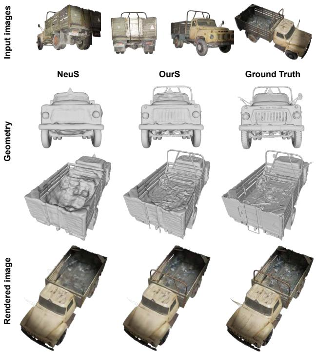  
Figure 1. We aim for quality geometry with NeRF reconstruction under inconsistency when viewing the same 3D point, for example, with images captured under a dynamic light field (top row), shown by the light spots on the truck cast from a torch moving with the camera. The middle two rows compare the reconstructed geometry from NeuS [41] (first column) and our method (second column). As observed, our method produces more details and better estimates the truck’s structure. The last row shows a novel view rendering from both methods. Even though our method normalizes the view-dependence, it does not lose details on the synthesized images thanks to the regularity induced by better geometry.

ometry, like depth scans.

Nevertheless, most improvements do not explicitly study the shape-radiance ambiguity that could induce degenerated geometric reconstructions. This ambiguity persists as long as some capacity is needed to account for the directional variations in the radiance, which is further amplified if the ambient light field changes according to the observer’s viewpoint. For example, the NeRF’s Multi-Layer Perceptrons (MLPs) takes in a 3D location and a 2D direction vector and outputs the observed color of this point from this specific viewing angle. If the MLP has sufficient capacity to model the directional phenomenon, a perfect photometric reconstruction could be achieved even if the learned geometry is entirely wrong. In other words, wrong geometry incurs more directional variations, which the MLP’s viewdependent branch can still encode, thus, rendering the photometric reconstruction loss incapable of constraining the solutions.

On the other hand, directional capacity is needed to prevent the (view-dependent) photometric loss from distorting the geometry (confirmed through our experiments). With quality geometry as the central goal, we are now facing a tradeoff between the capacity of the view-dependent radiance function and the shape-radiance ambiguity. Namely, the MLP’s capacity has to be increased to explain the directional variations, but if the capacity gets too large, shaperadiance ambiguity will permit degenerated geometric reconstructions. One can thus tune the capacity to achieve the best geometry for each scene, but it is time-consuming and infeasible since different scenes come with different levels of view dependence.

Instead of tuning the directional capacity, we adjust the view-dependence. More explicitly, we propose to normalize the directional variations by encoding invariant features distilled from the same scene representation. By doing so, the view-dependence of different scenes is aligned to the same level so that a single optimal capacity can ensure good view synthesis and prevent shape-radiance ambiguity from degrading the geometric estimation. Given the self-distillation property, the proposed view-dependence normalization can be jointly trained with the commonly used photometric reconstruction loss. It can also be easily plugged into any method relying on volume rendering for geometric scene reconstruction.

We demonstrate the effectiveness of the proposed viewdependence normalization on several datasets. Especially we verify that the level of view-dependence affects the minimality of the shape-radiance ambiguity with tunable directional capacity. And we show that our method effectively aligns the optimal capacity for each scene. To evaluate how our method works under a dynamically changing light field, we propose a new benchmark where a light source is moving conditioned on the camera pose. We validate that the geometry obtained from our method degrades gracefully as the significance of the induced directional variations increases. In summary, we make the following contributions:

• We perform a detailed study of the coupling between the capacity of the view-dependent radiance function and the shape-radiance ambiguity in the context of vol-

ume rendering.

• We propose a view-dependence normalization method that effectively aligns the optimality of the directional function capacity under shape-radiance ambiguity for each scene and achieves state-of-the-art geometry compared to various baselines.

• We quantitatively verify the robustness of our method when the light field changes to further increase the directional variation, ensuring the applicability to scenarios with unfavored lighting conditions.

## 2. Related Work

Leveraging volume rendering, NeRF [30] represents a scene as a continuous volumetric function parameterized by MLPs, which explicitly models volume density and viewdependent radiance computed from a 5D coordinate. It enables promising applications with photo-realistic rendering from arbitrary views. Follow-up works [3, 19, 21, 27, 32, 43, 51, 55] improve NeRF to achieve high-quality novel view rendering, however, the quality of the reconstructed geometry still lags.

Many methods thus perform disentanglement of shape and radiance in volume rendering for better appearance and geometry reconstruction. UNISURF [34] treats the surface as a decision boundary of a binary occupancy classifier. Several approaches [9,13,22,41,49,50] employ signed distance functions (SDFs) to better model the shape-induced volumetric rendering weights. It is noted in [50] that a global shape condition could be helpful to synthesize the appearance accurately. VolSDF [49] further improves the geometry by treating the volume density as a Laplacian cumulative distribution function (CDF) applied to an SDF. With a well-designed unbiased and occlusion-aware weight function, NeuS [41] achieves both quality rendering and fine geometric reconstruction details.

Most of the above approaches rely mainly on pixel values to determine the underlying scene structure with multiviews, thus, view-dependent effects such as reflection on a non-Lambertian surface or inconsistent lighting could easily incur shape-radiance ambiguity [55]. It is postulated in [55] that NeRF may alleviate the effect of shape-radiance ambiguity by preferring smoothly varying view-dependent radiance field. However, this condition may not be true with glossy surfaces or dynamic illuminations, where the radiance fields are inherently non-smooth. Another line of work aims at reconstructing editable representations by combining NeRFs with physics-based rendering techniques [1,4,5,7,8,26,33,45,48,53,54,56]. They decompose scenes into geometric and material factors or even explicitly learn the environmental lighting condition, but are still vulnerable to inputs with complex illumination artifacts.

In order to combat high-frequency factors that may cause difficulties in the reconstruction process, several works propose to optimize an extra transient field for each view [6,14, 15, 24, 25, 29, 36, 46, 52] so that the shared static structure can be faithfully reconstructed. Inspired by NeRF-W [29] which introduces transient latents to identify and disentangle view-dependent effects in unstructured data, [24] further employs physics-based rendering techniques [56] for material and normal estimation of an object with internet images. Other methods employ guided-optimization to leverage external signals for better geometry [2, 10, 31, 37, 42, 44]. For example, [44] first learns a monocular depth network on sparse structure-from-motion reconstruction and then utilizes the adapted depth priors to enhance the sampling of the volume rendering procedure. Depth oracle [31] also provides useful information for accelerated convergence while facilitating sparse view reconstruction [10].

To maximize practical usefulness, we choose not to assume external depth guidance. Instead, our method selfdistills invariant features from the radiance field and encodes them back into a neural feature field to normalize the view-dependence.

## 3. Method

We aim at reconstructing the surface (geometry) of a scene with a set of posed images $\left\{ { { I } _ { k } } , { p _ { k } } \right\}$ captured under dynamic lighting condition within the volume rendering framework [30]. More explicitly, we assume that the light field associated with each image is not constant. Without the assumption of a stable lighting, there exists a varying degree of freedom where the radiance of a surface point can change with respect to the viewing direction. Here we denote this phenomenon as directional view-dependence. Please note that we can also observe view-dependence due to non-Lambertian surface, however, by assuming nonconstant light field, our method is now put into a more general setup where accurate geometry is desired despite inconsistent radiance.

In the following, we first analyze how the minimality of the shape-radiance ambiguity varies according to the level of directional view-dependence. We then introduce a view-dependence normalization method that aligns the minimality of the shape-radiance ambiguity through selfdistillation of the encoded invariances in the scene representation. Finally, we show how the image reconstruction and self-distillation for view-dependence normalization can be jointly trained to achieve accurate geometry estimation under non-Lambertian and dynamic lighting conditions.

## 3.1. Volume rendering with shape-radiance ambiguity and directional view-dependence

To account for view-dependence, the radiance of a certain point $x \in \mathbb { R } ^ { 3 }$ in the scene is the output of a function:

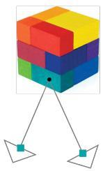  
(a)

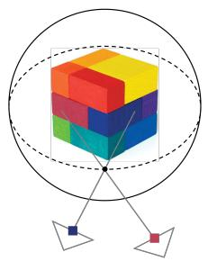  
(b)

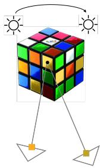  
(c)  
Figure 2. (a): When the geometry is correct, observations (the projections on the 2D image plane represented by squares) of the same surface point from different viewpoints are similar; (b): When the geometry is incorrect, i.e., a cube is reconstructed as a sphere, the radiance of a surface point (dot on the sphere) can exhibit large directional view-dependence. However, as long as the viewdependent radiance function has enough capacity (c in Eq. (1)), volume rendering of the wrong geometry can still achieve small photometric reconstruction error. Thus, one should constrain the view-dependent capacity of the radiance function to avoid overfitting; (c): On the other hand, when the surface is non-Lambertian or the light field is unstable, one should not over-constrain the viewdependent capacity; otherwise, the geometry may be traded for photometric reconstruction quality.

$c : \mathbb { R } ^ { 3 } \times \mathbb { S } ^ { 2 } \to \mathbb { R } ^ { 3 }$ , which maps the point coordinate x and a viewing direction $\mathbf { v } \in \mathbb { S } ^ { 2 }$ to an RGB value. Given a certain pixel p on the image plane defined by a camera center $\mathbf { o } ,$ we can leverage the commonly used volume rendering formulation to compute its pixel value as:

$$
C ( \mathbf { o } , \mathbf { v } ) = \intop _ { 0 } ^ { + \infty } w ( t ) c ( \mathbf { p } ( t ) , \mathbf { v } ) \mathrm { d } t\tag{1}
$$

where $\{ \mathbf { p } ( t ) = \mathbf { o } + t \mathbf { v } \mid t \geq 0 \}$ is the (outward) ray passing through the camera center o and the pixel p. And w is a weight function that depends on the scene geometry, and ideally, we like it to peak at the surface point.

Now we introduce our choice of the weight function beforehand to set a concrete ground for the consecutive analysis. However, note that our analysis of the coupling between the shape-radiance ambiguity and directional viewdependence of radiance does not rely on the exact choice of the weight function as long as it encourages maximum importance in the vicinity of surface points. Specifically, we adopt the weighting scheme of [41] as in the following:

$$
w ( t ) = T ( t ) \rho ( t )\tag{2}
$$

where $\rho ( t )$ is the density of a point on a ray parameterized by t, and $\begin{array} { r } { T ( t ) = \exp ( - \int _ { 0 } ^ { t } \rho ( \tau ) \mathrm { d } \tau ) } \end{array}$ is the accumulated transmittance. Particularly, we have

$$
\rho ( t ) = \operatorname* { m a x } ( \frac { - \frac { \mathrm { d } \Phi _ { s } } { \mathrm { d } t } ( f ( \mathbf { p } ( t ) ) ) } { \Phi _ { s } ( f ( \mathbf { p } ( t ) ) ) } , 0 )\tag{3}
$$

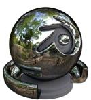  
C=1 (0.416)

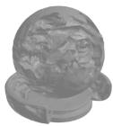  
C=2 (0.628)  
C=8 (0.691)  
C=12 (0.582)

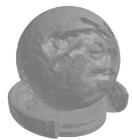  
C=4 (0.678)

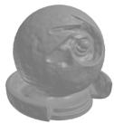

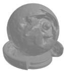  
C=16 (0.416)

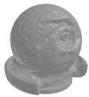  
Ground Truth

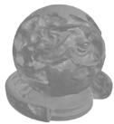

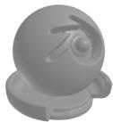  
(a) Geometric quality (with a fixed set of posed images) varies according to the capacity of the view-dependent color function. The scalar in the bracket is the intersection-over-union score, and C is the number of layers in the view-dependent color MLP. Bold indicates the optimal capacity. Here the object has a high directional view-dependence.

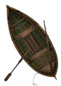

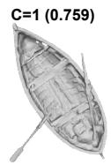

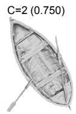

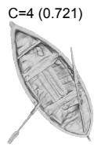

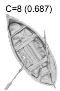

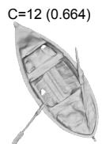

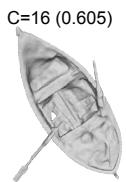

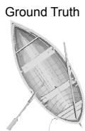  
(b) Similar to the above example, but now the object has a low directional view-dependence, and the optimal result is achieved at a small capacity.

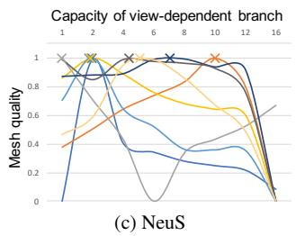

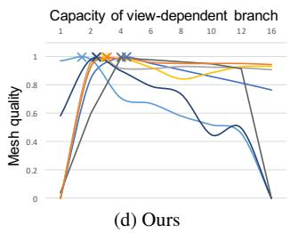  
Figure 3. In (a) and (b), we show two examples with different levels of directional view-dependence. As observed, the geometric quality of both depends on the capacity of the view-dependent color function, where the one with higher view-dependence achieves its optimum at a relatively larger capacity. Moreover, both decrease when the capacity gets larger than enough, entering the shape-radiance ambiguity zone. (c): For each object, we traverse the view-dependent color function’s capacity in [41] and plot the curve of the geometric quality. We can see that the coupling effect illustrated above is statistically valid, and there is no consensus on a capacity to achieve the optimum performance for all scenes. (d): When varying the view-dependent branches in the proposed framework (Fig. 4), we observe that the optimal capacity for all is consistent, verifying the effectiveness of the proposed directional view-dependence normalization. Note that the curves are scaled against the maximum for better visualization.

where $f ~ : ~ \mathbb { R } ^ { 3 } ~ \to ~ \mathbb { R }$ is a signed distance function parameterized by a neural network, and Φ is the Sigmoid function. Next, we detail the relationship between shaperadiance ambiguity and directional view-dependence in the context of volume rendering descried by Eq. (1).

Shape-radiance ambiguity in our case refers to the degeneration of geometry when the posed images can be perfectly reconstructed through volume rendering. In Fig. 2 (a), we show a Lambertian rubik, where different projections of the same surface point are constant if the geometry is correctly estimated. However, as soon as the capacity of the view-dependent color function (multi-layer perceptron $c ( \mathbf { p } ( t ) , \mathbf { v } )$ in Eq. (1)) becomes large enough, the posed images of the rubik can still be reconstructed even if the geometry is completely wrong. As shown in Fig. 2 (b), one can think of the sphere around the rubik as an LED screen, which can synthesize the image of an arbitrary camera pose by adjusting the color of each unit. In this case, the viewdependent color function’s capacity is approaching infinity. Thus, to ensure the quality of the learned geometry, we need to impose a constraint on the color function.

However, directional view-dependence is universal as there exist many non-Lambertian surfaces in the real world; moreover, there is no guarantee that the light field is static, especially when there is a need for active light sources, for example, in dim environments. And usually, we have a mixture of them, as shown in Fig. 2 (c). In order to have a good geometry through volume rendering, we may want to increase the capacity of the view-dependent color function so that the photometric reconstruction objective does not distort the geometry (through w(t) in Eq. (1)).

Thus, we can see a tight coupling between shaperadiance ambiguity and directional view dependence in the context of volume rendering. To account for view dependence, the capacity of the (directional) color function needs to be increased; yet, we do not want the capacity to pass what is enough for rendering the exhibited variations in the radiance. Otherwise, the shape-radiance ambiguity kicks in and starts to decrease the estimated geometry’s accuracy. We can check this phenomenon in Fig. 3 (a) and (b), where the metallic ball has a higher view-dependence radiance variation than the boat. We train NeuS [41] for each of them, but with various numbers of MLPs for the viewdependent color branch. As the capacity increases, the geometric quality of the reconstructed ball also increases until it hits a threshold (layer number of MLPs equal to eight in Fig. 3 (a)). Similarly, the optimal performance for the boat is achieved with one layer of MLP, and then starts to decrease (Fig. 3 (b)).

These examples clearly convey two messages: 1) The shape-radiance ambiguity always exists as long as the viewdependent color function has a large enough capacity; 2) We can alleviate the shape-radiance ambiguity by reducing the capacity until an optimal performance, but no more. Given the second, we could tune the view-dependent color function’s capacity to achieve the best geometric quality for each scene. However, this requires a time-consuming training process and relies on a reference geometry to tell the optimum. As evidenced in Fig. 3 (c), the optimal capacity for each scene (crosses on the performance-capacity curves) varies depending on the level of view-dependence of the scene, i.e., higher view-dependence entails a larger optimal capacity.

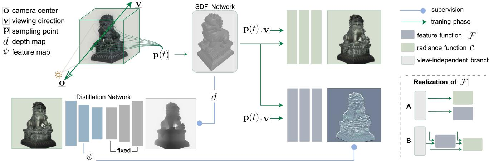  
Figure 4. Overview of our method. When reconstructing the scene from a set of posed images captured under dynamic lighting conditions, the proposed view-dependence normalization aligns the minimality of the shape-radiance ambiguity for different scenes by self-distilling depth features into a neural feature field. Note that the depth supervision for the distillation network comes directly from the SDF network in the architecture instead of external depth oracles. Two ways for incorporating the feature branch into the neural radiance field are shown in the bottom right, where A represents the parallel scheme in the left pipeline, and B indicates a scheme that makes the color function dependent on the feature branch.

Instead of tuning the capacity for each scene, we ask whether it is possible to align the degree of view-dependent radiance variation for all scenes. By doing so, a single optimal capacity should work across scenes and achieves the best overall geometry. Next, we describe how this can be achieved without controlling the surface material or the lighting condition, as shown in Fig. 3 (d).

## 3.2. Directional view-dependence normalization

Ideally, we like the scene to be perfectly Lambertian and the light field stable during the image capturing. In other words, we want the radiance of a specific point on the surface to be viewpoint invariant (Lambertian) and illumination invariant (stable lighting). Note that since an active light source usually changes according to the vantage point of the observer, we can think of the two as viewpoint-induced variations. We introduce our directional view-dependence normalization method that helps achieve the desired invariances and the joint training scheme for quality geometry via volume rendering (Fig. 4).

In contrast to [36, 44] that alleviate the effect of shaperadiance ambiguity by either external geometry priors or separate modeling of view-dependent and Lambertian components, the proposed view-dependence normalization works directly with the original neural radiance field through view-invariance distillation. More explicitly, we instantiate a distillation network $\psi ,$ which takes in a rendered image $I _ { k } ^ { r }$ and predicts the corresponding rendered depth:

$$
d _ { k } ^ { r } = \hat { d } _ { k } ^ { r } = \psi ( I _ { k } ^ { r } )\tag{4}
$$

where $d _ { k } ^ { r }$ is the projection of the zero-level set $S = \{ x \in$ $\mathbb { R } ^ { 3 } \mid f ( \overset { \cdot } { x } ) = 0 \}$ under the same pose of $I _ { k } ^ { r }$ . Also denote $\psi ^ { l } ( I _ { k } ^ { r } )$ as the feature map from the l-th layer of $\psi ,$ with $\hat { d } _ { k } ^ { r } = \psi ^ { L } ( I _ { k } ^ { r } )$ . Explicitly, we adopt [35], which employs [18] as its encoder, to serve as the distillation network ψ. Then, we instantiate a feature function ${ \mathcal F } ,$ , in parallel to the radiance function $c \left( { \mathrm { F i g . ~ 4 } } \right)$ , and denote the corresponding volume rendering as:

$$
\Psi ( \mathbf { o } , \mathbf { v } ) = \intop _ { 0 } ^ { + \infty } w ( t ) \mathcal { F } ( \mathbf { p } ( t ) , \mathbf { v } ) \mathrm { d } t\tag{5}
$$

where $( \mathbf { o } , \mathbf { v } )$ specify a ray that is parameterized by t.

The $k e y$ of view-dependence normalization is to dilute the variation in colors with the prediction of a more viewinvariant signal, namely, we set:

$$
\Psi ( \mathbf { o } , \mathbf { v } ) = \bar { \psi } ^ { l } ( I _ { k } ^ { r } ) [ \mathbf { p } ]\tag{6}
$$

where $\hat { \psi } ^ { l } ( I _ { k } ^ { r } )$ is the normalized feature from the l-th layer of the depth prediction network $\psi .$ . Since depth prediction requires illumination invariance (luminance does not change the geometry), features useful for this task should be stable to light field changes. Similarly, depth features shall encode a certain level of viewpoint invariance, e.g., in-plane translation and rotation of the camera do not alter the depth of the same point. Moreover, normalizing the depth feature help throw away depth variations caused by out-of-plane perturbations of camera pose, which further enhances the viewpoint invariance of the features.

On the other hand, features encoded by F should maintain discriminability modulo view-dependence so that geometric details are reconstructable. One can achieve this by choosing a relatively smaller l for $\hat { \psi } ^ { l } ( I _ { k } ^ { r } )$ , which we will ablation study as an operational hyperparameter. By learning the feature field in addition to radiance, viewpoint variations in color shall be compensated by the view-invariance in the distilled features, thus normalizing the view dependence. Now we detail the joint training objectives.

## 3.3. Network training

The proposed joint training with view-dependence normalization minimizes both the photometric and selfdistilled feature reconstruction errors. Denote the input image as $I _ { k }$ , the batch size as n and the number of point samples per ray as m, the joint training objective is:

$$
\mathcal { L } = \lambda _ { c o l o r } \mathcal { L } _ { c o l o r } + \lambda _ { v d n } \mathcal { L } _ { v d n } + \lambda _ { r e g } \mathcal { L } _ { r e g }\tag{7}
$$

where the color loss $\lambda _ { c o l o r }$ and view-dependence normalization loss $\mathcal { L } _ { v d n }$ are defined as:

$$
\mathcal { L } _ { c o l o r } = \frac { 1 } { n } \sum _ { i } { | I _ { k , i } ^ { r } - I _ { k , i } | }\tag{8}
$$

$$
\mathcal { L } _ { v d n } = \frac { 1 } { n } \sum _ { i } \left| \Psi ( \mathbf { o } _ { i } , \mathbf { v } _ { i } ) - \bar { \psi } ^ { l } ( I _ { k } ) [ \mathbf { p } _ { i } ] \right|\tag{9}
$$

Here, we use L1 loss as in [41, 50]. And $\mathcal { L } _ { r e g }$ is an Eikonal term [16] regularizing the gradients ∇ of the SDF network:

$$
\mathcal { L } _ { r e g } = \frac { 1 } { m n } \sum _ { i , j } ( | | \nabla f ( \mathbf { p } _ { i , j } ) ) | | - 1 ) ^ { 2 }\tag{10}
$$

Also as in [41], when masks are available, the color loss and mask loss are defined as:

$$
\mathcal { L } _ { c o l o r } = \frac { 1 } { n } \sum _ { i } \left| I _ { k , i } ^ { r } - I _ { k , i } \right| \cdot M _ { k , i }\tag{11}
$$

$$
\mathcal { L } _ { m s k } = B C E ( M _ { k } , \hat { M } _ { k } )\tag{12}
$$

where $M _ { k }$ is the foreground mask for image $I _ { k }$ , and $\hat { M } _ { k } =$ $\textstyle \sum _ { j = 1 } ^ { m } w _ { k , j }$ is the sum of weights along the camera ray.

Camera pose optimization. Similar to [43], we also treat camera poses and intrinsics as learnable parameters, and jointly optimize them when it is needed. For more details about this part please refer to the appendix.

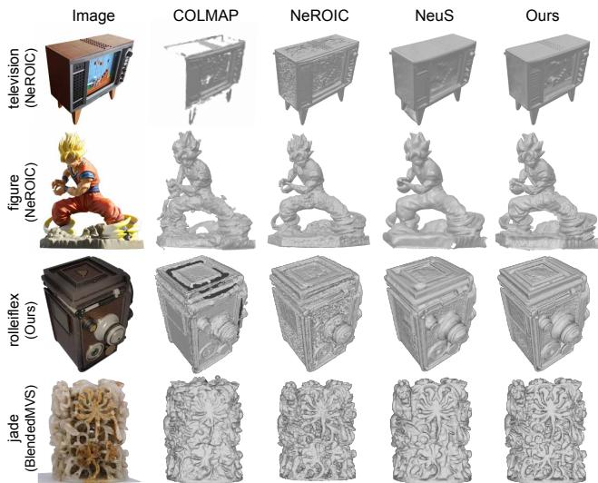  
Figure 5. Qualitative comparison with COLMAP [38], NeROIC [24], and NeuS [41], which are representatives of different categories described in Tab. 1. Our model retains accurate geometry with more details and less artifacts.

## 4. Experiments

Implementation details. We implement our method mainly based on NeuS [41]. The feature function F and the radiance function c have similar architectures, i.e., 4- layer MLP with a hidden dimension of 256. We follow the hierarchical sampling strategy in NeuS [41] and set the batch size to 512. We also adopt WaveletMonodepth [35] with a DenseNet161 backbone [17, 18] as our distillation network, and pretrain it on in-domain data (different from training and test scenes) for a few epochs to ensure efficient convergence during the joint training stage. As an operational choice, we conduct our experiments with depth features from the distillation encoder’s first Conv block (l=1). Note that we can optionally choose not to update the distillation network if the discrepancy between its prediction and the self-supervision is small. This can help reduce the training time when we have to train many scenes. The training is performed on a single NVIDIA RTX3090 GPU and takes 300K steps to converge in about 11 hours.

Baselines. We evaluate the proposed method against non-learning-based methods [12, 38], volume-based methods [24, 29, 30, 40] , and SDF-based methods [13, 41, 49]. Meshes for COLMAP [38] are extracted using screened Poisson Surface reconstruction [23] with trimming value 7. As a multi-stage method, NeROIC [24] infers the surface and normals in the first stage, then estimates material properties and ambient illumination with fixed geometry in the second stage. We only train it with the first stage to extract the geometry for evaluation. GeoNeuS [13] leverages sparse 3D points from Structure-From-Motion and photometric consistency in Multi-View-Stereo to optimize via SDF loss and photometric consistency loss. We follow the descriptions in their paper and reimplement their method for evaluation.

<table><tr><td>Method</td><td>COLMAP</td><td>Plenoxels</td><td>NeRF</td><td>NeRF-W</td><td>NeROIC</td><td>RefNeRF</td><td>VolSDF</td><td>NeuS</td><td>Geo-A</td><td>GeoNeuS</td><td>VolSDF+F</td><td>Geo-A+F</td><td>Ours</td></tr><tr><td>IoU ↑</td><td>0.607</td><td>0.479</td><td>0.481</td><td>0.586</td><td>0.501</td><td>0.442</td><td>0.635</td><td>0.639</td><td>0.600</td><td>0.517</td><td>0.675</td><td>0.692</td><td>0.708</td></tr><tr><td>L1 CD ↓</td><td>0.587</td><td>0.760</td><td>0.938</td><td>0.672</td><td>0.999</td><td>1.750</td><td>0.530</td><td>0.563</td><td>0.638</td><td>0.781</td><td>0.465</td><td>0.434</td><td>0.397</td></tr><tr><td>L2 CD ↓</td><td>2.568</td><td>1.897</td><td>3.263</td><td>1.549</td><td>3.938</td><td>15.152</td><td>1.223</td><td>1.461</td><td>2.416</td><td>2.873</td><td>1.063</td><td>0.898</td><td>0.827</td></tr><tr><td>NC↑</td><td>0.785</td><td>0.636</td><td>0.654</td><td>0.725</td><td>0.704</td><td>0.687</td><td>0.829</td><td>0.831</td><td>0.808</td><td>0.768</td><td>0.837</td><td>0.829</td><td>0.845</td></tr><tr><td>f-score ↑</td><td>0.790</td><td>0.577</td><td>0.552</td><td>0.668</td><td>0.568</td><td>0.521</td><td>0.760</td><td>0.762</td><td>0.757</td><td>0.627</td><td>0.798</td><td>0.834</td><td>0.854</td></tr></table>

Table 1. Quantitative comparison on our dataset with non-learning-based approaches: COLMAP [38], Plenoxels [12]; volume-based approaches: NeRF [30], NeRF-W [29], NeROIC [24], RefNeRF [40]; and SDF-based methods: VolSDF [49], NeuS [41], Geo-A & GeoNeuS [13]. Note that Geo-A refers to a simplified version of GeoNeuS [13] (named Model-A in their ablations), where the SDF is supervised by sparse points from COLMAP. We apply the proposed view-dependence normalization to VolSDF (VolSDF+F), Geo-A (Geo-A+F), and NeuS (Ours). The effectiveness is observed in all the variants of our method. Moreover, ours achieves the best on all five metrics of the learned geometry: Intersection-over-Union (IoU), L1/L2 Chamfer Distance (CD), Normal Consistency (NC), and f-score.
<table><tr><td rowspan="2">Lighting</td><td colspan="3">NeuS</td><td colspan="3">Ours</td></tr><tr><td>IoU↑</td><td>fscore ↑</td><td>L1 CD↓</td><td>IoU↑</td><td>fscore ↑</td><td>L1 CD ↓</td></tr><tr><td>static illum.</td><td>0.631</td><td>0.765</td><td>0.586</td><td>0.668</td><td>0.813</td><td>0.494</td></tr><tr><td>dynamic illum.</td><td>0.574</td><td>0.720</td><td>0.644</td><td>0.658</td><td>0.808</td><td>0.496</td></tr></table>

Table 2. Comparison with NeuS [41] under different lighting conditions. Our method achieves better scores on all three metrics, especially with dynamic lighting.

Datasets. Due to the lack of ground-truth geometry and controls of illumination in existing sequences, we create a new benchmark with synthetic renderings of eight challenging scenes. Especially, we let the light source changes its location accordingly to the camera poses. By this, we can simulate different levels of view variations beyond reflections. In each scene, we randomly select 30 views as training data. We also show the results on the released data with unconstrained illumination from NeROIC [24], as well as the data from DTU [20] and BlendedMVS [47] with static illumination. To test the capability in alleviating shape-radiance ambiguity by the proposed viewdependence normalization in practical applications, we also conduct experiments on two real-world captures, i.e., one is an intra-oral scanning, and the other is the underwater dataset AQUALOC [11], where dynamic lighting is needed to better perceive the scene.

Evaluation. We generate dense grids of the density/SDF value from the trained neural radiance field and extract meshes by Marching Cubes [28]. Then, We compare the multi-view reconstruction results to the ground truth and report the quantitative results by measuring Intersection-of-Union (IoU), L1/L2 Chamfer Distance (CD), Normal Consistency (NC), and f-score, following [39].

## 4.1. Comparison

Tab. 1 shows quantitative evaluations for all models on our dynamic-lighting scenes. SDF-based methods [41, 49] outperform volume-based methods [24, 30, 40] by an average margin of 0.1 in IoU and 0.17 in f-score. As observed in Fig. 5, volume-based methods can handle sudden depth changes, but the reconstruction results are noisy, suffering more from the shape-radiance ambiguity. This phenomenon is more evident in textured regions. For instance, in the third row of Fig. 5, the leather side of Rolleiflex attains a much rougher surface than the metal frame. In contrast, with the inductive bias of SDF, NeuS tends to learn a smoother surface to compensate for the effects of dynamic illuminations, thus lacking geometric details.

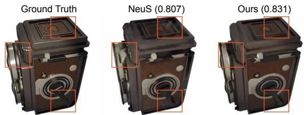  
Figure 6. Novel view synthesis from NeuS [41] and our model. Scalars in brackets are structural similarities (SSIM). Our method learns better geometry and enhances the radiance field, as demonstrated in the improved rendering details.

Our experiments show that the geometry of image-based reconstruction is affected by several factors: inconsistent lighting, lack of texture, reflections, etc. However, with view-dependence normalization, our method suffers less from these problems and outperforms by a large margin. With the employment of F in the architecture, both NeuS and VolSDF achieve around 10% improvement in IoU and f-score, and up to 30% improvement in Chamfer L1 Distance, demonstrating the generality of our methods in enhancing geometry with different reconstruction pipelines.

Robustness to lighting condition. Quantitative evaluations in Tab. 2 show that our method is more consistent in surface quality when the illumination changes. As the lighting condition becomes unstable, NeuS [41] drops a lot in geometry quality measured by IoU scores, whereas our method only drops by a graceful margin. Moreover, with the proposed view-dependence normalization, our method can further improve in the static lighting scenario.

Novel view rendering. Fig. 6 shows novel-view image generated by NeuS [41] and our method. As our method biases the SDF network towards enhanced geometry, better appearance reconstruction is achieved simultaneously.

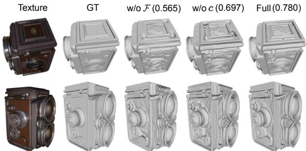  
Figure 7. Effectiveness of the feature function F and the color function c. F-scores are shown in the brackets. Lacking the proposed view-dependence normalization incurs a larger loss in geometric quality and results in over-smoothed surfaces.

<table><tr><td></td><td>IoU↑</td><td>L1 CD↓</td><td>L2 CD ↓</td><td>NC↑</td><td>f-score ↑</td></tr><tr><td>w/o</td><td>0.640</td><td>0.558</td><td>1.466</td><td>0.834</td><td>0.763</td></tr><tr><td>l = 1</td><td>0.705</td><td>0.396</td><td>0.823</td><td>0.858</td><td>0.851</td></tr><tr><td>l = 2</td><td>0.687</td><td>0.434</td><td>1.032</td><td>0.854</td><td>0.830</td></tr><tr><td>l = 3</td><td>0.682</td><td>0.419</td><td>0.842</td><td>0.854</td><td>0.827</td></tr><tr><td>l = 4</td><td>0.601</td><td>0.536</td><td>1.038</td><td>0.834</td><td>0.717</td></tr></table>

Table 3. Effect of using depth features from different encoder layers (l) of the distillation network ψ.

## 4.2. Ablations

Color vs. Feature: Fig. 7 shows that without the normalization feature function that regularizes the SDF network (w/o F), the reconstruction drops substantially, showing the benefits of our directional view-dependence normalization technique. Qualitatively, the feature field enables capturing sharp geometry. Removing the color function (w/o c) also produces worse geometries. Thus, the radiance field can help rectify abnormalities in case of misleading depth features. Moreover, with the combination of F and c, our full model achieves the best performance.

In Tab. 3, we perform an ablation study on how the performance changes depending on where the depth feature ψl is extracted. Restricted by the GPU memory, we only experiment with the first four layers from the encoder of Ψ. The features from each layer are in dimensions 96, 96, 192, and 384, with sizes of 1/2, 1/4, 1/8, and 1/16 of the input. We upsample input images to ensure the features are of the same resolution. Results of the model trained without ψl are reported in the first row (w/o). Generally speaking, models trained with smaller l gain better from the view-dependence normalization. Notably, the quality decreases significantly when l increases to 4, which indicates that high-level depth features may be too invariant to recover the underlying structures.

## 4.3. Real-world capture

Geometry reconstruction results from the underwater sequences in Fig. 8 (a) show that our model can have robust geometry estimation under harsh conditions, for instance, dark scenes with a weak moving light source. For NeuS, contrast enhancement on input images (NeuS-E) could help to learn better geometry, but the quality still lags. In contrast, our method can generate a reasonable surface without further modification of the pipeline.

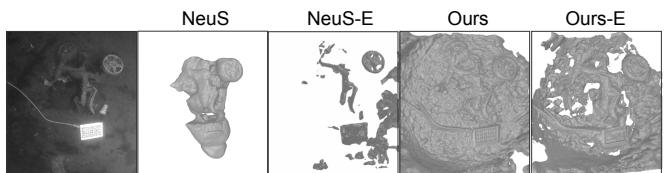  
(a) Reconstructed scenes from the underwater dataset AQUALOC [11]. E stands for using image enhancement to improve the contrast. Despite the enhancement, NeuS [41] still overlooks geometry details. Our method can better deal with the low-illuminance scenario.

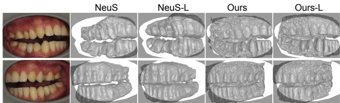  
(b) Reconstructed geometry from intra-oral images. L means training with camera pose optimization. Our method performs well in such complex scenes, while NeuS [41] fails to reason about the teeth structure.  
Figure 8. Results on unconstrained real-world scenes with dynamic lighting show the practical usefulness of our method for dim-environment applications.

Fig. 8 (b) shows another difficult scenario, i.e., intra-oral scans. To achieve better reconstruction quality, we further train the models with camera pose optimization. The occlusion by mouth gag, dynamic lighting, and the lack of structural information incur challenges for NeuS. As expected, our model learns a more accurate geometry for teeth despite textureless and highly reflective surfaces.

## 5. Discussion

We show that the coupling of the view-dependent radiance and the shape-radiance ambiguity – causing issues when quality geometry is important – can be alleviated by a simple yet effective view-dependence normalization. The effectiveness is guaranteed by enforcing a single optimal directional capacity that maximizes the rendering before the shape-radiance ambiguity kicks in. The view-dependence normalization comes down to distilling robust and discriminative information from the radiance field without relying on external supervision. We demonstrated its superiority in challenging scenes, e.g., with reflective and textureless surfaces under dynamic lighting conditions. We hope the proposed technique can serve future research in applying neural radiance fields for (unconstrained) real-world geometric reasoning tasks.

Acknowledgement: We thank the support of a grant from the Stanford Human-Centered AI Institute, an HKU-100 research award, and a Vannevar Bush Faculty Fellowship.

## References

[1] Dejan Azinovic, Tzu-Mao Li, Anton Kaplanyan, and Matthias Nießner. Inverse path tracing for joint material and lighting estimation. In Proceedings of the IEEE/CVF Conference on Computer Vision and Pattern Recognition, pages 2447–2456, 2019. 2

[2] Dejan Azinovic, Ricardo Martin-Brualla, Dan B Goldman,´ Matthias Nießner, and Justus Thies. Neural rgb-d surface reconstruction. In Proceedings of the IEEE/CVF Conference on Computer Vision and Pattern Recognition, pages 6290– 6301, 2022. 3

[3] Jonathan T Barron, Ben Mildenhall, Matthew Tancik, Peter Hedman, Ricardo Martin-Brualla, and Pratul P Srinivasan. Mip-nerf: A multiscale representation for anti-aliasing neural radiance fields. In Proceedings of the IEEE/CVF International Conference on Computer Vision, pages 5855–5864, 2021. 2

[4] Sai Bi, Zexiang Xu, Pratul Srinivasan, Ben Mildenhall, Kalyan Sunkavalli, Milos Haˇ san, Yannick Hold-Geoffroy,ˇ David Kriegman, and Ravi Ramamoorthi. Neural reflectance fields for appearance acquisition. arXiv preprint arXiv:2008.03824, 2020. 2

[5] Sai Bi, Zexiang Xu, Kalyan Sunkavalli, David Kriegman, and Ravi Ramamoorthi. Deep 3d capture: Geometry and reflectance from sparse multi-view images. In Proceedings of the IEEE/CVF Conference on Computer Vision and Pattern Recognition, pages 5960–5969, 2020. 2

[6] Mark Boss, Raphael Braun, Varun Jampani, Jonathan T Barron, Ce Liu, and Hendrik Lensch. Nerd: Neural reflectance decomposition from image collections. In Proceedings of the IEEE/CVF International Conference on Computer Vision, pages 12684–12694, 2021. 3

[7] Mark Boss, Varun Jampani, Raphael Braun, Ce Liu, Jonathan Barron, and Hendrik Lensch. Neural-pil: Neural pre-integrated lighting for reflectance decomposition. Advances in Neural Information Processing Systems, 34:10691–10704, 2021. 2

[8] Wenzheng Chen, Joey Litalien, Jun Gao, Zian Wang, Clement Fuji Tsang, Sameh Khamis, Or Litany, and Sanja Fidler. Dib-r++: Learning to predict lighting and material with a hybrid differentiable renderer. Advances in Neural Information Processing Systems, 34:22834–22848, 2021. 2

[9] Franc¸ois Darmon, Ben´ edicte Bascle, Jean-Cl´ ement Devaux,´ Pascal Monasse, and Mathieu Aubry. Improving neural implicit surfaces geometry with patch warping. In Proceedings of the IEEE/CVF Conference on Computer Vision and Pattern Recognition, pages 6260–6269, 2022. 2

[10] Kangle Deng, Andrew Liu, Jun-Yan Zhu, and Deva Ramanan. Depth-supervised nerf: Fewer views and faster training for free. In Proceedings of the IEEE/CVF Conference on Computer Vision and Pattern Recognition, pages 12882– 12891, 2022. 3

[11] Maxime Ferrera, Vincent Creuze, Julien Moras, and Pauline Trouve-Peloux. Aqualoc: An underwater dataset for visual–´ inertial–pressure localization. The International Journal of Robotics Research, 38(14):1549–1559, 2019. 7, 8

[12] Sara Fridovich-Keil, Alex Yu, Matthew Tancik, Qinhong Chen, Benjamin Recht, and Angjoo Kanazawa. Plenoxels: Radiance fields without neural networks. In Proceedings of the IEEE/CVF Conference on Computer Vision and Pattern Recognition, pages 5501–5510, 2022. 6, 7

[13] Qiancheng Fu, Qingshan Xu, Yew-Soon Ong, and Wenbing Tao. Geo-neus: Geometry-consistent neural implicit surfaces learning for multi-view reconstruction. arXiv preprint arXiv:2205.15848, 2022. 2, 6, 7

[14] Guy Gafni, Justus Thies, Michael Zollhofer, and Matthias Niessner. Dynamic neural radiance fields for monocular 4d facial avatar reconstruction. In Proceedings ofthe IEEE/CVF Conference on Computer Vision and Pattern Recognition (CVPR), pages 8649–8658, June 2021. 3

[15] Chen Gao, Ayush Saraf, Johannes Kopf, and Jia-Bin Huang. Dynamic view synthesis from dynamic monocular video. In Proceedings of the IEEE/CVF International Conference on Computer Vision (ICCV), pages 5712–5721, October 2021. 3

[16] Amos Gropp, Lior Yariv, Niv Haim, Matan Atzmon, and Yaron Lipman. Implicit geometric regularization for learning shapes. arXiv preprint arXiv:2002.10099, 2020. 6

[17] Gao Huang, Zhuang Liu, Geoff Pleiss, Laurens Van Der Maaten, and Kilian Weinberger. Convolutional networks with dense connectivity. IEEE Transactions on Pattern Analysis and Machine Intelligence, 2019. 6

[18] Gao Huang, Zhuang Liu, Laurens Van Der Maaten, and Kilian Q Weinberger. Densely connected convolutional networks. In Proceedings of the IEEE conference on computer vision and pattern recognition, pages 4700–4708, 2017. 5, 6

[19] Ajay Jain, Matthew Tancik, and Pieter Abbeel. Putting nerf on a diet: Semantically consistent few-shot view synthesis. In Proceedings of the IEEE/CVF International Conference on Computer Vision, pages 5885–5894, 2021. 2

[20] Rasmus Jensen, Anders Dahl, George Vogiatzis, Engin Tola, and Henrik Aanæs. Large scale multi-view stereopsis evaluation. In Proceedings of the IEEE conference on computer vision and pattern recognition, pages 406–413, 2014. 7

[21] Yoonwoo Jeong, Seokjun Ahn, Christopher Choy, Anima Anandkumar, Minsu Cho, and Jaesik Park. Self-calibrating neural radiance fields. In Proceedings of the IEEE/CVF International Conference on Computer Vision, pages 5846– 5854, 2021. 2

[22] Yue Jiang, Dantong Ji, Zhizhong Han, and Matthias Zwicker. Sdfdiff: Differentiable rendering of signed distance fields for 3d shape optimization. In Proceedings ofthe IEEE/CVF conference on computer vision and pattern recognition, pages 1251–1261, 2020. 2

[23] Michael Kazhdan, Matthew Bolitho, and Hugues Hoppe. Poisson surface reconstruction. In Proceedings of the fourth Eurographics symposium on Geometry processing, volume 7, 2006. 6

[24] Zhengfei Kuang, Kyle Olszewski, Menglei Chai, Zeng Huang, Panos Achlioptas, and Sergey Tulyakov. Neroic: Neural rendering of objects from online image collections. arXiv preprint arXiv:2201.02533, 2022. 3, 6, 7

[25] Tianye Li, Mira Slavcheva, Michael Zollhofer, Simon Green,¨ Christoph Lassner, Changil Kim, Tanner Schmidt, Steven

Lovegrove, Michael Goesele, Richard Newcombe, and Zhaoyang Lv. Neural 3d video synthesis from multi-view video. In Proceedings ofthe IEEE/CVF Conference on Computer Vision and Pattern Recognition (CVPR), pages 5521– 5531, June 2022. 3

[26] Zhengqin Li, Zexiang Xu, Ravi Ramamoorthi, Kalyan Sunkavalli, and Manmohan Chandraker. Learning to reconstruct shape and spatially-varying reflectance from a single image. ACM Transactions on Graphics (TOG), 37(6):1–11, 2018. 2

[27] Chen-Hsuan Lin, Wei-Chiu Ma, Antonio Torralba, and Simon Lucey. Barf: Bundle-adjusting neural radiance fields. In IEEE International Conference on Computer Vision (ICCV), 2021. 2

[28] William E Lorensen and Harvey E Cline. Marching cubes: A high resolution 3d surface construction algorithm. ACM siggraph computer graphics, 21(4):163–169, 1987. 7

[29] Ricardo Martin-Brualla, Noha Radwan, Mehdi SM Sajjadi, Jonathan T Barron, Alexey Dosovitskiy, and Daniel Duckworth. Nerf in the wild: Neural radiance fields for unconstrained photo collections. In Proceedings of the IEEE/CVF Conference on Computer Vision and Pattern Recognition, pages 7210–7219, 2021. 3, 6, 7

[30] Ben Mildenhall, Pratul P Srinivasan, Matthew Tancik, Jonathan T Barron, Ravi Ramamoorthi, and Ren Ng. Nerf: Representing scenes as neural radiance fields for view synthesis. In European conference on computer vision, pages 405–421. Springer, 2020. 2, 3, 6, 7

[31] Thomas Neff, Pascal Stadlbauer, Mathias Parger, Andreas Kurz, Joerg H Mueller, Chakravarty R Alla Chaitanya, Anton Kaplanyan, and Markus Steinberger. Donerf: Towards realtime rendering of compact neural radiance fields using depth oracle networks. In Computer Graphics Forum, volume 40, pages 45–59. Wiley Online Library, 2021. 3

[32] Michael Niemeyer, Jonathan T Barron, Ben Mildenhall, Mehdi SM Sajjadi, Andreas Geiger, and Noha Radwan. Regnerf: Regularizing neural radiance fields for view synthesis from sparse inputs. In Proceedings of the IEEE/CVF Conference on Computer Vision and Pattern Recognition, pages 5480–5490, 2022. 2

[33] Merlin Nimier-David, Zhao Dong, Wenzel Jakob, and Anton Kaplanyan. Material and lighting reconstruction for complex indoor scenes with texture-space differentiable rendering. 2021. 2

[34] Michael Oechsle, Songyou Peng, and Andreas Geiger. Unisurf: Unifying neural implicit surfaces and radiance fields for multi-view reconstruction. In Proceedings of the IEEE/CVF International Conference on Computer Vision, pages 5589–5599, 2021. 2

[35] Michael Ramamonjisoa, Michael Firman, Jamie Watson,¨ Vincent Lepetit, and Daniyar Turmukhambetov. Single image depth prediction with wavelet decomposition. In Proceedings of the IEEE/CVF conference on computer vision and pattern recognition, pages 11089–11098, 2021. 5, 6

[36] Sverker Rasmuson, Erik Sintorn, and Ulf Assarsson. Addressing the shape-radiance ambiguity in view-dependent radiance fields. arXiv preprint arXiv:2203.01553, 2022. 3, 5

[37] Barbara Roessle, Jonathan T Barron, Ben Mildenhall, Pratul P Srinivasan, and Matthias Nießner. Dense depth priors for neural radiance fields from sparse input views. In Proceedings of the IEEE/CVF Conference on Computer Vision and Pattern Recognition, pages 12892–12901, 2022. 3

[38] Johannes L Schonberger, Enliang Zheng, Jan-Michael¨ Frahm, and Marc Pollefeys. Pixelwise view selection for unstructured multi-view stereo. In European conference on computer vision, pages 501–518. Springer, 2016. 6, 7

[39] Yawar Siddiqui, Justus Thies, Fangchang Ma, Qi Shan, Matthias Nießner, and Angela Dai. Retrievalfuse: Neural 3d scene reconstruction with a database. In Proc. International Conference on Computer Vision (ICCV), Oct. 2021. 7

[40] Dor Verbin, Peter Hedman, Ben Mildenhall, Todd Zickler, Jonathan T Barron, and Pratul P Srinivasan. Ref-nerf: Structured view-dependent appearance for neural radiance fields. In 2022 IEEE/CVF Conference on Computer Vision and Pattern Recognition (CVPR), pages 5481–5490. IEEE, 2022. 6, 7

[41] Peng Wang, Lingjie Liu, Yuan Liu, Christian Theobalt, Taku Komura, and Wenping Wang. Neus: Learning neural implicit surfaces by volume rendering for multi-view reconstruction. arXiv preprint arXiv:2106.10689, 2021. 1, 2, 3, 4, 6, 7, 8

[42] Yusen Wang, Zongcheng Li, Yu Jiang, Kaixuan Zhou, Tuo Cao, Yanping Fu, and Chunxia Xiao. Neuralroom: Geometry-constrained neural implicit surfaces for indoor scene reconstruction. arXiv preprint arXiv:2210.06853, 2022. 3

[43] Zirui Wang, Shangzhe Wu, Weidi Xie, Min Chen, and Victor Adrian Prisacariu. Nerf–: Neural radiance fields without known camera parameters. arXiv preprint arXiv:2102.07064, 2021. 2, 6

[44] Yi Wei, Shaohui Liu, Yongming Rao, Wang Zhao, Jiwen Lu, and Jie Zhou. Nerfingmvs: Guided optimization of neural radiance fields for indoor multi-view stereo. In Proceedings ofthe IEEE/CVF International Conference on Computer Vision, pages 5610–5619, 2021. 3, 5

[45] Rui Xia, Yue Dong, Pieter Peers, and Xin Tong. Recovering shape and spatially-varying surface reflectance under unknown illumination. ACM Transactions on Graphics (TOG), 35(6):1–12, 2016. 2

[46] Wenqi Xian, Jia-Bin Huang, Johannes Kopf, and Changil Kim. Space-time neural irradiance fields for free-viewpoint video. In Proceedings ofthe IEEE/CVF Conference on Computer Vision and Pattern Recognition (CVPR), pages 9421– 9431, June 2021. 3

[47] Yao Yao, Zixin Luo, Shiwei Li, Jingyang Zhang, Yufan Ren, Lei Zhou, Tian Fang, and Long Quan. Blendedmvs: A largescale dataset for generalized multi-view stereo networks. In Proceedings of the IEEE/CVF Conference on Computer Vision and Pattern Recognition, pages 1790–1799, 2020. 7

[48] Yao Yao, Jingyang Zhang, Jingbo Liu, Yihang Qu, Tian Fang, David McKinnon, Yanghai Tsin, and Long Quan. Neilf: Neural incident light field for physically-based material estimation. In European Conference on Computer Vision, pages 700–716. Springer, 2022. 2

[49] Lior Yariv, Jiatao Gu, Yoni Kasten, and Yaron Lipman. Volume rendering of neural implicit surfaces. Advances in Neu-

ral Information Processing Systems, 34:4805–4815, 2021. 2, 6, 7

[50] Lior Yariv, Yoni Kasten, Dror Moran, Meirav Galun, Matan Atzmon, Basri Ronen, and Yaron Lipman. Multiview neural surface reconstruction by disentangling geometry and appearance. Advances in Neural Information Processing Systems, 33:2492–2502, 2020. 2, 6

[51] Alex Yu, Vickie Ye, Matthew Tancik, and Angjoo Kanazawa. pixelnerf: Neural radiance fields from one or few images. In Proceedings of the IEEE/CVF Conference on Computer Vision and Pattern Recognition, pages 4578–4587, 2021. 2

[52] Jason Zhang, Gengshan Yang, Shubham Tulsiani, and Deva Ramanan. Ners: Neural reflectance surfaces for sparse-view 3d reconstruction in the wild. Advances in Neural Information Processing Systems, 34:29835–29847, 2021. 3

[53] Kai Zhang, Fujun Luan, Zhengqi Li, and Noah Snavely. Iron: Inverse rendering by optimizing neural sdfs and materials from photometric images. In Proceedings of the IEEE/CVF Conference on Computer Vision and Pattern Recognition, pages 5565–5574, 2022. 2

[54] Kai Zhang, Fujun Luan, Qianqian Wang, Kavita Bala, and Noah Snavely. Physg: Inverse rendering with spherical gaussians for physics-based material editing and relighting. In Proceedings of the IEEE/CVF Conference on Computer Vision and Pattern Recognition, pages 5453–5462, 2021. 2

[55] Kai Zhang, Gernot Riegler, Noah Snavely, and Vladlen Koltun. Nerf++: Analyzing and improving neural radiance fields. arXiv preprint arXiv:2010.07492, 2020. 2

[56] Xiuming Zhang, Pratul P Srinivasan, Boyang Deng, Paul Debevec, William T Freeman, and Jonathan T Barron. Nerfactor: Neural factorization of shape and reflectance under an unknown illumination. ACM Transactions on Graphics (TOG), 40(6):1–18, 2021. 2, 3