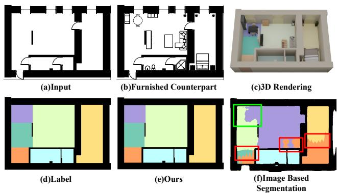
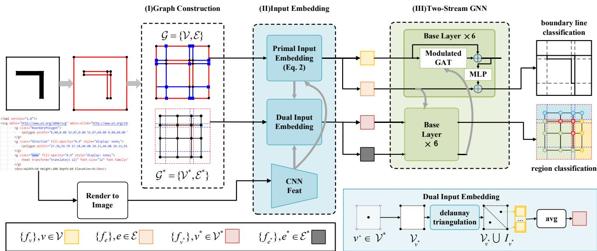
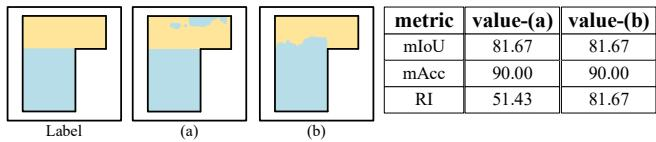
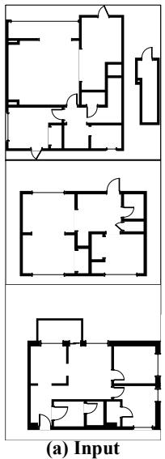
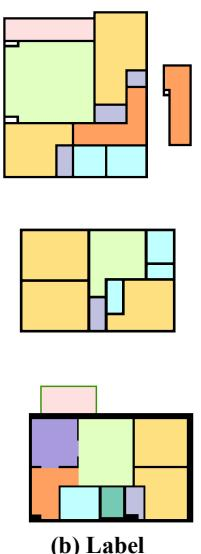
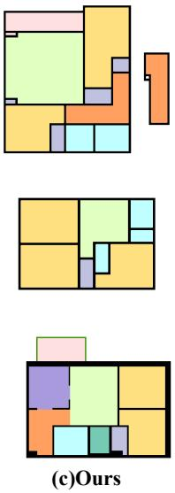
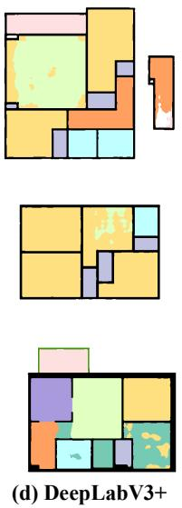
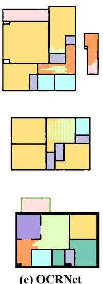
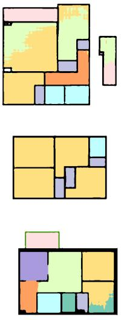
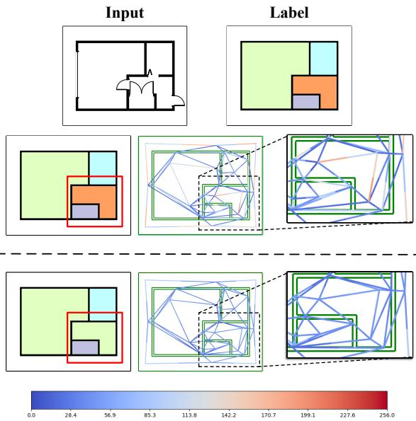

# VectorFloorSeg: Two-Stream Graph Attention Network for Vectorized Roughcast Floorplan Segmentation

Bingchen Yang1, Haiyong Jiang1§, Hao Pan2, Jun Xiao1∗ 1 School of Artificial Intelligence, University of Chinese Academy of Sciences 2 Microsoft Research Asia

yangbingchen211@mails.ucas.ac.cn, haiyong.jiang@ucas.ac.cn haopan@microsoft.com, xiaojun@ucas.ac.cn

## Abstract

Vector graphics (VG) are ubiquitous in industrial designs. In this paper, we address semantic segmentation of a typical VG, i.e., roughcast floorplans with bare wall structures, whose output can be directly used for further applications like interior furnishing and room space modeling. Previous semantic segmentation works mostly process well-decorated floorplans in raster images and usually yield aliased boundaries and outlier fragments in segmented rooms, due to pixel-level segmentation that ignores the regular elements (e.g. line segments) in vector floorplans. To overcome these issues, we propose to fully utilize the regular elements in vector floorplans for more integral segmentation. Our pipeline predicts room segmentation from vectorfloorplans by dually classifying line segments as room boundaries, and regions partitioned by line segments as room segments. To fully exploit the structural relationships between lines and regions, we use two-stream graph neural networks to process the line segments andpartitioned regions respectively, and devise a novel modulated graph attention layer tofuse the heterogeneous information from one stream to the other. Extensive experiments show that by directly operating on vector floorplans, we outperform image-based methods in both mIoU and mAcc. In addition, we propose a new metric that captures room integrity and boundary regularity, which confirms that our method produces much more regular segmentations. Source code is available at https://github.com/DrZiji/VecFloorSeg.

## 1. Introduction

Vector graphics are widely used in industrial designs, including graphic designs [26], 2D interfaces [5] and floorplans [15]. In particular, 2D floorplans consisting of geometric primitives (e.g., lines and curves) are the de-facto data representation for interior designs, indoor construction and property development. In contrast to raster images with fixed resolutions, vector graphics can be arbitrarily scaled without artifacts such as blurring and aliasing details. On the other hand, due to the irregularly structured data, it is difficult to apply image-based backbone networks directly to vector graphics for various applications.

  
Figure 1. Comparing the results of our vector graphics based method (e) and raster image-based method [39] (f). Our result has straight boundaries and consistent region labels, compared with image-based result where red squares highlight semantic confusion and the green square underscores missing room prediction.

Semantic segmentation of roughcast floorplans into rooms with labeled types (e.g. bedroom, kitchen, etc.) is a fundamental task for downstream applications. Interior designers usually first draw the roughcast floorplan, including basic elements like wall blocks and pipe barrels for property development (Fig. 1(a)) [29, 34]. Afterwards, interior furnishing, furniture layout, and 3D room spaces can be constructed and customized (Fig. 1(b)&(c)) [33]. During this procedure, it is important to obtain semantic segmentation of room spaces to cater to above needs. While recognizing room layouts from wall structures is straightforward for humans, automatic recognition with accurate semantics and clean boundaries is challenging.

Recent works [19, 22, 23, 39] use powerful image-based segmentation networks on rasterized floorplans to predict room segmentation in a pixel-wise manner. Due to the pixel-wise processing that ignores the integrity of structural elements, their results tend to have jigsaw boundaries and fragmented semantic regions as shown in Fig. 1(f). Besides, these methods usually rely on texts and furniture to determine the semantic labels, which are not available in roughcast floorplans. Another line of prior works processes vector graphics for recognition, e.g., object detection [14, 28] and symbol spotting [9,10,41]. However, to our best knowledge, semantic segmentation of vector graphics, roughcast floorplans in particular, has not been investigated before.

In this work, we make a first attempt at semantic segmentation of 2D roughcast floorplans directly as vector graphics. On one hand, by working with vector floorplans directly, the segmentation output is naturally regular and compact vector graphics rather than dense pixels (cf. Fig. 1(e)&(f)), which greatly facilitates downstream applications. On the other hand, the vector roughcast floorplans pose challenges in the following aspects. First, rooms in vector floorplans seldomly contain complete contour lines formed by the input line segments (see Fig. 1(a)&(d)). Second, the type of a room is determined not only by its shape but also by the relative relationships with its neighboring rooms and within the overall floorplan.

To address the above challenges, we make two observations. First, room spaces can be subdivided into a set of polygonal regions by input lines together with their extensions (Fig. 2), and their semantic classification as room types defines room segmentation. Second, lines (including extended lines) are potential boundaries of different rooms, and their being classified as boundaries or not should assist room segmentation in a dual direction.

Based on the two observations, we design a two-stream graph attention network (GAT) for the task. As illustrated in Fig. 2, the primal stream takes as input the primal graph that encodes line endpoints as vertices and line segments as edges, and predicts the boundary classification of edges; the dual stream takes as input the dual graph that encodes partitioned regions as vertices and their adjacency as edges, and predicts the vertex classification of regions, which effectively defines the semantic segmentation of a vector floorplan. Furthermore, the two streams should enhance each other rather than being separated. To facilitate data exchange between two streams, we present a novel modulated GAT layer to fuse information from one stream into the graph network computation of the other stream. We evaluate our approach on two large-scale floorplan datasets; both classical metrics and a new metric that we develop to focus on integral segmentation show that our results improve previous image-based results significantly. To summarize, we make the following contributions:

• We approach semantic segmentation of vector roughcast floorplans through the dual aspects of boundary line classification and region classification.

• We design two-stream graph neural networks to process dual regions and primal lines respectively, and devise a novel modulated GAT layer to exchange data across streams.

• We propose a new metric to capture both accuracy and integrity of the segmentation results.

• We obtain vector segmentation results on two floorplan datasets, which show much more compact boundaries and better integrity than raster image-based results.

## 2. Related Work

Rasterized Floorplan Understanding Floorplan understanding plays a crucial role in various indoor applications, such as interior designs, room space modeling, and real estates. Traditional methods [1, 8] treat a floorplan as an image and rely on low-level image processing and predefined rules to detect walls, doors and windows. However, they are limited by hand-crafted features and cannot handle floorplan elements with diverse drawing styles, e.g., different shapes, lengths or thickness. Recently, deep learning-based floorplan segmentation dominates the field and can achieve superior performance. For example, previous works [15, 19] employ a fully convolutional network (FCN) [20] to recognize room types, boundaries, and indoor furniture. Zeng et al. [39] design a deep multi-task network to learn room types and boundaries, respectively, and model their spatial interactions by boundary-guided attentions. Latest works [22, 23, 30] employ more powerful semantic segmentation networks [6, 27] and utilise object detection to detect furniture and texts, which as semantic priors further enhances the segmentation performance. However, image-based room segmentation is easily interfered by pixel noises and drawing styles, leading to aliased predictions near room boundaries and outlier fragments in segmented rooms. To avoid these drawbacks, this work explores direct segmentation with vectorized floorplans. After extending the lines in a floorplan to partition space into regions, we tackle the vector floorplan segmentation task with two complementary tasks, i.e. line classification as room boundaries and region classification as room types; by operating on these regular elements, the integrity of result segments largely improves.

Vector Graphics Recognition Vector graphics are widely used in 2D CAD designs, urban designs, graphic designs, and circuit designs, to facilitate resolution-free high precision geometric modeling. Considering their wide applications and great importance, many works are devoted to recognition tasks on vector graphics. Fan et al. [10] propose panoptic symbol spotting on CAD floorplans to recognize different symbols. In subsequent works [9, 41], better network designs are explored to improve the spotting performance. Jiang et al. [14] explore vectorized object detection and achieve a superior accuracy to detection methods [3,18] working on raster graphics, while enjoying faster inference time and less training parameters. Shi et al. [28] propose a unified vector graphics recognition framework that leverages the merits of both vector graphics and raster graphics. In this work, we tackle vectorized floorplan segmentation, which differs from symbol recognition in that the semantic regions generally have no corresponding entities in the input. We construct primal extended line graphs and dual partitioned region graphs to enable segmentation learning.

  
Figure 2. The overall pipeline of the proposed method. Given a vector floorplan input, we first build the primal and dual graphs in stage I, then compute the vertex/edge embeddings for the graphs in stage II by referring to CNN image features extracted from a rendered image of the floorplan, and finally in stage III use two parallel streams of GNN with modulated GAT layers exchanging data among them to learn the two tasks: primal edge classification as boundaries and dual region classification as room types. Since the two GNN streams have identical architecture, only one path has the layer operations shown. Lower right inset shows the feature embedding scheme for dual vertices.

Graph Neural Networks Pioneer works on Graph Neural Networks (GNN) [12] extend traditional neural networks to graph structured data, e.g., social networks [13] and recommendation systems [37]. More variants of GNNs, such as graph convolutional network (GCN) [16], graph attention network (GAT) [32], and other modifications [2, 4, 17], have been proposed and demonstrated ground-breaking performances for different graph learning tasks. Among these models, GAT features simplicity and generality, as it learns adaptive attention weights for neighbors by considering their similarity and relevance to the center node [4, 32, 40]. In this work, we design a novel graph attention module, to ensure the heterogeneous information from two different streams can modulate the attention operations of their dual streams, which enables the joint enhancement of the two tasks with floorplan segmentation.

## 3. Methodology

This work aims at semantic segmentation of 2D vector roughcast floorplans. Being roughcast floorplans, the input consists of predominantly a set of 2D geometric line segments representing wall structures, along with few circular arcs representing other structures, and the output is the vectorized semantic segmentation of different room regions. The overall pipeline of our proposed method is illustrated in Fig. 2. First, we divide the whole floorplan into nonoverlapping polygonal regions by extending the line segments until intersection. Then, we construct two graphs to represent the primal geometric line segments and the dual polygonal regions, and calculate their feature embeddings as described in Sec. 3.1 and Sec. 3.2. Finally, we use a twostream GNN for segmentation, where the primal stream predicts whether or not a line segment separates different room regions, and the dual stream classifies the partitioned polygon regions into different room types (see Sec. 3.3), with two streams enhancing each other. In this way, semantic segmentation of a vector floorplan is reformulated as polygon region classification, which naturally avoids imprecision in rasterization based methods.

## 3.1. Graph Construction

Aesthetically pleasing and rational room layouts contain both rooms that are separated into private areas, for example, bedrooms, and rooms that are connected without wall separation, e.g. living rooms, corridors, dining rooms, etc.

The partition of rooms without explicit separating walls is ambiguous. From the perspective of floorplan designers, a good room region is usually as regular and rectangular as possible; thus interior designers usually partition room space with extended wall structures as illustrated in Fig. 2(I). In this work, we follow this intuition and heuristically extend line segments so that the design space is divided into a set of polygonal regions (details about region partition are given in the supplementary). In this way, we can avoid rasterization and achieve semantic segmentation directly by classifying the room type of each partitioned region.

To learn the segmentation based on the spatial relation between wall structures and region layouts, we construct graphs to encode it. We represent the input capturing line structures with a primal graph $\mathcal { G } = \{ \nu , \mathcal { E } \}$ , where $\nu$ denotes the set of end points of line segments, and $\mathcal { E }$ denotes the set of line segments as shown in Fig. 2 (I). A vertex $v _ { k } \in \mathcal V$ has 2D coordinates $\mathbf { v } _ { k } \in \mathbb { R } ^ { 2 }$ , while an edge $e _ { i j } \in \mathcal { E }$ connecting vertex $v _ { i }$ and $v _ { j }$ is encoded by the tuple $( v _ { i } , v _ { j }$ , cos $( \theta _ { e _ { i j } } ) , c _ { e _ { i j } } )$ , where $\bar { \theta _ { e _ { i j } } } \in \left[ - \frac { \pi } { 2 } , \frac { \pi } { 2 } \right]$ is the angle between $e _ { i j }$ and the x-axis and $c _ { e _ { i j } } \in \{ 0 , 1 \}$ indicates whether $e _ { i j }$ is an extended line segment or an original line segment in vector floorplan. Note that $c _ { e }$ is significant, as a line segment from the input is highly likely to represent a wall and room boundary, while an extended line segment is only a possible room boundary.

We capture the partitioned polygonal room regions with a dual graph where the regions are represented by nodes and their adjacencies are defined by edges. The dual graph is defined as $\mathcal { G } ^ { * } = \{ \nu ^ { * } , \mathcal { E } ^ { * } \}$ as demonstrated in Fig. 2(I). A vertex $v ^ { \ast } \in \mathcal { V } ^ { \ast }$ in the dual graph denotes the polygonal region, which corresponds to a sub-graph $\mathcal { G } _ { v ^ { * } } = \{ \mathcal { V } _ { v ^ { * } } , \mathcal { E } _ { v ^ { * } } \} \subset \mathcal { G }$ from the primal graph that bounds the region. For simplicity, we take the mean value of primal vertex attributes (i.e. 2D coordinates) of $\mathcal { G } _ { v ^ { * } }$ ∗ as the attribute of the dual vertex $v ^ { * }$ An edge $e _ { i j } ^ { * } \in \mathcal { E } ^ { * }$ in the dual graph indicates the adjacency of two polygonal regions and we obtain its attribute as the concatenation of attributes of its two endpoints $( v _ { i } ^ { * } , v _ { j } ^ { * } )$

We note there is a correspondence between primal and dual edges as well. If $v _ { i } ^ { \ast } , v _ { j } ^ { \ast } \in \mathcal { V } ^ { \ast }$ has an edge $e _ { i j } ^ { * }$ , their corresponding polygonal regions $\mathcal { G } _ { v _ { i } ^ { * } } ~ = ~ \{ \mathcal { V } _ { v _ { i } ^ { * } } , \mathcal { E } _ { v _ { i } ^ { * } } ^ { \top } \}$ and $\mathcal { G } _ { v _ { i } ^ { * } } ~ = ~ \{ \mathcal { V } _ { v _ { i } ^ { * } } , \mathcal { E } _ { v _ { i } ^ { * } } \}$ would share primal line segment expressed as $\mathcal { E } _ { v _ { i } ^ { * } } \cap ^ { \prime } \mathcal { E } _ { v _ { i } ^ { * } }$ . On the other hand, without loss of generality, we assume a primal edge $e \in \mathcal { E } _ { v _ { i } ^ { * } } \cap \mathcal { E } _ { v _ { i } ^ { * } }$ is adjacent to regions $v _ { i } ^ { * } , v _ { j } ^ { * }$ , and it has a corresponding dual edge, which is exactly $e _ { i j } ^ { * }$ . To summarize, we define the dualization operation ∗(·) on edges by

$$
\begin{array} { r l } { * ( e _ { i j } ^ { * } ) = \mathscr { E } _ { v _ { i } ^ { * } } \cap \mathscr { E } _ { v _ { j } ^ { * } } } & { { } } \\ { * e = e _ { i j } ^ { * } , \quad e \in * ( e _ { i j } ^ { * } ) } & { { } } \end{array}\tag{1}
$$

Theoretically speaking, $\mathcal { E } _ { v _ { i } ^ { * } } \cap \mathcal { E } _ { v _ { i } ^ { * } }$ only contains a single primal edge. We keep the set expression in Eq. 1 since there

may be extra vertices separating a straight wall into multiple primal edges. Please refer to the supplementary for an illustration of such exceptions.

## 3.2. Input Embedding

After constructing two graphs, we embed vertex and edge attributes as input features to the two-stream GNN. In addition, despite the equivalence of raster images and vector floorplans in depicting room layout, we find that using features obtained from the raster image as additional input helps perceive larger spatial receptive field and improves the performance (Sec. 4.5); thus we use both image features and geometric features for vertex embedding.

The embedding for primal graph vertices V is given by

$$
f _ { v } = x _ { v } + p e _ { v } , \quad v \in \mathcal { V }\tag{2}
$$

where $x _ { v } \in \mathbb { R } ^ { C }$ denotes the feature vector indexed by the coordinates of v from the rasterized floorplan image feature, and $p e _ { v } \in \mathbb { R } ^ { C }$ is the sinusoidal positional encoding of vertex positions following [31]; please refer to supplementary for more details.

The embedding of a dual vertex $v ^ { \ast } \in \mathcal { V } ^ { \ast }$ should capture the features of a polygonal region. Thus we compute it as the average feature of points sampled from the polygonal region enclosed by $\mathcal { G } _ { v ^ { * } } = \{ \mathcal { V } _ { v ^ { * } } , \mathcal { E } _ { v ^ { * } } \}$ . First, $\nu _ { v } .$ ∗ is selected to maintain the corner information. Also, we sample interior points $I _ { v } { * }$ ∗ by using the centers of Delaunay triangles [25] within $\mathcal { G } _ { v ^ { * } }$ . The features of $I _ { v } ,$ ∗ are calculated in the same form as Eq. 2. The dual vertex embedding feature $f _ { v } ^ { * }$ is calculated as

$$
f _ { v ^ { * } } = \frac { 1 } { | \mathcal { V } _ { v ^ { * } } \cup I _ { v ^ { * } } | } \sum _ { v \in \mathcal { V } _ { v ^ { * } } \cup I _ { v ^ { * } } } f _ { v } , \quad v ^ { * } \in \mathcal { V } ^ { * }\tag{3}
$$

The sampling strategy and average aggregation are illustrated in the lower right inset of Fig. 2 (Dual Input Embedding). We use this sampling strategy for its simplicity, any other strategies are also permitted (e.g. uniform sampling).

We embed the primal and dual edges by mapping their attributes to input features. Since a primal edge $e \in { \mathcal { E } }$ contains attributes other than endpoint positions (see Sec. 3.1), we map the coordinates and additional attributes to C-dim features by separate learnable projection matrices $W _ { e }$ , Wθ :

$$
f _ { e _ { i j } } = W _ { e } ( p e _ { v _ { i } } | | p e _ { v _ { j } } ) + W _ { \theta } ( c o s ( \theta _ { e _ { i j } } ) | | c _ { e _ { i j } } ) , e _ { i j } \in \mathcal { E }\tag{4}
$$

where || denotes feature concatenation. For dual edges $\mathcal { E } ^ { * }$ which mostly depict the adjacency of dual vertices and lack additional attributes, we compute their feature embeddings simply from dual vertex coordinates:

$$
f _ { e _ { i j } ^ { * } } = W _ { e ^ { * } } ( p e _ { v _ { i } ^ { * } } | | p e _ { v _ { j } ^ { * } } ) , \quad e _ { i j } ^ { * } \in \mathcal { E } ^ { * }\tag{5}
$$

where $W _ { e ^ { * } } \in \mathbb { R } ^ { C \times 2 C }$ is a learnable projection matrix.

## 3.3. The Two-Stream Graph Neural Network

After embedding input features of two graphs, we feed them to a two-stream graph neural network to learn highlevel semantic features. The two streams address complementary tasks, i.e., boundary line classification and polygonal region classification, which attacks the segmentation problem from dual aspects and should enhance each other.

For example, if two vertices in the dual graph $\mathcal { G } ^ { * }$ are assigned different labels, the shared line segments of their corresponding polygonal regions in $\mathcal { G }$ should be room boundary lines. Meanwhile, if an edge in the primal graph G is predicted as room boundary, regions that are separated by the edge are likely to have different room types. To facilitate such edge based modulation, we devise a novel modulated GAT layer that learns vertex features in one stream by taking edge features from the other stream into account.

As shown in Fig. 2, the two-stream graph neural network takes feature embeddings of the primal and dual graphs as input and applies two parallel graph neural networks, each with $L = 6$ modulated GAT layers. For the lth-level modulated GAT layer the vertex feature $f _ { v _ { i } } ^ { l }$ in the primal (dual) stream accumulates features from its neighboring vertices $N _ { v _ { i } }$ as follows:

$$
f _ { v _ { i } } ^ { l + 1 } = f _ { v _ { i } } ^ { l } + \Theta _ { \gamma } ( \alpha _ { i i } W _ { v } f _ { v _ { i } } ^ { l } + \sum _ { v _ { j } \in N _ { v _ { i } } } \alpha _ { i j } W _ { v } f _ { v _ { j } } ^ { l } )\tag{6}
$$

where $\Theta _ { \gamma }$ denotes an MLP layer, $W _ { v } \in \mathbb { R } ^ { C \times C }$ is a learnable projection matrix, and $\alpha _ { i j }$ is an adaptive weight to balance neighborhood features.

We compute $\alpha _ { i j }$ as:

$$
\alpha _ { i j } = \frac { \exp { \left( [ W _ { q } f _ { v _ { i } } ^ { l } ] ^ { T } \cdot g ( f _ { * e _ { i j } } ^ { l } ) \cdot [ W _ { k } f _ { v _ { j } } ^ { l } ] \right) } } { \sum _ { v _ { m } \in N _ { v _ { i } } \cup \{ v _ { i } \} } \exp { \left( [ W _ { q } f _ { v _ { i } } ^ { l } ] ^ { T } \cdot g ( f _ { * e _ { i m } } ^ { l } ) \cdot [ W _ { k } f _ { v _ { m } } ^ { l } ] \right) } }\tag{7}
$$

where $W _ { q } , W _ { k } ~ \in ~ \mathbb { R } ^ { C \times C }$ are learnable parameters and $g ( \cdot ) \ : \ \mathbb { R } ^ { \hat { C } } \  \ \mathbb { R } ^ { C \times C }$ maps the dual edge feature from the other stream to a weight matrix, which we use to modulate the similarity between two vertices. For simplicity, we implement $g ( f _ { * e _ { i j } } ^ { l } ) = W _ { g } f _ { * e _ { i j } } ^ { l }$ , with a learnable tensor $W _ { g } \in \mathbb { R } ^ { ( C \times C ) \times C }$ . Moreover, for the degenerate case of $e _ { i i }$ we simply set $g ( f _ { * e _ { i i } } ^ { l } ) = I \mathrm { ~ }$ where I is the identity matrix.

The dual edge features are obtained by the correspondence established in Eq. 1. Specifically, for a primal edge $e ,$ the dual edge ∗e $\in { \mathcal { E } } ^ { * }$ is unique and its feature is directly obtained from the dual stream GNN. For a dual edge $e ^ { * }$ , its corresponding primal edges are represented by a set $* ( e ^ { * } )$ and we obtain the feature as the average of all primal edges in this set.

After the feature aggregation on vertices, we update the edge features of two streams in the lth-level modulated GAT

layer by:

$$
f _ { e _ { i j } } ^ { l + 1 } = f _ { e _ { i j } } ^ { l } + \Theta _ { e } ( f _ { v _ { i } } ^ { l } | | f _ { v _ { j } } ^ { l } ) , \quad e _ { i j } \in \mathcal { E } \cup \mathcal { E } ^ { * }\tag{8}
$$

where $\Theta _ { e }$ denotes an MLP layer.

The output features of the two-stream GNN are used for prediction tasks. The edge features in $\mathcal { G }$ produced by the primal stream are fed into a binary classification head to predict whether or not an edge in $\mathcal { G }$ separates different room regions. The vertex features in $\mathcal { G } ^ { * }$ from the dual stream are projected into the probabilities of the vertices belonging to different room types.

## 3.4. The Objective Function

We optimize the two-stream network by minimizing the boundary classification loss for lines ${ \mathcal { L } } _ { p }$ and room type classification loss for regions $\mathcal { L } _ { r } . ~ \mathcal { L } _ { p }$ classifies primal line segments as lying on the boundaries of rooms by the binary cross entropy. $\mathcal { L } _ { r }$ classifies dual polygonal regions into corresponding room types by the cross entropy, which also gives the semantic segmentation of vector floorplans. We employ the focal loss on $\mathcal { L } _ { r }$ for better performance. The overall loss $\mathcal { L }$ is defined as $\mathcal { L } = \lambda _ { p } \cdot \mathcal { L } _ { p } + \mathcal { L } _ { r } ,$ where the hyper-parameter $\lambda _ { p }$ is set to 0.5 empirically.

## 4. Experiments

## 4.1. Datasets

We conduct experiments on two datasets including R2V [19] and CubiCasa-5k [15]. R2V is a floorplan segmentation dataset covering 10 semantic categories (i.e., wall, door, window, washing room, bedroom, closet, balcony, hall, kitchen, other room, background) and consisting of 870 images, where 770 images are used as training data and the remaining 100 images are used for testing. We convert each image to its corresponding roughcast vector floorplan by extracting the contours of wall masks as closed line loops and converting line primitives into SVG commands.

CubiCasa-5k is a large-scale floorplan dataset with both vector graphics (SVG format) and rendered images, in which annotations of 12 room types (background included) and 11 furniture types are available. As we focus on roughcast floorplan segmentation, we only keep the walls as input and the room annotations as ground truth. We further remove data items with unlabeled rooms, thus having 4192 items for training, 399 for validation, and 400 for testing.

## 4.2. Implementation Details

Input We rescale the longer side of a raster floorplan to 256 and keep its aspect ratio, and pad the short side with white color, to form an input image with size of 256×256 for feature extraction. 2D coordinates of graph vertices are correspondingly uniformly scaled to the range [0, 255].

  
Figure 3. Illustration of our proposed RI metric for room prediction integrity.

Training Our implementation is based on prevalent GNN code base PyG [11]. We train the network with a batch size of 8. We use the SGD optimizer with momentum $\mu = 0 . 9$ and set weight decay to 0.0005. The CNN image feature backbone is loaded with pre-trained weights provided by mmsegmentation [7] and fine-tuned during training. Training data is randomly flipped with a probability of 0.5 as data augmentation. The network is trained for 200 epochs with a learning rate initialized as 0.01 and scheduled with the cosine annealing strategy [21].

## 4.3. Evaluation Metrics

Following existing works on floorplan segmentation [23, 39], we employ mean Intersection over Union (mIoU) and class-wise mean Accuracy (mAcc). However, these metrics count pixels and are insensitive to fragmented and noisy segments which severely affects the room integrity and boundary smoothness (Fig. 1). These artifacts, however, pose great difficulty for downstream applications like 3D modeling. The proposed RI metric is proposed to penalize fragmented segments. It accounts for room integrity by treating regions with consistent labels as rooms (see Fig. 3), so that the outlier fragments would be penalized by being exposed as independent rooms.

First, we build a match between the predicted rooms and ground truth rooms. Since the predicted rooms P and the ground truth rooms G are sets with possibly different cardinalities, we use the optimal bipartite matching to build correspondence [24], where the cost metric $C ( p , g ) \ = \ 1 - \operatorname { I o U } ( p , g )$ is defined for each pair of prediction $p \in P$ and ground truth $g \in G$ . Given the bipartite correspondence $\sigma : { \cal P }  G \cup \{ \phi \}$ , we say a predicted room $p \in P$ is matched to a ground truth room $\sigma ( p ) \in G$ if $\mathrm { I o U } ( p , \sigma ( p ) )$ is greater than 0.5 and $p$ and $\sigma ( p )$ have the same room type.

Formally, we define RI (ranged [0,1]) as the product of the average IoU of matched rooms and F1-score:

$$
\begin{array} { l l } { { R I = \frac { \sum _ { ( p , g ) \in T P } \mathrm { I o U } ( p , g ) } { | T P | } \cdot 2 \frac { p r e c i s i o n \cdot r e c a l l } { p r e c i s i o n + r e c a l l } } } \\ { { } } \\ { { = \frac { \sum _ { ( p , g ) \in T P } \mathrm { I o U } ( p , g ) } { | T P | + \frac { 1 } { 2 } | F P | + \frac { 1 } { 2 } | F N | } , } } \end{array}\tag{9}
$$

where T P are matched prediction and ground truth pairs, FP are predicted rooms without matched ground truth, and

<table><tr><td rowspan=1 colspan=1>Methods</td><td rowspan=1 colspan=1>Backbone</td><td rowspan=1 colspan=1>Params(M)</td><td rowspan=1 colspan=1>GFLOPs</td><td rowspan=1 colspan=1>mIoU</td><td rowspan=1 colspan=1>mAcc</td><td rowspan=1 colspan=1>RI</td></tr><tr><td rowspan=2 colspan=1>DFPR [39]Ours</td><td rowspan=2 colspan=1>VGG-16一</td><td rowspan=1 colspan=1>28.91</td><td rowspan=1 colspan=1>223.39</td><td rowspan=1 colspan=1>69.47</td><td rowspan=1 colspan=1>81.5</td><td rowspan=1 colspan=1>50.96</td></tr><tr><td rowspan=1 colspan=1>22.57</td><td rowspan=1 colspan=1>91.63</td><td rowspan=1 colspan=1>75.56</td><td rowspan=1 colspan=1>87.32</td><td rowspan=1 colspan=1>80.48</td></tr><tr><td rowspan=4 colspan=1>DeepLabV3+ [6]DNL [36]UperNet [35]Ours</td><td rowspan=4 colspan=1>ResNet-50一一一</td><td rowspan=1 colspan=1>43.59</td><td rowspan=1 colspan=1>176.76</td><td rowspan=1 colspan=1>74.59</td><td rowspan=1 colspan=1>83.46</td><td rowspan=1 colspan=1>49.99</td></tr><tr><td rowspan=2 colspan=1>50.02</td><td rowspan=2 colspan=1>200.16237.02</td><td rowspan=3 colspan=2>33.29</td><td rowspan=2 colspan=1>83.84</td></tr><tr><td rowspan=1 colspan=1>73.23</td></tr><tr><td></td><td rowspan=1 colspan=1>115.15</td><td rowspan=1 colspan=1>79.77</td><td rowspan=1 colspan=1>88.41</td><td rowspan=1 colspan=1>84.67</td></tr><tr><td rowspan=2 colspan=1>OCRNet [38]Ours</td><td rowspan=1 colspan=1>ResNet-101</td><td rowspan=1 colspan=1>55.51</td><td rowspan=1 colspan=1>231.11</td><td rowspan=1 colspan=1>77.98</td><td rowspan=1 colspan=1>85.34</td><td rowspan=1 colspan=1>70.82</td></tr><tr><td rowspan=1 colspan=1></td><td rowspan=1 colspan=1>51.39</td><td rowspan=1 colspan=1>193.01</td><td rowspan=1 colspan=1>81.38</td><td rowspan=1 colspan=1>89.86</td><td rowspan=1 colspan=1>86.20</td></tr></table>

Table 1. Comparison results on R2V.
<table><tr><td rowspan="2">Methods</td><td rowspan="2">Backbone</td><td colspan="3">val-set</td><td colspan="3">test-set</td></tr><tr><td>mIoU</td><td>mAcc</td><td>RI</td><td>mIoU</td><td>mAcc</td><td>RI</td></tr><tr><td>DFPR [39] Ours</td><td>VGG-16</td><td>49.68 60.27</td><td>60.37 72.32</td><td>38.44 66.89</td><td>47.73</td><td>58.68 69.89</td><td>38.57</td></tr><tr><td>DeepLabV3+ [6]</td><td>ResNet-50</td><td>60.46</td><td>73.18</td><td>38.41</td><td>57.48 58.18</td><td>71.75</td><td>64.09 35.16</td></tr><tr><td>DNL [36]</td><td>一</td><td>59.61</td><td>72.15</td><td>42.38</td><td>55.29</td><td>68.36</td><td>40.49</td></tr><tr><td>UperNet [35]</td><td></td><td>59.31</td><td>72.22</td><td>45.90</td><td>57.04</td><td>70.50</td><td>44.71</td></tr><tr><td>Ours</td><td>一</td><td>63.09</td><td>75.48</td><td>69.74</td><td>61.35</td><td>74.45</td><td>67.99</td></tr><tr><td></td><td></td><td></td><td></td><td></td><td></td><td></td><td></td></tr><tr><td>OCRNet [38] Ours</td><td>ResNet-101</td><td>60.44 64.36</td><td>72.94 76.98</td><td>43.99 69.55</td><td>57.13 62.49</td><td>70.62 75.48</td><td>41.89 67.51</td></tr></table>

Table 2. Comparison results on CubiCasa-5k.

FN are ground truth without matched predicted rooms. The average IoU measures the segmentation quality of matched pairs, while the F1-score evaluates segmentation integrity by counting matched/unmatched regions rather than pixels. To this end, we show in Fig. 3 that results with fragmented regions harmful to the room integrity are much more penalized in RI metrics.

## 4.4. Comparison

We compare our method with prevalent image-based semantic segmentation methods, e.g., DeepLabV3+ [6] and OCRNet [38], which are also widely used in floorplan segmentation, as well as DFPR [39] that specializes for floorplans. We report the results in Tab. 1 & 2. The quantitative results show that our proposed method based on vector floorplans outperforms all other baselines in terms of mIoU, mAcc and room integrity (RI) under different image backbones, and shows remarkable strength on RI, despite that our network has the least amount of parameters. The reason for the poor RI performance of baselines is that they tend to produce many fractured regions with noisy semantics as shown in Fig. 4. Under RI, the outlier patches on one hand become false positives and yield a larger denominator in Eq. 9, and on the other hand prevent correct matching pairs and increase false negatives, all contributing to lower RI.

The qualitative comparison is provided in Fig. 4, the color bar of room categories is displayed in the supplementary. Although DeepLabV3+ and OCRNet (column (d)&(e)) expand receptive fields and integrate contextual features to improve the performance, their outputs still suffer from aliasing boundaries and inconsistent segmentation. DFPR integrates boundary information to assist room segmentation, but its performance on roughcast floorplans is greatly degraded as no interior textures or text symbols are available for shortcut semantic inference. When zoomed in, the predicted boundaries show serious sawteeth patterns, which would impose additional burdens on post-processing and down-stream applications. By contrast, our method takes advantage of the regular line segments and regions to generate smooth boundaries and consistent room segmentation.

  
(e) OCRNet

  
(f) DFPR

Figure 4. The qualitative comparison with image-based floorplan segmentation methods on two datasets. The first two rows are examples from R2V and the last row is from Cubicasa.
<table><tr><td colspan="3">Vertex Embedding</td><td colspan="2">Architecture</td><td rowspan="2">mIoU mAcc</td><td rowspan="2"></td><td rowspan="2">RI</td></tr><tr><td>pos.</td><td>vertex samp.</td><td>backbone</td><td>p-stream</td><td>GAT Ours</td></tr><tr><td></td><td></td><td></td><td></td><td>45.92</td><td></td><td>60.30 73.29</td><td>53.45 65.12</td></tr><tr><td>√ √</td><td>√</td><td></td><td></td><td></td><td>59.01 61.32</td><td>75.03</td><td>67.35</td></tr><tr><td>√</td><td>√</td><td>√</td><td></td><td></td><td>75.60</td><td>85.34</td><td>81.03</td></tr><tr><td>√</td><td>√</td><td>√</td><td>√</td><td>77.08</td><td></td><td>85.77</td><td>83.04</td></tr><tr><td>√</td><td>√</td><td>√</td><td>√ √</td><td>79.77</td><td></td><td>88.41</td><td>84.67</td></tr></table>

<table><tr><td rowspan=1 colspan=1>dual map edge ini.</td><td rowspan=1 colspan=1>mIoU</td><td rowspan=1 colspan=1>mAcc</td><td rowspan=1 colspan=1>RI</td></tr><tr><td rowspan=3 colspan=1>√√        √</td><td rowspan=1 colspan=1>77.38</td><td rowspan=1 colspan=1>86.37</td><td rowspan=1 colspan=1>83.95</td></tr><tr><td rowspan=2 colspan=1>78.2279.77</td><td rowspan=1 colspan=1>87.67</td><td rowspan=1 colspan=1>83.06</td></tr><tr><td rowspan=1 colspan=1>88.41</td><td rowspan=1 colspan=1>84.67</td></tr></table>

Table 3. Ablation studies on vertex embedding and the network architecture. pos.: using sine positional encodings in Eq. 2. vertex samp.: using interior sampling (Eq. 3) to compute the dual vertex embedding. backbone: adding image features from rasterized floorplans. p-stream: with the primal stream that predicts boundary lines. GAT Ours: using the modulated GAT layer that enables feature interaction between two streams; if not marked, the GAT layer degrades to vanilla similarity-based attention [31] by replacing the learnt weight matrix $g ( f _ { * e _ { i j } } ^ { l } )$ in Eq. 7 with an identity matrix. If none of the above is marked, pe of Eq. 2 is set to zero, and $x _ { v }$ is a learnable embedding indexed by vertex category (i.e. primal vertex or sampled vertex). $W _ { e } ( \cdot )$ and $W _ { e ^ { * } } ( \cdot )$ of Eqs. (4,5) are also set to zero.  
Table 4. Ablation studies on edge features. dual map: using dual edge features from the other stream (cf. Fig. 2(III)); if not marked, the modulated GAT in each stream uses edge features from its own stream instead. edge ini.: using the edge embeddings of Eq. 4 and 5; if not marked, the edge embeddings are set to zero.

## 4.5. Ablation Studies

In this part, we analyze the effectiveness of vertex embedding, architectural designs of the two-stream GNN, as well as edge features. We use ResNet-50 as the backbone

in all ablation studies.

Vertex Embedding for primal and dual graphs involves positional encodings and image features (Sec. 3.2). Results in Tab. 3 upper part reveal their significance for good performance. In particular, an alternative to the embeddings of dual vertices in Eq. 3 is to consider the region centroid only instead of interior sampling, and results show the sampling strategy works better.

The Two-Stream GNN consists of a necessary dual stream for segmentation prediction, and a primal stream for boundary line classification that can be removed, with their interactions implemented by our proposed modulated GAT layer. Results in Tab. 3 lower part suggest that the inclusion of the primal stream and the modulated GAT layer both improve the performance significantly (4.17% in mIoU, 2.97% in mAcc and 3.64% in room integrity), which means that on one hand the boundary classification task enhances segmentation through their shared embedding layers, and on the other hand the modulated GAT layer facilitates such mutual enhancement further.

  
Figure 5. Visualization of attention weights generated by the modulated GAT (second row) and vanilla similarity-based attention [31] (third row), where from left to right are segmentation results, the attention visualization and their zoom-ins. For attention visualization, the dual graph $\mathcal { G } ^ { * }$ is superimposed on room boundaries (green lines); an edge $e _ { i j } ^ { * } \in \mathcal { E } ^ { * }$ is colored by corresponding attention weights $\alpha _ { i j } ^ { * }$ and $\alpha _ { j i } ^ { * }$ . Since $\alpha _ { i j } ^ { * } \neq \alpha _ { j i } ^ { * }$ are asymmetric, we split the edge at the middle and draw two parts with colors encoding $\alpha _ { i j } ^ { * }$ and $\alpha _ { j i } ^ { * }$ . Warmer color means larger attention. Best viewed by zooming in.

Edge Features are a critical detail for the modulated GAT layer communicating between two GNN streams. First, we find the edge embedding (Eqs. 4 and 5) contributes to the boundary prediction in the primal stream and room segmentation in the dual stream, because by fixing other network settings and only setting the edge embedding to zero, the final segmentation results shown in the second row of Tab. 4 degrade. On top of that, we find the modulation by dual edges in GAT layers is important too, because by switching the modulation in primal(dual) stream to edge features of their streams, the results also degrade as shown in the first row of Tab. 4.

## 4.6. Discussion

Visual Analysis on the Modulated GAT To demonstrate how feature interaction between two-stream GNN works, we visualize the attention weights in the last GNN layer of the dual stream in Fig. 5. The visualization results show that the attention weights can capture clear region and boundary patterns under dual edge feature modulation. For example, the attention weights are small if two connected vertices lie in different rooms, confirming that the feature interaction between vertices is suppressed; contrarily, the attention weights become greater when they are in the same room. In comparison, GAT layers with vanilla attention (i.e. replacing $g ( f _ { * e _ { i j } } ^ { l } )$ in Eq. 7 with an identity matrix) do not show such obvious adaptiveness, which explains the performance difference in Tab. 3 lower part.

Limitations Despite producing superior results compared with image-based floorplan segmentation methods, our method cannot give accurate predictions in several scenarios. For example, for extremely small regions within a floorplan, our method tends to assign wrong labels, partly because these regions have few meaningful interior samples to produce good vertex embedding features. Another case is the misclassification of similar categories (e.g. wall blocks and railings), which we may leverage more detailed shape priors like door and window features to tackle in the future. Besides, our method can only handle line primitives and use polylines as a substitution for curves at present, which makes it difficult to process complex curves, e.g., B-Spline and Bezier curves. Illustrations of discussed limitations can be found in the supplementary.

## 5. Conclusion

In this work we present a novel semantic segmentation problem on a typical kind of vector graphics, i.e., to process vector roughcast floorplans directly and produce compact and regular segmentation. While existing image-based segmentation methods are not directly applicable, we propose a two-stream graph attention network directly working on vector graphics and cast the problem into dual tasks of room boundary classification and partitioned region classification. A novel modulated GAT module is devised to enable efficient interactions between the two streams, and therefore their mutual enhancement. Results and new metrics show our method achieves superior performance and produces much more regular and integral floorplan segmentation. Considering the importance of vector graphics for industrial design, we hope this work can inspire future research on vector graphics based deep learning for intelligent industrial design and analysis.

## Acknowledgement

This work is supported by the National Natural Science Foundation of China (U2003109, U21A20515, 62102393, 62206263, 62271467), China Postdoctoral Science Foundation (2022T150639, 2021M703162), the State Key Laboratory of Robotics and Systems (HIT) (SKLRS-2022-KF-11), and the Fundamental Research Funds for the Central Universities.

## References

[1] Sheraz Ahmed, Marcus Liwicki, Markus Weber, and Andreas Dengel. Improved automatic analysis of architectural floor plans. In 2011 International Conference on Document Analysis and Recognition, pages 864–869. IEEE, 2011. 2

[2] Filippo Maria Bianchi, Daniele Grattarola, Lorenzo Livi, and Cesare Alippi. Graph neural networks with convolutional arma filters. IEEE Transactions on Pattern Analysis and Machine Intelligence, 2021. 3

[3] Alexey Bochkovskiy, Chien-Yao Wang, and Hong-Yuan Mark Liao. Yolov4: Optimal speed and accuracy of object detection. arXiv preprint arXiv:2004.10934, 2020. 3

[4] Shaked Brody, Uri Alon, and Eran Yahav. How attentive are graph attention networks? In The Tenth International Conference on Learning Representations, ICLR 2022. Open-Review.net, 2022. 3

[5] Alexandre Carlier, Martin Danelljan, Alexandre Alahi, and Radu Timofte. Deepsvg: A hierarchical generative network for vector graphics animation. Advances in Neural Information Processing Systems, 33:16351–16361, 2020. 1

[6] Liang-Chieh Chen, Yukun Zhu, George Papandreou, Florian Schroff, and Hartwig Adam. Encoder-decoder with atrous separable convolution for semantic image segmentation. In Proceedings of the European conference on computer vision (ECCV), pages 801–818, 2018. 2, 6

[7] MMSegmentation Contributors. MMSegmentation: Openmmlab semantic segmentation toolbox and benchmark. https : / / github . com / open - mmlab/mmsegmentation, 2020. 6

[8] Llu´ıs-Pere de las Heras, Sheraz Ahmed, Marcus Liwicki, Ernest Valveny, and Gemma Sanchez. Statistical segmen-´ tation and structural recognition for floor plan interpretation. International Journal on Document Analysis and Recognition (IJDAR), 17(3):221–237, 2014. 2

[9] Zhiwen Fan, Tianlong Chen, Peihao Wang, and Zhangyang Wang. Cadtransformer: Panoptic symbol spotting transformer for cad drawings. In Proceedings of the IEEE/CVF Conference on Computer Vision and Pattern Recognition, pages 10986–10996, 2022. 2, 3

[10] Zhiwen Fan, Lingjie Zhu, Honghua Li, Xiaohao Chen, Siyu Zhu, and Ping Tan. Floorplancad: a large-scale cad drawing dataset for panoptic symbol spotting. In Proceedings of the IEEE/CVF International Conference on Computer Vision, pages 10128–10137, 2021. 2, 3

[11] Matthias Fey and Jan E. Lenssen. Fast graph representation learning with PyTorch Geometric. In ICLR Workshop on Representation Learning on Graphs and Manifolds, 2019. 6

[12] Marco Gori, Gabriele Monfardini, and Franco Scarselli. A new model for learning in graph domains. In Proceedings. 2005 IEEE international joint conference on neural networks, volume 2, pages 729–734, 2005. 3

[13] Will Hamilton, Zhitao Ying, and Jure Leskovec. Inductive representation learning on large graphs. Advances in neural information processing systems, 30, 2017. 3

[14] Xinyang Jiang, Lu Liu, Caihua Shan, Yifei Shen, Xuanyi Dong, and Dongsheng Li. Recognizing vector graph-

ics without rasterization. Advances in Neural Information Processing Systems, 34:24569–24580, 2021. 2, 3

[15] Ahti Kalervo, Juha Ylioinas, Markus Haiki¨ o, Antti Karhu,¨ and Juho Kannala. Cubicasa5k: A dataset and an improved multi-task model for floorplan image analysis. In Scandinavian Conference on Image Analysis, pages 28–40. Springer, 2019. 1, 2, 5

[16] Thomas N. Kipf and Max Welling. Semi-supervised classification with graph convolutional networks. In 5th International Conference on Learning Representations, ICLR 2017. OpenReview.net, 2017. 3

[17] Guohao Li, Matthias Muller, Ali Thabet, and Bernard Ghanem. Deepgcns: Can gcns go as deep as cnns? In Proceedings of the IEEE/CVF international conference on computer vision, pages 9267–9276, 2019. 3

[18] Tsung-Yi Lin, Priya Goyal, Ross Girshick, Kaiming He, and Piotr Dollar. Focal loss for dense object detection.´ In Proceedings of the IEEE international conference on computer vision, pages 2980–2988, 2017. 3

[19] Chen Liu, Jiajun Wu, Pushmeet Kohli, and Yasutaka Furukawa. Raster-to-vector: Revisiting floorplan transformation. In Proceedings of the IEEE International Conference on Computer Vision, pages 2195–2203, 2017. 2, 5

[20] Jonathan Long, Evan Shelhamer, and Trevor Darrell. Fully convolutional networks for semantic segmentation. In Proceedings of the IEEE conference on computer vision and pattern recognition, pages 3431–3440, 2015. 2

[21] Ilya Loshchilov and Frank Hutter. SGDR: stochastic gradient descent with warm restarts. In 5th International Conference on Learning Representations, ICLR 2017. OpenReview.net, 2017. 6

[22] Zhengda Lu, Teng Wang, Jianwei Guo, Weiliang Meng, Jun Xiao, Wei Zhang, and Xiaopeng Zhang. Data-driven floor plan understanding in rural residential buildings via deep recognition. Information Sciences, 567:58–74, 2021. 2

[23] Xiaolei Lv, Shengchu Zhao, Xinyang Yu, and Binqiang Zhao. Residential floor plan recognition and reconstruction. In Proceedings of the IEEE/CVF Conference on Computer Vision and Pattern Recognition, pages 16717–16726, 2021. 2, 6

[24] James Munkres. Algorithms for the assignment and transportation problems. Journal of the Society for Industrial and Applied Mathematics, 5(1):32–38, 1957. 6

[25] L Paul Chew. Constrained delaunay triangulations. Algorithmica, 4(1):97–108, 1989. 4

[26] Pradyumna Reddy, Michael Gharbi, Michal Lukac, and Niloy J Mitra. Im2vec: Synthesizing vector graphics without vector supervision. In Proceedings of the IEEE/CVF Conference on Computer Vision and Pattern Recognition, pages 7342–7351, 2021. 1

[27] Olaf Ronneberger, Philipp Fischer, and Thomas Brox. Unet: Convolutional networks for biomedical image segmentation. In International Conference on Medical image computing and computer-assisted intervention, pages 234– 241. Springer, 2015. 2

[28] Ruoxi Shi, Xinyang Jiang, Caihua Shan, Yansen Wang, and Dongsheng Li. Rendnet: Unified 2d/3d recognizer with

latent space rendering. In Proceedings of the IEEE/CVF Conference on Computer Vision and Pattern Recognition, pages 5408–5417, 2022. 2, 3

[29] Jiahui Sun, Wenming Wu, Ligang Liu, Wenjie Min, Gaofeng Zhang, and Liping Zheng. Wallplan: synthesizing floorplans by learning to generate wall graphs. ACM Transactions on Graphics (TOG), 41(4):1–14, 2022. 1

[30] Ilya Y Surikov, Mikhail A Nakhatovich, Sergey Y Belyaev, and Daniil A Savchuk. Floor plan recognition and vectorization using combination unet, faster-rcnn, statistical component analysis and ramer-douglas-peucker. In International Conference on Computing Science, Communication and Security, pages 16–28. Springer, 2020. 2

[31] Ashish Vaswani, Noam Shazeer, Niki Parmar, Jakob Uszkoreit, Llion Jones, Aidan N Gomez, Łukasz Kaiser, and Illia Polosukhin. Attention is all you need. Advances in neural information processing systems, 30, 2017. 4, 7, 8

[32] Petar Velickovic, Guillem Cucurull, Arantxa Casanova, Adriana Romero, Pietro Lio, and Yoshua Bengio. Graph\` attention networks. In 6th International Conference on Learning Representations, ICLR 2018. OpenReview.net, 2018. 3

[33] Madhawa Vidanapathirana, Qirui Wu, Yasutaka Furukawa, Angel X Chang, and Manolis Savva. Plan2scene: Converting floorplans to 3d scenes. In Proceedings of the IEEE/CVF Conference on Computer Vision and Pattern Recognition, pages 10733–10742, 2021. 1

[34] Wenming Wu, Xiao-Ming Fu, Rui Tang, Yuhan Wang, Yu-Hao Qi, and Ligang Liu. Data-driven interior plan generation for residential buildings. ACM Transactions on Graphics (TOG), 38(6):1–12, 2019. 1

[35] Tete Xiao, Yingcheng Liu, Bolei Zhou, Yuning Jiang, and Jian Sun. Unified perceptual parsing for scene understanding. In Proceedings of the European conference on computer vision (ECCV), pages 418–434, 2018. 6

[36] Minghao Yin, Zhuliang Yao, Yue Cao, Xiu Li, Zheng Zhang, Stephen Lin, and Han Hu. Disentangled non-local neural networks. In European Conference on Computer Vision, pages 191–207. Springer, 2020. 6

[37] Rex Ying, Ruining He, Kaifeng Chen, Pong Eksombatchai, William L. Hamilton, and Jure Leskovec. Graph convolutional neural networks for web-scale recommender systems. In Proceedings of the 24th ACM SIGKDD International Conference on Knowledge Discovery & Data Mining, KDD 2018, pages 974–983. ACM, 2018. 3

[38] Yuhui Yuan, Xilin Chen, and Jingdong Wang. Objectcontextual representations for semantic segmentation. In European conference on computer vision, pages 173–190. Springer, 2020. 6

[39] Zhiliang Zeng, Xianzhi Li, Ying Kin Yu, and Chi-Wing Fu. Deep floor plan recognition using a multi-task network with room-boundary-guided attention. In Proceedings of the IEEE/CVF International Conference on Computer Vision, pages 9096–9104, 2019. 1, 2, 6

[40] Jiani Zhang, Xingjian Shi, Junyuan Xie, Hao Ma, Irwin King, and Dit-Yan Yeung. Gaan: Gated attention networks for learning on large and spatiotemporal graphs. In

Amir Globerson and Ricardo Silva, editors, Proceedings of the Thirty-Fourth Conference on Uncertainty in Artificial Intelligence, UAI 2018, pages 339–349. AUAI Press, 2018. 3

[41] Zhaohua Zheng, Jianfang Li, Lingjie Zhu, Honghua Li, Frank Petzold, and Ping Tan. Gat-cadnet: Graph attention network for panoptic symbol spotting in cad drawings. In Proceedings of the IEEE/CVF Conference on Computer Vision and Pattern Recognition, pages 11747–11756, 2022. 2, 3