# Weakly Supervised Video Representation Learning with Unaligned Text for Sequential Videos

Sixun Dong1\*, Huazhang Hu1\*, Dongze Lian1,2, Weixin Luo3, Yicheng Qian1, Shenghua Gao1,4,5† 1ShanghaiTech University 2National University of Singapore 3Meituan 4Shanghai Engineering Research Center of Intelligent Vision and Imaging 5Shanghai Engineering Research Center of Energy Efficient and Custom AI IC {dongsx, huhzh, liandz, luowx, qianyc, gaoshh}@shanghaitech.edu.cn

## Abstract

Sequential video understanding, as an emerging video understanding task, has driven lots of researchers’ attention because ofits goal-oriented nature. This paper studies weakly supervised sequential video understanding where the accurate time-stamp level text-video alignment is not provided. We solve this task by borrowing ideasfrom CLIP. Specifically, we use a transformer to aggregate frame-level features for video representation and use a pre-trained text encoder to encode the texts corresponding to each action and the whole video, respectively. To model the correspondence between text and video, we propose a multiple granularity loss, where the video-paragraph contrastive loss enforces matching between the whole video and the complete script, and a fine-grained frame-sentence contrastive loss enforces the matching between each action and its description. As the frame-sentence correspondence is not available, we propose to use the fact that video actions happen sequentially in the temporal domain to generate pseudo frame-sentence correspondence and supervise the network training with the pseudo labels. Extensive experiments on video sequence verification and textto-video matching show that our method outperforms baselines by a large margin, which validates the effectiveness of our proposed approach. Code is available at https: //github.com/svip-lab/WeakSVR.

## 1. Introduction

A strong artificial intelligence (AI) system is expected to be able to learn knowledge from the open world in an embodied manner such that amounts of goal-oriented tasks are designed for reinforcement learning in the environment. In the area of video understanding, a great deal of pioneering work in video classification [55], action localization [53], and action segmentation [25] has been explored, laying the foundation for video understanding. Beyond these typical video understanding tasks, sequential videos (such as Fig. 1) that usually describe how to perform a task in a certain sequence of procedures can be regarded as a goaloriented task. Solving this task is extremely promising for guiding intelligence to learn a task like humans. It makes performing sequential video representations a potentially critical part of the road to strong AI.

Some efforts have been made for video representation learning for sequential videos. e.g., [1, 17] learns a video representation in an instructive video. However, these meth ods rely heavily on the annotations of temporal boundaries, i.e., the timestamps of sequential actions, which are usually difficult to be obtained due to the time-consuming human labeling in practice. A common but often overlooked scenario is that sequential videos usually occur accompanied with audio or text narrations, which show consistent steps with explanations. The rich text information describes the corresponding procedure in detail as shown in Fig. 1, but they are usually not aligned with videos. Therefore, a question arises, i.e., whether it is possible to directly learn the video representation with unaligned text and video in a weakly supervised manner.

With the popularity of visual-language tasks, multimodal learning has attracted growing attention and has been explored in a variety of areas, e.g., image classification [5, 49], object detection [41, 61], and video understanding [59]. One of the most representative works is CLIP [42]. It has shown the potential of learning a powerful semantic representation from natural language supervision with a contrastive learning loss and the strong zero-shot generalization on the downstream tasks, such as text-video retrieval [47, 57], action segmentation [63], multiple-choice videoQA [16, 57] and action step localization [4]. Video-CLIP [58] presents a contrastive learning approach to pretrain a unified model with video-text pairs, and [1] proposes a unified fully and timestamp-supervised framework for multi-model action segmentation. This provides us with an alternative for weakly supervised video representation learning. However, all these previous works are equipped with aligned texts and video frames [1], which is not existent in our weakly supervised setting. Thus, it is intractable to directly adapt the existing multi-modal video representation models to our task.

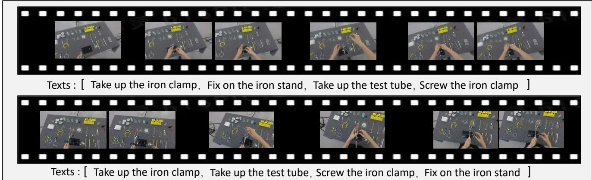  
Figure 1. Sequential Video. The samples come from CSV dataset. They describe two types of step schedule to accomplish the task of ”fix the test tube on the iron stand with iron clamp”. The upper process the step ”fix on the iron stand ” before the steps ”take up the test tube” and ”screw the iron clamp”. Diversely, the lower make the steps of ”take up the test tube” and ”screw the iron clamp” before the step ”fix on the iron stand ”. It can be seen that the order, time span and temporal location of sub-actions to accomplish the task are apparently different.

To overcome the unalignment issue between text and video and learn a satisfactory video representation, we propose a weakly supervised video representation learning pipeline and introduce a multiple granularity contrastive loss to constrain the model, which takes full account of the pseudo temporal alignment between frames and sentences. To be specific, we first extract video and text features from a CLIP-based vision-language model, and a global contrastive loss is designed to constrain the complete videoparagraph alignment. It constrains that a video will be closer to the sequence of the texts describing it while far away from the rest of the texts, and vice versa. Secondly, we introduce a fine-grained contrastive learning loss, which encourages the frame sequences of representations to be more similar to the neighbor sentence representations than the remote sentences in the same paragraph. The intuition behind this constraint comes from a basic idea: if the $s _ { j }$ is the corresponding sentence for frame $h _ { i } ,$ , the corresponding sentence for frame $h _ { i + 1 }$ is never before the $s _ { j }$ in sequence. Specifically, we take the probabilistic sample from the sentence-frame similarity metric. And we propose to apply the differentiable Gumbel-Softmax [22] tricks to generate predictions and propose three kinds of methods to generate the pseudo-labels that are based on the temporal relation of sentences in the temporal domain: 1) maximum-index sorting; 2) Viterbi algorithm [15]; 3) splitting. Finally, we calculate the Info-NCE contrastive loss based on the pseudo labels in order to guide the network to focus on the finegrained action matching in sequential videos.

To evaluate the effectiveness of our weakly supervised video representation method, we conduct extensive experiments on two downstream tasks: video verification in procedures and text-to-video matching. The results of experiments show that our approach outperforms other baselines by a significant margin and also demonstrates the great generalization of our model.

We summarize our contributions in three folds:

• We propose a novel weakly supervised video representation learning pipeline with unaligned text for sequential videos, which can learn powerful and semantic video-text representations.

• We design multiple granularity contrastive learning loss, including coarse-grained loss and fine-grained loss. Notably, we propose a novel method to implement the temporal alignment between frames and sentences.

• Our model also shows strong generalization ability to downstream tasks, such as video sequence verification for procedures in videos and text-to-video matching.

## 2. Related Works

Sequential Video. The same task described in videos may consist of several sequential sub-actions in different orders for a sequential video. Sequential videos are generally accompanied by explanations such as audio or caption. Various kinds of studies related to sequential videos are now in the ascendant. For example, COIN [48], Diving [28],

CSV [40], EPIC-KITCHENS [9], IKEA-ASM [2] and Assembly101 [43] provide videos composed by multiple sequential actions and the corresponding step annotations. [43] proposes a large-scale multi-view video dataset for understanding procedural activities, which is beneficial for the whole community. [40] defines the pioneering sequence verification task and designs a method based on the alignment of video pairs. However, the method is seriously dependent on video pairs of the same tasks. [30] learns to recognize procedural activities in sequential videos with distant supervision [37, 60]. [33] propose an action segmentation method using the set-supervised method for sequential videos. [24] employs temporal optimal transport to generate pseudo labels to complete joint representation learning and online clustering for sequential video alignment. D3TW [6] aligns clips and transcripts with differentiable continuous relaxation.

Vision-text Multi-modality Learning. Vision-text multimodality [4, 17, 36, 42, 45, 46, 52, 56, 63] has attracted increasing attention in computer vision communities over the recent year. One of the most representative works is CLIP [42], which is able to learn a powerful visual representation from natural language supervision with contrastive learning loss. Due to the strong zero-shot generalization ability of the method, a large number of follow-up works have been proposed [4,17,27,38,47,56,58]. VideoCLIP [58] presents a contrastive approach to pre-train a unified model with video-text pairs. X-CLIP [38] effectively expands the pretrained language-image model to video domains based on a cross-frame attention mechanism. However, these methods heavily rely on strong data augmentation and a large batch size. For downstream tasks, LocVTP [4] shows its transfer potentials on localization-based and retrieval-based tasks. CLIP4Clip [34] uses the pretrained CLIP as our backbone to solve the video clip retrieval task from frame-level input. [16] bridges video-text retrieval with multiple-choice questions. LF-VILA [47] applies a multi-modality temporal contrastive loss to implement long-form video-language pre-training, which heavily relies on the timestamp annotations of clip-sentence pairs.

Video Representation Learning. Learning good video representations has been heavily investigated in the literature. 3D convolution neural networks (3D-CNNs) are originally considered to learn deep video representations [5, 13, 50]. However, 3D-CNNs are limited to capturing long-term dependencies on the temporal domain with their insufficient receptive field. Due to the ability to capture long-term dependency of the self-attention mechanism [51], vision transformer models [3, 7, 11, 12, 21, 31, 32] show competitive performances against 3D-CNNs in video representation learning. Following the ViT [11], many related works emerge. TimeSformer [3] designs different selfattention schemes in the temporal-spatial domain. Video

Swin-Transformer [32] adopts the local attention in nonoverlapping shifted windows to lead to a better speedaccuracy trade-off. Over recent years, weakly supervised or self-supervised learning [7, 44] is popular for learning better video representation. Following SimCLR [8], [7] introduces a self-supervised contrastive transformer framework to learn frame-wise action representations. [29] proposes a transformer-based cross-modal architecture for zero-shot action recognition. Previous works mainly focus on shortform simple video representation, whereas representation learning of sequential video is underexplored.

## 3. Method

In this section, we first present the overall architecture of the proposed framework in Sec. 3.1. Then we explain the vision representation module and language representation module in Sec. 3.2, followed by the designed multiple granularity contrastive learning module in Sec. 3.3 and Sec. 3.4.

## 3.1. Overview

Fig. 2 displays the overview of our framework. Our framework consists of three parts: a vision representation module, a language representation module, and a multiple granularity contrastive learning module. In the vision representation module, which shows in the right part of the figure, we sample frames from an untrimmed sequence video as input and extract visual features with the pre-trained vision encoder (unfrozen). After that, we concatenate the visual feature and pass them into the Transformer encoder. The Transformer encoder implements the cross-frame communication with self-attention and outputs the frame representations, following ViT [11]. Additionally, the results from Transformer encoder are then passed through the MLP module to integrate the frame representations and obtain the video representation. In the left language representation module, a collection of text descriptions of procedures and the description of the entire video pass into the pre-trained language encoder (frozen) separately, then we can obtain the sentence representations and a paragraph representation. More explanation about the aforementioned modules is in Sec. 3.2. Finally, we introduce multiple granularity contrastive loss to restrict learned representations in crossmodel space.

## 3.2. Vision-Language Modules

As illustrated in Fig. 2, multi-level video representation and language representation are produced by the vision module and language module, respectively.

Vision module. Following [54], given an untrimmed sequence video, we uniformly split the raw video into N clips and randomly sample one frame per clip to form a sequence of N frames, $X = \{ x _ { 1 } , x _ { 2 } , . . . , x _ { N } \}$ . Then we feed the frame sequence X into the pre-trained vision encoder $E _ { v }$ to produce a sequence of feature maps $\{ f _ { 1 } , f _ { 2 } , \ldots , f _ { N } \}$ . This process can be denoted as $f _ { i } = E _ { v } ( x _ { i } ) , i \in [ 1 , 2 , \ldots , N ]$ After that, we prepend a learnable embedding $x _ { c l s }$ to the sequence of features, called [class] token [11]. Then as Eq. (1) shown, our method learns the frame representations by utilizing the transformer encoder (TE) to embed temporal and context information into frame representations $H = \{ h _ { 1 } , h _ { 2 } , \ldots , h _ { N } \}$

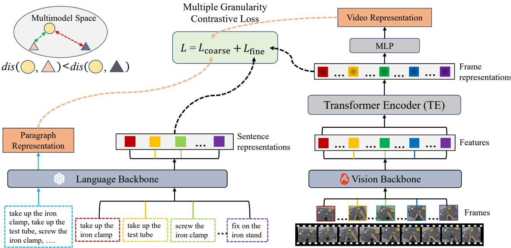  
Figure 2. Overview of our framework. Our framework consists of three parts: vision representation module, language representation module, multiple granularity loss module. In the vision representation module, we feed the frames sampled from the untrimmed sequentia video into the module, then obtain the frame representations and a video representation. In the language representation module, a collection of texts of procedures and the description of the entire video pass into the pre-trained language backbone separately, and we get th sentence representations and a paragraph representation. In addition, we introduce multiple granularity contrastive learning loss to restrict representations in cross-model space.

$$
H = \mathrm { T E } ( [ x _ { \mathrm { c l s } } , f _ { 1 } , f _ { 2 } , \dots , f _ { N } ] + e ^ { \mathsf { p o s } } )\tag{1}
$$

where $[ . , . ]$ concatenates the features of frames and $[ c l a s s ]$ token. And $e ^ { \mathsf { p o s } }$ represents the temporal position embedding of sequence.

At last, the MLP module, which consists of a full connection layer, takes all frame representations H as input and outputs a video representation v as follows:

$$
v = { \mathrm { M L P } } ( H )\tag{2}
$$

Language module. Specifically in our model, given a sequence of $K$ text descriptions of procedures ${ \boldsymbol { T } } =$ $\{ t _ { 1 } , t _ { 2 } , \ldots , t _ { K } \}$ , we first feed individual procedure texts into the frozen pre-trained language encoder E to produce sentence representations $\boldsymbol { S } = \{ s _ { 1 } , s _ { 2 } , . . . , s _ { K } \}$ . The process can be denoted as $s _ { i } = E _ { l } ( t _ { i } ) , i \in [ 1 , 2 , . . K ]$

In the meantime, we combine the sequence of text descriptions of procedures T into a single text description of the entire video. Then, the pre-trained language encoder $E _ { l }$ extract a paragraph-level language representation l as follows:

$$
l = E _ { l } ( [ t _ { 1 } , t _ { 2 } , \dots , t _ { K } ] )\tag{3}
$$

where [., .] represents simply the sequential concatenation of strings.

## 3.3. Coarse-grained Contrastive Loss

We first conduct contrastive learning at the videoparagraph level. Specifically, through the vision-language module that is explained in Sec. 3.2, we obtain a video representation V and paragraph representation $L ,$ where $\bar { V , L } ~ \in ~ \mathbb { R } ^ { 1 \times D }$ Then use one batch of data, $V =$ $\{ v _ { 1 } , v _ { 2 } , \ldots , v _ { N } \}$ $\textit { L } = \ \{ l _ { 1 } , l _ { 2 } , \ldots , l _ { N } \}$ , to calculate the loss.

After that, we formulate the global video-paragraph alignment into the standard contrastive framework [42] based on InfoNCE loss [39] as follows:

$$
L _ { \mathrm { I n f o N C E } } ( V , L ) = - \frac { 1 } { N } \sum _ { i = 1 } ^ { N } \log \frac { \exp { ( \varphi ( v _ { i } , l _ { i } ) / \tau ) } } { \sum _ { j = 1 } ^ { N } \exp { ( \varphi ( v _ { j } , l _ { j } ) / \tau ) } }\tag{4}
$$

$$
\varphi ( v _ { i } , l _ { i } ) = \frac { v _ { i } } { \Vert v _ { i } \Vert } \cdot \frac { l _ { i } ^ { T } } { \Vert l ^ { T } \Vert }\tag{5}
$$

where τ is the temperature parameter optimized during training [42]. And $\varphi ( . , . )$ represents the cosine similarity

function, and N is the number of video-text pairs. The $L _ { \mathrm { I n f o N C E } }$ represents the InfoNCE loss.

Last, as shown Eq. (6), we calculate symmetrically video-text and text-video loss by Eq. (4) to obtain the coarse-grained contrastive loss $L _ { \mathrm { c o a r s e } } .$

$$
L _ { \mathrm { c o a r s e } } = L _ { \mathrm { I n f o N C E } } ( V , L ) + L _ { \mathrm { I n f o N C E } } ( L , V )\tag{6}
$$

Showing in the upper left of Fig. 2, the coarse-grained global contrastive loss $L _ { \mathrm { c o a r s e } }$ restricts the representation in the cross-model latent space with video-paragraph level supervision.

## 3.4. Fine-grained Contrastive Loss

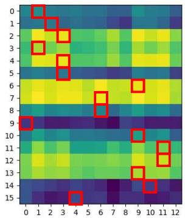  
(a) The Output of Gumbel-Softmax

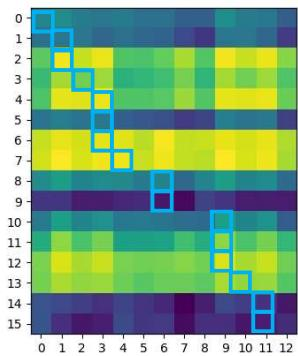  
(b) Maximum-index Sorting

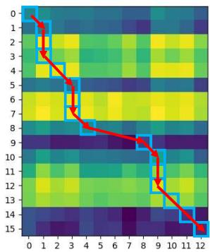  
(c) Viterbi Algorithm

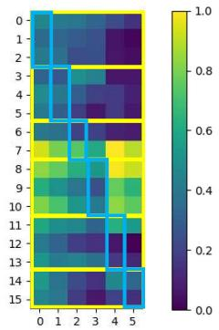  
(d) Splitting  
Figure 3. Visualization of fine-grained contrastive loss. The upper left figure shows the similarity matrix with Gumbel-Softmax. The other three figures show three kinds of pseudo-labels generation methods respectively: 1) maximum-index sorting; 2) Viterbi algorithm; 3) splitting.

Due to the lack of frame-level annotations, there is no annotation to locate the start frame and end frames per action. A frame can’t know its correct corresponding sentence. To overcome this problem, we propose an essential hypothesis based on the temporal relation between sentences and frames: if $s _ { j }$ is the corresponding sentence representation for the frame representation $h _ { i } ,$ the sentence representation for frame representation $h _ { i + 1 }$ should be in the set of $\{ s _ { j } , s _ { j + 1 } , s _ { j + 2 } , \ldots , s _ { K } \}$ and never in the set of $\{ s _ { 1 } , s _ { 2 } , \dotsc , s _ { j - 1 } \}$ . The visualization of fine-grained contrastive loss can be seen in Fig. 3.

Specifically, in our model, we first obtain the sequence of frame-level sequences of representations H and sequence of sentence-level representations S through the visionlanguage module. As Eq. (7) shows, we symmetrically calculate the fine-grained contrastive learning loss, named $L _ { f i n e } ,$ to achieve frame-sentence alignment.

$$
\begin{array} { r l } & { L _ { f i n e } = C E ( \psi _ { \mathrm { p r e d s } } ( H , S ) , \phi _ { \mathrm { p s e u d o } } ( H , S ) ) } \\ & { \phantom { a a a a a a a a a a a a a a a a a a a } + C E ( \psi _ { \mathrm { p r e d s } } ( S , H ) , \phi _ { \mathrm { p s e u d o } } ( S , H ) ) } \end{array}\tag{7}
$$

where CE is the Cross-Entropy loss. We use $\psi _ { \mathrm { p r e d s } }$ to predict the most related sentence $s _ { j }$ with one frame, where $s _ { j } \in S$ The $\phi _ { \mathrm { p s e u d o } }$ could utilize the probability distribution of prediction and the similarity matrix of H and S to generate the pseudo labels as ground truth. Then as Eq. (7) shown, we calculate $L _ { \mathrm { f i n e } }$ by the CE loss of the prediction and pseudo labels. And we separately introduce two methods of $\psi _ { \mathrm { p r e d s } }$ and $\phi _ { \mathrm { p s e u d o } }$ in Sec. 3.4.1 and Sec. 3.4.2. The method of Gumbel-Softmax with splitting is shown in Sec. 5.3.

## 3.4.1 Gumbel-Softmax with Sorting

We first use Eq. (5) to calculate the similarity matrix between the frame representations H and its sentence representations S. And we obtain the first prediction by Eq. (8).

$$
\psi _ { \mathrm { p r e d s } } ( H , S ) = \mathrm { G u m b e l - S o f t m a x } ( \varphi ( H , S ) )\tag{8}
$$

where Gumbel-Softmax is the straight-through Gumbel-Softmax function [22]. We utilize the Gumbel-Softmax to ensure the dispersed sampling from the original distribution can be calculated for the gradients in the backward pass. Then, we get the maximum index through arg max and sort the maximum-index list to an increasing order to generate pseudo labels. We regard them as the ground truth, which shows in Fig. 3b in blue. Finally, we finish the first kind of $\psi _ { \mathrm { p r e d s } }$ and $\phi _ { \mathrm { p s e u d o } }$ by Eqs. (8) and (9).

$$
\phi _ { \mathrm { p s e u d o } } ( H , S ) = \mathrm { s o r t } \left[ \operatorname * { a r g m a x } _ { i \in [ 1 , K ] } ( \psi _ { \mathrm { p r e d s } } ( H , S ) _ { N \times K } ) \right]\tag{9}
$$

## 3.4.2 Gumbel-Softmax with Viterbi

Following the Viterbi algorithm [15], it could generate the maximum a posteriori probability estimate, called the Viterbi path. The original Viterbi algorithm needs two important matrices: transition matrix and emission matrix. As shown in Eq. (11), we use the similarity of the language and vision features as the emission with the shape [N, K], where N means the number of sampled frames and K is the total number of its labels. Specifically in our method, as Eq. (10)shows, we use one upper triangular mask matrix as the transition matrix to limit the path of probability, which could make sure the way won’t go back. Based on the Viterbi path (shown in Fig. 3c), we obtain the pseudolabels by Eq. (12). Different from our method using Viterbi algorithm to generate pseudo labels, [23, 26] apply Viterbi decoding prediction, and activities have constant action orders. More details about the Viterbi algorithm can be seen in supplementary materials.

$$
{ \mathrm { T r a n s i t i o n ~ m a t r i x : } } A = { \left[ \begin{array} { l l l l } { { \frac { 1 } { n } } } & { \dots } & { { \frac { 1 } { n } } } \\ & { \ddots } & { \vdots } \\ { 0 } & & { { \frac { 1 } { n } } } \end{array} \right] } _ { N \times N }\tag{10}
$$

$$
\mathrm { E m i s s i o n \ m a t r i x : } B = \varphi ( H , S )\tag{11}
$$

$$
\phi _ { \mathrm { p s e u d o } } ( H , S ) = \mathrm { V i t e r b i } ( A , B )\tag{12}
$$

## 3.4.3 Training Loss

In conclusion, we train our module with the combination of the proposed coarse-grained contrastive loss and finegrained contrastive loss:

$$
L = L _ { \mathrm { c o a r s e } } + \lambda _ { 1 } L _ { \mathrm { f i n e } }\tag{13}
$$

where $\lambda _ { 1 }$ represents the weight of fine-grained contrastive loss.

## 4. Experiments

In this section, we first introduce the implementation details, evaluation benchmarks and evaluation metrics in Sec. 4.1. The experiments to verify the effectiveness of baselines for video-text representation learning are shown in Sec. 4.2. In addition, we also transfer our proposed framework to downstream sequence verification in Sec. 4.3 and text-to-video matching tasks in Sec. 4.4.

## 4.1. Experimental Details

Implementation Details. The vision backbone we employ is the pre-trained CLIP vision encoder based on ViT-B [11]. And the model is initialized adopting Kaiming and Xavier uniform initialization for different layers [18, 19]. In our module, the parameter of the vision backbone is unfrozen and finetuned when training. On the other hand, the language backbone is the pre-trained CLIP text encoder whose parameter is frozen totally. More implementation details can be seen in supplementary materials.

Datasets. We conduct experiments on the datasets COIN-SV, Diving-SV and CSV. COIN-SV is rearranged from COIN and composed of 36 tasks that contain more than 20 comprehensive instructional videos in the training dataset. Diving-SV is rearranged from Diving and contains 48 kinds of diving competition videos. And CSV [40] includes 45 procedures for training and 25 procedures for testing. In these datasets, all kinds of videos in the test set are unseen in the training set.

Testing phase. During inference, we apply the method that distinguishes positive pairs from negative pairs to evaluate the quality of learned video representations. Specifically in this paper, we calculate the normalized Euclidean distance between two video representations $v _ { 1 }$ and $v _ { 2 }$ in the same video pair:

$$
d = d i s ( v _ { 1 } , v _ { 2 } )\tag{14}
$$

$$
y = \left\{ \begin{array} { l l } { 1 , d \leq \tau } \\ { 0 , o t h e r w i s e } \end{array} \right.\tag{15}
$$

where $d i s ( . , . )$ means the ℓ2-normalization Euclidean distance function. τ is a threshold to decide whether the sequences are consistent. $y = 1$ means the two sequences of videos are consistent, otherwise inconsistent.

Evaluation Metrics. We adopt the Area Under ROC Curve (AUC) as the measurement for all of our experiments, which is commonly used to evaluate the performance in the field of anomaly detection [14] and face verification [10]. Higher AUC means better performance.

## 4.2. Comparison of baselines

Under weak supervision, the only annotations we know are the text descriptions of procedures, but the timestamps of actions and video task classification are unknown. The results of weakly supervised video sequence verification are shown in Tab. 1. We compare our method with other baselines, including 1) MIL-NCE [35]. 2) CAT, we change the SVIP [40] model architecture and add a text encoder to adapt to this task. 3) VideoSwin+MLP, we adopt the video swin transformer [32] as the vision encoder to extract frame features. 4) CLIP+Transformer Encoder+Pool. 5) CLIP+Transformer Encoder+MLP. To adapt to the task, we apply the CLIP text encoder as the text encoder of baselines except for MIL-NCE. Other methods but ours only calculate the coarse-grained contrastive loss.

<table><tr><td rowspan="2">Method</td><td rowspan="2">Text Encoder</td><td colspan="3">Weakly Supervised (w/o CLS)</td></tr><tr><td>CSV</td><td>Diving-SV</td><td>COIN-SV</td></tr><tr><td>MIL-NCE [35]</td><td>MLP [35]</td><td>53.02</td><td>58.49</td><td>47.95</td></tr><tr><td>CAT [40]</td><td></td><td>70.63</td><td>77.87</td><td>47.70</td></tr><tr><td>VideoSwin [32]+MLP</td><td>CLIP [42]</td><td>62.48</td><td>60.88</td><td>54.73</td></tr><tr><td>CLIP [42]+TE [11]+Pool</td><td></td><td>58.67</td><td>72.13</td><td>49.79</td></tr><tr><td>CLIP [42]+TE [11]+MLP</td><td></td><td>74.82</td><td>81.47</td><td>50.13</td></tr><tr><td>Ours</td><td>CLIP [42]</td><td>79.80</td><td>85.19</td><td>52.56</td></tr></table>

Table 1. Results of representation learning for weakly supervised video sequence verification task.

The results in Tab. 1 demonstrate that multiple granularity contrastive learning is effective for learning discriminative video representations under weak supervision.

## 4.3. Sequence Verification

Following the setting of sequence verification [40], we know the classification of videos but yet do not know the timestamp of actions. The testing results on sequence verification compared to other methods are shown in the Tab. 2. We can use class information for sequence verification of procedures in videos.

<table><tr><td rowspan="2">Method</td><td rowspan="2">Pre-train</td><td colspan="3">Supervised (w CLS)</td></tr><tr><td>CSV</td><td>Diving-SV</td><td>COIN-SV</td></tr><tr><td>MIL-NCE [35]</td><td>HowTo100M [36]</td><td>56.16</td><td>63.43</td><td>47.80</td></tr><tr><td>Swin [31]</td><td>K-400 [5]</td><td>54.06</td><td>73.10</td><td>43.70</td></tr><tr><td>TRN [62]</td><td>K-400 [5]</td><td>80.32</td><td>80.69</td><td>57.19</td></tr><tr><td>CAT [40]</td><td>K-400 [5]</td><td>83.02</td><td>83.11</td><td>51.13</td></tr><tr><td>CLIP [42]+TE [11]+MLP</td><td>CLIP [42]</td><td>79.38</td><td>83.48</td><td>48.50</td></tr><tr><td>Ours (weakly supervised)</td><td>CLIP [42]</td><td>79.80</td><td>85.19</td><td>52.56</td></tr><tr><td>Ours</td><td>CLIP [42]</td><td>86.92</td><td>86.09</td><td>59.57</td></tr></table>

Table 2. Results of downstream video sequence verification task under supervised setting.

For a fair comparison, some adjustments have been made to the architecture of our model in this task setting. Specifically, we add a classification layer on the top of the video representation and the classification loss to our model. Besides, we apply the adjusted video sequence alignment mechanism by ours and train with pair data that are the same as SVIP [40]. This adjusted model is named ”Ours”. In addition, we also compare with some state-of-the-art methods [31, 40, 62] of sequence verification and change some video-language pre-trained model [36] accordingly to adapt to this task. Weakly supervised means no classification information of tasks. To clarify the improvements from technical differences, we replace the visual backbone of CAT [40] with CLIP-ViT [42] to form CLIP+TE+MLP. Then, we improve performance by adjusting network structure, e.g., the position of SEQ loss. Observed Tab. 2, our model outperforms them by a notable margin on all the considered datasets. The results also demonstrate that the finegrained contrastive loss we proposed enforces the model to learn more discriminative representations. The results of our weakly supervised model, which surpasses other supervised methods, demonstrate our model’s excellent performance.

## 4.4. Text-to-Video Matching

Setting. We validate the performance of the video-language representations on text-to-video matching, which aims to find the correct video corresponding to a sequence of texts from a series of videos. Specifically, we train our model on the CSV dataset under weak supervision and test it on our proposed benchmark about text-to-video matching. This task evaluates the model’s ability to learn semantic and generalized video representations.

Benchmark. To better evaluate the text-to-video matching, we rearrange the test set of CSV [40] and propose a new scripted benchmark, named CSV-Matching. It has 800 text-video pairs. Each text-video pair is composed of one sequence of text descriptions of procedures and five videos. All of the videos describe the same task but hold different procedures. There is only one correct video matching the text descriptions in each pair. More details about the textto-matching benchmark will show in the supplementary materials.

The text-to-video matching results in Tab. 3 indicate that our method has the best performance. And due to data of CSV-Matching being unseen when training, it shows that our method has a more powerful generalization ability.

<table><tr><td rowspan="2">Method</td><td>Text-to-Video Matching</td></tr><tr><td>CSV-Matching</td></tr><tr><td>MIL-NCE [35]</td><td>60.02</td></tr><tr><td>CAT [40]</td><td>53.54</td></tr><tr><td>CLIP [42] +TE [11] +MLP</td><td>62.67</td></tr><tr><td>Ours</td><td>65.23</td></tr></table>

Table 3. Results of text-to-video matching task on our proposed benchmark CSV-Matching. We evaluate the results using AUC.

## 5. Analysis

In this section, we first analyze the impact of different backbones in Sec. 5.1. conduct comprehensive ablation studies of multiple granularity contrastive loss and pseudolabel generation in Secs. 5.2 and 5.3. Moreover, we analyze our limitations and broader impact.

## 5.1. Ablation of Backbone

As Tab. 4 shown, our method based on CLIP-ViT obtains the best performance compared with other backbones. In addition, results indicate that fine-grained and multi-grained losses improve performance under weak supervision and supervision, respectively.

<table><tr><td rowspan="2">Backbone</td><td rowspan="2">Pretrained</td><td colspan="3">Weakly Supervised (w/o CLS)</td><td colspan="2">Supervised (w CLS)</td></tr><tr><td> $L _ { \mathrm { c o a r s e } }$ </td><td>Lfine</td><td>CSV</td><td> $\overline { { L _ { \mathrm { c o a r s e } } + L _ { \mathrm { f i n e } } } }$ </td><td>CSV</td></tr><tr><td rowspan="2">ResNet50 [20]</td><td>ImageNet-1K</td><td>√</td><td>X</td><td>76.22</td><td>x</td><td>78.83</td></tr><tr><td></td><td></td><td>√</td><td>78.32</td><td>√</td><td>81.00</td></tr><tr><td rowspan="2">ViT-B/32 [11]</td><td>ImageNet-21K</td><td>√</td><td>X √</td><td>73.88 75.18</td><td>x √</td><td>81.66 82.11</td></tr><tr><td></td><td></td><td></td><td></td><td></td><td></td></tr><tr><td rowspan="2">CLIP-ViT [42] (Ours)</td><td>Text-Image Pair</td><td>√</td><td>X</td><td>78.49</td><td>x</td><td>83.58</td></tr><tr><td></td><td></td><td>√</td><td>79.80</td><td>√</td><td>86.92</td></tr></table>

Table 4. Results of our method with different backbone on CSV.

## 5.2. Ablation of Multiple Granularity Contrastive Loss

In this section, we conduct comprehensive ablation studies to investigate the effects of our multiple granularity contrastive loss. To better demonstrate the superiority of our method, we present the loss ablation experiments on the sequence verification task under supervision with classification in Tab. 5. As shown, both coarse-grained contrastive loss $L _ { \mathrm { c o a r s e } }$ and fine-grained loss $L _ { \mathrm { f i n e } }$ are crucial. Specifically, the method with coarse-grained and fine-grained contrastive loss surpasses the method without them by 3.34%.

<table><tr><td>Method</td><td> $\overline { { L _ { \mathrm { f i n e } } } }$ </td><td> $L _ { \mathrm { c o a r s e } }$ </td><td>CSV</td></tr><tr><td rowspan="4">Ours (w CLS)</td><td>X</td><td>X</td><td>83.58</td></tr><tr><td>√</td><td>X</td><td>84.85</td></tr><tr><td>x</td><td>√</td><td>84.32</td></tr><tr><td>√</td><td>√</td><td>86.92</td></tr></table>

Table 5. Ablation studies of our proposed multiple granularity contrastive loss on CSV. To verify the effectiveness of $L _ { \mathrm { f i n e } }$ and $L _ { \mathrm { c o a r s e } }$ separately, we conduct experiments on video verification task.

Introducing the fine-grained loss $L _ { \mathrm { f i n e } }$ brings 2.6% performance improvement compared to only using coarsegrained contrastive loss $L _ { \mathrm { c o a r s e } } .$ . Comparing only uses $L _ { \mathrm { c o a r s e } }$ or uses $L _ { \mathrm { f i n e } } .$ , the result indicates that the model training with more fine-grained information is better than coarse information. By restricting the video representation to framesentence level latent space, the fine-grained contrastive loss can help the model learn more discriminative video representations.

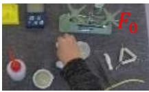

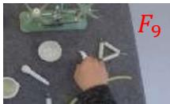

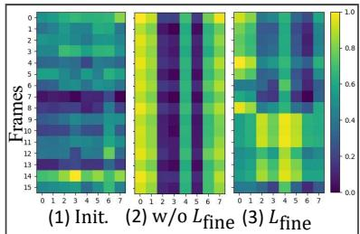

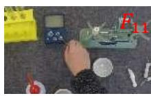

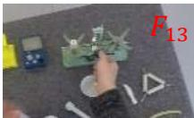  
Figure 4. Visualization of ablation study about fine-grained contrastive loss.

0: take up the rubber stopper   
1: put down the rubber stopper   
2: take up the tweezer   
3: clamp the tweezer   
4: put down the weight   
5: put down the tweezer   
6: screw the knob   
7: move the vernier

The visualization of the ablation study about fine-grained loss, as shown in Fig. 4, illustrates fine-grained contrastive loss implements the alignment between frames and sentences.

## 5.3. Ablation of the Pseudo-Label Generation

Splitting. Splitting means we split the sequence of frame representations or sentence representations uniformly into several parts to keep the sequence length of frame representations or sentence representations equal. The values belonging to the same part will be added and then averaged. After that, we get a square matrix and output probability distribution of prediction. The elements along the diagonal are regarded as pseudo labels. Then calculate the finegrained contrastive loss as Eq. (7). This process is shown in Fig. 3d, and the blue boxes represent the pseudo-labels.

<table><tr><td rowspan=1 colspan=1>Method</td><td rowspan=1 colspan=1> $L _ { \mathrm { f i n e } }$ </td><td rowspan=1 colspan=1>Pseudo-label generation</td><td rowspan=1 colspan=1>CSV</td></tr><tr><td rowspan=2 colspan=1>Ours</td><td rowspan=1 colspan=1> $\boldsymbol { x }$ </td><td rowspan=1 colspan=1> $\boldsymbol { x }$ </td><td rowspan=1 colspan=1>74.82</td></tr><tr><td rowspan=1 colspan=1> $\checkmark$ </td><td rowspan=1 colspan=1>splitviterbisort</td><td rowspan=1 colspan=1>72.7578.4679.80</td></tr></table>

Table 6. Ablation studies of the type of pseudo-label generation on our proposed method.

We conduct ablation studies about three methods of pseudo-label generation in the fine-grained loss $L _ { \mathrm { f i n e } }$ showing in Tab. 6. Specifically, we validate the effectiveness of different kinds of coarse-grained contrastive loss on the weakly supervised video verification task. The results show the algorithms of maximum-index sorting and Viterbi are performing better than splitting. The method of splitting matrices into several parts and aligning sequences along the diagonal is too simple and crude .

Broader Impact and Limitations. In realistic sequential videos, sub-actions could be repeated. It could mislead the model to generate biased pseudo-labels and lead to the deterioration of performance.More analysis can be seen in supplementary materials. Moreover, the proposed method will likely be applied to behavior detection, healthcare, online education, industrial generation, etc.

## 6. Conclusions

In this paper, we propose a novel framework of weakly supervised video representation learning for sequential videos. Borrowing the multi-modal contrastive learning from CLIP, our method can learn video representation with unaligned text and video without relying on the accurate time-stamp level text-video annotation. We propose a multiple granularity loss where the video-paragraph contrastive loss constrains the matching between the whole video and the complete script, and a fine-grained frame-sentence contrastive loss constrains the matching between each action and its descriptions. We also propose to generate pseudo labels with temporal consistency in video and text. Experiments results show that our design is effective, and our method achieves state-of-the-art performance when transferred to downstream video sequence verification and textto-video matching tasks.

## Acknowledgements.

The work was supported by National Key R&D Program of China (2018AAA0100704), NSFC #61932020, #62172279, Science and Technology Commission of Shanghai Municipality (Grant No. 20ZR1436000), and “Shuguang Program” supported by Shanghai Education Development Foundation and Shanghai Municipal Education Commission.

## References

[1] Nadine Behrmann, S Alireza Golestaneh, Zico Kolter, Juergen Gall, and Mehdi Noroozi. Unified fully and timestamp supervised temporal action segmentation via sequence to sequence translation. In European Conference on Computer Vision, pages 52–68. Springer, 2022. 1, 2

[2] Yizhak Ben-Shabat, Xin Yu, Fatemeh Saleh, Dylan Campbell, Cristian Rodriguez-Opazo, Hongdong Li, and Stephen Gould. The ikea asm dataset: Understanding people assembling furniture through actions, objects and pose. In Proceedings of the IEEE/CVF Winter Conference on Applications ofComputer Vision, pages 847–859, 2021. 3

[3] Gedas Bertasius, Heng Wang, and Lorenzo Torresani. Is space-time attention all you need for video understanding? In ICML, volume 2, page 4, 2021. 3

[4] Meng Cao, Tianyu Yang, Junwu Weng, Can Zhang, Jue Wang, and Yuexian Zou. Locvtp: Video-text pre-training for temporal localization. arXiv preprint arXiv:2207.10362, 2022. 1, 3

[5] Joao Carreira and Andrew Zisserman. Quo vadis, action recognition? a new model and the kinetics dataset. In proceedings of the IEEE Conference on Computer Vision and Pattern Recognition, pages 6299–6308, 2017. 1, 3, 7

[6] Chien-Yi Chang, De-An Huang, Yanan Sui, Li Fei-Fei, and Juan Carlos Niebles. D3tw: Discriminative differentiable dynamic time warping for weakly supervised action alignment and segmentation. In Proceedings of the IEEE/CVF Conference on Computer Vision and Pattern Recognition, pages 3546–3555, 2019. 3

[7] Minghao Chen, Fangyun Wei, Chong Li, and Deng Cai. Frame-wise action representations for long videos via sequence contrastive learning. In Proceedings of the IEEE/CVF Conference on Computer Vision and Pattern Recognition, pages 13801–13810, 2022. 3

[8] Ting Chen, Simon Kornblith, Mohammad Norouzi, and Geoffrey Hinton. A simple framework for contrastive learning of visual representations. In International conference on machine learning, pages 1597–1607. PMLR, 2020. 3

[9] Dima Damen, Hazel Doughty, Giovanni Maria Farinella, Sanja Fidler, Antonino Furnari, Evangelos Kazakos, Davide Moltisanti, Jonathan Munro, Toby Perrett, Will Price, et al. Scaling egocentric vision: The epic-kitchens dataset. In Proceedings of the European Conference on Computer Vision (ECCV), pages 720–736, 2018. 3

[10] Jiankang Deng, Jia Guo, Niannan Xue, and Stefanos Zafeiriou. Arcface: Additive angular margin loss for deep face recognition. In Proceedings of the IEEE/CVF Conference on Computer Vision and Pattern Recognition (CVPR), June 2019. 6

[11] Alexey Dosovitskiy, Lucas Beyer, Alexander Kolesnikov, Dirk Weissenborn, Xiaohua Zhai, Thomas Unterthiner, Mostafa Dehghani, Matthias Minderer, Georg Heigold, Sylvain Gelly, et al. An image is worth 16x16 words: Transformers for image recognition at scale. arXiv preprint arXiv:2010.11929, 2020. 3, 4, 6, 7

[12] Haoqi Fan, Bo Xiong, Karttikeya Mangalam, Yanghao Li, Zhicheng Yan, Jitendra Malik, and Christoph Feichten-

hofer. Multiscale vision transformers. In Proceedings of the IEEE/CVF International Conference on Computer Vision, pages 6824–6835, 2021. 3

[13] Christoph Feichtenhofer, Haoqi Fan, Jitendra Malik, and Kaiming He. Slowfast networks for video recognition. In Proceedings of the IEEE/CVF international conference on computer vision, pages 6202–6211, 2019. 3

[14] Jia-Chang Feng, Fa-Ting Hong, and Wei-Shi Zheng. Mist: Multiple instance self-training framework for video anomaly detection. In Proceedings of the IEEE/CVF conference on computer vision and pattern recognition, pages 14009– 14018, 2021. 6

[15] G David Forney. The viterbi algorithm. Proceedings of the IEEE, 61(3):268–278, 1973. 2, 5

[16] Yuying Ge, Yixiao Ge, Xihui Liu, Dian Li, Ying Shan, Xiaohu Qie, and Ping Luo. Bridgeformer: Bridging videotext retrieval with multiple choice questions. arXiv preprint arXiv:2201.04850, 2022. 1, 3

[17] Tengda Han, Weidi Xie, and Andrew Zisserman. Temporal alignment networks for long-term video. In Proceedings of the IEEE/CVF Conference on Computer Vision and Pattern Recognition, pages 2906–2916, 2022. 1, 3

[18] Kaiming He, Xinlei Chen, Saining Xie, Yanghao Li, Piotr Dollar, and Ross Girshick. Masked autoencoders are scalable´ vision learners. In Proceedings of the IEEE/CVF Conference on Computer Vision and Pattern Recognition, pages 16000– 16009, 2022. 6

[19] Kaiming He, Xiangyu Zhang, Shaoqing Ren, and Jian Sun. Delving deep into rectifiers: Surpassing human-level performance on imagenet classification. In Proceedings of the IEEE international conference on computer vision, pages 1026–1034, 2015. 6

[20] Kaiming He, Xiangyu Zhang, Shaoqing Ren, and Jian Sun. Deep residual learning for image recognition. In Proceedings ofthe IEEE conference on computer vision and pattern recognition, pages 770–778, 2016. 7

[21] Huazhang Hu, Sixun Dong, Yiqun Zhao, Dongze Lian, Zhengxin Li, and Shenghua Gao. Transrac: Encoding multiscale temporal correlation with transformers for repetitive action counting. In Proceedings of the IEEE/CVF Conference on Computer Vision and Pattern Recognition, pages 19013–19022, 2022. 3

[22] Eric Jang, Shixiang Gu, and Ben Poole. Categorical reparameterization with gumbel-softmax. arXiv preprint arXiv:1611.01144, 2016. 2, 5

[23] Anna Kukleva, Hilde Kuehne, Fadime Sener, and Jurgen Gall. Unsupervised learning of action classes with continuous temporal embedding. In Proceedings ofthe IEEE/CVF Conference on Computer Vision and Pattern Recognition, pages 12066–12074, 2019. 6

[24] Sateesh Kumar, Sanjay Haresh, Awais Ahmed, Andrey Konin, M Zeeshan Zia, and Quoc-Huy Tran. Unsupervised action segmentation by joint representation learning and online clustering. In Proceedings ofthe IEEE/CVF Conference on Computer Vision and Pattern Recognition, pages 20174– 20185, 2022. 3

[25] Colin Lea, Michael D Flynn, Rene Vidal, Austin Reiter, and Gregory D Hager. Temporal convolutional networks for action segmentation and detection. In proceedings ofthe IEEE Conference on Computer Vision and Pattern Recognition, pages 156–165, 2017. 1

[26] Jun Li and Sinisa Todorovic. Action shuffle alternating learning for unsupervised action segmentation. In Proceedings of the IEEE/CVF Conference on Computer Vision and Pattern Recognition, pages 12628–12636, 2021. 6

[27] Manling Li, Ruochen Xu, Shuohang Wang, Luowei Zhou, Xudong Lin, Chenguang Zhu, Michael Zeng, Heng Ji, and Shih-Fu Chang. Clip-event: Connecting text and images with event structures. In Proceedings ofthe IEEE/CVF Conference on Computer Vision and Pattern Recognition, pages 16420–16429, 2022. 3

[28] Yingwei Li, Yi Li, and Nuno Vasconcelos. Resound: Towards action recognition without representation bias. In Proceedings of the European Conference on Computer Vision (ECCV), pages 513–528, 2018. 2

[29] Chung-Ching Lin, Kevin Lin, Lijuan Wang, Zicheng Liu, and Linjie Li. Cross-modal representation learning for zeroshot action recognition. In Proceedings of the IEEE/CVF Conference on Computer Vision and Pattern Recognition, pages 19978–19988, 2022. 3

[30] Xudong Lin, Fabio Petroni, Gedas Bertasius, Marcus Rohrbach, Shih-Fu Chang, and Lorenzo Torresani. Learning to recognize procedural activities with distant supervision. In Proceedings of the IEEE/CVF Conference on Computer Vision and Pattern Recognition, pages 13853–13863, 2022. 3

[31] Ze Liu, Yutong Lin, Yue Cao, Han Hu, Yixuan Wei, Zheng Zhang, Stephen Lin, and Baining Guo. Swin transformer: Hierarchical vision transformer using shifted windows. In Proceedings of the IEEE/CVF International Conference on Computer Vision, pages 10012–10022, 2021. 3, 7

[32] Ze Liu, Jia Ning, Yue Cao, Yixuan Wei, Zheng Zhang, Stephen Lin, and Han Hu. Video swin transformer. In Proceedings of the IEEE/CVF Conference on Computer Vision and Pattern Recognition, pages 3202–3211, 2022. 3, 6

[33] Zijia Lu and Ehsan Elhamifar. Set-supervised action learning in procedural task videos via pairwise order consistency. In Proceedings of the IEEE/CVF Conference on Computer Vision and Pattern Recognition, pages 19903–19913, 2022. 3

[34] Huaishao Luo, Lei Ji, Ming Zhong, Yang Chen, Wen Lei, Nan Duan, and Tianrui Li. Clip4clip: An empirical study of clip for end to end video clip retrieval and captioning. Neurocomputing, 508:293–304, 2022. 3

[35] Antoine Miech, Jean-Baptiste Alayrac, Lucas Smaira, Ivan Laptev, Josef Sivic, and Andrew Zisserman. End-to-end learning of visual representations from uncurated instructional videos. In Proceedings of the IEEE/CVF Conference on Computer Vision and Pattern Recognition, pages 9879– 9889, 2020. 6, 7

[36] Antoine Miech, Dimitri Zhukov, Jean-Baptiste Alayrac, Makarand Tapaswi, Ivan Laptev, and Josef Sivic. Howto100m: Learning a text-video embedding by watching

hundred million narrated video clips. In Proceedings of the IEEE/CVF International Conference on Computer Vision, pages 2630–2640, 2019. 3, 7

[37] Mike Mintz, Steven Bills, Rion Snow, and Dan Jurafsky. Distant supervision for relation extraction without labeled data. In Proceedings of the Joint Conference of the 47th Annual Meeting of the ACL and the 4th International Joint Conference on Natural Language Processing of the AFNLP, pages 1003–1011, 2009. 3

[38] Bolin Ni, Houwen Peng, Minghao Chen, Songyang Zhang, Gaofeng Meng, Jianlong Fu, Shiming Xiang, and Haibin Ling. Expanding language-image pretrained models for general video recognition. In European Conference on Computer Vision, pages 1–18. Springer, 2022. 3

[39] Aaron van den Oord, Yazhe Li, and Oriol Vinyals. Representation learning with contrastive predictive coding. arXiv preprint arXiv:1807.03748, 2018. 4

[40] Yicheng Qian, Weixin Luo, Dongze Lian, Xu Tang, Peilin Zhao, and Shenghua Gao. Svip: Sequence verification for procedures in videos. In Proceedings of the IEEE/CVF Conference on Computer Vision and Pattern Recognition, pages 19890–19902, 2022. 3, 6, 7

[41] Fang Qingyun, Han Dapeng, and Wang Zhaokui. Crossmodality fusion transformer for multispectral object detection. arXiv preprint arXiv:2111.00273, 2021. 1

[42] Alec Radford, Jong Wook Kim, Chris Hallacy, Aditya Ramesh, Gabriel Goh, Sandhini Agarwal, Girish Sastry, Amanda Askell, Pamela Mishkin, Jack Clark, et al. Learning transferable visual models from natural language supervision. In International Conference on Machine Learning, pages 8748–8763. PMLR, 2021. 1, 3, 4, 6, 7

[43] Fadime Sener, Dibyadip Chatterjee, Daniel Shelepov, Kun He, Dipika Singhania, Robert Wang, and Angela Yao. Assembly101: A large-scale multi-view video dataset for understanding procedural activities. In Proceedings of the IEEE/CVF Conference on Computer Vision and Pattern Recognition, pages 21096–21106, 2022. 3

[44] Kaitao Song, Xu Tan, Tao Qin, Jianfeng Lu, and Tie-Yan Liu. Mpnet: Masked and permuted pre-training for language understanding. Advances in Neural Information Processing Systems, 33:16857–16867, 2020. 3

[45] Chen Sun, Fabien Baradel, Kevin Murphy, and Cordelia Schmid. Learning video representations using contrastive bidirectional transformer. arXiv preprint arXiv:1906.05743, 2019. 3

[46] Chen Sun, Austin Myers, Carl Vondrick, Kevin Murphy, and Cordelia Schmid. Videobert: A joint model for video and language representation learning. In Proceedings of the IEEE/CVF International Conference on Computer Vision, pages 7464–7473, 2019. 3

[47] Yuchong Sun, Hongwei Xue, Ruihua Song, Bei Liu, Huan Yang, and Jianlong Fu. Long-form video-language pretraining with multimodal temporal contrastive learning. arXiv preprint arXiv:2210.06031, 2022. 1, 3

[48] Yansong Tang, Dajun Ding, Yongming Rao, Yu Zheng, Danyang Zhang, Lili Zhao, Jiwen Lu, and Jie Zhou. Coin: A large-scale dataset for comprehensive instructional video

analysis. In Proceedings of the IEEE/CVF Conference on Computer Vision and Pattern Recognition, pages 1207– 1216, 2019. 2

[49] Du Tran, Lubomir Bourdev, Rob Fergus, Lorenzo Torresani, and Manohar Paluri. Learning spatiotemporal features with 3d convolutional networks. In Proceedings of the IEEE international conference on computer vision, pages 4489–4497, 2015. 1

[50] Du Tran, Heng Wang, Lorenzo Torresani, Jamie Ray, Yann LeCun, and Manohar Paluri. A closer look at spatiotemporal convolutions for action recognition. In Proceedings of the IEEE conference on Computer Vision and Pattern Recognition, pages 6450–6459, 2018. 3

[51] Ashish Vaswani, Noam Shazeer, Niki Parmar, Jakob Uszkoreit, Llion Jones, Aidan N Gomez, Łukasz Kaiser, and Illia Polosukhin. Attention is all you need. Advances in neural information processing systems, 30, 2017. 3

[52] Jue Wang, Gedas Bertasius, Du Tran, and Lorenzo Torresani. Long-short temporal contrastive learning of video transformers. In Proceedings of the IEEE/CVF Conference on Computer Vision and Pattern Recognition, pages 14010–14020, 2022. 3

[53] Limin Wang, Yuanjun Xiong, Zhe Wang, Yu Qiao, Dahua Lin, Xiaoou Tang, and Luc Van Gool. Temporal segment networks: Towards good practices for deep action recognition. In European conference on computer vision, pages 20–36. Springer, 2016. 1

[54] Limin Wang, Yuanjun Xiong, Zhe Wang, Yu Qiao, Dahua Lin, Xiaoou Tang, and Luc Van Gool. Temporal segment networks: Towards good practices for deep action recognition. In European conference on computer vision, pages 20–36. Springer, 2016. 3

[55] Limin Wang, Yuanjun Xiong, Zhe Wang, Yu Qiao, Dahua Lin, Xiaoou Tang, and Luc Van Gool. Temporal segment networks for action recognition in videos. IEEE transactions on pattern analysis and machine intelligence, 41(11):2740– 2755, 2018. 1

[56] Mengmeng Wang, Jiazheng Xing, and Yong Liu. Actionclip: A new paradigm for video action recognition. arXiv preprint arXiv:2109.08472, 2021. 3

[57] Hu Xu, Gargi Ghosh, Po-Yao Huang, Prahal Arora, Masoumeh Aminzadeh, Christoph Feichtenhofer, Florian Metze, and Luke Zettlemoyer. Vlm: Task-agnostic videolanguage model pre-training for video understanding. arXiv preprint arXiv:2105.09996, 2021. 1

[58] Hu Xu, Gargi Ghosh, Po-Yao Huang, Dmytro Okhonko, Armen Aghajanyan, Florian Metze, Luke Zettlemoyer, and Christoph Feichtenhofer. Videoclip: Contrastive pre-training for zero-shot video-text understanding. arXiv preprint arXiv:2109.14084, 2021. 1, 3

[59] Jiahui Yu, Zirui Wang, Vijay Vasudevan, Legg Yeung, Mojtaba Seyedhosseini, and Yonghui Wu. Coca: Contrastive captioners are image-text foundation models. arXiv preprint arXiv:2205.01917, 2022. 1

[60] Daojian Zeng, Kang Liu, Yubo Chen, and Jun Zhao. Distant supervision for relation extraction via piecewise convolutional neural networks. In Proceedings ofthe 2015 confer-

ence on empirical methods in natural language processing, pages 1753–1762, 2015. 3

[61] Yanan Zhang, Jiaxin Chen, and Di Huang. Cat-det: Contrastively augmented transformer for multi-modal 3d object detection. In Proceedings of the IEEE/CVF Conference on Computer Vision and Pattern Recognition, pages 908–917, 2022. 1

[62] Bolei Zhou, Alex Andonian, Aude Oliva, and Antonio Torralba. Temporal relational reasoning in videos. In Proceedings ofthe European conference on computer vision (ECCV), pages 803–818, 2018. 7

[63] Linchao Zhu and Yi Yang. Actbert: Learning global-local video-text representations. In Proceedings of the IEEE/CVF conference on computer vision and pattern recognition, pages 8746–8755, 2020. 1, 3