# ÓÑÌæ Ó¿­µ»¼ Ñ°¬·³¿´ Ì®¿²­°±®¬ º±® ﮬ·¿´ ܱ³¿·² ß¼¿°¬¿¬·±²

DZ«óÉ»· Ô«± ݸ«¿²óÈ·¿² λ²

ͽ¸±±´ ±º Ó¿¬¸»³¿¬·½­ô Í«² Ç¿¬óÍ»² ˲·ª»®­·¬§ô ݸ·²¿

´«±§©îè೿·´îò­§­«ò»¼«ò½²ô ®½¸«¿²¨à³¿·´ò­§­«ò»¼«ò½²

## ß¾­¬®¿½¬

ß­ ¿² ·³°±®¬¿²¬ ³»¬¸±¼±´±¹§ ¬± ³»¿­«®» ¼·­¬®·¾«¬·±² ¼·­½®»°¿²½§ô ±°¬·³¿´ ¬®¿²­°±®¬ øÑÌ÷ ¸¿­ ¾»»² ­«½½»­­º«´´§ ¿°°´·»¼ ¬± ´»¿®² ¹»²»®¿´·¦¿¾´» ª·­«¿´ ³±¼»´­ «²¼»® ½¸¿²¹ó ·²¹ »²ª·®±²³»²¬­ò ر©»ª»®ô ¬¸»®» ¿®» ­¬·´´ ´·³·¬¿¬·±²­ô ·²ó ½´«¼·²¹ ­¬®·½¬ °®·±® ¿­­«³°¬·±² ¿²¼ ·³°´·½·¬ ¿´·¹²³»²¬ô º±® ½«®®»²¬ ÑÌ ³±¼»´·²¹ ·² ½¸¿´´»²¹·²¹ ®»¿´ó©±®´¼ ­½»²¿®·±­ ´·µ» °¿®¬·¿´ ¼±³¿·² ¿¼¿°¬¿¬·±²ô ©¸»®» ¬¸» ´»¿®²»¼ ¬®¿²­ó °±®¬ °´¿² ³¿§ ¾» ¾·¿­»¼ ¿²¼ ²»¹¿¬·ª» ¬®¿²­º»® ·­ ·²»ª·¬¿¾´» ̸«­ô ·¬ ·­ ²»½»­­¿®§ ¬± »¨°´±®» ¿ ³±®»º»¿­·¾´» ÑÌ ³»¬¸±¼ó ±´±¹§ º±® ®»¿´ó©±®´¼ ¿°°´·½¿¬·±²­ò ײ ¬¸·­ ©±®µô ©» º±ó ½«­ ±² ¬¸» ®·¹±®±«­ ÑÌ ³±¼»´·²¹ º±® ½±²¼·¬·±²¿´ ¼·­¬®·¾«ó ¬·±² ³¿¬½¸·²¹ ¿²¼ ´¿¾»´ ­¸·º¬ ½±®®»½¬·±²ò ß ²±ª»´ ³¿­µ»¼ ÑÌ øÓÑÌ÷ ³»¬¸±¼±´±¹§ ±² ½±²¼·¬·±²¿´ ¼·­¬®·¾«¬·±²­ ·­ °®±ó posed by defining a mask operation with label information. Ú«®¬¸»®ô ¿ ®»´¿¨»¼ ¿²¼ ®»©»·¹¸¬·²¹º±®³«´¿¬·±² ·­ °®±°±­»¼ ¬± ·³°®±ª» ¬¸» ®±¾«­¬²»­­ ±º ÑÌ ·² »¨¬®»³» ­½»²¿®·±­ò É» °®±ª» ¬¸» ¬¸»±®»¬·½¿´ »¯«·ª¿´»²½» ¾»¬©»»² ½±²¼·¬·±²¿´ ÑÌ and MOT, which implies the well-defined MOT serves as a ½±³°«¬¿¬·±²óº®·»²¼´§ °®±¨§ò Û¨¬»²­·ª» »¨°»®·³»²¬­ ª¿´·¼¿¬» ¬¸» »ºº»½¬·ª»²»­­ ±º ¬¸»±®»¬·½¿´ ®»­«´¬­ ¿²¼ °®±°±­»¼ ³±¼»´

## ïò ײ¬®±¼«½¬·±²

Ú±® ®»¿´ó©±®´¼ ª·­«¿´ ¼¿¬¿ ·² «²½±²­¬®¿·²»¼ »²ª·®±²ó ³»²¬­ô ¼»¬»½¬·²¹ ¬¸» ­¸·º¬ ±º ¼¿¬¿ ¼·­¬®·¾«¬·±²­ ¿²¼ ³»¿ó ­«®·²¹ ¬¸» ­¬¿¬·­¬·½¿´ ¼·­½®»°¿²½§ ¿®» »­­»²¬·¿´ °®±¾´»³­ º±® ´»¿®²·²¹ ¹»²»®¿´·¦¿¾´» ³±¼»´ Åîçô íðô ëïÃò ݱ²­·¼»®¿¾´» efforts have been made to build well-defined metrics on ¼·­¬®·¾«¬·±²­ô ©¸»®» ¬¸» ±°¬·³¿´ ¬®¿²­°±®¬ øÑÌ÷ ¾¿­»¼ ¼·­ó tances have shown significant advantages in sample-wise ½±®®»´¿¬·±² ½¸¿®¿½¬»®·¦¿¬·±² ¿²¼ ¹»±³»¬®·½ ·²¬»®°®»¬¿¾·´·¬§ ÅêôéôçôïïôïîôîìôîéÃò ˲¼»® ¬¸» ¹«¿®¿²¬»»­ ±º ¿°°»¿´·²¹ ¬¸»ó ±®»¬·½¿´ °®±°»®¬·»­ô ÑÌ󾿭»¼ ³±¼«´»­ Åèô ïðô ïïô ïêô îðô îìà ¿®» »¨¬»²­·ª»´§ »¨°´±®»¼ ¬± ´»¿®² ¬¸» ¬®¿²­º»®®¿¾´» ³±¼»´ó ­ò ̸»­» ¿¼ª¿²½»¼ ³±¼»´­ ¸¿ª» ¿´­± ¾»»² ­«½½»­­º«´´§ ¿°ó °´·»¼ ¬± ¬¸» ½±³°«¬»® ª·­·±² ¿²¼ °¿¬¬»®² ®»½±¹²·¬·±² ¬¿­µ­ ·² changing environments, e.g., object classification [31, 39], ­»³¿²¬·½ ­»¹³»²¬¿¬·±² Åëîà ¿²¼ ³»¼·½¿´ ·³¿¹»­ ÅìîÃò

ß ¬§°·½¿´ ­½»²¿®·± º±® ´»¿®²·²¹ «²¼»® ¼·­¬®·¾«¬·±² ­¸·º¬ ·­ µ²±©² ¿­ ¼±³¿·² ¿¼¿°¬¿¬·±² øÜß÷ô ©¸»®» ¬¸» ³±¼»´ ¬®¿·²»¼ ±² ¬¸» ´¿¾»´»¼ ­±«®½» ¼±³¿·² ·­ »¨°»½¬»¼ ¬± ¾» ¬®¿²­ó º»®®¿¾´» ¬± «²´¿¾»´»¼ ¬¿®¹»¬ ¼±³¿·² ©·¬¸ ¼·ºº»®»²¬ ¼¿¬¿ ¼·­ó ¬®·¾«¬·±² ò ײ Üßô ­±«®½» ¼±³¿·² ¿²¼ ¬¿®¹»¬ ¼±³¿·² ­¸¿®» ¬¸» ­¿³» ´¿¾»´ ­°¿½» ô ¬¸»² ·²­°·®»¼ ¾§ ¼·­¬®·¾«¬·±² ¿¼¿°ó ¬¿¬·±² ¬¸»±®§ Åïô ìèÃô ¬¸» ÑÌ󾿭»¼ ³±¼»´­ «­«¿´´§ º±½«­ ±² ´»¿®²·²¹ ·²ª¿®·¿²¬ °®±°»®¬·»­ô »ò¹òô ³¿®¹·²¿´ ·²ª¿®·¿²¬ ®»°®»ó ­»²¬¿¬·±²­ Åèô ïïô îèÃô ¿¼ª»®­¿®·¿´ ·²ª¿®·¿²¬ ®»°®»­»²¬¿¬·±²ó ­ ÅïêÃô ½±²¼·¬·±²¿´ ·²ª¿®·¿²¬ ®»°®»­»²¬¿¬·±²­ Åïçô îìô íèà ¿²¼ ¶±·²¬ ·²ª¿®·¿²¬ ®»°®»­»²¬¿¬·±²­ Åïðô îðÃ

ر©»ª»®ô ·² ®»¿´ó©±®´¼ ­½»²¿®·±­ô ¬¸» ´¿¾»´ ­°¿½» «­«ó ¿´´§ ½¸¿²¹»­ ©·¬¸ ¬¸» ­¸·º¬·²¹ ¼·­¬®·¾«¬·±²­ô ©¸·½¸ ·²¼«½»­ ¬¸» °¿®¬·¿´ Üß øÐÜß÷ °®±¾´»³­ Åîô íô ïêô îïô îëÃò λ½»²¬ ¬¸»±®»¬·½¿´ ®»­«´¬­ Åíèô ìçà ¿´­± ·³°´§ ¬¸¿¬ ¬¸» ­¸·º¬ ±² ´¿ó ¾»´ ¼·­¬®·¾«¬·±²­ Åìéà ·­ ²±²ó²»¹´·¹·¾´» ·² ¿°°´·½¿¬·±²ô ¿²¼ ¬¸» ´¿¾»´ ¼·­¬®·¾«¬·±² ½±®®»½¬·±² ·­ ²»½»­­¿®§ ¬± ¿½¸·»ª» ¿ sufficiently small joint risk across domains. Therefore, if ´¿¾»´ ¼·­¬®·¾«¬·±²­ $P _ { Y }$ ¿²¼ $Q _ { Y }$ ¿®» ¼·ºº»®»²¬ô ¿ ½±®®»½¬·±² ø»ò¹òô ®»©»·¹¸¬»¼ ¿²¼ ®»´¿¨¿¬·±²÷ ±² ­±«®½» $P _ { Y }$ ·­ «­«¿´ó ´§ ²»½»­­¿®§ Åîîô ìéÃò Í·²½» ¬¸»®» ¿®» ­¬®·½¬ ½±²­¬®¿·²¬­ ±² ¬¸» ³¿®¹·²¿´ ¼·­¬®·¾«¬·±²­ô ½´¿­­·½¿´ ÑÌ ³±¼»´­ ©·´´ ´»¿®² ·²½±®®»½¬ ­¿³°´» ½±®®»´¿¬·±² ¿²¼ º«®¬¸»® ·²¼«½» ¬¸» ²»¹¿ó ¬·ª» ¬®¿²­º»® °®±¾´»³ò ̧°·½¿´´§ô ¬± ¿¼¼®»­­ ¬¸»­» ·­­«»­ô ¬¸»®» ¿®» ¬©± ¬§°»­ ±º ª¿®·¿²¬­ º±® ÑÌò ï÷ λ©»·¹¸¬»¼ ÑÌ Åïêô íîô ííà ·²¬®±¼«½»­ ¿ ®»©»·¹¸¬»¼ ±°»®¿¬·±²ô ©¸·½¸ ¿·³ó ­ ¬± ¼»¬»½¬ ¬¸» ±«¬´·»® ½´¿­­»­ ø·ò»òô «²­»»² ½´¿­­»­ ·² ¬¿®¹»¬ ¼±³¿·²÷ ¿²¼ ¼»½®»¿­» ¬¸»·® ³¿­­»­ ·² $P _ { Y }$ ò ̸»² ¬¸» ÑÌ ¿­­·¹²³»²¬ô ©¸·½¸ ·­ ½±²­¬®¿·²»¼ ¾§ ®»©»·¹¸¬»¼ ­±«®½» ¼·­ó ¬®·¾«¬·±²ô ©·´´ ±²´§ ¬®¿²­°±®¬ ¬¸» ·²º±®³¿¬·±² ¬¸¿¬ ·­ ­¸¿®»¼ ¾§ ¾±¬¸ ¼±³¿·²­ò ر©»ª»®ô ¬¸» »ºº»½¬·ª»²»­­ ±º ¬¸»­» ³±¼ó »´­ ¼·®»½¬´§ ¼»°»²¼­ ±² ¬¸» ®»©»·¹¸¬»¼ º«²½¬·±² ô ©¸»®» ³±¼»´­ ½±«´¼ ¾» »®®±®ó°®±²» ©¸»² ©»·¹¸¬ ·­ ·²¿½½«®¿¬»ò î÷ ˲¾¿´¿²½»¼ ÑÌ øËÑÌ÷ Åëô ïïà ·²¬®±¼«½»­ ®»´¿¨¿¬·±² ¬± ¬¸» ­¬®·½¬ ³¿®¹·²¿´ ½±²­¬®¿·²¬­ ¾§ °»²¿´·¦·²¹ ¬¸» ¿­­·¹²³»²¬­ ¬¸¿¬ ¼±²ù¬ ³»»¬ ¬¸» ½±²­¬®¿·²¬­ò Í«½¸ ¿ ®»´¿¨¿¬·±² ¿´´±©­ ¬¸» ¿­­·¹²³»²¬­ ¬± º±½«­ ±² ¬¸» ½±®®»½¬ ½±®®»´¿¬·±² ©·¬¸ ´±© ¬®¿²­°±®¬ ½±­¬ ¿²¼ ·¹²±®» ¬¸» ·²½±®®»½¬ ¬®¿²­°±®¬¿¬·±² ¬± ±«¬ó ´·»® ½´¿­­»­ ©·¬¸ ¸·¹¸»® ½±­¬ò Þ«¬ô ­·²½» ¬¸» ®»´¿¨¿¬·±² ·­ ¿°°´·»¼ ¬± ±®·¹·²¿´ ¼·­¬®·¾«¬·±²­ô ¬¸» °»²¿´¬§ ©·´´ ¾» «²¿ºó º±®¼¿¾´» ¿²¼ ¬¸» ®»´¿¨¿¬·±² ©·´´ º¿·´ ©¸»² ½®±­­ó¼±³¿·² ¼·­ó tributions are significantly different.

Besides, as a sufficient condition to achieve successful Üßô ¬¸» ½±²¼·¬·±²¿´ ­¸·º¬ ½±®®»½¬·±² ¸¿­ ®»½»·ª»¼ ·²½®»¿­·²¹ ¿¬¬»²¬·±² ®»½»²¬´§ Åïìô ïçô îíô íèÃò Í»ª»®¿´ °·±²»»®·²¹ ©±®µó ­ Åïçô îìô íîà ±² ¬¸» ÑÌ ³±¼»´·²¹ ¾»¬©»»² ½±²¼·¬·±²¿´ ¼·­ó ¬®·¾«¬·±²­ ¸¿ª» ­¸±©² ¹®»¿¬ °±¬»²¬·¿´ ·² ³·¬·¹¿¬·²¹ ²»¹¿¬·ª» ¬®¿²­º»® ¿²¼ ®»¼«½·²¹ ¹»²»®¿´·¦¿¬·±² ®·­µò Þ«¬ô ¬¸»®» ¿®» ­¬·´´ ­»ª»®¿´ ´·³·¬¿¬·±²­ô ·ò»òô ­¬®·½¬ ¿­­«³°¬·±² ±² µ»®²»´ Ù¿«­ó ­·¿² °®·±® ÅîìÃô ·³°´·½·¬ ½±²¼·¬·±²¿´ ¿´·¹²³»²¬ ª·¿ ®»©»·¹¸¬ó »¼ ­±«®½» Åíîà ¿²¼ ·³°´·½·¬ °®±¨§ ©·¬¸ ­³¿´´ ·²¬®¿ó½´¿­­ ¼·­½®»°¿²½§ ¿­­«³°¬·±² ÅïçÃò λ½»²¬´§ô ÑÌ ©·¬¸ ³¿­µ ·­ °®±°±­»¼ ¬± ·²¬»¹®¿¬·²¹ ´¿¾»´ ·²º±®³¿¬·±² ·²¬± ÑÌò Ƹ¿²¹ »¬ al. [46] first define the mask on transport plan. Gu et al. [15] º«®¬¸»® »­¬¿¾´·­¸ ¬¸» ³¿­µ ¬¸»±®§ º±® Ù®±³±ªóÉ¿­­»®­¬»·² ر©»ª»®ô ¬¸»±®»¬·½¿´ «²¼»®­¬¿²¼·²¹ ±² ¬¸» ®»´¿¬·±² ¾»¬©»»² ³¿­µ ³»½¸¿²·­³ ¿²¼ ½±²¼·¬·±²¿´ ÑÌ ·­ «²»¨°´±®»¼ò ̸«­ ·¬ ·­ ²»½»­­¿®§ ¬± »¨°´±®» ¿ ¹»²»®¿´ ¿²¼ »¨°´·½·¬ º±®³«´¿¬·±² of OT for sufficient conditional distribution matching, and ¼»ª»´±° ½±³°«¬¿¬·±²óº®·»²¼´§ ¿´¹±®·¬¸³­ º±® ¿°°´·½¿¬·±²ò

Generally, to alleviate the difficulties in current OT ³»¬¸±¼±´±¹§ º±® ´¿¾»´ ¼·­¬®·¾«¬·±² ½±®®»½¬·±² ¿²¼ ½±²¼·ó ¬·±²¿´ ¼·­¬®·¾«¬·±² ³¿¬½¸·²¹ô µ²±©² ¿­ ¹»²»®¿´·¦»¼ ´¿¾»´ ­¸·º¬ øÙÔÍ÷ ½±®®»½¬·±²ô ©» ¿®» ·²¬»®»­¬»¼ ·² ¬©± ³¿¶±® °®±¾ó ´»³­æ ï÷ ®·¹±®±«­ ³±¼»´·²¹ ¿²¼ »¨°´·½·¬ ¿´¹±®·¬¸³ º±® ÑÌ ¾»¬©»»² ½±²¼·¬·±²¿´ ¼·­¬®·¾«¬·±²­å î÷ «²¾·¿­»¼ ¿²¼ ®»´¿¨»¼ ¬®¿²­°±®¬ °´¿² ´»¿®²·²¹ º±® »¨¬®»³» ¹»²»®¿´·¦¿¬·±² ­½»²¿®·ó ±ô »ò¹òô ÐÜßò ײ ¬¸·­ °¿°»®ô ©» °®±°±­» ¿ ²±ª»´ ³¿­µ»¼ ÑÌ øÓÑÌ÷ ³»¬¸±¼±´±¹§ ¾§ ·²¬®±¼«½·²¹ ¿ ®»´¿¨»¼ ¿²¼ ®»©»·¹¸¬ó »¼ ÑÌ º±®³«´¿¬·±² ¿²¼ ¬¸» ½±²¼·¬·±²¿´ ³¿­µ ³»½¸¿²·­³ Further, we derive an efficient fixed-point method for learn-·²¹ ÑÌ ¿­­·¹²³»²¬ô ¿²¼ °®±°±­» ¿² ÑÌ󾿭»¼ ·²ª¿®·¿²¬ ®·­µ ³±¼»´ ¬± ¼»¿´ ©·¬¸ ¬¸» »¨¬®»³» ÐÜß °®±¾´»³ò Ñ«® ½±²¬®·ó ¾«¬·±²­ ½¿² ¾» ­«³³¿®·¦»¼ ¿­ º±´´±©­ò

̸» ¬¸»±®»¬·½¿´ ½±²²»½¬·±² ¾»¬©»»² ÓÑÌ ¿²¼ ½±²¼·¬·±²ó ¿´ ÑÌ ·­ °®±ª»¼ º±® ½±³³±²´§ «­»¼ ÑÌ º±®³«´¿¬·±²ó ­ò ̸» ³¿·² ®»­«´¬ »²­«®»­ ¬¸» °®±°±­»¼ ³¿­µ ³»½¸¿ó nism and MOT model are sufficient to characterize the ´¿¾»´ó½±²¼·¬·±²»¼ ­¿³°´» ½±®®»­°±²¼»²½» ¿²¼ ³»¿­«®» ¬¸» ½±²¼·¬·±²¿´ ¼·­½®»°¿²½§ »¨°´·½·¬´§ò

ß ®»´¿¨¿¬·±² ¿²¼ ®»©»·¹¸¬·²¹ ¾¿­»¼ ÑÌ º±®³«´¿¬·±² ·­ °®±°±­»¼ô ©¸·½¸ ±ª»®½±³»­ ¬¸» ­»²­·¬·ª·¬§ ±º ½«®®»²¬ ÑÌ ³±¼»´·²¹­ ¬± ©»·¹¸¬ »­¬·³¿¬·±² ¿²¼ ·²¬®·²­·½ ´¿¾»´ ¼·­ó ½®»°¿²½§ò ײ¬«·¬·ª» ¿²¿´§­·­ ·­ °®»­»²¬»¼ ¬± ­¸±© ¬¸» ¿¼ó ª¿²¬¿¹»­ ±º ÓÑÌ ³»¬¸±¼±´±¹§ò

É·¬¸ ¬¸»±®»¬·½¿´ ¹«¿®¿²¬»»­ô ¿ ½±³°«¬¿¬·±²óº®·»²¼´§ »³ó pirical estimation with explicit fixed-point algorithm is °®±°±­»¼ ¿­ °®±¨§ º±® ½±²¼·¬·±²¿´ ÑÌò ̸»² ¿² »¯«·ª¿´»²ó ¬ ®·­µ ³±¼»´ ·­ °®±°±­»¼ ¬± ´»¿®² ³·²·³·¦»¼ ®·­µ ±² ¾±¬¸ ­±«®½» ¿²¼ ¬®¿²­°±®¬»¼ ­±«®½» ¼±³¿·²­ò ̸» ¿°°´·½¿¬·±² ¬± ÐÜß ·­ »¨¬»²­·ª»´§ »ª¿´«¿¬»¼ô ©¸·½¸ ª¿´·¼¿¬»­ ¬¸» »ºó º»½¬·ª»²»­­ ±º ¬¸»±®»¬·½¿´ ®»­«´¬­ ¿²¼ °®±°±­»¼ ³±¼»´

## îò Ó»¬¸±¼±´±¹§æ Ó¿­µ»¼ ÑÌ

Ò±¬¿¬·±²ò Ô»¬ ¿²¼ ¾» ¬¸» ½±ª¿®·¿¬» ¿²¼ ´¿¾»´ ª¿®·ó ¿¾´»ô ©¸·½¸ ¬¿µ» ¬¸»·® ª¿´«»­ º®±³ ¿²¼ ò ¿²¼ ¼»²±¬» ¬¸» ¼·­¬®·¾«¬·±²­ ±º ­±«®½» ¿²¼ ¬¿®¹»¬ ¼±³¿·²­ô ©¸»®» ´±©»®ó ½¿­» ´»¬¬»®­ ¿²¼ ¼»²±¬» ¬¸» °®±¾¿¾·´·¬§ ¼»²­·¬§ º«²½¬·±²­ øÐÜÚ­÷ ¿²¼ ­«¾­½®·°¬­ ®»°®»­»²¬ ¬¸» ½±®®»­°±²¼·²¹ ®¿²¼±³ ª¿®·¿¾´»­ô $\mathrm { e . g . , } P _ { Y }$ ·³°´·»­ ¬¸» ´¿¾»´ ¼·­¬®·¾«¬·±² ±² ­±«®½»ò Ù·ª»² ¿ °±­·¬·ª» ½±²ª»¨ º«²½¬·±² ©·¬¸ $\phi ( 1 ) \ : = \ : 0$ ô ¬¸» φ-divergence is defined as $D _ { \phi } ( P \| Q ) \triangleq \mathbb { E } _ { Q } [ \phi ( { \frac { \mathrm { d } P } { \mathrm { d } Q } } ) ]$ ò Û­ó °»½·¿´´§ô ©¸»² $\phi ( t ) = t$ ´² $t , D _ { \phi } ( P \| Q )$ ¾±·´­ ¼±©² ¬± ¬¸» ©»´´óµ²±©² ÕÔ ¼·ª»®¹»²½»ò Ú±® ¿ ´»¿®²·²¹ ³±¼»´ $f : \mathcal { X } $ ô ¹·ª»² ¿ ´±­­ º«²½¬·±² $\ell : \mathcal { V } \times \mathcal { V } \to \mathbb { R } _ { + }$ ô ©» ¼»²±¬» ¬¸» ®·­µ ±º ±² $P _ { X Y }$ ¿­ $\varepsilon _ { P } ( f ) = \mathbb { E } _ { P _ { X Y } } [ \ell ( f ( X ) , Y ) ]$ Ãò

## îòïò Ю»´·³·²¿®§

ÙÔÍ Ý±®®»½¬·±² ¿²¼ ÐÜßò ̸» ´¿¾»´ ¼·­¬®·¾«¬·±²­ ø»ò¹òô ½´¿­­ °®±°±®¬·±²­÷ ·² ®»¿´ó©±®´¼ ­½»²¿®·±­ «­«¿´´§ ·²¼«½»­ ¬¸» ·²½®»¿­·²¹ ¼·­½®»°¿²½§ ¾»¬©»»² ³¿®¹·²¿´ ¼·­¬®·¾«¬·±²ó $\textbf { s } P _ { Y }$ ¿²¼ $Q _ { Y }$ Åîîô ìéÃò Í«½¸ ¿ °¸»²±³»²±² ·­ º±®³¿´´§ µ²±©² ¿­ ´¿¾»´ñ¬¿®¹»¬ ­¸·º¬ Åîîô ìéÃò Ò±¬» ÐÜß ½¿² ¾» ¬¿µó »² ¿­ ¿² »¨¬®»³» ­½»²¿®·± ±º ´¿¾»´ ­¸·º¬ô ©¸»®» ¬¸» °®±ó °±®¬·±²­ ±º ±«¬´·»® ½´¿­­»­ ©·´´ ­¸·º¬ ¬± ð ·² ¬¿®¹»¬ ¼·­¬®·ó ¾«¬·±² $Q , \mathrm { i . e . , s u p p } ( q _ { Y } ) \subset \mathrm { s u p p } ( p _ { Y } )$ ò ̸«­ô ³¿²§ ÐÜß ³»¬¸±¼­ ¿®» ¼»ª»´±°»¼ «²¼»® ¬¸» ­¸·º¬ ½±®®»½¬·±² º®¿³»ó ©±®µô »ò¹òô ®»©»·¹¸¬»¼ ³±³»²¬ ³¿¬½¸·²¹ ÅíìôìëÃô ®»©»·¹¸¬ó »¼ ÑÌ Åïêô ííÃô ®»´¿¨¿¬·±² ÑÌ Åïïô îèà ¿²¼ ®»©»·¹¸¬»¼ ¿¼ó ª»®­¿®·¿´ ¿¼¿°¬¿¬·±² Åîô íÃò Ѳ» ¬¸» ±¬¸»® ¸¿²¼­ô ¬± ¿½¸·»ª» ¾»¬¬»® ¹»²»®¿´·¦¿¬·±²ô ³±¼»´­ ¿®» «­«¿´´§ ®»¯«·®»¼ ¬± »¨ó ¬®¿½¬ ·²ª¿®·¿²¬ ¼·­½®·³·²¿²¬ ·²º±®³¿¬·±² ¿²¼ ·²¬®·²­·½ °¿¬¬»®² ¿½®±­­ ¼±³¿·²­ô ©¸·½¸ ½¿² ¾» ¬¸»±®»¬·½¿´´§ ½¸¿®¿½¬»®·¦»¼ ¿­ ¬¸» ³¿¬½¸·²¹ ¾»¬©»»² ½±²¼·¬·±²¿´ ¼·­¬®·¾«¬·±²­ $P _ { Z | Y }$ ¿²¼ $Q _ { Z | Y }$ Åïìô ïèÃò ̸»­» ³±¼»´­ ¿·³ ¬± ¼»ª»´±° ¼·­½®»°¿²½§ó ¾¿­»¼ ±¾¶»½¬·ª»­ º±® ´»¿®²·²¹ ½±²¼·¬·±²¿´ ·²ª¿®·¿²¬ ®»°®»­»²ó ¬¿¬·±² $Z , \mathbf { e . g }$ òô ½±²¼·¬·±²¿´ ¿¼ª»®­¿®·¿´ ´±­­ ÅîíÃô ½±²¼·¬·±²¿´ Þ«®»­ ³»¬®·½ ÅîìÃô ½±²¼·¬·±²¿´ ³±³»²¬ ³¿¬½¸·²¹ Åìðô ëðà ¿²¼ ´±½¿´ ­¬®«½¬«®» ¬®¿²­º»® Åîëô ìïÃò

λ½»²¬´§ô ¾§ ³»®¹·²¹ ´¿¾»´ ­¸·º¬ ¿²¼ ½±²¼·¬·±²¿´ ­¸·º¬ô ÙÔÍ ·­ »¨¬»²­·ª»´§ ­¬«¼·»¼ ¬± »¨°´±®» ¬¸» ¬®¿²­º»®¿¾·´·¬§ ¿²¼ ¼·­½®·³·²¿¾·´·¬§ ±º Üß ³±¼»´­ Åïçô íëô íèô ìéÃò ̸»±®»¬·ó ½¿´´§ô ­¸·º¬·²¹ ¼·­¬®·¾«¬·±²­ ´»¿¼ ¬± ¬¸» ¾·¿­»¼ ®·­µ »­¬·³¿ó ¬·±² $( \mathrm { i . e . , } \varepsilon _ { P } ( f ) \ne \varepsilon _ { Q } ( f ) )$ ¿²¼ ½´«­¬»® ³·­¿´·¹²³»²¬ ø·ò»òô $P _ { Z | Y } \neq Q _ { Z | Y } ) .$ ô ©¸·½¸ »¨°´·½·¬´§ ¼»¹®¿¼»­ ¹»²»®¿´·¦¿¬·±² °»®º±®³¿²½»ò ̧°·½¿´´§ô ÙÔÍ ½¿² ¾» ³·¬·¹¿¬»¼ ¾§ ·²¬®±¼«½ó ·²¹ ¬¸» ®»½±²­¬®«½¬»¼ ­±«®½» $P _ { Z Y } ^ { w }$ °¿®¿³»¬»®·¦»¼ ¾§ ·³°±®ó ¬¿²½» ©»·¹¸¬ ¿²¼ ½±²¼·¬·±²¿´ ·²ª¿®·¿²¬ ®»°®»­»²¬¿¬·±² ò ×¼»¿´´§ô ¬¸» ³±¼»´ ¬®¿·²»¼ ±² ©»·¹¸¬»¼ ­±«®½» $P _ { Z Y } ^ { w }$ ·­ ­«ºó ficient for small generalization error and successful transº»® ÅíèÃô ©¸·½¸ ·³°´·»­ ÙÔÍ󾿭»¼ ³±¼»´ ½¿² ¾» »ºº»½¬·ª» ·² ¼»¿´·²¹ ©·¬¸ ½±³°´»¨ ¼¿¬¿­»¬ ­¸·º¬ ­½»²¿®·±­ô $\mathrm { e . g . }$ ô ÐÜßò

ËÑÌò λ½»²¬´§ô ÑÌ󾿭»¼ ³±¼»´­ ¸¿ª» ¾»»² ­«½½»­­º«´´§ ¿°°´·»¼ ¬± ¬®¿²­º»® ´»¿®²·²¹ °®±¾´»³­ Åèô ïðô ïïô îðô îèô ííÃò ײ ½´¿­­·½¿´ ÑÌô ¾§ ·²¬®±¼«½·²¹ ¬¸» »²¬®±°§ ®»¹«´¿®·¦¿¬·±² $H ( \gamma ) = \mathbb { E } _ { \gamma } [ - \ln ( \mathrm { d } \gamma ) ]$ ô ¬¸» Í·²µ¸±®² ¼·ª»®¹»²½» Åçà ¾»ó ¬©»»² ¼·­¬®·¾«¬·±²­ $P$ ¿²¼ ½¿² ¾» º±®³«´¿¬»¼ ¿­

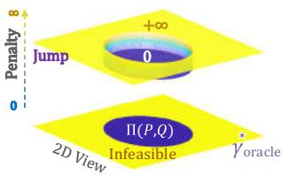  
Balanced OT(a)

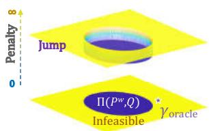  
Reweighting OT(b)

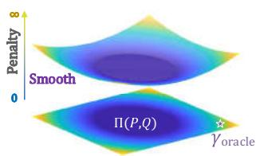  
Unbalanced OT(c)

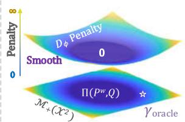  
Our Formulation(d)  
Ú·¹«®» ïò ×´´«­¬®¿¬·±² ±º ¼·ºº»®»²¬ ÑÌ º±®³«´¿¬·±²­ò ø¿÷óø¾÷æ Ú±® ÑÌ­ ©·¬¸ ½±²­¬®¿·²¬­ ±² ³¿®¹·²¿´ ¼·­¬®·¾«¬·±²­ô ¬¸±«¹¸ ©»·¹¸¬ © ³¿µ»­ ·¼»¿´ ­±´«¬·±² $\gamma _ { \mathrm { o r a c l e } }$ ½´±­»® ¬± ¬¸» º»¿­·¾´» ®»¹·±² $\Pi , \gamma _ { \mathrm { o r a c l e } }$ ·­ ­¬·´´ «²¿½¸·»ª¿¾´» øõï °»²¿´¬§÷ò ø½÷æ ËÑÌ ©·¬¸ ®»´¿¨¿¬·±² ®»ó °´¿½»­ ¬¸» ½±²­¬®¿·²¬­ ©·¬¸ ­³±±¬¸ °»²¿´¬§ô ¾«¬ $\gamma _ { \mathrm { o r a c l e } }$ ·­ ­¬·´´ º¿® ¿©¿§ º®±³ ¬¸» ½»²¬»®ô ©¸·½¸ ´»¿¼­ ¬± ´¿®¹» °»²¿´¬§ò ø¼÷æ Ñ«® º±®ó ³«´¿¬·±² Û¯ò øí÷ ©·¬¸ ®»´¿¨¿¬·±² $D _ { \phi }$ ¿²¼ ®»©»·¹¸¬»¼ $P ^ { w }$ »²­«®»­ ¬¸¿¬ $\gamma _ { \mathrm { o r a c l e } }$ ¾»´±²¹­ ¬± ¬¸» º»¿­·¾´» ®»¹·±² ©·¬¸ ­³¿´´»® °»²¿´¬§ò

$$
S ^ { \lambda } ( P , Q , c ) = \operatorname* { m i n } _ { \gamma \in \Pi ( P , Q ) } \int c \mathrm { d } \gamma - \lambda H ( \gamma ) ,\tag{øï÷}
$$

©¸»®» $\Pi ( P , Q )$ ·­ ¬¸» ­»¬ ±º °®±¾¿¾·´·­¬·½ ½±«°´·²¹­ ±ª»® $P$ ¿²¼ $Q ,$ ·­ °¿®¿³»¬»® ±º ­°¿®­·¬§ °»²¿´¬§ô ·­ ¬¸» ½±­¬ º«²½¬·±² º±® ¬®¿²­°±®¬ô $\mathrm { e . g . , } c$ is defined on $\mathcal { X } ^ { 2 }$ º±® ³¿®¹·²¿´ ÑÌ Åèô îðà ¿²¼ $( \mathcal { X } \times \mathcal { Y } ) ^ { 2 }$ º±® ¶±·²¬ ÑÌ Åïðô ììÃò

Ú«®¬¸»®ô ¬± ¼»¿´ ©·¬¸ ³±®» ¹»²»®¿´ ­½»²¿®·±­ô »ò¹òô «²ó »¯«¿´ ¬±¬¿´ ³¿­­ ¿²¼ ´¿¾»´ ­¸·º¬ô ËÑÌ Åêô éô ïïà ·­ °®±°±­»¼ ¿­ ¿ ®»´¿¨¿¬·±² ±º ½´¿­­·½¿´ ÑÌ Û¯ò øï °´¿½·²¹ ¬¸» ­¬®·½¬ ³¿®¹·²¿´ ½±²­¬®¿·²¬ $\gamma \in \Pi ( P , Q )$ ©·¬¸ ®»ó ´¿¨»¼ °»²¿´¬§ ¬»®³­ ±² $\gamma _ { \mathrm { : } }$ ËÑÌ ½¿² ¾» º±®³«´¿¬»¼ ¿­

$$
\begin{array} { l } { { S ^ { \lambda , \beta } ( P , Q , c ) = \displaystyle \operatorname* { m i n } _ { \gamma \in { \mathcal { M } } _ { + } } \int c \mathrm { d } \gamma - \lambda H ( \gamma ) } } \\ { { \qquad + \left. \beta \left[ D _ { \phi } ( \gamma _ { P } \| P ) + D _ { \phi } ( \gamma _ { Q } \| Q ) \right] \right. } } \end{array}\tag{øî÷}
$$

©¸»®» $\gamma _ { P }$ ¿²¼ $\gamma _ { Q }$ ¿®» ¬¸» ³¿®¹·²¿´­ ±º $\gamma , \beta$ ·­ ¬¸» °¿®¿³»¬»® º±® ³¿®¹·²¿´ °»²¿´¬§ô $\mathcal { M } _ { + }$ ·­ ¬¸» ­°¿½» ±º ¼·­¬®·¾«¬·±²­ô $\mathrm { e . g . }$ $\mathcal { M } _ { + } ( \mathcal { X } ^ { 2 } )$ ±ª»® ­°¿½» $\mathcal { X } ^ { 2 }$ º±® ³¿®¹·²¿´ ËÑÌ Åêô ïïÃò

## îòîò Ò»© Ú±®³«´¿¬·±² ¿²¼ ß²¿´§­·­

Ó±¬·ª¿¬·±²ò ̸±«¹¸ ¬¸» ®»©»·¹¸¬»¼ ­¬®¿¬»¹§ Åïêô íîô $3 8 , 4 7 ]$ ¿²¼ ËÑÌ ³»¬¸±¼±´±¹§ Åïïà ¸¿ª» ¾»»² »¨°´±®»¼ º±® µ²±©´»¼¹» ¬®¿²­º»®ô ¬¸»®» ¿®» ­¬·´´ °±¬»²¬·¿´ ©»¿µ²»­­»­ ¬¸¿¬ ©» ¿®» ·²¬»®»­¬»¼ ·²æ ï÷ ¬¸±«¹¸ ¬¸» ³¿®¹·²¿´ ¿´·¹²³»²¬ ¾»ó ¬©»»² $P ^ { w }$ ¿²¼ $Q$ ³·¬·¹¿¬»­ ´¿¾»´ ­¸·º¬ô »ò¹òô ÓÓÜ Åìéà ¿²¼ ÑÌ Åïêô íîô ííà ±² ©»·¹¸¬»¼ ­±«®½»ô ·¬ ·¹²±®»­ ¬¸» ½±²¼·ó ¬·±²¿´ ­¸·º¬ ©¸·½¸ «­«¿´´§ ¼»¹®¿¼»­ ¬¸» ¼·­½®·³·²¿¾·´·¬§å î÷ ¬¸» °»®º±®³¿²½» ±º ¿¼¿°¬¿¬·±² ©·¬¸ $P ^ { w }$ significantly de-°»²¼­ ±² ¬¸» °®»½·­·±² ±º »­¬·³¿¬·±² ¿­ Ú·¹ò ï ø¾÷ô ©¸·½¸ ³¿§ ¼»¹®¿¼» ¬¸» ®±¾«­¬²»­­ ±º ­¸·º¬ ½±®®»½¬·±² ³±¼»´å í÷ ¬¸» ³¿®¹·²¿´ °»²¿´¬§ ©·¬¸ ·² ËÑÌ Åïïà ·­ ­»²­·¬·ª» ¬± ¬¸» ¼»ó ¹®»» ±º ´¿¾»´ ­¸·º¬ ¿­ Ú·¹ò ï ø½÷ô »­°»½·¿´´§ º±® ¬¸» »¨¬®»³» ÐÜß ­½»²¿®·± ©·¬¸ ´¿®¹» ´¿¾»´ ¼·­½®»°¿²½§ò

To address the challenges above, we first introduce a ²±ª»´ ÑÌ ©·¬¸ ®»©»·¹¸¬»¼ ¿²¼ ®»´¿¨¿¬·±²ô ©¸·½¸ ®»¼«½»­ ¬¸» «²½»®¬¿·²¬§ ±º »­¬·³¿¬·±² ¿²¼ ¿´´»ª·¿¬»­ ¬¸» ´¿®¹» °»²¿´¬§ ±² ±®·¹·²¿´ ¼·­¬®·¾«¬·±² $P$ ­·³«´¬¿²»±«­´§ò ̸»² ©» °®±ó °±­» ¬¸» ½±²¼·¬·±²¿´ ËÑÌ º±®³«´¿¬·±²ô ©¸·½¸ ½¸¿®¿½¬»®·¦»­ ´¿¾»´ó©·­» ½±®®»´¿¬·±²­ ¿²¼ ³·¬·¹¿¬»­ ½±²¼·¬·±²¿´ ­¸·º¬ò

λ´¿¨»¼ ¿²¼ λ©»·¹¸¬»¼ Ú±®³«´¿¬·±²ò ̱ ±ª»®½±³» ¬¸» ¾·¿­ ±º ®·­µ »­¬·³¿¬·±² $\varepsilon _ { P }$ ©·¬¸ ´¿¾»´ °®±°±®¬·±² $P _ { Y }$ ±² ±®·¹·²¿´ ­±«®½» ¼±³¿·²ô ¬¸» ®»©»·¹¸¬»¼ ­¬®¿¬»¹·»­ º±® ³±¼ó ·º§·²¹ ¼·­¬®·¾«¬·±² ¿®» ©·¼»´§ ¿°°´·»¼ Åïçô íëô íèô ìéÃò ̱ unify the different formulations, we first present a rigorous ó®»©»·¹¸¬»¼ ­±«®½» ¿­ º±´´±©­ò

Ù·ª»² ¿ ®»©»·¹¸¬»¼ º«²½¬·±² $w : \mathcal { V } \to \mathbb { R } _ { - }$ õ ­«½¸ ¬¸¿¬ ·­ ¿´­± ¿ ÐÜÚ ±² ø¿÷ ̸» ó®»©»·¹¸¬»¼ ­±«®½» $P ^ { w }$ is defined as $p _ { Y } ^ { w } = w \cdot p _ { Y }$ $\begin{array} { r } { p _ { X | Y } ^ { w } = p _ { X | Y } a n d p _ { X } ^ { w } = \int _ { \mathcal { V } } p _ { Y = y } ^ { w } \cdot p _ { X | Y = y } \mathrm { d } y . } \end{array}$ ø¾÷ ̸» ±°¬·³¿´ ©»·¹¸¬ $w ^ { * }$ satisfies $P _ { Y } ^ { w ^ { * } } = Q _ { Y }$

ß² ·³°±®¬¿²¬ °®±°»®¬§ ±º ®»©»·¹¸¬»¼ ·­ ¬¸¿¬ ·º $P _ { X \mid Y } =$ $Q _ { X \mid Y }$ ô ¬¸»² ¼¿¬¿­»¬ ­¸·º¬ ½¿² ¾» ¿¼¼®»­­»¼ ±² ¬¸» ó ®»©»·¹¸¬»¼ ­±«®½»ô ·ò»òô ${ \cal P } _ { X Y } ^ { w ^ { * } } = { \cal P } _ { X | Y } { \cal P } _ { Y } ^ { w ^ { * } } = Q _ { X | Y } Q _ { Y } =$ $Q _ { X Y }$ ¿²¼ $\varepsilon _ { P ^ { w ^ { * } } } = \varepsilon _ { Q }$ ò Þ¿­»¼ ±² ¬¸» ®»©»·¹¸¬»¼ ­±«®½»ô ©» ©·´´ ²»¨¬ ­¸±© ¬¸¿¬ ¬¸» ¾·¿­»¼ ­¿³°´»ó©·­» ¬®¿²­°±®¬­ ·² ½«®ó ®»²¬ ÑÌ ½¿² ¾» ³·¬·¹¿¬»¼ ¾§ ¬¸» ®»´¿¨¿¬·±² ¿²¼ ®»©»·¹¸¬»¼ º±®³«´¿¬·±²

ß­ ¼·­½«­­»¼ ¾»º±®»ô ¬¸±«¹¸ ËÑÌ ½¿² ¼»¿´ ©·¬¸ ¬¸» ´¿¾»´ ­¸·º¬ ­½»²¿®·±­ ¾§ ®»´¿¨·²¹ ¬¸» ½±²­¬®¿·²¬­ ±² ³¿®¹·²¿´ ¼·­ó ¬®·¾«¬·±²ô ¬¸» ÑÌ ³±¼»´ ·­ ­¬·´´ ®»¯«·®»¼ ¬± ´»¿®² ½±«°´·²¹ ©·¬¸ ³¿®¹·²¿´ $\gamma _ { P }$ ½´±­» ¬± $P .$ ׬ ·³°´·»­ ­«½¸ ¿ ³±¼»´ ³¿§ º¿·´ ·² ­±³» »¨¬®»³» ­½»²¿®·±­ ©¸»®» ¬¸» ·¼»¿´ ³¿®¹·²¿´ ¿®» ¿½¬«¿´´§ ¿©¿§ º®±³ ¬¸» ±®·¹·²¿´ ­±«®½» ¼±³¿·² $P , \mathrm { e . g . , \gamma }$ ­¸±«´¼ ²±¬ ¿­­·¹² ª¿´«»­ ¬± ¬¸» ±«¬´·»® ½´¿­­»­ ·² $P .$ ̸»®»ó º±®»ô ·¬ ·­ ²»½»­­¿®§ ¬± ®»º±®³«´¿¬» ¬¸» ±®·¹·²¿´ ËÑÌ ¾§ ³±¼·º§·²¹ ¬¸» ³¿®¹·²¿´ °»²¿´¬§ ±² $P$ ¿­ $P ^ { w } ;$

$$
\begin{array} { l } { { S ^ { \lambda , \beta } ( P ^ { w } , Q , c ) = \displaystyle \operatorname* { m i n } _ { \gamma \in { \mathcal { M } } _ { + } ( { \mathcal { X } } ^ { 2 } ) } \int c \mathrm { d } \gamma - \lambda H ( \gamma ) } } \\ { { + \left. \beta \left[ D _ { \phi } ( \gamma _ { P ^ { w } } \| P ^ { w } ) + D _ { \phi } ( \gamma _ { Q } \| Q ) \right] \right. } } \end{array}\tag{øí÷}
$$

ß² ·²¬«·¬·ª» ·´´«­¬®¿¬·±² ±º Û¯ò øí÷ ¿²¼ ®»´¿¬»¼ ÑÌ º±®ó ³«´¿¬·±²­ ¿®» ­¸±©² ·² Ú·¹ò ïô ©¸»®» ¬¸» ·¼»¿´ $\gamma _ { \mathrm { o r a c l e } }$ ­«½¸ ¬¸¿¬ ·¬­ ³¿®¹·²¿´­ ¿®» $Q .$ Ú±® ±®·¹·²¿´ $( \mathrm { i . e . }$ ô ¾¿´¿²½»¼÷ ÑÌ Ûó ¯ò øï÷ ·² $\mathrm { F i g ~ 1 ~ ( a ) } { - } ( \mathbf { b } )$ ô ¬¸» º»¿­·¾´» ®»¹·±²­ ¿®» °®±¾¿¾·´·­¬·½ ½±«°´·²¹ ­»¬ ô ©¸·½¸ ·³°´·»­ ·¼»¿´ ­±´«¬·±²­ ¿®» ¿´©¿§­ «²ó ¿½¸·»ª¿¾´» «²´»­­ ·­ ¬¸» ±°¬·³¿´ $w ^ { * }$ ò ̸±«¹¸ ¬¸» ³¿®¹·²¿´ ½±²­¬®¿·²¬­ ¿®» ®»´¿¨»¼ô ¿²¼ º»¿­·¾´» ®»¹·±²­ ¿®» »¨¬»²¼»¼ ¬± $\mathcal { M } _ { + }$ ·² ËÑÌ Û¯ò $( 2 ) , \gamma _ { \mathrm { o r a c l e } }$ ³¿§ ¾» ­¬·´´ ¸¿®¼ ¬± ´»¿®² ­·²½» ¬¸» °»²¿´¬§ ³¿§ ¾» ´¿®¹»ô ·ò»òô Ú·¹ ï ¬¸» ½»²¬»® ©·¬¸ ð °»²¿´¬§ ª¿´«» ·­ $\Pi ( P , Q )$ ô ¬¸» ´¿®¹» ¼·­ó ½®»°¿²½§ ¾»¬©»»² $P$ ¿²¼ $Q$ ³¿µ»­ $\gamma _ { \mathrm { o r a c l e } }$ º¿® ¿©¿§ º®±³ ¬¸» ´±© °»²¿´¬§ ®»¹·±²ò Ú±® ±«® º±®³«´¿¬·±² Û¯ò øí÷ ·² Ú·¹ ï ø¼÷ô ¬¸» ³±¼»´ ·²¸»®·¬­ ¬¸» ¿¼ª¿²¬¿¹»­ ±º ËÑÌ ¿²¼ ®»©»·¹¸¬»¼ ÑÌò ̸» ®»©»·¹¸¬»¼ ­±«®½» $P ^ { w }$ º«®¬¸»® »²­«®»­ ¬¸¿¬ ±®¿½´» ·­ º»¿­·¾´»ô ¿²¼ ¬¸» °»²¿´¬§ ª¿´«» ·­ ­³¿´´»® ¬¸¿² ËÑÌò Þ»ó ­·¼»­ô ¬¸» ®»´¿¨¿¬·±² ±² $P ^ { w }$ ®»¼«½»­ ¬¸» ®·­µ ±º »­¬·³¿¬·±² $w ,$ ¬¸»² ¬¸» ²»·¹¸¾±«®­ ±º ¿®» ¿´­± º»¿­·¾´»ò ̸«­ô ¬¸» ·¼»¿´ ­±´«¬·±² ·­ ­¬·´´ ¿½¸·»ª¿¾´» »ª»² ·º $\ne ~ w ^ { * }$ ô ©¸·½¸ ±ª»®½±³»­ ¬¸» ´·³·¬¿¬·±² ±º ®»©»·¹¸¬»¼ ÑÌò ײ ½±²½´«­·±² ²»© º±®³«´¿¬·±² Û¯ò øí÷ »²­«®»­ ¬¸» »¨·­¬»²½» ±º «²¾·¿­»¼ $\gamma _ { \mathrm { o r a c l e } }$ º±® ¬¿®¹»¬ ¼±³¿·² $Q$ ¿²¼ ¬¸» º»¿­·¾·´·¬§ ±º ´»¿®²·²¹ò

ݱ²¼·¬·±²¿´ ÑÌò ̸±«¹¸ ¬¸» ®»©»·¹¸¬»¼ ¿²¼ ®»´¿¨¿¬·±² º±®³«´¿¬·±² Û¯ò øí÷ »²­«®»­ ¬¸» °±­­·¾·´·¬§ ±º ´»¿®²·²¹ «²¾·ó ¿­»¼ $\gamma$ º±® ¬¿®¹»¬ ¼±³¿·² $Q ,$ ¬¸» ½±²¼·¬·±²¿´ ­¸·º¬ ½±®®»½¬·±² º±® ·²¬®·²­·½ ­¬®«½¬«®» ¬®¿²­º»® ·­ ­¬·´´ ²±¬ ¹«¿®¿²¬»»¼ò ̸»®»ó º±®»ô ¬± º«®¬¸»® ¿½¸·»ª» ¬¸» ½±²¼·¬·±²¿´ ·²ª¿®·¿²¬ °®±°»®¬§ô we now define conditional transport mechanism to learn ´¿¾»´ó©·­» ½±®®»´¿¬·±²­ ¿²¼ ³·¬·¹¿¬» ¬¸» ²»¹¿¬·ª» ¬®¿²­°±®¬­ ¾»¬©»»² ·²¬»®ó½´¿­­ ­¿³°´» °¿·®­ò

Ú±® ¿²§ ²±²ó²»¹¿¬·ª» ½±ó efficient function $\alpha ( \cdot )$ ±² ­«½¸ ¬¸¿¬ ­«°°ø ÷ ã ­«°°ø Ç÷ ­«°°ø Ç÷ ¿²¼ $\begin{array} { r } { \sum _ { y \in \mathcal { y } } \alpha ( y ) = 1 } \end{array}$ ô ¬¸» ½±²¼·ó ¬·±²¿´ ËÑÌ ¾»¬©»»² $P ^ { w }$ ¿²¼ $Q$ is defined as

$$
\mathrm { O T } _ { \mathrm { c o n d } } ^ { \alpha } ( P ^ { w } , Q , c ) = \sum _ { y \in \mathcal { Y } } \alpha ( y ) \mathrm { O T } ( P _ { X | y } ^ { w } , Q _ { X | y } , c ) .\tag{øì÷}
$$

Ò±¬» ¬¸¿¬ ¬¸» ¹»²»®¿´ º±®³«´¿¬·±² Û¯ò øì÷ ·­ ­«·¬¿¾´» º±® ¼·ºº»®»²¬ ÑÌ󾿭»¼ ³±¼»´­ô »ò¹òô Õ¿²¬±®±ª·½¸ ÑÌô Í·²µ¸±®² ÑÌ $S ^ { \lambda }$ ¿²¼ ËÑÌ $S ^ { \lambda , \beta }$ ò ß² ·²¬«·¬·ª» »¨°´¿²¿¬·±² º±® ½±²¼·ó ¬·±²¿´ ÑÌ ·­ ¬¸¿¬ ·¬ ½¿² ¾» ¬¿µ»² ¿­ ¬¸» ­´·½»¼ ÑÌ ¾»¬©»»² ½±²¼·¬·±²¿´ ¼·­¬®·¾«¬·±²­ $P _ { X \mid y }$ ¿²¼ $Q _ { X \mid y }$ ±ª»® ¿´´ ´¿¾»´ ½±²ó ¼·¬·±²­ $y \in \mathcal { D }$ . The coefficient $\alpha$ »²­«®»­ ¬¸¿¬ ¬¸» ½±²¼·ó ¬·±²¿´ ¬®¿²­°±®¬­ ¿®» ±²´§ ½¿®®·»¼ ±«¬ ±² ­¸¿®»¼ ½´¿­­»­ô ·ò»òô $\operatorname { s u p p } ( \alpha ) \ = \ \operatorname { s u p p } ( p _ { Y } )$ ­«°°ø Ç÷ò ײ ½±²½´«­·±²ô ­«½¸ ¿ º±®³«´¿¬·±² »²­«®»­ ¬¸¿¬ ¬¸» ÑÌ °®±¾´»³­ º±® ¿´´ ­¸¿®»¼ ½´¿­­»­ ¿®» ½±²­·¼»®»¼ô $\operatorname { i . e . , } \alpha ( y ) > 0 \operatorname { i f } y$ ·­ ­¸¿®»¼ ½´¿­­»­ò

Ú±® »³°·®·½¿´ ¿°°´·½¿¬·±²ô ¬¸» ½±²¼·¬·±²¿´ ÑÌ ·² Û¯ò øì÷ »²­«®»­ ¬¸¿¬ ¬¸» ½±²¼·¬·±²¿´ ¬®¿²­°±®¬ ³±¼»´ ·­ ¹»²»®¿´´§ º»¿­·¾´» º±® »¨¬®»³» ­½»²¿®·±­ô »ò¹òô ±«¬´·»® ½´¿­­»­ ·² Ðó Üß ¿²¼ «²­»»² ½´¿­­»­ ·² ±°»²ó­»¬ ­½»²¿®·±ò ر©»ª»®ô since there are multiple (even infinite’ for regression s-½»²¿®·± ©·¬¸ ½±²¬·²«±«­ ÷ ³·²·³·¦¿¬·±² °®±¾´»³­ ø·ò»òô $\mathrm { O T } ( P _ { X \mid u } ^ { w } , Q _ { X \mid y } , c ) )$ ·² Û¯ò øì÷ô ¬¸·­ º±®³«´¿¬·±² ·­ ²±¬ ¹»²ó »®¿´´§ ¿°°´·½¿¾´» ¿²¼ ¸¿­ ²± ½´±­»¼óº±®³ ­±´«¬·±²ò Þ»­·¼»­ô ·­ ¿ ¸§°»®°¿®¿³»¬»®ô ©¸·½¸ ·­ «­«¿´´§ ¸¿®¼ ¬± »­¬·³¿¬»ò ײ ¬¸» ²»¨¬ô ©» ©·´´ ¼»ª»´±° ¿² »¯«·ª¿´»²¬ °®±¨ó § º±® ½±²¼·¬·±²¿´ ÑÌô ·ò»òô ÓÑÌô ©¸·½¸ °®±ª·¼»­ ¿² ·²¬»®ó °®»¬¿¾´» ­±´«¬·±² º±® ª·¿ ¬¸» »­­»²¬·¿´ ±º ¼¿¬¿

## îòíò ̸»±®»¬·½¿´ Ю±¨§ ¿²¼ Û­¬·³¿¬·±²

ײ ¬¸·­ ­»½¬·±²ô ©» º±½«­ ±² ¬¸» ½±³°«¬¿¬·±²óº®·»²¼´§ °®±¨§ ±º ½±²¼·¬·±²¿´ ÑÌò ݱ²­·¼»®·²¹ ¬¸» »³°·®·½¿´ ­ó cenario with finite samples, where labeled source data $\mathcal { D } ^ { s } = \{ \mathbf { x } _ { i } ^ { s } , y _ { i } ^ { s } \} _ { i = 1 } ^ { n }$ ¿²¼ «²´¿¾»´»¼ ¬¿®¹»¬ ¼¿¬¿ $\mathcal { D } ^ { t } { = } \{ { \bf x } _ { i } ^ { t } \} _ { i = 1 } ^ { m }$ ¿®» given, we first define the mask matrix for discrete OT and °®±°±­» ¬¸» ÓÑÌ ³»¬¸±¼±´±¹§ò ̸»² ©» °®±ª» ¬¸» ¬¸»±®»¬ó ·½¿´ ½±²²»½¬·±² ¾»¬©»»² $M O T$ ¿²¼ ½±²¼·¬·±²¿´ ÑÌ Û¯ò øì÷ô ©¸·½¸ »²­«®»­ ¬¸¿¬ ÓÑÌ ½¿² ¾» ¿ ¹»²»®¿´´§ ¿°°´·½¿¾´» °®±¨ó y with explicit fixed point solution.

Ë­«¿´´§ô $P$ ¿²¼ ¿®» ¼»²±¬»¼ ¿­ »³°·®·½¿´ ¼·­¬®·¾«¬·±²­ô »ò¹òô $\begin{array} { r } { P _ { X } = \frac { 1 } { n } \sum _ { i } \delta _ { \mathbf { x } _ { i } ^ { s } } } \end{array}$ ò ̸»² ¬¸» ¼·­½®»¬» º±®³«´¿¬·±² ±º Û¯ò øí÷ ½¿² ¾» ©®·¬¬»² ¿­

$$
\begin{array} { r l } & { S ^ { \lambda , \beta } ( P ^ { w } , Q , \mathbf { C } ) = \underset { \mathbf { r } \in \mathcal { M } _ { + } ( \mathbb { R } ^ { n \times m } ) } { \operatorname* { m i n } } \langle \mathbf { r } , \mathbf { C } \rangle _ { F } + \lambda \langle \mathbf { I } , \ln \mathbf { r } \rangle _ { F } } \\ & { \qquad + \beta \big [ D _ { \phi } ( \mathbf { \Gamma } _ { P ^ { w } } \| P ^ { w } ) + D _ { \phi } ( \mathbf { \Gamma } _ { Q } \| Q ) \big ] , \qquad ( 5 ) } \end{array}
$$

©¸»®» $\mathbf { T } \in \mathbb { R } ^ { n \times m }$ ·­ µ²±©² ¿­ ¬¸» ¬®¿²­°±®¬ °´¿² ³¿¬®·¨ô $\mathbf { C } _ { i j } = \| \mathbf { x } _ { i } ^ { s } - \mathbf { x } _ { j } ^ { t } \| _ { 2 } ^ { 2 }$ ·­ ¬¸» °¿·®ó©·­» ½±­¬ô ¿²¼ $\langle \mathbf { r } , \mathbf { C } \rangle _ { F } =$ $\sum _ { i j } \mathbf { \Gamma } \mathbf { \Gamma } \mathbf { \Gamma } _ { i j } \mathbf { C } _ { i j }$ ·­ ¬¸» Ú®±¾»²·«­ ·²²»® °®±¼«½¬ò Ú±® ½±²¼·¬·±²¿´ OT, the empirical conditional distributions are defined as $\begin{array} { r } { P _ { X | Y = l } = \frac { 1 } { n _ { l } } \sum _ { i } \mathbb { I } _ { [ y _ { i } ^ { s } = l ] } \delta _ { \mathbf { x } _ { i } ^ { s } } ( Q _ { X | Y } } \end{array}$ ·­ ­·³·´¿®÷ô ©¸»®» $n _ { l }$ ·­ ¬¸» ­·¦» ±º ¬¸» ó¬¸ ½´¿­­ ­±«®½» ¼¿¬¿ò ̸»² ¬¸» ¼·³»²­·±²­ ±º °´¿² ¿²¼ ½±­¬ ³¿¬®·½»­ ·² »¿½¸ ÑÌ °®±¾´»³ ±º Û¯ò øì÷ ¿®» $n _ { l } \times m _ { l }$ ò ̸»®»º±®»ô ·¬ ·­ ½´»¿® ¬¸¿¬ ¬¸» ½±²¼·¬·±²¿´ ÑÌ ·²¼«½»­ ³«´¬·°´» ÑÌ °®±¾´»³­ ¾»¬©»»² ¬¸» ½®±­­ó¼±³¿·² ½´«­¬»®­ô ¿²¼ ¬¸» °´¿² ·² »¿½¸ ­«¾ó°®±¾´»³ ½¸¿®¿½¬»®·¦»­ ¬¸» ½´¿­­ó´»ª»´ ¼»°»²¼»²½§ ¾»¬©»»² ­±«®½» ¿²¼ ¬¿®¹»¬ ¼±³¿·²­ò

̱ ±ª»®½±³» ­´·½»ó©·­» ½±³°«¬¿¬·±² °®±¾´»³ ±º ½±²¼·ó ¬·±²¿´ ÑÌô ¬¸» µ»§ ·¼»¿ ·­ ·²½±®°±®¿¬·²¹ ¬¸» ³«´¬·°´» ­«¾ó °®±¾´»³­ ·²¬± ­·²¹´» ÑÌ°®±¾´»³ ©·¬¸ ³¿­µ ³»½¸¿²·­³ò

Ù·ª»² ´¿¾»´­ $\{ y _ { i } ^ { s } \} _ { i = 1 } ^ { n }$ ¿²¼ $\{ y _ { i } ^ { t } \} _ { i = 1 } ^ { m } ,$ ô ¬¸» ³¿­µ ³¿¬®·¨ Ó $\in \mathbb { R } ^ { n \times m }$ is defined as

$$
\mathbf { M } _ { i j } \triangleq \left\{ \begin{array} { r l r } { 1 , } & { \mathrm { i f } y _ { i } ^ { s } = y _ { j } ^ { t } , } \\ { \infty , } & { \mathrm { i f } y _ { i } ^ { s } \neq y _ { j } ^ { t } . } \end{array} \right.\tag{øê÷}
$$

Then the masked cost is defined as $\tilde { \mathbf { C } } = \mathbf { C } \odot \mathbf { M }$ ô ¿²¼ ¬¸» ³¿­µ»¼ ÑÌ ·­º±®³«´¿¬»¼ ¿­

$$
\mathrm { O T } _ { \mathrm { m a s k } } ( P ^ { w } , Q , { \tilde { \bf C } } ) = \mathrm { O T } ( P ^ { w } , Q , { \tilde { \bf C } } ) .\tag{øé÷}
$$

É·¬¸ ¬¸» ´¿¾»´ó½±²¼·¬·±²»¼ ³¿­µ Óô ¬¸» ·²¬»®ó½´¿­­ ¼·­ó tances in the modified cost $\tilde { \mathbf { C } }$ will be enlarged to infinity. ײ¬«·¬·ª»´§ô ­«½¸ ¿ ³¿­µ ±² ½±­¬ »²­«®»­ ¬¸¿¬ ¬¸» ¬®¿²­°±®¬ °´¿² ©·´´ ±²´§ ¿­­·¹² ª¿´«»­ ¬± ¬¸» ·²¬®¿ó½´¿­­ ­¿³°´» °¿·®ò Ú±® »¨¿³°´»ô ¬¸» ³¿­µ»¼ ËÑÌ ·­ º±®³«´¿¬»¼ ¿­

$$
\begin{array} { r l r } & { } & { S _ { \mathrm { m a s k } } ^ { \lambda , \beta } ( P ^ { w } , Q , \tilde { \bf C } ) = \underset { { \Gamma \in \mathcal { M } _ { + } ( { \mathbb R } ^ { n \times m } ) } } { \mathrm { m i n } } \langle { \Gamma , \tilde { \bf C } } \rangle _ { F } + \lambda \langle { \Gamma , \ln { \Gamma } } \rangle _ { F } } \\ & { } & { + \beta \left[ D _ { \phi } ( { \Gamma _ { P ^ { w } } } \| P ^ { w } ) + D _ { \phi } ( { \Gamma _ { Q } } \| Q ) \right] . \quad ( 8 ) } \end{array}
$$

Ò±© ©» ¾»¹·² ¬± °®»­»²¬ ¬¸» ³¿·² ¬¸»±®»¬·½¿´ ®»­«´¬ó ${ \bf S } ,$ ©¸·½¸ ½±²²»½¬ ½±²¼·¬·±²¿´ ÑÌ ©·¬¸ ¬¸» ½±³°«¬¿¬·±²ó º®·»²¼´§ $\mathrm { O T } _ { \mathrm { m a s k } }$ ò Ю±±º­ ¿®» °®±ª·¼»¼ ·² ¿°°»²¼·¨ò

̸»±®»³ ï øЮ±¨§÷ ß­­«³» ­«°° $( q _ { Y } ) \subseteq \operatorname { s u p p } ( p _ { Y } )$ ô ¬¸» º±´´±©·²¹ ·¼»²¬·¬·»­ ¸±´¼

ø¿÷ Õ¿²¬±®±ª·½¸ ÑÌæ

$$
\mathrm { O T } _ { \mathrm { m a s k } } ( P ^ { w ^ { * } } , Q , { \tilde { \bf C } } ) = \mathrm { O T } _ { \mathrm { c o n d } } ^ { q _ { Y } } ( P ^ { w ^ { * } } , Q , { \bf C } ) .
$$

ø¾÷ Í·²µ¸±®² ÑÌæ

$$
S _ { \mathrm { m a s k } } ^ { \lambda } ( P ^ { w ^ { * } } , Q , { \tilde { \bf C } } ) + \lambda H ( Q _ { Y } ) = S _ { \mathrm { c o n d } } ^ { \lambda , q _ { Y } } ( P ^ { w ^ { * } } , Q , { \bf C } ) .
$$

ø½÷ ËÑÌæ ¬¸»®» »¨·­¬­ ²±²ó²»¹¿¬·ª» $\alpha ( \cdot )$ ±² ­«½¸ ¬¸¿¬ ${ \mathrm { s u p p } } ( \alpha ) = { \mathrm { s u p p } } ( q _ { Y } ) , \sum _ { y \in \mathcal { Y } } \alpha ( y ) = 1$ ¿²¼

$$
S _ { \mathrm { m a s k } } ^ { \lambda , \beta } ( P ^ { w ^ { * } } , Q , { \tilde { \bf C } } ) + C _ { 0 } ( \alpha , Q _ { Y } ) = S _ { \mathrm { c o n d } } ^ { \lambda , \beta , \alpha } ( P ^ { w ^ { * } } , Q , { \bf C } ) ,
$$

©¸»®» $C _ { 0 }$ ·­ ¿ ½±²­¬¿²¬ ¼»°»²¼·²¹ ±²´§ ±² ¿²¼ $Q _ { Y }$

Thm. 1 shows that MOT serves as a well-defined approximation for conditional OT. Specifically, for Kan-¬±®±ª·½¸ ÑÌô ÓÑÌ $\mathrm { O T } _ { \mathrm { m a s k } }$ »¨¿½¬´§ »¯«¿´­ ¬± ½±²¼·¬·±²¿´ ÑÌ $\mathrm { O T } _ { \mathrm { c o n d } } ^ { \alpha } ;$ º±® Í·²µ¸±®² ÑÌ ¿²¼ ËÑÌô ÓÑÌ ·­ »¯«·ª¿ó ´»²¬ ø«° ¬± ¿ ½±²­¬¿²¬÷ ¬± ½±²¼·¬·±²¿´ ÑÌ $\mathrm { O T } _ { \mathrm { c o n d } } ^ { \alpha }$ ô ¿²¼ ³·²ó imizing the computation-friendly MOT is sufficient to en-­«®» ¿ ­³¿´´ $\mathrm { O T } _ { \mathrm { c o n d } } ^ { \alpha }$ É» ¿´­± °®»­»²¬ ¿² ·²¬«·¬·ª» ·´´«­ó ¬®¿¬·±² º±® ¬¸» ½±²²»½¬·±² ¾»¬©»»² $\mathrm { O T } _ { \mathrm { c o n d } } ^ { \alpha }$ ¿²¼ $\mathrm { O T } _ { \mathrm { m a s k } }$ ·² Ú·¹ò îò ײ ½±²½´«­·±²ô ¬¸» ³¿·² ®»­«´¬­ ·³°´§ ¬¸¿¬ ÓÑÌ ½¿² ¿´­± ¿½¸·»ª» ½±²¼·¬·±²¿´ ¬®¿²­°±®¬ º±® ½´¿­­ó´»ª»´ µ²±©´ó »¼¹» ¬®¿²­º»®ô ©¸·´» ±ª»®½±³·²¹ ¬¸» ©»¿µ²»­­»­ ±º ­´·½»ó ©·­» ½±³°«¬¿¬·±² ¿²¼ ¸§°»®°¿®¿³»¬»® ·² $\mathrm { O T } _ { \mathrm { c o n d } } ^ { \alpha } .$

## íò ß´¹±®·¬¸³ ¿²¼ ß°°´·½¿¬·±²

Þ¿­»¼ ±² ¬¸» ¬¸»±®»¬·½¿´ ¹«¿®¿²¬»» ±º ÓÑÌô ©» ²±© °®»­»²¬ ¬¸» ²«³»®·½¿´ ¿´¹±®·¬¸³ º±® ­±´ª·²¹ Û¯ò øè÷ »¨°´·½ó ·¬´§ò ̸»² ¿ ½±²¼·¬·±²¿´ ·²ª¿®·¿²¬ ³±¼»´ ©·¬¸ ®·­µ ³·²·ó ³·¦¿¬·±² ±² ¬¸» ®»©»·¹¸¬»¼ ­±«®½» ¼±³¿·² ¿²¼ ¬®¿²­°±®¬»¼ ­±«®½» ¼±³¿·² ·­ °®±°±­»¼ º±® ÐÜß °®±¾´»³ò

## íòïò ß´¹±®·¬¸³æ ß Ú·¨»¼ б·²¬ Ó»¬¸±¼

ײ ¬¸·­ ­»½¬·±²ô ©» º±½«­ ±² ¬¸» ²«³»®·½¿´ ­±´«¬·±² º±® ¬¸» ³¿­µ»¼ ËÑÌ °®±¾´»³ ·² Û¯ò øè÷ò Ò±¬» ¬¸¿¬ ­«½¸ ¿ ­±´«¬·±² ·­ ¿´­± ¿°°´·½¿¾´» º±® ¬¸» Í·²µ¸±®² ÑÌô ­·²½» $S _ { \mathrm { m a s k } } ^ { \lambda , \beta }$ ©·´´ ¾±·´ ¼±©² ¬± $S _ { \mathrm { m a s k } } ^ { \lambda }$ ©¸»² $\beta = \infty ( \mathrm { i } . \mathrm { e } .$ ô ­¬®·½¬ ½±²­¬®¿·²¬­÷ô

ß­ ­¬«¼·»¼ ¾§ ݸ·¦¿¬ »¬ ¿´ò Åêô ̸³ò íòïïÃô ·º $D _ { \phi } = \mathrm { K L }$ ¬¸» ±®·¹·²¿´ ËÑÌ °®±¾´»³ Û¯ò øë lution with explicit computation. Specifically, defining the µ»®²»´ ${ \mathcal { K } } = \exp ( - \mathbf { C } / \lambda ) \in \mathbb { R } ^ { n \times m }$ , the fixed point iterations º±® ²±²ó²»¹¿¬·ª» ­½¿´·²¹ ª»½¬±®­ ·­ º±®³«´¿¬»¼ ¿­

$$
\mathbf { s } _ { 1 } ^ { ( i ) } = \Big ( \frac { p _ { X } ^ { w } } { \mathcal { K } \mathbf { s } _ { 2 } ^ { ( i - 1 ) } } \Big ) ^ { \frac { \beta } { \beta + \lambda } } , \quad \mathbf { s } _ { 2 } ^ { ( i ) } = \Big ( \frac { q _ { X } } { \mathcal { K } ^ { \top } \mathbf { s } _ { 1 } ^ { ( i ) } } \Big ) ^ { \frac { \beta } { \beta + \lambda } } .\tag{øç÷}
$$

̸»² ¬¸» ­»¯«»²½» $\mathrm { d i a g } ( \mathbf { s } _ { 1 } ^ { ( i ) } ) \mathcal { K } \mathrm { d i a g } ( \mathbf { s } _ { 2 } ^ { ( i ) } )$ ©·´´ ½±²ª»®¹» ¬± ¬¸» ­±´«¬·±² ±º Û¯ò øë÷ ø·ò»òô ±°¬·³¿´ ¬®¿²­°±®¬ °´¿² $\mathbf { \Gamma } ^ { \mathbf { \Gamma } ^ { \mathbf { r } * } } )$ ò

Í·³·´¿®´§ô ¬¸» ³¿­µ»¼ ËÑÌ Û¯ò øè÷ ½¿² ¿´­± ¾» ­±´ª»¼ by the fixed point method. The major difference is that the

ß´¹±®·¬¸³ ï Ú·¨»¼ б·²¬ Ó»¬¸±¼ º±® Û¯ò øè÷   
ײ°«¬æ ±¾­»®ª¿¬·±²­ $\{ ( \mathbf { x } _ { i } ^ { s } , y _ { i } ^ { s } ) \} _ { i = 1 } ^ { n }$ ±º $P$ ¿²¼ $\{ ( \mathbf { x } _ { i } ^ { t } , y _ { i } ^ { t } ) \} _ { i = 1 } ^ { m }$   
±º $Q ,$ ³¿¨·³«³ ·¬»®¿¬·±² $I _ { \mathrm { m a x } } ,$ ·³°±®¬¿²½» ©»·¹¸¬ ô   
°»²¿´¬§ °¿®¿³»¬»® $\lambda , \beta ;$   
Ñ«¬°«¬æ ¬®¿²­°±®¬ °´¿² ${ \tilde { \bf { r } } } ;$   
ïæ ײ·¬·¿´·¦» $\bar { \mathbf { s } _ { 2 } ^ { ( 0 ) } } = [ 1 , 1 , \dotsc , 1 ] ^ { \top } / m \in \mathbb { R } ^ { m } ;$   
îæ ݱ³°«¬» $p _ { X } ^ { w }$ ¿­ Ü»ºò ï ¿²¼ $\tilde { \mathcal { K } }$ ¿­ Û¯ò øïð÷å   
íæ º±® $i = 1 , \bar { 2 , } . . . , I _ { \mathrm { m a x } } $ ¼±   
ìæ $\begin{array} { r } { \mathbf { s } _ { 1 } ^ { ( i ) }  ( \frac { p _ { X } ^ { w } } { \tilde { \kappa } \mathbf { s } _ { 2 } ^ { ( i - 1 ) } } ) ^ { \frac { \beta } { \beta + \lambda } } , \quad \mathbf { s } _ { 2 } ^ { ( i ) }  ( \frac { q _ { X } } { \tilde { K } ^ { \top } \mathbf { s } _ { 1 } ^ { ( i ) } } ) ^ { \frac { \beta } { \beta + \lambda } } ; } \end{array}$   
ëæ »²¼ º±®   
êæ $\tilde { \Gamma } \gets \mathrm { d i a g } ( \mathbf { s } _ { 1 } ^ { ( I _ { \operatorname* { m a x } } ) } ) \tilde { \mathcal { K } } \mathrm { d i a g } ( \mathbf { s } _ { 2 } ^ { ( I _ { \operatorname* { m a x } } ) } ) .$

µ»®²»´ $\tilde { \kappa }$ ·²¼«½»¼ ¾§ ´¿¾»´ó½±²¼·¬·±²»¼ ³¿­µ»¼ ½±­¬ $\tilde { \mathbf { C } }$ ·­ ¼»®·ª»¼ ¿­

$$
\tilde { \mathcal { K } } _ { i j } = \left\{ \begin{array} { c l } { 0 , } & { \mathrm { ~ i f ~ } \tilde { \mathbf { C } } _ { i j } = \infty , } \\ { \mathrm { e x p } ( - \mathbf { C } _ { i j } / \lambda ) , } & { \mathrm { ~ e l s e } . } \end{array} \right.\tag{øïð÷}
$$

̸»² ¬¸» ¬®¿²­°±®¬ °´¿² º±® ³¿­µ»¼ ËÑÌ ½¿² ¾» ¼»ó ¼«½»¼ ¾§ ®»°´¿½·²¹ ¬¸» µ»®²»´ ·² ­½¿´·²¹ ·¬»®¿¬·±² Ûó ¯ò øç÷ ©·¬¸ ¬¸» ³¿­µ»¼ µ»®²»´ ¢ò Ò±¬» ¬¸¿¬ ­·²½» $\mathbf { \Gamma } ^ { \mathbf { \Gamma } \mathbf { \Gamma } ^ { \mathbf { \Gamma } } }$ ≈ ¼·¿ $\mathrm { g } ( \mathbf { s } _ { 1 } ^ { ( i ) } ) \tilde { \mathcal { K } } \mathrm { d i a g } ( \mathbf { s } _ { 2 } ^ { ( i ) } )$ ô ¬¸»² ¬¸» ¬®¿²­°±®¬ ³¿­­ $\Gamma _ { i j } ^ { * }$ ©·´´ ¾» ð ·º $\tilde { \mathcal { K } } _ { i j } = 0$ ò ײ¬«·¬·ª»´§ô ¬¸» ³¿­µ ³»½¸¿²·­³ »²­«®»­ ¬¸¿¬ ¬¸» ¿­­·¹²³»²¬­ ¾»¬©»»² ¬¸» ·²¬»®ó½´¿­­ ­¿³°´»­ ©·´´ ¾» ­·¹²·ºó icantly reduced. We summarize the fixed point method for ³¿­µ»¼ ËÑÌ Û¯ò øè÷ ·² ß´¹ò ïô ©¸»®» ¬¸» ³¿­µ»¼ Í·²µ¸±®² ÑÌ $( \beta = \infty )$ ½¿² ¾» ­±´ª»¼ ¾§ ­»¬¬·²¹ $\beta / ( \beta + \lambda ) = 1$ ·² ­¬»° ìò Ò±¬» ¬¸¿¬ ­·²½» $\tilde { \mathcal { K } }$ ·­ ¾´±½µ ¼·¿¹±²¿´ ø«° ¬± °»®³«¬¿ó ¬·±²­ ±² ­¿³°´»­÷ô ¬¸» ·¬»®¿¬·±²­ ·² ­¬»° ì ½¿² ¾» »ºº»½¬·ª»´§ ·³°´»³»²¬»¼ ¾§ ·¬»®¿¬·²¹ ¬¸» ¾´±½µ ³¿¬®·½»­ °¿®¿´´»´´§

## íòîò ß°°´·½¿¬·±²æ ÐÜß

ײ ¬¸·­ ­»½¬·±²ô ©» º±½«­ ±² ¬¸» ÑÌ󾿭»¼ ³±¼»´·²¹ º±® »¨¬®»³» ÐÜß ­½»²¿®·±ô ¿²¼ °®±°±­» ÓÑÌ󾿭»¼ ³±¼»´ ¬± ´»¿®² ¬¸» ½®±­­ó¼±³¿·² ·²ª¿®·¿²¬ µ²±©´»¼¹»

Ó±¬·ª¿¬»¼ ¾§ ¬¸» ¼·­½«­­·±² ±º ­«½½»­­º«´ Üß ·² Í»½ò îòïô ©» ¿®» ·²¬»®»­¬»¼ ·² ¬©± °®±¾´»³­æ ï÷ ´»¿®²·²¹ ½±²¼·¬·±²¿´ ·²ª¿®·¿²¬ ®»°®»­»²¬¿¬·±² $Z$ ª·¿ ÑÌå î÷ ´»¿®²·²¹ ¬®¿²­º»®®¿¾´» ³±¼»´ ©·¬¸ «²¾·¿­»¼ ®·­µ »­¬·³¿¬·±²ò É·¬¸ ¬¸»­» ¹±¿´­ ·² ³·²¼ô ©» ¼»½±³°±­» ¬¸» ´»¿®²·²¹ ³±¼»´ ¿­ $f _ { c } \circ f _ { r } ,$ ©¸»®» $f _ { r } : X \mapsto Z$ ·­ ®»°®»­»²¬¿¬·±² ´»¿®²»® ¿²¼ $f _ { c } : Z \mapsto Y$ ·­ ¬¿­µ ´»¿®²»®ò ̸»­» ½±³°±­·¬·±²­ ¿®» °¿®¿³»¬»®·¦»¼ ¾§ ²»«ó ®¿´ ²»¬©±®µ­ô ¿²¼ ¬¸» ±ª»®¿´´ º®¿³»©±®µ ½¿² ¾» ­«³³¿®·¦»¼ ¿­ º±´´±©·²¹ ¬©± ¿´¬»®²¿¬·ª» °®±½»­­»­ ø­¸±©² ¿­ Ú·¹ò î÷ò

Ì®¿²­°±®¬ ß­­·¹²³»²¬ Ô»¿®²·²¹ò ײ ¬¸·­ °®±½»­­ô ©» ¿·³ ¬± ´»¿®² ¿² ·¼»¿´ ¬®¿²­°±®¬ °´¿² º±® ½¸¿®¿½¬»®·¦·²¹ ¬¸» ½®±­­ó¼±³¿·² ­¿³°´» ½±®®»­°±²¼»²½»ò Ú·®­¬´§ô ©» »­ó ¬·³¿¬» ©»·¹¸¬ ©·¬¸ ÞÞÍÛ Åîîà ¿´¹±®·¬¸³ô ©¸±­» ½±²ó ª»®¹»²½» °®±°»®¬§ ·­ ¬¸»±®»¬·½¿´´§ »²­«®»¼ò ̸»² ¬¸» ´¿¾»´ó ½±²¼·¬·±²»¼ ³¿­µ»¼ ËÑÌ Û¯ò øè÷ ·­ »³°´±§»¼ô ·ò»òô

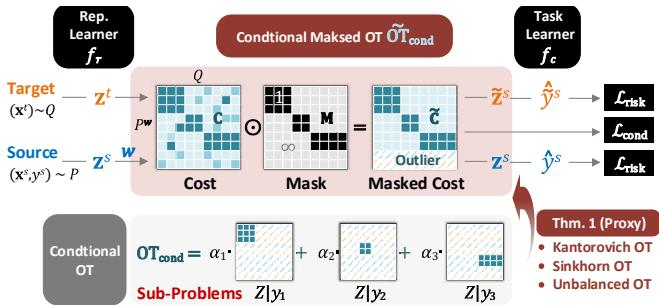  
Ú·¹«®» îò ×´´«­¬®¿¬·±² ±º ¬¸» ÓÑÌ󾿭»¼ ³±¼»´ º±® ÐÜßò ͬ¿¹» λ¼æ ¬®¿²­°±®¬ ¿­­·¹²³»²¬ ´»¿®²·²¹ º±® ±¾¬¿·²·²¹ ·¼»¿´ ¬®¿²­°±®¬ °´¿² $\tilde { \mathbf { T } }$ with well-defined proxy $\mathrm { O T } _ { \mathrm { m a s k } } \mathrm { ; }$ å ͬ¿¹» Þ´¿½µæ ½±²¼·¬·±²ó ¿´ ¿´·¹²³»²¬ ¿²¼ ®·­µ ³·²·³·¦¿¬·±² º±® ´»¿®²·²¹ ½±²¼·¬·±²¿´ ·²ª¿®·ó ¿²¬ ®»°®»­»²¬¿¬·±² $Z$ ¿²¼ ¬®¿²­º»®®¿¾´» ³±¼»´ $f _ { c } \circ f _ { r }$

$$
\begin{array} { r l } &  \mathcal { L } _ { \mathrm { c o n d } } ( f _ { r } , \mathbf { \boldsymbol { \Gamma } } ) = \mathbf { \mathcal { \langle } { \mathbf { \boldsymbol { \Gamma } } } \mathbf { \boldsymbol { \Gamma } } \mathbf { \boldsymbol { \cdot } } \tilde { \mathbf { C } } + \lambda \ln \mathbf { \mathbf { \boldsymbol { \Gamma } } } \mathbf { \boldsymbol { \rangle } } _ { F } } \\ & { \qquad + \beta \left[ D _ { \phi } ( \mathbf { \boldsymbol { \Gamma } } _ { P _ { Z } ^ { w } } \Vert P _ { Z } ^ { w } ) + D _ { \phi } ( \mathbf { \boldsymbol { \Gamma } } _ { Q _ { Z } } \Vert Q _ { Z } ) \right] , } \end{array}\tag{øïï÷}
$$

©¸»®» ¬¸» ½±­¬ ³¿¬®·¨ $\mathbf { C } _ { i j } = \| \mathbf { z } _ { i } ^ { s } - \mathbf { z } _ { j } ^ { t } \| _ { 2 } ^ { 2 }$ ò Ò±¬» ¬¸¿¬ ¬¸·­ ¬®¿²­°±®¬ ¿­­·¹²³»²¬ ´»¿®²·²¹ ·­ ·³°´»³»²¬»¼ ·² ®»°®»­»²ó ¬¿¬·±² ­°¿½» $\mathcal { Z }$ ©·¬¸ ´»¿®²»® $f _ { r } ,$ ô ©¸·½¸ »²­«®»­ ¬¸» ³±¼»´ ½¿² ¼§²¿³·½¿´´§ ³»¿­«®» ¿²¼ ¾®·¼¹» ¬¸» ½±²¼·¬·±²¿´ ¼·­ó ½®»°¿²½§ ¼«®·²¹ ¬®¿·²·²¹ °®±½»¼«®»ò Í·²½» ¬¸»®» ¿®» ²± ´¿ó ¾»´­ º±® ¬¿®¹»¬ ¼±³¿·²ô ©» «­» ¬¸» °­»«¼± ´¿¾»´­ $\hat { y } = f ( \mathbf { x } )$ º±® »­¬·³¿¬·²¹ ¬¸» ³¿­µ»¼ ½±­¬ Ý¢ ò ײ ¬¸·­ ­¬¿¹»ô ¬¸» ¬®¿²­ó port plan will be learned with fixed representation learner $f _ { r } , \mathrm { i . e . }$ ô ½±³°«¬» $\tilde { \Gamma } = \arg \operatorname* { m i n } _ { \Gamma } \mathcal { L } _ { \mathrm { c o n d } }$ ¿½½±®¼·²¹ ¬± ß´¹ò ïò

ݱ²¼·¬·±²¿´ ß´·¹²³»²¬ ¿²¼ η­µ Ó·²·³·¦¿¬·±²ò ײ ¬¸·­ °®±½»­­ô ©» ¿·³ ¬± »­¬·³¿¬» «²¾·¿­»¼ ®·­µ ¿²¼ ½®±­­ó ¼±³¿·² ½±²¼·¬·±²¿´ ¼·­½®»°¿²½§ ¾¿­»¼ ±² ¬¸» ´»¿®²»¼ ·¼»¿´ ¿­­·¹²³»²¬ ¢ò ̸»² ¬¸» ³±¼»´ ©·´´ ¾» ±°¬·³·¦»¼ ¿½½±®¼ó ·²¹ ¬± ¬¸» »­¬·³¿¬»¼ ±¾¶»½¬·ª»­

Ú±® ½±²¼·¬·±²¿´ ¿´·¹²³»²¬ô ¬¸» ³¿­µ»¼ ËÑÌ ´±­­ $\mathcal { L } _ { \mathrm { c o n d } }$ Û¯ò øïï $\tilde { \Gamma }$ is sufficient to achieve class-level ¬®¿²­°±®¬ò ̸»±®»¬·½¿´´§ô ·¬ ½¿² ¿´­± ³·¬·¹¿¬» ¬¸» ½±²¼·¬·±²¿´ ¼·­¬®·¾«¬·±² ­¸·º¬ ¿­ ­¸±©² ·² ̸³ò ïò Þ»­·¼»­ô ­·²½» $\mathcal { L } _ { \mathrm { c o n d } }$ ·­ ¾«·´¬ ±² ®»©»·¹¸¬»¼ ­±«®½» ¼±³¿·²ô ¬¸» ®·­µ ±º ²»¹¿¬·ª» transfer can be significantly reduced.

Ú±® ®·­µ ³·²·³·¦¿¬·±²ô ¿°¿®¬ º®±³ ¬¸» ®·­µ »­¬·³¿¬·±² ±² ®»©»·¹¸¬»¼ ­±«®½» $P ^ { w }$ ô ©» °®±°±­» ¬± ´»¿®² ®·­µ ±² ¬®¿²­ó °±®¬»¼ ­±«®½» $\tilde { P } ^ { w }$ ¾¿­»¼ ±² ¬¸» ´»¿®²»¼ ·¼»¿´ ¿­­·¹²³»²¬ $\tilde { \Gamma }$ Í«½¸ ¬®¿²­°±®¬ »­¬¿¾´·­¸»­ ¬¸» »¨°´·½·¬ ½±²²»½¬·±² ¾»¬©»»² empirical risk and target data. Specifically, given $\tilde { \Gamma }$ ô ¬¸» ­±«®½» ¼¿¬¿ ½¿² ¾» ®»°®»­»²¬»¼ ¾§ ¬¸» ¬¿®¹»¬ ­¿³°´»­ ª·¿ ¬¸» º±´´±©·²¹ ¾¿®§½»²¬»® ³¿° °®±¾´»³æ

$$
\begin{array} { r } { \tilde { \mathbf { z } } _ { i } ^ { s } = \underset { \mathbf { z } } { \arg \operatorname* { m i n } } \sum _ { j = 1 } ^ { m } \ \tilde { \Gamma } _ { i j } \| \mathbf { z } - \mathbf { z } _ { j } ^ { t } \| _ { 2 } ^ { 2 } . } \end{array}\tag{øïî÷}
$$

ß­ ­¸±©² ¾§ ݱ«®¬§ »¬ ¿´ò ÅèÃô ¿² ¿²¿´§¬·½ ­±´«¬·±² º±® Ûó ¯ò øïî÷ô ½¿´´»¼ ¾¿®§½»²¬»® ³¿°°·²¹ ô ½¿² ¾» ©®·¬¬»² ¿­

$$
\tilde { \mathbf { z } } _ { i } ^ { s } = \psi _ { \tilde { \mathbf { r } } _ { i , : } } ( \mathbf { Z } ^ { t } ) = ( < \tilde { \mathbf { r } } _ { i , : } , \mathbf { 1 } _ { m } > ) ^ { - 1 } \sum _ { j = 1 } ^ { m } \tilde { \mathbf { T } } _ { i j } \mathbf { z } _ { j } ^ { t } .\tag{øïí÷}
$$

̸»² ©» ¼»²±¬» ±¾­»®ª¿¬·±²­ ±º ¬®¿²­°±®¬»¼ ­±«®½» ${ \tilde { P } } ^ { w }$ ¿­ $\{ ( \tilde { \mathbf { z } } _ { i } ^ { s } , y _ { i } ^ { s } ) \} _ { i = 1 } ^ { n }$ ô ¿²¼ °®±°±­» ¬± ´»¿®² »³°·®·½¿´ ®·­µ ±² $\tilde { P } ^ { w }$ ¿­

$$
\mathbb { E } _ { \tilde { P } ^ { w } } [ \ell ( f _ { c } ( \tilde { \mathbf { z } } ^ { s } ) , y ^ { s } ) ] = \mathbb { E } _ { Q } [ \ell ( f _ { c } \circ \psi \circ f _ { r } ( \mathbf { x } ^ { t } ) , y ^ { s } ) ] .\tag{øïì÷}
$$

ß² ·²¬«·¬·ª» »¨°´¿²¿¬·±² º±® ¾¿®§½»²¬»® ³¿°°·²¹ $\psi$ ·­ ¬¸¿¬ ·¬ ½±²­·¼»®­ ¬¸» ³·²·³·¦»¼ ½±­¬ º±® ®»½±²­¬®«½¬·²¹ ­±«®½» ­¿³°´» $\mathbf { z } ^ { s }$ ·² ¬¸» ®»°®»­»²¬¿¬·±² ­°¿½» ±º ¬¿®¹»¬ ¼±³¿·²ô ·ò»òô ¬¸» ®¿²¹» ­°¿½» $\operatorname { I m } ( \mathbf { Z } ^ { t } )$ ò Í«½¸ ¿ ®»½±²­¬®«½¬·±² »²­«®»­ ¬¸¿¬ ¬¸» ¬¿®¹»¬ ®»°®»­»²¬¿¬·±² ­°¿½» ½¿² ¾» ­«°»®ª·­»¼´§ ±°¬·ó ³·¦»¼ ª·¿ ·¬­ ¬®¿²­°±®¬ ½±®®»­°±²¼»²½» ©·¬¸ ­±«®½» ¼¿¬¿ô $\operatorname { i . e . , ~ } \psi \circ f _ { r } ( \mathbf { x } ^ { t } )$ ·² ¬®¿²­°±®¬»¼ ­±«®½» ®·­µ Û¯ò øïì÷ò É·¬¸ $P ^ { w }$ ¿²¼ $\tilde { P } ^ { w }$ ô ©» ½¿² º±®³«´¿¬» ¬¸» «²¾·¿­»¼ »³°·®·½¿´ ®·­µ »­¬·³¿¬·±²­ º±® ¬¿­µ ´»¿®²·²¹ ¿­

$$
\mathcal { L } _ { \mathrm { r i s k } } ( f _ { r } , f _ { c } ) = \mathbb { E } _ { P ^ { w } } [ \ell ( f ( \mathbf { x } ^ { s } ) , y ^ { s } ) ] + \mathbb { E } _ { \tilde { P } ^ { w } } [ \ell ( f _ { c } ( \tilde { \mathbf { z } } ^ { s } ) , y ^ { s } ) ] .
$$

Ú·²¿´´§ô ¬¸» ±°¬·³·¦¿¬·±² ±¾¶»½¬·ª» ·² ½±²¼·¬·±²¿´ ¿´·¹²ó ³»²¬ ¿²¼ ®·­µ ³·²·³·¦¿¬·±² ­¬¿¹» ½¿² ¾» ­«³³¿®·¦»¼ ¿­

$$
\operatorname* { m i n } _ { f _ { r } , f _ { c } } \mathcal { L } ( f _ { r } , f _ { c } ) = \mathcal { L } _ { \mathrm { r i s k } } ( f _ { r } , f _ { c } ) + \eta \mathcal { L } _ { \mathrm { c o n d } } ( f _ { r } , \tilde { \Gamma } ) .\tag{øïë÷}
$$

## ìò Û¨°»®·³»²¬­

ײ ¬¸·­ ­»½¬·±²ô ©» ª¿´·¼¿¬» ÓÑÌ ³»¬¸±¼±´±¹§ ¿²¼ »ª¿´ó «¿¬» ¬¸» °®±°±­»¼ ÐÜß ³±¼»´ ¾§ ½±²¼«½¬·²¹ »¨°»®·³»²¬­ on standard PDA datasets, i.e., Office-Home [39], VisDAîðïé Åíï íêà ¿²¼ ׳¿¹»ÝÔÛÚ ÅìÃò Ü»¬¿·´­ ±º ¼¿¬¿­»¬­ ¿²¼ ·³°´»³»²¬¿¬·±²­ ¿®» °®±ª·¼»¼ ·² ¿°°»²¼·¨

Ю±¨§ ß²¿´§­·­ò ̱ ª¿´·¼¿¬» ¬¸» °®±¨§ °®±°»®¬§ ±º ³¿­µ»¼ ÑÌ ·² ̸³ò ïô ©» ½±³°¿®» ª¿´«»­ ±º $\mathrm { O T } _ { \mathrm { c o n d } } ^ { \alpha }$ ¿²¼ $\mathrm { O T } _ { \mathrm { m a s k } }$ on Office-Home. Results in ${ \mathrm { F i g } } .$ í¿óí¼ ·³°´§ ¬¸¿¬ ¬¸» ¿¾­±´«¬» ¼·ºº»®»²½» ¾»¬©»»² $\mathrm { O T } _ { \mathrm { c o n d } } ^ { \alpha }$ ¿²¼ $\mathrm { O T } _ { \mathrm { m a s k } }$ ø©·¬¸ ½±²­¬¿²¬ ·² ̸³ò ï÷ ·­ ¿´³±­¬ ¦»®± ¿²¼ ·­ ²»¹´·¹·¾´» ½±³ó °¿®»¼ ¬± ¬¸» ­½¿´»­ ±º $\mathrm { O T }$ ª¿´«»­ò ̸»­» ®»­«´¬­ ¼»³±²­¬®¿¬» ¬¸¿¬ ¬¸» ¬¸»±®»¬·½¿´ ®»­«´¬­ ¿®» ª¿´·¼ô ¿²¼ $\mathrm { O T } _ { \mathrm { c o n d } } ^ { \alpha }$ ¿²¼ °®±¨§ $\mathrm { O T } _ { \mathrm { m a s k } }$ ¿®» ·²¼»»¼ »¯«·ª¿´»²¬ ·² ¿°°´·½¿¬·±²ò

ÑÌ Ú±®³«´¿¬·±²­ò ̱ ½±³°¿®» ¬¸» »¨·­¬·²¹ ÑÌ º±®ó ³«´¿¬·±²­ ©·¬¸ °®±°±­»¼ ³±¼»´·²¹­ô ©» ª·­«¿´·¦» ¬¸» °´¿² ª¿´«»­ ø¼¿®µ»® ½±´±® ·­ ¸·¹¸»® ·² ª¿´«»÷ ¿²¼ ®»°±®¬ ¬¸» ³¿­­»­ ¿­­·¹²»¼ ¬± ±«¬´·»®ô ø­¸¿®»¼÷ ·²¬»®ó½´¿­­ ¿²¼ ·²¬®¿ó í»óí¸ ¼»³±²­¬®¿¬» ¬¸¿¬ ®»©»·¹¸¬»¼ ÑÌ ¿½¬«¿´´§ ®»¼«½»­ ¿­­·¹²³»²¬­ ¬± ±«¬´·ó »® ½´¿­­»­ô ¾«¬ »­¬·³¿¬»¼ ³¿§ ¾» ´»­­ ¿½½«®¿¬» º±® ­¸¿®»¼ ½´¿­­»­ ¿²¼ ·²¬»®ó½´¿­­ ³¿­­ ·­ ´¿®¹»ò ̸±«¹¸ ËÑÌ ´»¿®²­ ¾»¬¬»® ¿­­·¹²³»²¬­ º±® ­¸¿®»¼ ½´¿­­»­ô ¬¸»®» ·­ ´¿®¹» ³¿­­ º±® ±«¬´·»® ½´¿­­»­ ­·²½» ³¿®¹·²¿´ °»²¿´¬§ ³¿§ ¾» «²¿ºº±®¼¿¾´» º±® »¨¬®»³» ­½»²¿®·±ò ײ $\mathrm { F i g . 3 g }$ ô ±«® ®»©»·¹¸¬»¼ ¿²¼ ®»´¿¨ó ¿¬·±² º±®³«´¿¬·±² Û¯ò øí÷ ·­ ­«°»®·±® ¿²¼ ¬¸» ·²¬®¿ó½´¿­­ ³¿­­ is larger. Further, MOT ensures a significant block diagonal ­¬®«½¬«®» º±® ¬®¿²­°±®¬ °´¿² ·² Ú·¹ò í¸ô ©¸»®» ¬¸» ·²¬»®ó½´¿­­ mass and outlier mass are significantly reduced by penalty ±² ½±­¬ ³¿¬®·¨ò ̸»­» ®»­«´¬­ ª¿´·¼¿¬» ¬¸¿¬ ÓÑÌ ³»¬¸±¼±´ó ±¹§ ½¿² ´»¿®² ¾»¬¬»® °´¿² º±® ¬¿­µ µ²±©´»¼¹» ¬®¿²­º»®ò

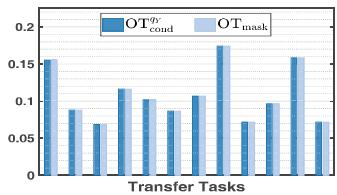  
ø¿÷ Õ¿²¬±®±ª·½¸ ÑÌ

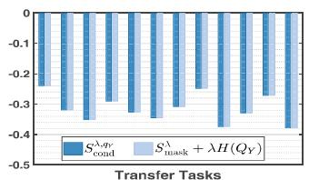  
ø¾÷ Í·²µ¸±®² ÑÌ

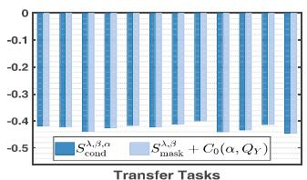

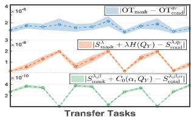  
ø½÷ ˲¾¿´¿²½»¼ ÑÌ

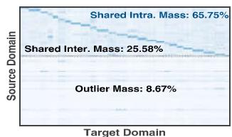

ø¼÷ ß¾­±´«¬» Ü·ºº»®»²½»  
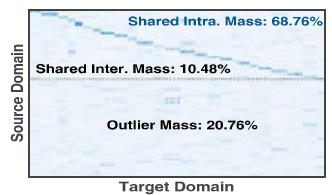  
ø»÷ λ©»·¹¸¬»¼ ÑÌ  
øº÷ ˲¾¿´¿²½»¼ ÑÌ

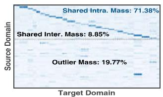  
ø¹÷ Ú±®³«´¿¬·±² Û¯ò øí÷

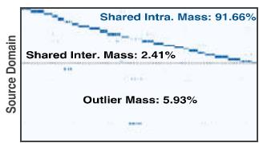  
ø¸÷ ÓÑÌ Û¯ò øè÷

Figure 3. (a)-(d): Numerical validation of the proxy theorem on all transfer tasks of Office-Home, where $\mathrm { O T } _ { \mathrm { c o n d } } ^ { \alpha }$ ¿²¼ $\mathrm { O T } _ { \mathrm { m a s k } }$ ¿®» ¿½¬«¿´´§ »¯«·ª¿´»²¬ ·² »³°·®·½¿´ ­½»²¿®·±­ò ø»÷óø¸÷æ ݱ³°¿®·­±² ±º ¼·ºº»®»²¬ ÑÌ º±®³«´¿¬·±²­ô ©¸»®» °®±°±­»¼ ³»¬¸±¼­ Û¯ò øí÷ ¿²¼ Û¯ò øè÷ ¿®» ¾»¬¬»®
<table><tr><td colspan="2">Modules</td><td rowspan="2">Home</td><td rowspan="2">Office VisDA Office Image 2017</td><td rowspan="2">31</td><td rowspan="2">CLEF</td><td rowspan="2">Mean</td></tr><tr><td>OT</td><td> $\mathbb { E } _ { \tilde { P } ^ { w } } [ \ell ]$   $\mathcal { L } _ { \mathrm { c o n d } }$ </td></tr><tr><td>ROT</td><td>√ √</td><td>73.9</td><td>73.1</td><td>93.7</td><td>88.2</td><td>82.2</td></tr><tr><td>UOT</td><td>√ √</td><td>69.1</td><td>67.6</td><td>92.5</td><td>87.1</td><td>79.1</td></tr><tr><td>Eq. (3)</td><td>√ √</td><td>74.2</td><td>76.8</td><td>94.3</td><td>89.2</td><td>83.6</td></tr><tr><td>MOT</td><td>√</td><td>76.6</td><td>84.9</td><td>95.4</td><td>90.4</td><td>86.8</td></tr><tr><td>MOT</td><td>√</td><td>74.6</td><td>89.3</td><td>97.5</td><td>91.9</td><td>88.3</td></tr><tr><td>MOT</td><td>√ √</td><td>80.6</td><td>92.4</td><td>98.4</td><td>93.6</td><td>91.3</td></tr></table>

Ì¿¾´» ïò ß¾´¿¬·±² ­¬«¼§ øλ­Ò»¬óëð÷ò

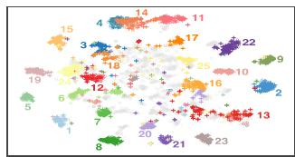

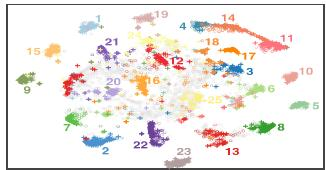  
ø¿÷ λ©»·¹¸¬»¼ ÑÌ  
ø¾÷ ˲¾¿´¿²½»¼ ÑÌ

ß¾´¿¬·±² ͬ«¼§ò ̱ »ª¿´«¿¬» ¬¸» »ºº»½¬·ª»²»­­ ±º ¼·ºº»®ó »²¬ ³±¼«´»­ô ©» °®»­»²¬ ®»­«´¬­ ±º ¿¾´¿¬·±² »¨°»®·³»²¬­ ·² Tab. 1. We first consider different OT formulations for mod-»´ °®±°±­»¼ ·² Í»½ò íòîò ̸» $1 ^ { \mathrm { s t } } - 3 ^ { \mathrm { r d } }$ ®±©­ ·³°´§ ¬¸¿¬ °®±ó °±­»¼ º±®³«´¿¬·±² Û¯ò øí÷ ¿½¸·»ª» ¸·¹¸»® ¿½½«®¿½·»­ ¬¸¿² ®»©»·¹¸¬»¼ ÑÌ øÎÑÌ÷ ¿²¼ ËÑÌò Ú«®¬¸»®ô ¬¸» $6 ^ { \mathrm { { t h } } }$ ®±© ·³ó plies mask mechanism can improve accuracies significantly ©·¬¸ ´¿¾»´ó½±²¼·¬·±²»¼ µ²±©´»¼¹» ¬®¿²­º»®ò ̸»­» ®»­«´¬­ ª¿´·¼¿¬» ¬¸» ­«°»®·±®·¬§ ±º ²»© ÑÌ º±®³«´¿¬·±²­ò Þ»­·¼»­ô ©» ½±²­·¼»® ¬¸» ¬®¿²­°±®¬»¼ ­±«®½» ®·­µ $\mathbb { E } _ { \tilde { P } ^ { u } }$ Å Ã ·² Û¯ò øïì÷ ¿²¼ ½±²¼·¬·±²¿´ ¿´·¹²³»²¬ $\mathcal { L } _ { \mathrm { c o n d } }$ ·² Û¯ò øïë÷ò ݱ³°¿®·²¹ ¬¸» ®»­«´¬­ ·² $4 ^ { \mathrm { t h } } - 6 ^ { \mathrm { t h } }$ ô ©» ±¾­»®ª» ¬¸¿¬ ¾±¬¸ $\mathbb { E } _ { \tilde { P } ^ { w } } [ \ell ]$ ¿²¼ $\mathcal { L } _ { \mathrm { c o n d } }$ ½¿² ·³°®±ª» ³±¼»´ °»®º±®³¿²½»ô ¿²¼ ¬¸» º«´´ ÓÑÌ ³±¼»´ ·­ significantly better. These results demonstrate that proposed ·²ª¿®·¿²¬ ´»¿®²·²¹ ³±¼»´ ©·¬¸ ¬®¿²­°±®¬»¼ ®·­µ ³·²·³·¦¿¬·±² ·­ »ºº»½¬·ª» ·² ¼»¿´·²¹ ©·¬¸ ÐÜß °®±¾´»³ò

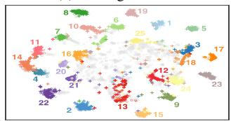

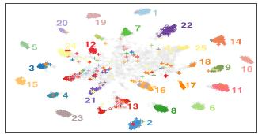  
ø¼÷ ÓÑÌ Û¯ò øè÷  
ø½÷ Ú±®³«´¿¬·±² Û¯ò øí÷  
Ú·¹«®» ìò ¬óÍÒÛ Åîêà ª·­«¿´·¦¿¬·±² ±º ´»¿®²»¼ ®»°®»­»²¬¿¬·±²­ô ©¸»®» ­¸¿®»¼ ½´¿­­»­ ¸¿ª» ¼·ºº»®»²¬ ½±´±® ¿²¼ ±«¬´·»® ½´¿­­»­ ¿®» ¹®¿§ò ù ùæ ­±«®½» ­¿³°´»­å ùõùæ ¬¿®¹»¬ ­¿³°´»­å ù²«³¾»®ùæ ´¿¾»´­ò

Ú»¿¬«®» Ê·­«¿´·¦¿¬·±²ò ̱ ¿²¿´§¦» ¬¸» ¯«¿´·¬§ ±º ´»¿®²»¼ ®»°®»­»²¬¿¬·±²­ô ©» «­» ¬óÍÒÛ Åîêà ¬± ª·­«¿´·¦» ¬¸» îóÜ º»¿ó tures of different OT formulations on Office-Home. For ®»©»·¹¸¬»¼ ÑÌ ¿²¼ ËÑÌô ¬¸±«¹¸ ¬¸» ²»¹¿¬·ª» ·³°¿½¬­ ±º ±«¬´·»® ½´¿­­»­ ¿®» ®»¼«½»¼ ¿­ Ú·¹ò ì¿óì¾ô ¬¸» ¼·­½®·³·²¿¾·´ó ity for shared classes are not sufficiently learned, and some ­¿³°´»­ ¿®» ¬®¿²­º»®®»¼ ¬± ·²½±®®»½¬ ½´¿­­»­ ©·¬¸ ³¿®¹·²¿´ ¿¼¿°¬¿¬·±²ò Ú±® º±®³«´¿¬·±² Û¯ò øí÷ô ¬¸» ®»°®»­»²¬¿¬·±²­ ¿®» ³±®» ½±³°¿½¬ô ¿²¼ º»©»® ­¿³°´»­ ¿®» ±ª»®´¿°°·²¹ ©·¬¸ ±«¬ó ´·»® ½´¿­­»­ò Ú«®¬¸»®ô ¬¸» ½±²¼·¬·±²¿´ ¿´·¹²³»²¬ ·² ÓÑÌ »²ó ­«®»­ ¬¸» ½´¿­­ó©·­» ¿´·¹²³»²¬ º±® ½®±­­ ¼±³¿·² ­¿³°´»­ ¬¸»² ¬¸» ·²¬®¿ó½´¿­­ ½±³°¿½¬²»­­ ¿²¼ ·²¬»®ó½´¿­­ ­»°¿®¿¾·´·¬§ ì¼ò ̸»­» ®»­«´¬­ ¼»³±²ó ­¬®¿¬» ¬¸¿¬ ¬¸» °®±°±­»¼ ÑÌ º±®³«´¿¬·±²­ ¿²¼ ·²ª¿®·¿²¬ ®·­µ ´»¿®²·²¹ ³±¼»´ ·²¼»»¼ ´»¿®² ½±®®»½¬ ¬®¿²­°±®¬ ®»´¿¬·±²­ ¿²¼ ¼·­½®·³·²¿¬·ª» ®»°®»­»²¬¿¬·±²­ò

Ü·ºº»®»²¬ ÐÜß Í½»²¿®·±­ò É» »ª¿´«¿¬» ÑÌ󾿭»¼ ³±¼ó »´­ «²¼»® ¼·ºº»®»²¬ ÐÜß ­½»²¿®·±­ ¾§ ª¿®§·²¹ ¬¸» ²«³¾»® of shared classes on Office-Home. The results in Fig 5aë¾ ·³°´§ ¬¸¿¬ ¿´´ ³±¼»´­ ¿½¸·»ª» ¸·¹¸ ¿½½«®¿½§ ©¸»² ¬¸»®» ¿®» ´»­­ ­¸¿®»¼ ½´¿­­»­ô ­·²½» ¬¸»®» ¿®» ®»´¿¬·ª»´§ ³±®» ­¿³ó °´»­ñµ²±©´»¼¹» ±² ¬¸» ­±«®½» ¼±³¿·²ò É·¬¸ ¬¸» ·²½®»¿­» ±º ­¸¿®»¼ ½´¿­­»­ô ¬¸» ´¿¾»´ ¼·­½®»°¿²½§ ·­ ­³¿´´»®ô ¾«¬ ¬¸» target classification task is more challenging since there are ³±®» ¬¿®¹»¬ ­¿³°´»­ò ̸«­ô ©» ½¿² ±¾­»®ª» ¬¸¿¬ ¬¸» ¿½½«®¿ó ½·»­ ·²½®»¿­» ¿¬ ·²¬»®ª¿´ Åîð íðà ¿²¼ ¬¸»² ¼»½®»¿­» ©·¬¸ ¬¸» ·²½®»¿­·²¹ ¬¿®¹»¬ ­¿³°´»­ò Ù»²»®¿´´§ô ÓÑÌ ·­ ­«°»®·±® ¬± ±¬¸»® ÑÌ ³±¼»´·²¹­ô ©¸·½¸ ¼»³±²­¬®¿¬» ¬¸» »ºº»½¬·ª»²»­­ ±º °®±°±­»¼ ³»¬¸±¼±´±¹§ ·² ¼·ºº»®»²¬ ´»¿®²·²¹ ­½»²¿®·±­

ݱ³°¿®·­±² ©·¬¸ ÍÑÌßò ̱ »ª¿´«¿¬» ¬¸» ³±¼»´ °»®º±®ó ³¿²½»ô ©» ½±³°¿®» ÓÑÌ ©·¬¸ ­»ª»®¿´ ÍÑÌß ÐÜß ³»¬¸±¼ó ­ô ¿²¼ °®»­»²¬ ®»­«´¬­ ·² Ì¿¾ò îóíò ï÷ Ú±® ¿¼ª»®­¿®·¿´ ¿¼¿°¬¿ó ¬·±²ô ÐßÜß ·³°®±ª»­ ÜßÒÒ ¾§ ·²¬®±¼«½·²¹ ¬¸» ®»©»·¹¸¬ó »¼ ­±«®½» $P ^ { w }$ ¬± ¿¼ª»®­¿®·¿´ ¬®¿·²·²¹ò ̸» ¾»¬¬»® °»®º±®ó ³¿²½» ª¿´·¼¿¬»­ ¬¸» »ºº»½¬·ª»²»­­ ±º ´¿¾»´ ¼·­¬®·¾«¬·±² ½±®ó ®»½¬·±² º±® ÐÜßò ݱ³°¿®»¼ ©·¬¸ ¬¸»­» ¿¼ª»®­¿®·¿´ ³±¼»´­ ©·¬¸ ³¿®¹·²¿´ ¿´·¹²³»²¬ô ÓÑÌ ´»¿®²­ ½±²¼·¬·±²¿´ ·²ª¿®·¿²¬ ®»°®»­»²¬¿¬·±²­ ©·¬¸ ³¿­µ»¼ ³»½¸¿²·­³ò î÷ Ú±® ³»¬®·½ó ¾¿­»¼ ¿¼¿°¬¿¬·±² ³±¼»´­ ÍßÚÒ ¿²¼ ÜÓÐô ¬¸±«¹¸ ´¿¾»´ó ½±²¼·¬·±²»¼ ·²º±®³¿¬·±² ·­ ·²½±®°±®¿¬»¼ô ¬¸» »¨°´·½·¬ ½±²ó ¼·¬·±²¿´ ¼·­¬®·¾«¬·±² ¿´·¹²³»²¬ ·­ ²±¬ »²­«®»¼ò í÷ ݱ³°¿®»¼ ©·¬¸ ±¬¸»® ÑÌ ³±¼»´­ øÖËÓÞÑÌô ßÎ ¿²¼ ³óÐÑÌ÷ô ÓÑÌ ±ª»®½±³»­ ¬¸» ´·³·¬¿¬·±²­ ±º »¨·­¬·²¹ ÑÌ ³±¼»´·²¹­ ¿­ ¼·­ó cussed before. Specifically, AR is reweighted-based model, ©¸·½¸ ¿°°´·»­ $P ^ { w }$ ¬± ¬¸» ¼«¿´ ÑÌ °®±¾´»³ô ¾«¬ ¬¸» °»®º±®ó ³¿²½» ³¿§ ¾» ­»²­·¬·ª» ¬± ¬¸» °®»½·­·±² ±º $w .$ ÖËÓÞÑÌ ¿²¼ ³óÐÑÌ ¿®» ®»­°»½¬·ª»´§ «²¾¿´¿²½»¼ ¬®¿²­°±®¬ ³±¼»´ ¿²¼ °¿®¬·¿´ ¬®¿²­°±®¬ ³±¼»´ô ©¸·½¸ ½¿² ¾» ¾±¬¸ ®»¹¿®¼»¼ ¿­ ®»´¿¨¿¬·±²ó¾¿­»¼ ÑÌ ©·¬¸±«¬ ­¬®·½¬ ³¿®¹·²¿´ ½±²­¬®¿·²¬­ ¾«¬ ¬¸» ®»´¿¨¿¬·±² ³¿§ ¾» ´»­­ »ºº»½¬·ª» ©¸»² ´¿¾»´ ­¸·º¬ ·­ ­»ª»®»ô »ò¹òô ÐÜßò Ú±®¬«²¿¬»´§ô ±«® º±®³«´¿¬·±² Û¯ò øí÷ ·²ó ¬»¹®¿¬·²¹ ¬¸» ¿¼ª¿²¬¿¹»­ ±º ®»´¿¨¿¬·±² ¿²¼ ®»©»·¹¸¬»¼ô ¿²¼ mask mechanism further ensures the sufficiency of conditional shift correction. Therefore, MOT achieve signifi-½¿²¬ ·³°®±ª»³»²¬­ ø¿¾±«¬ ïû ìû÷ ±² º±«® ÐÜß ¼¿¬¿­»¬­ô ©¸·½¸ ª¿´·¼¿¬»­ ¬¸» »ºº»½¬·ª»²»­­ ±º °®±°±­»¼ ³»¬¸±¼±´±¹§ò

<table><tr><td rowspan="2">Methods</td><td colspan="10">Office-Home</td><td colspan="3"></td><td rowspan="2">VisDA-2017 S→R</td></tr><tr><td>A→C</td><td></td><td>A→P A→R</td><td></td><td>C→A C→P</td><td></td><td>C→R P→A P→C</td><td></td><td></td><td>P→R R→A R→C R→P Mean</td><td></td><td></td><td></td></tr><tr><td>Source [17]</td><td>46.3</td><td>67.5</td><td>75.9</td><td>59.1</td><td>59.9</td><td>62.7</td><td>58.2</td><td>41.8</td><td>74.9</td><td>67.4</td><td>48.2</td><td>74.2</td><td>61.4</td><td>45.3</td></tr><tr><td>DANN [13]</td><td>43.8</td><td>67.9</td><td>77.5</td><td>63.7</td><td>59.0</td><td>67.6</td><td>56.8</td><td>37.1</td><td>76.4</td><td>69.2</td><td>44.3</td><td>77.5</td><td>61.7</td><td>51.0</td></tr><tr><td>PADA [2]</td><td>52.0</td><td>67.0</td><td>78.7</td><td>52.2</td><td>53.8</td><td>59.0</td><td>52.6</td><td>43.2</td><td>78.8</td><td>73.7</td><td>56.6</td><td>77.1</td><td>62.1</td><td>53.5</td></tr><tr><td>ETN [3]</td><td>59.2</td><td>77.0</td><td>79.5</td><td>62.9</td><td>65.7</td><td>75.0</td><td>68.3</td><td>55.4</td><td>84.4</td><td>75.7</td><td>57.7</td><td>84.5</td><td>70.5</td><td></td></tr><tr><td>SAFN [43]</td><td>58.9</td><td>76.3</td><td>81.4</td><td>70.4</td><td>73.0</td><td>77.8</td><td>72.4</td><td>55.3</td><td>80.4</td><td>75.8</td><td>60.4</td><td>79.9</td><td>71.8</td><td>67.7</td></tr><tr><td>DRCN[21]</td><td>51.6</td><td>75.8</td><td>82.0</td><td>62.9</td><td>65.1</td><td>72.9</td><td>67.4</td><td>50.0</td><td>81.0</td><td>76.4</td><td>57.7</td><td>79.3</td><td>68.5</td><td>58.2</td></tr><tr><td>DMP [25]</td><td>59.0</td><td>81.2</td><td>86.3</td><td>68.1</td><td>72.8</td><td>78.8</td><td>71.2</td><td>57.6</td><td>84.9</td><td>77.3</td><td>61.5</td><td>82.9</td><td>73.5</td><td>72.7</td></tr><tr><td>JUMBOT [11]</td><td>62.7</td><td>77.5</td><td>84.4</td><td>76.0</td><td>73.3</td><td>80.5</td><td>74.7</td><td>60.8</td><td>85.1</td><td>80.2</td><td>66.5</td><td>83.9</td><td>75.5</td><td>84.0†</td></tr><tr><td>AR [16]</td><td>67.4</td><td>85.3</td><td>90.0</td><td>77.3</td><td>70.6</td><td>85.2</td><td>79.0</td><td>64.8</td><td>89.5</td><td>80.4</td><td>66.2</td><td>86.4</td><td>78.3</td><td>88.7</td></tr><tr><td>m-POT [28]</td><td>64.6</td><td>80.6</td><td>87.2</td><td>76.4</td><td>77.6</td><td>83.6</td><td>77.1</td><td>63.7</td><td>87.6</td><td>81.4</td><td>68.5</td><td>87.4</td><td>78.0</td><td>87.0†</td></tr><tr><td>MOT</td><td>63.1</td><td>86.1</td><td>92.3</td><td>78.7</td><td>85.4</td><td>89.6</td><td>79.8</td><td>62.3</td><td>89.7</td><td>83.8</td><td>67.0</td><td>89.6</td><td>80.6</td><td>92.4</td></tr></table>

§ λ­«´¬­ ®»°±®¬»¼ ¾§ Í¿´ª¿¼±® »¬ ¿´ò ÅíéÃò

<table><tr><td>Office-31</td><td colspan="5">A→WD→WW→DA→DD→AW→AMean</td></tr><tr><td>Source [17] DANN[13] PADA [2] SAFN[43] DRCN[21]</td><td>75.6 73.6 86.5 87.5 90.8</td><td>96.3 98.1 96.3 98.7 99.3 100 96.6 99.4 100 100</td><td>83.4 83.9 81.5 82.8 82.2 92.7 89.8 92.6 94.3 95.2</td><td>85.0 87.1 86.1 86.5 95.4 92.7 92.7 93.1</td><td>94.8 95.9</td></tr><tr><td>DMP [25] AR [16]</td><td>96.6 93.5</td><td>100 100 100</td><td>100 96.4 99.7 96.8 100 98.7</td><td>95.1 95.4 95.5 96.0 96.1 96.4</td><td>97.2 96.9 98.4</td></tr></table>

<table><tr><td>ImageCLEF I→P P→I</td><td>I→C C→I C→P P→C Mean</td></tr><tr><td>Source [17] 78.3 86.9 DANN[13] 78.1 86.3</td><td>91.0 84.3 72.5 91.5 84.1 91.3 84.0 72.1 90.3 83.7</td></tr><tr><td>PADA [2] 81.7 92.1 94.6 89.8 77.7</td><td>94.1 88.3 93.0 90.3 77.8 94.0 87.5</td></tr><tr><td>SAFN[43] 79.5 90.7 DMP [25] 82.4 94.5 96.7</td><td>94.3 78.7 96.4 90.5 95.0 98.0 95.0 87.0 98.7 93.6</td></tr></table>

Table 3. Classification accuracies (%) on Office-31 and Image-ÝÔÛÚ ¼¿¬¿­»¬­ øλ­Ò»¬óëð÷ò

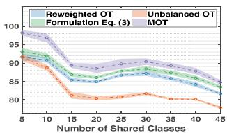  
(a) Office-Home P→R

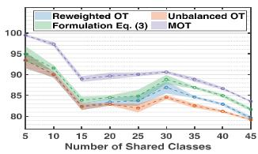  
(b) Office-Home R→P  
Figure 5. Accuracy curves and 95% confidence intervals of OT-¾¿­»¼ ³±¼»´­ ¾§ ª¿®§·²¹ ¬¸» ²«³¾»® ±º ­¸¿®»¼ ½´¿­­»­ò

## ëò ݱ²½´«­·±²

ײ ¬¸·­ °¿°»®ô ©» ­§­¬»³¿¬·½¿´´§ ­¬«¼§ ¬¸» ´·³·¬¿¬·±²­ ·² ½«®®»²¬ ÑÌ ³±¼»´·²¹­ º±® ®»¿´ó©±®´¼ ´»¿®²·²¹ ­½»²¿®·±­ô ¿²¼ ¬¸»² ¼»ª»´±° ²±ª»´ ÑÌ ³»¬¸±¼±´±¹§ ©·¬¸ ¬¸»±®»¬·½¿´ ¹«¿®¿²¬»»­ò Ú±® ¬¸»±®»¬·½¿´ ¿­°»½¬ô ¿ ²±ª»´ º±®³«´¿¬·±² ·­ °®±°±­»¼ ©·¬¸ ®»©»·¹¸¬»¼ ¿²¼ ®»´¿¨¿¬·±² ±°»®¿¬·±²­ô ¿²¼ ¿ ²»© ÑÌ ª¿®·¿²¬ ½¿´´»¼ ÓÑÌ ·­ °®±°±­»¼ ¾§ »¨°´±®·²¹ ¬¸» ³¿­µ ³»½¸¿²·­³å ¬¸» »¯«·ª¿´»²¬ ®»´¿¬·±² ¾»¬©»»² ÓÑÌ ¿²¼ ½±²¼·¬·±²¿´ ÑÌ ·­ °®±ª»¼ô ©¸·½¸ ·³°´·»­ ¬¸» ½±³°«¬¿¬·±²ó º®·»²¼´§ ÓÑÌ ½¿² ¿´­± ½¸¿®¿½¬»®·¦» ¬¸» ½±²¼·¬·±²¿´ ·²º±®ó ³¿¬·±² ·² ¬®¿²­°±®¬¿¬·±²ò Ú±® ³»¬¸±¼±´±¹§ô ©» °®±°±­» ¿² ·²ª¿®·¿²¬ ´»¿®²·²¹ ³±¼»´ ©·¬¸ ÓÑÌô ©¸±­» »ºº»½¬·ª»²»­­ ·­ ª¿´·¼¿¬»¼ ¾§ »¨¬»²­·ª»´§ ²«³»®·½¿´ »¨°»®·³»²¬­ ¿²¼ ¿²¿´§ó ­·­ò ß² ·²¬»®»­¬·²¹ º«¬«®» ¼·®»½¬·±² ·­ ­¬«¼§·²¹ ¬¸»±®§ ¿²¼ ¿´¹±®·¬¸³ º±® ³¿­µ»¼ °¿®¬·¿´ ÑÌ ¿²¼ ÓÑÌ ©·¬¸ ­±º¬ ´¿¾»´­

## ß½µ²±©´»¼¹»³»²¬

̸·­ ©±®µ ·­ ­«°°±®¬»¼ ·² °¿®¬ ¾§ ¬¸» Ò¿¬·±²¿´ Õ»§ ÎúÜ Ð®±¹®¿³ ±º ݸ·²¿ «²¼»® Ù®¿²¬ îðîïÇÚßïððíððïå ·² °¿®¬ ¾§ ¬¸» Ò¿¬·±²¿´ Ò¿¬«®¿´ ͽ·»²½» Ú±«²¼¿¬·±² ±º ݸ·ó ²¿ «²¼»® Ù®¿²¬ êïçéêîîçå ·² °¿®¬ ¾§ ¬¸» Ù«¿²¹¼±²¹ Þ¿ó ­·½ ¿²¼ ß°°´·»¼ Þ¿­·½ λ­»¿®½¸ Ú±«²¼¿¬·±² «²¼»® Ù®¿²¬ îðîíÞïëïëðîðððìå ¿²¼ ·² °¿®¬ ¾§ ¬¸» Ñ°»² λ­»¿®½¸ Ю±¶»½¬­ ±º Ƹ»¶·¿²¹ Ô¿¾ «²¼»® Ù®¿²¬ îðîïÕØðßÞðèò

## λº»®»²½»­

Åïà ͸¿· Þ»²óÜ¿ª·¼ô Ö±¸² Þ´·¬¦»®ô Õ±¾§ Ý®¿³³»®ô ß´»¨ Õ«´»­¦¿ô Ú»®²¿²¼± л®»·®¿ô ¿²¼ Ö»²²·º»® ɱ®¬³¿² Ê¿«¹¸¿²ò ß ¬¸»±®§ ±º ´»¿®²·²¹ º®±³ ¼·ºº»®»²¬ ¼±³¿·²­ò Ó¿½¸·²» ´»¿®²ó ·²¹ô éçøïóî÷æïëïŠïéëô îðïðò ï

Åîà Ƹ¿²¹¶·» Ý¿±ô Ô·¶·¿ Ó¿ô Ó·²¹­¸»²¹ Ô±²¹ô ¿²¼ Ö·¿²³·² É¿²¹ò ﮬ·¿´ ¿¼ª»®­¿®·¿´ ¼±³¿·² ¿¼¿°¬¿¬·±²ò ײ ÛÝÝÊô °¿¹»­ ïíëŠïëðô îðïèò ïô îô è

Åíà Ƹ¿²¹¶·» Ý¿±ô Õ¿·½¸¿± DZ«ô Ó·²¹­¸»²¹ Ô±²¹ô Ö·¿²³·² É¿²¹ô ¿²¼ Ï·¿²¹ Ç¿²¹ò Ô»¿®²·²¹ ¬± ¬®¿²­º»® »¨¿³°´»­ º±® °¿®¬·¿´ ¼±³¿·² ¿¼¿°¬¿¬·±²ò ײ ÝÊÐÎô °¿¹»­ îçèëŠîççìô îðïçò ïô îô è

Åìà ޿®¾¿®¿ Ý¿°«¬±ô Ø»²²·²¹ Ó«´´»®ô Ö»­«­ Ó¿®¬·²»¦óÙ±³»¦ô x Ó¿«®·½·± Ê·´´»¹¿­ô Þ«®¿µ ß½¿®ô Ò±ª· אַ·½·¿ô Ò»¼¿ Ó¿®ó ª¿­¬·ô Í«¦¿² Ë­µx x »¬ ¿´ò ׳¿¹»½´»º îðïìæ Ѫ»®ª·»© ¿²¼ ¿²¿´§­·­ ±º ¬¸» ®»­«´¬­ ײ ײ¬»®²¿¬·±²¿´ ݱ²º»®»²½» ±º ¬¸» Ý®±­­óÔ¿²¹«¿¹» Ûª¿´«¿ó ¬·±² Ú±®«³ º±® Û«®±°»¿² Ô¿²¹«¿¹»­ô °¿¹»­ ïçîŠîïïô îðïìò ê

Åëà Կ»¬·¬·¿ ݸ¿°»´ô λ³· Ú´¿³¿®§ô Ø¿±®¿² É«ô Ý l »¼®·½ Ú l »ª±¬¬»ô l ¿²¼ Ù·´´»­ Ù¿­­±ò ˲¾¿´¿²½»¼ ±°¬·³¿´ ¬®¿²­°±®¬ ¬¸®±«¹¸ ²±²ó²»¹¿¬·ª» °»²¿´·¦»¼ ´·²»¿® ®»¹®»­­·±²ò ײ Ò»«®×ÐÍô ª±´ó «³» íìô °¿¹»­ îíîéðŠîíîèîô îðîïò ï

Åêà Ի²¿·½ ݸ·¦¿¬ô Ù¿¾®·»´ 맮»ô Þ»®²¸¿®¼ ͽ¸³·¬¦»®ô ¿²¼ l Ú®¿²½h±·­óÈ¿ª·»® Ê·¿´¿®¼ò ͽ¿´·²¹ ¿´¹±®·¬¸³­ º±® «²¾¿´¿²½»¼ ±°¬·³¿´ ¬®¿²­°±®¬ °®±¾´»³­ò Ó¿¬¸»³¿¬·½­ ±º ݱ³°«¬¿¬·±²ô èéøíïì÷æîëêíŠîêðçô îðïèò ïô íô ë

Åéà Ի²¿·½ ݸ·¦¿¬ô Ù¿¾®·»´ 맮»ô Þ»®²¸¿®¼ ͽ¸³·¬¦»®ô ¿²¼l Ú®¿²½h±·­óÈ¿ª·»® Ê·¿´¿®¼ò ˲¾¿´¿²½»¼ ±°¬·³¿´ ¬®¿²­°±®¬æ Ü§ó ²¿³·½ ¿²¼ Õ¿²¬±®±ª·½¸ º±®³«´¿¬·±²­ò Ö±«®²¿´ ±º Ú«²½¬·±²¿´ ß²¿´§­·­ô îéìøïï÷æíðçðŠíïîíô îðïèò ïô í

Åèà ҷ½±´¿­ ݱ«®¬§ô γ· Ú´¿³¿®§ô Ü»ª·­ Ì«·¿ô ¿²¼ ß´¿·² οµ±ó ¬±³¿³±²¶§ò Ñ°¬·³¿´ ¬®¿²­°±®¬ º±® ¼±³¿·² ¿¼¿°¬¿¬·±²ò ×ÛÛÛ ÌÐßÓ×ô íçøç÷æïèëíŠïèêëô îðïéò ïô îô íô ê

Åçà ӿ®½± Ý«¬«®·ò Í·²µ¸±®² ¼·­¬¿²½»­æ Ô·¹¸¬­°»»¼ ½±³°«¬¿¬·±² ±º ±°¬·³¿´ ¬®¿²­°±®¬ò ײ Ò»«®×ÐÍô ª±´«³» îêô îðïíò ïô í

Åïðà ޸¿®¿¬¸ Þ¸«­¸¿² Ü¿³±¼¿®¿²ô Þ»²¶¿³·² Õ»´´»²¾»®¹»®ô λ³·l Ú´¿³¿®§ô Ü»ª·­ Ì«·¿ô ¿²¼ Ò·½±´¿­ ݱ«®¬§ò Ü»»°¶¼±¬æ Ü»»° ¶±·²¬ ¼·­¬®·¾«¬·±² ±°¬·³¿´ ¬®¿²­°±®¬ º±® «²­«°»®ª·­»¼ ¼±³¿·² ¿¼¿°¬¿¬·±²ò ײ ÛÝÝÊô °¿¹»­ ììéŠìêíô îðïèò ïô îô í

Åïïà շ´·¿² Ú¿¬®¿­ô ̸·¾¿«´¬ Í»¶±«®²l »ô Îl »³· Ú´¿³¿®§ô ¿²¼ Ò·½±ól ´¿­ ݱ«®¬§ò ˲¾¿´¿²½»¼ ³·²·¾¿¬½¸ ±°¬·³¿´ ¬®¿²­°±®¬å ¿°°´·ó ½¿¬·±²­ ¬± ¼±³¿·² ¿¼¿°¬¿¬·±²ò ײ ×ÝÓÔô °¿¹»­ íïèêŠíïçéò ÐÓÔÎô îðîïò ïô îô íô è

Åïîà շ´·¿² Ú¿¬®¿­ô DZ«²»­ Æ·²»ô λ³· Ú´¿³¿®§ô λ³· Ù®·¾±²ª¿´l ¿²¼ Ò·½±´¿­ ݱ«®¬§ò Ô»¿®²·²¹ ©·¬¸ ³·²·¾¿¬½¸ ©¿­­»®­¬»·²æ ¿­§³°¬±¬·½ ¿²¼ ¹®¿¼·»²¬ °®±°»®¬·»­ò ײ ß×ÍÌßÌô °¿¹»­ îïíïŠ îïìïô îðîðò ï

Åïíà ǿ®±­´¿ª Ù¿²·² ¿²¼ Ê·½¬±® Ô»³°·¬­µ§ò ˲­«°»®ª·­»¼ ¼±³¿·² ¿¼¿°¬¿¬·±² ¾§ ¾¿½µ°®±°¿¹¿¬·±²ò ײ ×ÝÓÔô °¿¹»­ ïïèðŠïïèçô îðïëò è

Åïìà ӷ²¹³·²¹ Ù±²¹ô Õ«² Ƹ¿²¹ô ̱²¹´·¿²¹ Ô·«ô Ü¿½¸»²¹ Ì¿±ô Ý´¿®µ Ù´§³±«®ô ¿²¼ Þ»®²¸¿®¼ ͽ¸±´µ±°ºò ܱ³¿·² ¿¼¿°¬¿ó x ¬·±² ©·¬¸ ½±²¼·¬·±²¿´ ¬®¿²­º»®¿¾´» ½±³°±²»²¬­ò ײ ×ÝÓÔô °¿¹»­ îèíçŠîèìèô îðïêò î

Åïëà ȷ¿²¹ Ù«ô Ç«½¸»²¹ Ç¿²¹ô É»· Æ»²¹ô Ö·¿² Í«²ô ¿²¼ Ʊ²¹¾»² È«ò Õ»§°±·²¬ó¹«·¼»¼ ±°¬·³¿´ ¬®¿²­°±®¬ ©·¬¸ ¿°°´·½¿¬·±²­ ·² ¸»¬»®±¹»²»±«­ ¼±³¿·² ¿¼¿°¬¿¬·±²ò ײ Ò»«®×ÐÍô îðîîò î

Åïêà ȷ¿²¹ Ù«ô È· Ç«ô Ö·¿² Í«²ô Ʊ²¹¾»² È«ô »¬ ¿´ò ß¼ª»®­¿®ó ·¿´ ®»©»·¹¸¬·²¹ º±® °¿®¬·¿´ ¼±³¿·² ¿¼¿°¬¿¬·±²ò ײ Ò»«®×ÐÍ ª±´«³» íìô °¿¹»­ ïìèêðŠïìèéîô îðîïò ïô îô íô è

Åïéà տ·³·²¹ Ø»ô È·¿²¹§« Ƹ¿²¹ô ͸¿±¯·²¹ λ²ô ¿²¼ Ö·¿² Í«² Ü»»° ®»­·¼«¿´ ´»¿®²·²¹ º±® ·³¿¹» ®»½±¹²·¬·±²ò ײ ÝÊÐÎô °¿¹»­ ééðŠééèô îðïêò è

Åïèà ȷ¿²¹ Ö·¿²¹ô Ï·½¸»²¹ Ô¿±ô ͬ¿² Ó¿¬©·²ô ¿²¼ Ó±¸¿³³¿¼ Ø¿ª¿»·ò ׳°´·½·¬ ½´¿­­ó½±²¼·¬·±²»¼ ¼±³¿·² ¿´·¹²³»²¬ º±® «²ó ­«°»®ª·­»¼ ¼±³¿·² ¿¼¿°¬¿¬·±²ò ײ ×ÝÓÔô °¿¹»­ ìèïêŠìèîé îðîðò î

Åïçà ӿ¬¬¸·»« Õ·®½¸³»§»®ô ß´¿·² οµ±¬±³¿³±²¶§ô Û³³¿²«»´ ¼» Þ»¦»²¿½ô ¿²¼ אַ·½µ Ù¿´´·²¿®·ò Ó¿°°·²¹ ½±²¼·¬·±²¿´ ¼·­¬®·ó ¾«¬·±²­ º±® ¼±³¿·² ¿¼¿°¬¿¬·±² «²¼»® ¹»²»®¿´·¦»¼ ¬¿®¹»¬ ­¸·º¬ò ײ ×ÝÔÎô îðîîò ïô îô í

Åîðà ӻ²¹¨«» Ô·ô Ç·óÓ·²¹ Ƹ¿·ô DZ«óÉ»· Ô«±ô л²¹óÚ»· Ù»ô ¿²¼ ݸ«¿²óÈ·¿² λ²ò Û²¸¿²½»¼ ¬®¿²­°±®¬ ¼·­¬¿²½» º±® «²­«°»®ó ª·­»¼ ¼±³¿·² ¿¼¿°¬¿¬·±²ò ײ ÝÊÐÎô °¿¹»­ ïíçíêŠïíçìì îðîðò ïô îô í

Åîïà ͸«¿²¹ Ô·ô ݸ· Ø¿®±´¼ Ô·«ô Ï·«¨·¿ Ô·²ô Ï· É»²ô Ô·³·² Í« Ù¿± Ø«¿²¹ô ¿²¼ Ƹ»²¹³·²¹ Ü·²¹ò Ü»»° ®»­·¼«¿´ ½±®®»½ó ¬·±² ²»¬©±®µ º±® °¿®¬·¿´ ¼±³¿·² ¿¼¿°¬¿¬·±²ò ×ÛÛÛ ÌÐßÓ× ìíøé÷æîíîçŠîíììô îðîïò ïô è

Åîîà ƿ½¸¿®§ Ô·°¬±²ô Ç«óÈ·¿²¹ É¿²¹ô ¿²¼ ß´»¨¿²¼»® ͳ±´¿ò Ü»ó ¬»½¬·²¹ ¿²¼ ½±®®»½¬·²¹ º±® ´¿¾»´ ­¸·º¬ ©·¬¸ ¾´¿½µ ¾±¨ °®»¼·½ó ¬±®­ò ײ ×ÝÓÔô °¿¹»­ íïîîŠíïíðò ÐÓÔÎô îðïèò ïô îô ë

Åîíà ӷ²¹­¸»²¹ Ô±²¹ô Ƹ¿²¹¶·» Ý¿±ô Ö·¿²³·² É¿²¹ô ¿²¼ Ó·½¸¿»´ × Ö±®¼¿²ò ݱ²¼·¬·±²¿´ ¿¼ª»®­¿®·¿´ ¼±³¿·² ¿¼¿°¬¿ó ¬·±²ò ײ Ò»«®×ÐÍô ª±´«³» íïô îðïèò î

Åîìà DZ«óÉ»· Ô«± ¿²¼ ݸ«¿²óÈ·¿² λ²ò ݱ²¼·¬·±²¿´ Þ«®»­ ³»¬ó ®·½ º±® ¼±³¿·² ¿¼¿°¬¿¬·±²ò ײ ÝÊÐÎô °¿¹»­ ïíçèçŠïíççèô îðîïò ïô î

Åîëà DZ«óÉ»· Ô«±ô ݸ«¿²óÈ·¿² λ²ô Ü¿±óÏ·²¹ Ü¿·ô ¿²¼ ر²¹ Ç¿²ò ˲­«°»®ª·­»¼ ¼±³¿·² ¿¼¿°¬¿¬·±² ª·¿ ¼·­½®·³·²¿¬·ª» ³¿²·º±´¼ °®±°¿¹¿¬·±²ò ×ÛÛÛ ÌÐßÓ×ô ììøí÷æïêëíŠïêêçô îðîîò ïô îô è

Åîêà Կ«®»²­ ª¿² ¼»® Ó¿¿¬»² ¿²¼ Ù»±ºº®»§ Ø·²¬±²ò Ê·­«¿´·¦·²¹ ¼¿¬¿ «­·²¹ ¬ó­²»ò ÖÓÔÎô çøïï÷æîëéçŠîêðëô îððèò é

Åîéà ո¿· Ò¹«§»²ô Ü¿²¹ Ò¹«§»²ô Ï«±½ Ò¹«§»²ô Ì«²¹ и¿³ô Ø«²¹ Þ«·ô Ü·²¸ и«²¹ô Ì®«²¹ Ô»ô ¿²¼ Ò¸¿¬ رò Ѳ ¬®¿²­ó °±®¬¿¬·±² ±º ³·²·ó¾¿¬½¸»­æ ß ¸·»®¿®½¸·½¿´ ¿°°®±¿½¸ò ײ ×ÝÓó Ôô °¿¹» íìô îðîîò ï

Åîèà ո¿· Ò¹«§»²ô Ü¿²¹ Ò¹«§»²ô Ì«²¹ и¿³ô Ò¸¿¬ رô »¬ ¿´ò ×³ó °®±ª·²¹ ³·²·ó¾¿¬½¸ ±°¬·³¿´ ¬®¿²­°±®¬ ª·¿ °¿®¬·¿´ ¬®¿²­°±®¬¿ó ¬·±²ò ײ ×ÝÓÔô °¿¹»­ ïêêëêŠïêêçðô îðîîò ïô îô è

Åîçà ͷ²²± Ö·¿´·² п² ¿²¼ Ï·¿²¹ Ç¿²¹ò ß ­«®ª»§ ±² ¬®¿²­º»® ´»¿®² ·²¹ò ×ÛÛÛ ÌÕÜÛô îîøïð÷æïíìëŠïíëçô îððçò ï

Åíðà ʷ­¸¿´ Ó Ð¿¬»´ô ο¹¸«®¿³¿² Ù±°¿´¿²ô Ϋ±²¿² Ô·ô ¿²¼ ο³¿ ݸ»´´¿°°¿ò Ê·­«¿´ ¼±³¿·² ¿¼¿°¬¿¬·±²æ ß ­«®ª»§ ±º ®»½»²¬ ¿¼ª¿²½»­ò ×ÛÛÛ Í·¹²¿´ Ю±½»­­·²¹ Ó¿¹¿¦·²»ô íîøí÷æëíŠêçô îðïëò ï

Åíïà ȷ²¹½¸¿± л²¹ô Þ»² Ë­³¿²ô Ò»»´¿ Õ¿«­¸·µô Ö«¼§ رºº³¿² Ü»¯«¿² É¿²¹ô ¿²¼ Õ¿¬» Í¿»²µ±ò Ê·­¼¿æ ̸» ª·­«¿´ ¼±³¿·² ¿¼¿°¬¿¬·±² ½¸¿´´»²¹»ò ¿®È·ª °®»°®·²¬ ¿®È·ªæïéïðòðêçîìô îðïéò ïô ê

Åíîà ߴ¿·² οµ±¬±³¿³±²¶§ô λ³· Ú´¿³¿®§ô Ù·´´»­ Ù¿­­±ô Ó Û´l ß´¿§¿ô Ó¿¨·³» Þ»®¿®ô ¿²¼ Ò·½±´¿­ ݱ«®¬§ò Ñ°¬·³¿´ ¬®¿²­°±®¬ º±® ½±²¼·¬·±²¿´ ¼±³¿·² ³¿¬½¸·²¹ ¿²¼ ´¿¾»´ ­¸·º¬ò Ó¿½¸·²» Ô»¿®²·²¹ô ïïïøë÷æïêëïŠïêéðô îðîîò ïô îô í

Åííà ׻ª¹»² λ¼µ±ô Ò·½±´¿­ ݱ«®¬§ô λ³· Ú´¿³¿®§ô ¿²¼ Ü»ª·­ Ì«ól ·¿ò Ñ°¬·³¿´ ¬®¿²­°±®¬ º±® ³«´¬·ó­±«®½» ¼±³¿·² ¿¼¿°¬¿¬·±² «²ó ¼»® ¬¿®¹»¬ ­¸·º¬ò ײ ß×ÍÌßÌô °¿¹»­ èìçŠèëèò ÐÓÔÎô îðïçò ïô îô í

Åíìà ݸ«¿²óÈ·¿² λ²ô л²¹º»· Ù»ô л·§· Ç¿²¹ô ¿²¼ ͸«·½¸»²¹ Yan. Learning target-domain-specific classifier for partial ¼±³¿·² ¿¼¿°¬¿¬·±²ò ×ÛÛÛ ÌÒÒÔÍô íîøë÷æïçèçŠîððïô îðîï î

Åíëà ݸ«¿²óÈ·¿² λ²ô È·¿±óÔ·² È«ô ¿²¼ ر²¹ Ç¿²ò Ù»²»®¿´·¦»¼ ½±²¼·¬·±²¿´ ¼±³¿·² ¿¼¿°¬¿¬·±²æ ß ½¿«­¿´ °»®­°»½¬·ª» ©·¬¸ ´±©ó®¿²µ ¬®¿²­´¿¬±®­ò ×ÛÛÛ ÌÝÇÞô ëðøî÷æèîïŠèíìô îðïèò îô í

Åíêà տ¬» Í¿»²µ±ô Þ®·¿² Õ«´·­ô Ó¿®·± Ú®·¬¦ô ¿²¼ Ì®»ª±® Ü¿®®»´´ ß¼¿°¬·²¹ ª·­«¿´ ½¿¬»¹±®§ ³±¼»´­ ¬± ²»© ¼±³¿·²­ò ײ ÛÝÝÊô °¿¹»­ îïíŠîîêô îðïðò ê

Åíéà ̷¿¹± Í¿´ª¿¼±®ô Õ·´·¿² Ú¿¬®¿­ô ×±¿²²·­ Ó·¬´·¿¹µ¿­ô ¿²¼ ß¼¿³ Ѿ»®³¿²ò ß ®»°®±¼«½·¾´» ¿²¼ ®»¿´·­¬·½ »ª¿´«¿¬·±² ±º °¿®¬·¿´ ¼±³¿·² ¿¼¿°¬¿¬·±² ³»¬¸±¼­ò ¿®È·ª °®»°®·²¬ ¿®Èó ·ªæîîïðòðïîïðô îðîîò è

Åíèà λ³· Ì¿½¸»¬ ¼»­ ݱ³¾»­ô Ø¿² Ƹ¿±ô Ç«óÈ·¿²¹ É¿²¹ô ¿²¼ Ù»±ºº®»§ Ö Ù±®¼±²ò ܱ³¿·² ¿¼¿°¬¿¬·±² ©·¬¸ ½±²¼·¬·±²¿´ ¼·­ó ¬®·¾«¬·±² ³¿¬½¸·²¹ ¿²¼ ¹»²»®¿´·¦»¼ ´¿¾»´ ­¸·º¬ò ײ Ò»«®×ÐÍ ª±´«³» ííô °¿¹»­ ïçîéêŠïçîèçô îðîðò ïô îô í

Åíçà ػ³¿²¬¸ Ê»²µ¿¬»­©¿®¿ô Ö±­» Û«­»¾·±ô ͸¿§±µ ݸ¿µ®¿¾±®¬§ô ¿²¼ Í»¬¸«®¿³¿² п²½¸¿²¿¬¸¿²ò Ü»»° ¸¿­¸·²¹ ²»¬©±®µ º±® «²­«°»®ª·­»¼ ¼±³¿·² ¿¼¿°¬¿¬·±²ò ײ ÝÊÐÎô °¿¹»­ ëðïèŠ ëðîéô îðïéò ïô ê

Åìðà л²¹º»· É»·ô Ç·°·²¹ Õ»ô È·²¹¸«¿ Ï«ô ¿²¼ ̦»óÇ«² Ô»±²¹ Í«¾¼±³¿·² ¿¼¿°¬¿¬·±² ©·¬¸ ³¿²·º±´¼­ ¼·­½®»°¿²½§ ¿´·¹²ó ³»²¬ò ×ÛÛÛ ÌÝÇÞô ëîøïï÷æïïêçèŠïïéðèô îðîîò î

Åìïà ؿ·º»²¹ È·¿ô Ì¿±¬¿± Ö·²¹ô ¿²¼ Ƹ»²¹³·²¹ Ü·²¹ò Ó¿¨·³«³ ­¬®«½¬«®¿´ ¹»²»®¿¬·±² ¼·­½®»°¿²½§ º±® «²­«°»®ª·­»¼ ¼±³¿·² ¿¼¿°¬¿¬·±²ò ×ÛÛÛ ÌÐßÓ×ô îðîîò î

Åìîà ٻ²¹óÈ·² È«ô ݸ»² Ô·«ô Ö«² Ô·«ô Ƹ±²¹¨·¿²¹ Ü·²¹ô Ú»²¹ ͸·ô Ó¿² Ù«±ô É»· Ƹ¿±ô È·¿±³·²¹ Ô·ô Ç·²¹ É»·ô Ç¿±¦±²¹ Ù¿±ô ݸ«¿² È·¿² λ²ô ¿²¼ Ü·²¹¹¿²¹ ͸»²ò Ý®±­­ó­·¬» ­»ª»®ó ·¬§ ¿­­»­­³»²¬ ±º ½±ª·¼óïç º®±³ ½¬ ·³¿¹»­ ª·¿ ¼±³¿·² ¿¼¿°ó ¬¿¬·±²ò ×ÛÛÛ Ì®¿²­¿½¬·±²­ ±² Ó»¼·½¿´ ׳¿¹·²¹ô ìïøï÷æèèŠ ïðîô îðîïò ï

Åìíà Ϋ·¶·¿ È«ô Ù«¿²¾·² Ô·ô Ö·¸¿² Ç¿²¹ô ¿²¼ Ô·¿²¹ Ô·²ò Ô¿®¹»® ²±®³ ³±®» ¬®¿²­º»®¿¾´»æ ß² ¿¼¿°¬·ª» º»¿¬«®» ²±®³ ¿°°®±¿½¸ º±® «²­«°»®ª·­»¼ ¼±³¿·² ¿¼¿°¬¿¬·±²ò ײ ×ÝÝÊô °¿¹»­ ïìîêŠ ïìíëô îðïçò è

Åììà 벶«² È«ô л´»² Ô·«ô Ô·§¿² É¿²¹ô ݸ¿± ݸ»²ô ¿²¼ Ö·²¼±²¹ É¿²¹ò λ´·¿¾´» ©»·¹¸¬»¼ ±°¬·³¿´ ¬®¿²­°±®¬ º±® «²­«°»®ª·­»¼ ¼±³¿·² ¿¼¿°¬¿¬·±²ò ײ ÝÊÐÎô °¿¹»­ ìíçìŠììðíô îðîðò í

Åìëà ر²¹´·¿²¹ Ç¿²ô Ç«µ¿²¹ Ü·²¹ô л·¸«¿ Ô·ô Ï·´±²¹ É¿²¹ô Çó ±²¹ È«ô ¿²¼ É¿²¹³»²¹ Æ«±ò Ó·²¼ ¬¸» ½´¿­­ ©»·¹¸¬ ¾·¿­æ É»·¹¸¬»¼ ³¿¨·³«³ ³»¿² ¼·­½®»°¿²½§ º±® «²­«°»®ª·­»¼ ¼±ó ³¿·² ¿¼¿°¬¿¬·±²ò ײ ÝÊÐÎô °¿¹»­ îîéîŠîîèïô îðïéò î

Åìêà ַ§·²¹ Ƹ¿²¹ô È· È·¿±ô Ô±²¹óÕ¿· Ø«¿²¹ô Ç« α²¹ô ¿²¼ Çó ¿¬¿± Þ·¿²ò Ú·²»ó¬«²·²¹ ¹®¿°¸ ²»«®¿´ ²»¬©±®µ­ ª·¿ ¹®¿°¸ ¬±°±´±¹§ ·²¼«½»¼ ±°¬·³¿´ ¬®¿²­°±®¬ò ײ ×ÖÝß×ô îðîîò î

Åìéà ի² Ƹ¿²¹ô Þ»®²¸¿®¼ ͽ¸±´µ±°ºô Õ®·µ¿³±´ Ó«¿²¼»¬ô ¿²¼ x Ƹ·µ«² É¿²¹ò ܱ³¿·² ¿¼¿°¬¿¬·±² «²¼»® ¬¿®¹»¬ ¿²¼ ½±²¼·ó ¬·±²¿´ ­¸·º¬ò ײ ×ÝÓÔô °¿¹»­ èïçŠèîéò ÐÓÔÎô îðïíò ïô î í

Åìèà ǫ½¸»² Ƹ¿²¹ô Ì·¿²´» Ô·«ô Ó·²¹­¸»²¹ Ô±²¹ô ¿²¼ Ó·½¸¿»´ Ö±®¼¿²ò Þ®·¼¹·²¹ ¬¸»±®§ ¿²¼ ¿´¹±®·¬¸³ º±® ¼±³¿·² ¿¼¿°¬¿ó ¬·±²ò ײ ×ÝÓÔô °¿¹»­ éìðìŠéìïíò ÐÓÔÎô îðïçò ï

Åìçà ؿ² Ƹ¿±ô λ³· Ì¿½¸»¬ Ü»­ ݱ³¾»­ô Õ«² Ƹ¿²¹ô ¿²¼ Ù»ó ±ºº®»§ Ù±®¼±²ò Ѳ ´»¿®²·²¹ ·²ª¿®·¿²¬ ®»°®»­»²¬¿¬·±²­ º±® ¼±ó ³¿·² ¿¼¿°¬¿¬·±²ò ײ ×ÝÓÔô °¿¹»­ éëîíŠéëíîô îðïçò ï

Åëðà DZ²¹½¸«² Ƹ«ô Ú«¦¸»² Ƹ«¿²¹ô Ö·²¼±²¹ É¿²¹ô Ù«±´·² Õ»ô Ö·²¹©« ݸ»²ô Ö·¿²¹ Þ·¿²ô Ø«· È·±²¹ô ¿²¼ Ï·²¹ Ø» Deep subdomain adaptation network for image classifica-¬·±²ò ×ÛÛÛ ÌÒÒÔÍô íîøì÷æïéïíŠïéîîô îðîïò î

Åëïà ګ¦¸»² Ƹ«¿²¹ô Ƹ·§«¿² Ï·ô Õ»§« Ü«¿²ô ܱ²¹¾± È·ô Çó ±²¹½¸«² Ƹ«ô Ø»²¹­¸« Ƹ«ô Ø«· È·±²¹ô ¿²¼ Ï·²¹ Ø»ò ß ½±³°®»¸»²­·ª» ­«®ª»§ ±² ¬®¿²­º»® ´»¿®²·²¹ò Ю±½»»¼·²¹­ ±º ¬¸» ×ÛÛÛô ïðçøï÷æìíŠéêô îðîðò ï

Åëîà ǿ²¹ Ʊ«ô Ƹ·¼·²¹ Ç«ô ÞÊÕ Õ«³¿®ô ¿²¼ Ö·²­±²¹ É¿²¹ò Ë²ó ­«°»®ª·­»¼ ¼±³¿·² ¿¼¿°¬¿¬·±² º±® ­»³¿²¬·½ ­»¹³»²¬¿¬·±² ª·¿ ½´¿­­ó¾¿´¿²½»¼ ­»´ºó¬®¿·²·²¹ò ײ ÛÝÝÊô °¿¹»­ îèçŠíðëô îðïèò ï